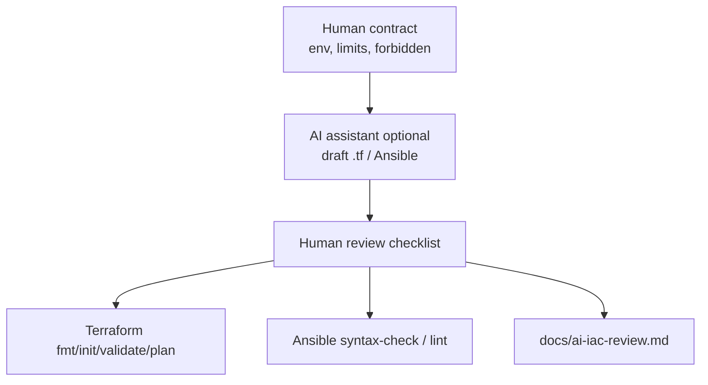
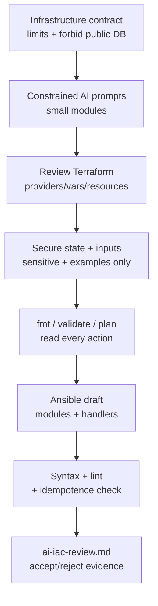

# Lab 45: Infrastructure as Code with AI Assistance — Northstar CRM Stack Sketches

**Module:** 45 — Infrastructure as Code with AI Assistance  
**Lab folder:** `labs/Week 5 - DevOps, CI-CD and OpenShift/module-45/lab45/`  
**Difficulty:** Intermediate  
**Duration:** 4–5 Hours

**Primary IDE:** IntelliJ IDEA Community Edition · **Optional IDE:** VS Code

| OS | How-to for this lab |
| -- | ------------------- |
| Windows | [LAB-45-WINDOWS.md](LAB-45-WINDOWS.md) |
| macOS | [LAB-45-MACOS.md](LAB-45-MACOS.md) |

> **Environment reminder:** Finish [Lab 0](../../../Week%201%20-%20Java%20and%20JVM%20Foundations/module-00/lab0/LAB-0-GUIDE.md). Use **IntelliJ IDEA Community** (primary; optional VS Code) on your laptop with **Terraform** and **Ansible** (as assigned). Work under `~/java-bootcamp` (Windows: `%USERPROFILE%\java-bootcamp`).

---

## How to follow this lab

1. Open the **Windows** or **macOS** how-to (links above) in a second tab.
2. Create/work only under your `java-bootcamp/examples/…` folder from the steps (not inside this `labs/` git clone unless a step says otherwise).
3. For each **Step N**: read **Why** (if present) → do the actions → confirm **Expected** / **Expected result** → then continue.
4. When stuck, use **Failure Experiments** / troubleshooting in this guide before asking for help.
5. Capture evidence under `notes/screenshots/` (redact secrets). Use the **Pass criteria** tables — write **Pass** or **Fail** in your notes. GitHub file view does not support clickable checkboxes.

## Lab Overview

This Module 45 lab uses an AI coding assistant to draft **Terraform** and **Ansible** infrastructure sketches for the **Customer Management Platform**, then validates, threat-models, corrects, and documents every generated decision. You will produce `infra/terraform/*.tf`, `terraform.tfvars.example`, `infra/ansible/site.yml`, `inventory.example.yml`, and `docs/ai-iac-review.md`.

**Purpose.** Leadership freezes an IaC rule: AI may accelerate scaffolding, but humans remain accountable for exposure, cost, state security, and idempotence. Syntactically valid Terraform that opens a public database still fails the lab. Planned apply without reading the plan fails the lab. Undocumented AI acceptance fails the lab.

**What you build (exercise).** Copy to `lab45-crm`; define an infrastructure contract (env, region, network, runtime, DB, tags, cost limits, forbidden public exposure); draft with constrained prompts; review Terraform structure; secure sensitive variables and remote-state narrative; run `fmt` / `init` / `validate` / `plan`; draft idempotent Ansible; prove syntax/lint and second-run no-change where authorized; write a complete AI review record (`docs/ai-iac-review.md`).

**What success looks like.** Under `~/java-bootcamp/examples/lab45-crm/` a peer can read the contract, reproduce format/validate/plan (or instructor-safe substitute), run Ansible syntax/lint, and see at least one AI suggestion rejected or hardened with rationale—tied to CRM environments that will host APIs for fixtures `CUS-1001` / `CUS-1002` (app data stays out of IaC).

**Depends on Labs 43–44 (delivery narrative).** Need environment naming conventions and secret hygiene from CD work. Terraform/Ansible installed; Copilot optional. Finish prior labs’ secret leaks before claiming IaC credit.

**CRM connection.** IaC provisions platforms for the CRM—it does **not** embed Amina/Ravi PII. Use labels/tags like `application=crm`, `environment=dev`. Application smoke still uses `CUS-1001` / `CUS-1002` / `lab-request-001` in app labs, not in Terraform state.

---

## Learning Objectives

After completing this lab, you will be able to:

* Write bounded IaC prompts that state assumptions and forbid secrets/public DBs
* Review generated Terraform and Ansible critically (not “it linted”)
* Model variables, validation, providers, and outputs safely
* Describe encrypted remote state and locking without committing backend credentials
* Create idempotent Ansible tasks with modules, handlers, ownership, and modes
* Run format, validate, lint, and plan checks and interpret create/destroy risk
* Document AI assumptions, corrections, residual risks, and approval status
* Keep CRM customer fixtures out of infrastructure code and state files

---

## Business Scenario

The team wants faster environment setup for Northstar CRM (dev/test/stage). AI-generated infrastructure can be syntactically plausible while insecure, destructive, expensive, or non-idempotent. Human review remains accountable—especially before anything that could reach a cluster hosting customer APIs.

You are drafting non-production sketches so Lab 44 promotions land on predictable namespaces and hosts. Publicly exposed databases, hard-coded cloud keys, and “AI said apply” are unacceptable.

Use these examples consistently:

| ID | Name | Notes |
| -- | ---- | ----- |
| `CUS-1001` | Amina Khan | App fixture only—never in `.tf` / Ansible vars as PII |
| `CUS-1002` | Ravi Singh | App fixture only |
| `lab-request-001` | — | App correlation only |
| `crm-dev` / `crm-test` | — | example environment/namespace names |
| `lab45-001` | — | AI review entry ID in `docs/ai-iac-review.md` |

**Security note for evidence.** Never commit `*.tfstate`, real `terraform.tfvars`, cloud keys, Ansible vault passwords, or kubeconfig. Commit `*.tfvars.example` and `inventory.example.yml` only. Redact plan outputs that show account IDs if instructor requires.

---

## Architecture Context

### NOW (this lab)



### Lab flow (mermaid)



### Architecture NOW vs LATER

| Aspect | Lab 45 (NOW) | Production IaC |
| ------ | ------------ | -------------- |
| Apply | Prefer plan-only unless instructor approves | Pipeline-gated apply with policy-as-code |
| State | Document remote backend; often `-backend=false` locally | Encrypted remote state + lock |
| AI | Draft + mandatory review log | Same + org allow-lists |
| Scope | Namespace/runtime sketches | Full VPC/DB with modules & sentinel |

**Lab focus:** AI-assisted Terraform + Ansible with accountable human review for CRM infra sketches.

---

## Prerequisites

Complete [SETUP](../../../SETUP-INSTRUCTIONS.md), [Lab 0](../../../Week%201%20-%20Java%20and%20JVM%20Foundations/module-00/lab0/LAB-0-GUIDE.md), and preferably [Lab 44](../../module-44/lab44/LAB-44-GUIDE.md). Confirm:

* Terraform 1.5+ and Ansible on the PATH
* Cloud/Kubernetes credentials only as instructor directs
* GitHub Copilot (or equivalent) optional for drafts
* `tflint` / `ansible-lint` if available in the image
* No secrets committed to Git

### Pre-flight

```bash
java -version
terraform version
ansible --version
ansible-lint --version 2>/dev/null || true
git --version
pwd
ls ~/java-bootcamp/examples
```

If Copilot is used: Command Palette → `GitHub Copilot: Check Status` → signed in / active.

---

## Suggested Project Files

Primary training layout:

```text
~/java-bootcamp/examples/lab45-crm/
├── infra/
│   ├── terraform/
│   │   ├── versions.tf
│   │   ├── providers.tf
│   │   ├── variables.tf
│   │   ├── main.tf
│   │   ├── outputs.tf
│   │   └── terraform.tfvars.example
│   └── ansible/
│       ├── site.yml
│       ├── inventory.example.yml
│       └── templates/
│           └── crm.env.j2
├── docs/
│   └── ai-iac-review.md
├── notes/screenshots/            (plan excerpts, lint, review)
├── .gitignore                    (must ignore *.tfstate*, *.tfvars, vault)
├── README.md
└── (optional) application sources from prior labs
```

Platform secondary paths:

```text
customer-management-platform/
├── infra/terraform/
├── infra/ansible/
└── docs/ai-iac-review.md
```

Ignore state files, real tfvars, vault passwords, `.env`, and kubeconfig.

---

## Concepts to Discuss

Write 2–3 sentences each in `docs/ai-iac-review.md`:

1. Main infra flow (contract → draft → validate → plan → config manage)
2. Trust boundary: what `plan` proves vs what it assumes about provider credentials
3. Success/failure contracts (`validate` ok but plan destroys prod namespace)
4. Stable naming (`crm-${environment}`) vs random AI names
5. Idempotency of Ansible second runs and Terraform plans
6. Why `-backend=false` may be required in training
7. Evidence operators need (plan summary, lint, review log)
8. Two engineers applying the same root module (locking)
9. False confidence: AI code that “looks enterprise” but opens `0.0.0.0/0`
10. What Labs 43–44 still own (artifact promote) vs what IaC owns

---

## Implementation Steps

Complete each step in order. Commands assume `~/java-bootcamp/examples/lab45-crm` (Windows: `%USERPROFILE%\java-bootcamp\examples\lab45-crm`) unless noted. Parts 1–8 map to Steps 1–8.

---

### Step 1 — Define infrastructure contract (Part 1)

**Why:** Unbounded AI prompts invent production VPCs, public RDS, and $10k NAT gateways.

**Do this:** Create the workspace and write the contract at the top of `docs/ai-iac-review.md`:

```bash
cd ~/java-bootcamp/examples
cp -r lab44-crm lab45-crm 2>/dev/null || mkdir -p lab45-crm
cd lab45-crm
mkdir -p infra/terraform infra/ansible/templates docs notes/screenshots
git switch -c lab/45-crm 2>/dev/null || true
```

State environment, region, network expectations, runtime (K8s namespace / VM), database posture, tags, and cost limits. List **forbidden** resources and public exposure. Define outputs and evidence expected from AI (file list, assumptions section, review checklist).

**Expected result:** Written contract with forbidden list and cost/exposure limits.

**If it fails:** Contract says “whatever AI suggests” → rewrite with hard forbids before prompting.

---

### Step 2 — Draft with constrained prompts (Part 2)

**Why:** Lab 11-style false confidence returns when prompts omit safety constraints.

**Do this:** Ask AI for **small modules** and explicit assumptions. Prohibit hard-coded secrets and public databases. Request a review checklist with the draft. Save the prompt under entry `lab45-001` in `docs/ai-iac-review.md`. If AI is unavailable, hand-write sketches and mark “manual.”

Example prompt constraints (adapt):

```text
Generate Terraform for a non-prod Kubernetes namespace crm-${environment}
with labels application=crm. No public LoadBalancer DB. No plaintext secrets.
Pin provider versions. List assumptions. Include a human review checklist.
```

**Expected result:** Draft files present; prompt archived; assumptions listed.

**If it fails:** AI emits AWS keys in code → reject immediately; rotate if pasted into chat logs per policy.

---

### Step 3 — Review Terraform structure (Part 3)

**Why:** Monolithic mystery `main.tf` hides destructive defaults.

**Do this:** Separate providers, variables, resources, and outputs. Pin compatible provider ranges. Inspect every resource, data source, and default. Prefer a namespace sketch like:

```hcl
terraform {
  required_version = ">= 1.6"
  required_providers {
    kubernetes = { source = "hashicorp/kubernetes", version = "~> 2.0" }
  }
}
variable "environment" {
  type = string
  validation {
    condition     = contains(["dev", "test", "stage"], var.environment)
    error_message = "Use an approved non-production environment."
  }
}
resource "kubernetes_namespace_v1" "crm" {
  metadata {
    name = "crm-${var.environment}"
    labels = { application = "crm", environment = var.environment }
  }
}
output "namespace" { value = kubernetes_namespace_v1.crm.metadata[0].name }
```

**Expected result:** Structured files; pinned providers; human notes on each resource purpose.

**If it fails:** Unpinned `version = "*"` → pin; mysterious resources outside contract → delete.

---

### Step 4 — Secure state and inputs (Part 4)

**Why:** State files and tfvars are secret stores whether you meant them to be or not.

**Do this:** Mark sensitive variables. Keep secret tfvars untracked. Add `terraform.tfvars.example` with fake placeholders only. Describe encrypted remote state and locking in `docs/ai-iac-review.md` without committing backend credentials. Update `.gitignore`:

```text
*.tfstate
*.tfstate.*
.terraform/
*.tfvars
!terraform.tfvars.example
```

**Expected result:** Example tfvars only; sensitive markings; state ignore rules; remote-state narrative.

**If it fails:** Real `terraform.tfvars` staged → unstage, scrub, rotate secrets.

---

### Step 5 — Validate Terraform plan (Part 5)

**Why:** `validate` is syntax; `plan` is the blast radius.

**Do this:**

```bash
cd ~/java-bootcamp/examples/lab45-crm/infra/terraform
terraform fmt -check -recursive || terraform fmt -recursive
terraform init -backend=false
terraform validate
terraform plan -var='environment=dev' -out=tfplan
terraform show -no-color tfplan | tee ../../notes/tfplan-excerpt.txt
```

Read every create, update, replace, and destroy. Estimate cost and identify privilege or exposure changes. Do **not** `apply` unless instructor explicitly approves a disposable target.

**Expected result:** Format clean; validate ok; plan excerpt saved; destroy/replace actions explained.

**If it fails:** Provider auth errors → use `-backend=false` and mocked/provider-less sketches, or instructor sandbox only.

---

### Step 6 — Draft Ansible configuration (Part 6)

**Why:** Shell-only playbooks are rarely idempotent and often leak secrets in logs.

**Do this:** Prefer modules over shell. Add handlers, ownership, modes, and privilege boundaries. Use `no_log` only for tasks that process secrets.

```yaml
- name: Configure CRM runtime host
  hosts: crm
  become: true
  tasks:
    - name: Create CRM service account
      ansible.builtin.user:
        name: crm
        system: true
        shell: /usr/sbin/nologin
    - name: Install runtime configuration
      ansible.builtin.template:
        src: crm.env.j2
        dest: /etc/crm/crm.env
        owner: root
        group: crm
        mode: "0640"
      notify: Restart CRM
  handlers:
    - name: Restart CRM
      ansible.builtin.service:
        name: crm
        state: restarted
```

Create `inventory.example.yml` with fictional hosts only.

**Expected result:** `site.yml` + example inventory + template; no real secrets.

**If it fails:** Hard-coded password in playbook → move to vault/env; never commit vault pass.

---

### Step 7 — Test idempotence (Part 7)

**Why:** Config management that mutates every run creates change noise and outages.

**Do this:**

```bash
cd ~/java-bootcamp/examples/lab45-crm/infra/ansible
ansible-playbook --syntax-check -i inventory.example.yml site.yml
ansible-lint site.yml 2>/dev/null || echo "ansible-lint not installed; note residual risk"
```

If a disposable authorized target exists, run once, run again, expect zero changes. Capture evidence. If no host is authorized, document syntax/lint as the training substitute and state residual risk.

**Expected result:** Syntax clean; lint clean or residual risk owned; idempotence evidence or documented substitute.

**If it fails:** Second run always “changed” → fix modules/statefulness before claiming idempotence.

---

### Step 8 — Write AI review record (Part 8)

**Why:** Undocumented AI acceptance recreates false-confidence culture at infra blast radius.

**Do this:** Complete `docs/ai-iac-review.md` with: prompt, generated excerpt, human corrections, validation evidence (`fmt`/`validate`/`plan`/`ansible-lint`), unresolved risk, and approval status. Record at least one rejected or hardened suggestion (`lab45-001`). If manual-only, mark N/A with rationale.

Checklist reminder:

1. Can every default fail closed if AI guessed wrong?
2. Are secrets absent from tracked files?
3. Is public exposure forbidden by contract enforced?
4. Are provider versions pinned?
5. Did a human read the plan actions?

**Expected result:** Dated review entry; reject/harden evidence; approval line signed (name/date).

**If it fails:** “LGTM” with no specifics → expand until a peer can reproduce your judgment.

---

### Step 9 — Failure experiments + evidence pack

**Why:** Safe hostility to AI output is the learning outcome.

**Do this:** Complete [Failure Experiments](#failure-experiments). Ensure state/tfvars are gitignored. Capture sanitized plan/lint screenshots.

**Expected result:** ≥3 experiments; clean `git status`; review doc complete.

**If it fails:** See Troubleshooting.

---

## Implementation Checkpoints

### Checkpoint A — Tooling

_Mark each row **Pass** or **Fail** in your lab notes (GitHub markdown files are not interactive checklists)._

| # | Confirm | Your notes |
| - | ------- | ---------- |
| 1 | `lab45-crm` with `infra/terraform` and `infra/ansible` | Pass / Fail |
| 2 | Terraform and Ansible versions recorded | Pass / Fail |
| 3 | `.gitignore` excludes state and secret tfvars | Pass / Fail |

### Checkpoint B — Core IaC

_Mark each row **Pass** or **Fail** in your lab notes (GitHub markdown files are not interactive checklists)._

| # | Confirm | Your notes |
| - | ------- | ---------- |
| 1 | Contract + forbidden exposures documented | Pass / Fail |
| 2 | Terraform structured with validated variables | Pass / Fail |
| 3 | `terraform.tfvars.example` present (no real secrets) | Pass / Fail |

### Checkpoint C — Validation + AI discipline

_Mark each row **Pass** or **Fail** in your lab notes (GitHub markdown files are not interactive checklists)._

| # | Confirm | Your notes |
| - | ------- | ---------- |
| 1 | `fmt` / `validate` / `plan` (or approved substitute) evidenced | Pass / Fail |
| 2 | Ansible syntax (+ lint if available) | Pass / Fail |
| 3 | `docs/ai-iac-review.md` with accept/reject notes | Pass / Fail |

### Checkpoint D — Hygiene

_Mark each row **Pass** or **Fail** in your lab notes (GitHub markdown files are not interactive checklists)._

| # | Confirm | Your notes |
| - | ------- | ---------- |
| 1 | No `*.tfstate` / real tfvars / vault passwords committed | Pass / Fail |
| 2 | Idempotence evidence or residual risk owned | Pass / Fail |
| 3 | CRM PII fixtures not embedded in IaC | Pass / Fail |

---

## Reference Commands, Configuration, and Code

### Terraform namespace sketch

```hcl
terraform {
  required_version = ">= 1.6"
  required_providers {
    kubernetes = { source = "hashicorp/kubernetes", version = "~> 2.0" }
  }
}

variable "environment" {
  type = string
  validation {
    condition     = contains(["dev", "test", "stage"], var.environment)
    error_message = "Use an approved non-production environment."
  }
}

variable "crm_image_digest" {
  type      = string
  default   = ""
  sensitive = false
  # Prefer digest promotion from Lab 44 — do not invent :latest
}

resource "kubernetes_namespace_v1" "crm" {
  metadata {
    name = "crm-${var.environment}"
    labels = {
      application = "crm"
      environment = var.environment
    }
  }
}

output "namespace" {
  value = kubernetes_namespace_v1.crm.metadata[0].name
}
```

### `terraform.tfvars.example`

```hcl
environment = "dev"
# crm_image_digest = "sha256:replace-me"
```

### Idempotent Ansible tasks

```yaml
- name: Configure CRM runtime host
  hosts: crm
  become: true
  tasks:
    - name: Ensure CRM config directory
      ansible.builtin.file:
        path: /etc/crm
        state: directory
        owner: root
        group: crm
        mode: "0750"
    - name: Create CRM service account
      ansible.builtin.user:
        name: crm
        system: true
        shell: /usr/sbin/nologin
    - name: Install runtime configuration
      ansible.builtin.template:
        src: crm.env.j2
        dest: /etc/crm/crm.env
        owner: root
        group: crm
        mode: "0640"
      notify: Restart CRM
  handlers:
    - name: Restart CRM
      ansible.builtin.service:
        name: crm
        state: restarted
```

### `docs/ai-iac-review.md` outline

```markdown
# AI IaC Review — lab45-001
## Contract summary
- Forbidden: public DB, hard-coded secrets, unpinned providers
## Prompt (paste sanitized)
## Generated excerpt (short)
## Human corrections
1.
## Validation evidence
- terraform fmt/validate/plan:
- ansible syntax/lint:
## Rejected AI suggestion
- What / why unsafe:
## Residual risks / owners / dates
## Approval
- Name / date / decision:
```

### Validation commands

```bash
cd ~/java-bootcamp/examples/lab45-crm/infra/terraform
terraform fmt -check -recursive
terraform init -backend=false
terraform validate
terraform plan -var='environment=dev' -out=tfplan
terraform show -no-color tfplan
cd ../ansible
ansible-playbook --syntax-check -i inventory.example.yml site.yml
ansible-lint site.yml
```

### Evidence log template

```markdown
# Lab 45 Evidence Log
- Terraform version:
- Ansible version:
- AI used? Y/N (tool):
## Results
| Check | Result | Evidence |
| ----- | ------ | -------- |
| Contract written | PASS/FAIL | |
| fmt/validate | PASS/FAIL | |
| plan read | PASS/FAIL | |
| ansible syntax | PASS/FAIL | |
| AI reject/harden | PASS/FAIL | |
```

### Artifact map

| Artifact | Role |
| -------- | ---- |
| `infra/terraform/*.tf` | Declarative CRM env sketch |
| `terraform.tfvars.example` | Safe input template |
| `infra/ansible/site.yml` | Idempotent config sketch |
| `inventory.example.yml` | Fake inventory |
| `docs/ai-iac-review.md` | AI accountability record |
| `notes/tfplan-excerpt.txt` | Sanitized plan evidence |

---

## Manual Verification

1. Infrastructure contract forbids public DB / hard-coded secrets.
2. Terraform files separate providers, variables, resources, outputs.
3. Sensitive inputs marked; only example tfvars committed.
4. `terraform validate` succeeds; plan actions were read and summarized.
5. Ansible prefers modules; file modes/owners set deliberately.
6. Syntax-check (and lint if available) pass or residual risk is owned.
7. AI review documents prompt, corrections, and at least one rejection/hardening.
8. No state files or cloud keys in Git.
9. CRM fixtures `CUS-1001`/`CUS-1002` are not in IaC as personal data.
10. Peer can re-run validate/plan commands from the README alone.

---

## Failure Experiments

| # | Experiment | Observe | Restore |
| - | ---------- | ------- | ------- |
| 1 | Temporarily allow `0.0.0.0/0` in a draft | Review must catch and reject | Remove; document rejection |
| 2 | Break a variable validation | `plan`/`validate` fails clearly | Fix validation |
| 3 | Commit a fake secret string then scrub | Shows leak risk | Remove; improve `.gitignore` |
| 4 | Convert a task to raw `shell` | Idempotence/lint suffers | Restore module |
| 5 | Ask AI for “prod open RDS” | Must refuse/reject vs contract | Keep contract primacy |

---

## Troubleshooting

| Symptom | Likely cause | Fix |
| ------- | ------------ | --- |
| Provider auth failures | No cloud creds in training | `-backend=false`; kube provider sketch; instructor sandbox |
| `fmt` fails CI style | Unformatted HCL | `terraform fmt -recursive` |
| Plan wants destroy | Name/state drift | Read carefully; do not apply blindly |
| Ansible host unreachable | Example inventory only | Syntax-check only; document residual risk |
| AI invents resources | Weak prompt | Re-prompt within contract; delete extras |
| State accidentally created | Local backend | Delete local state; ensure ignore rules |
| Lint not installed | Image gap | Note residual risk; still run syntax-check |

---

## Security and Production Review

Answer in `docs/ai-iac-review.md`:

1. Which inputs are untrusted (AI output, community modules)?
2. Where are authn/authz for apply enforced (human approval, CI roles)?
3. Which values are sensitive in state and logs?
4. What can be retried safely (`plan`, syntax-check)?
5. What happens after partial apply failure?
6. What would an operator monitor (drift, cost, open network / firewalls)?
7. Which local default is unacceptable (`apply` without plan read, public DB)?
8. How are IaC contracts versioned with Lab 44 environment names?

---

## Cleanup

```bash
cd ~/java-bootcamp/examples/lab45-crm
# Do not destroy instructor-shared shared infra without approval
rm -f infra/terraform/tfplan
rm -rf infra/terraform/.terraform
git status --short
```

Delete any local state created accidentally. Keep sanitized plan excerpts.

**Keep `lab45-crm`**—Capstone and later hardening may reuse these modules as starting points.

---

## Expected Deliverables

* `infra/terraform/*.tf` (structured, pinned providers)
* `terraform.tfvars.example`
* `infra/ansible/site.yml`
* `inventory.example.yml`
* `docs/ai-iac-review.md` with human corrections and validation evidence
* Plan / lint evidence (or approved substitute)
* No secrets, state files, or real customer data committed

---

## Evaluation Rubric (100 Marks)

| Criteria | Marks |
| -------- | ----: |
| Environment and project structure | 10 |
| Core implementation (Terraform + Ansible sketches) | 30 |
| Integration/configuration correctness (fmt/validate/plan/lint) | 15 |
| Failure handling (rejected unsafe AI / adverse review) | 15 |
| Automated verification | 10 |
| Security and production awareness / AI review discipline | 10 |
| Documentation and evidence | 10 |

**Notes:** Blind `apply` of AI output → honor violation potential. Committed state/secrets → must remediate before scoring. AI used with no review log → lose AI/security marks.

---

## Reflection Questions

Write 3–6 sentence answers:

1. Which design decision most affected safety (contract vs AI draft)?
2. Which failure was hardest to diagnose?
3. What evidence proves you read the plan, not only validated syntax?
4. What breaks first when ten engineers share one state file without locks?
5. Which concern should move to policy-as-code in CI?
6. What must change before real customer data lands in these environments?
7. How does this lab connect to Labs 43–44 and Lab 46?
8. What metric matters most for IaC drift detection?
9. (Forward look) Which AI suggestion would be most dangerous under prompt injection?

---

## Bonus Challenges

1. Add policy-as-code checks forbidding public exposure.
2. Create a module interface with validated inputs.
3. Add Ansible check mode and capture idempotence evidence.
4. Compare two AI drafts for risk and cost.
5. Write a prompt-injection-resistant review checklist.
6. Wire `terraform plan` into a GitHub Actions step (Lab 43 style) without auto-apply.

---

## Success Criteria

You are finished when:

* Terraform and Ansible sketches match the written contract
* Validation/plan (or approved substitutes) are evidenced
* AI drafts (if any) were human-reviewed with at least one harden/reject
* Secrets and state stay out of Git
* Another student can reproduce validate/plan/syntax steps
* CRM PII fixtures are not embedded in IaC
* No production cloud key is hard-coded

---

## Instructor Notes

* **Live probe:** Ask which AI suggestion they rejected and what plan action worried them most. Open `ai-iac-review.md` and the plan excerpt side by side.
* **Assess:** Contract quality, secret/state hygiene, honest plan reading, Ansible modules vs shell, review discipline.
* **Continuity:** Prefer `examples/lab45-crm`. Keep environment naming aligned with Lab 44. Do not require real cloud spend.
* **Common pitfalls:** Committing tfstate; public exposure; unpinned providers; apply without approval; empty AI review; PII in tags/vars.
* **Timing:** 4–5 hours. Provider auth pain is common—steer early to `-backend=false` sketches when sandbox is unavailable.

---

*End of Lab 45 — Infrastructure as Code with AI Assistance: Northstar CRM Stack Sketches. Keep `lab45-crm` for portfolio and later policy-as-code work.*
