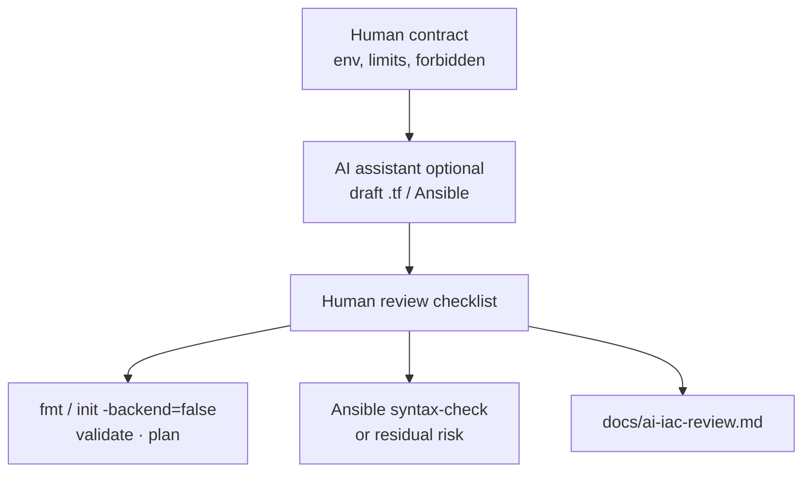

# Lab 45: Infrastructure as Code with AI Assistance — Northstar CRM Stack Sketches

**Module:** 45 — Infrastructure as Code with AI Assistance  
**Duration:** ~45 minutes (timed path with starter) · Full path: 4–5 Hours

**Primary IDE:** IntelliJ IDEA Community Edition · **Optional IDE:** VS Code

| OS | How-to for this lab |
| -- | ------------------- |
| Windows | [LAB-45-WINDOWS.md](LAB-45-WINDOWS.md) |
| macOS | [LAB-45-MACOS.md](LAB-45-MACOS.md) |

> **Two folders (do not mix):** [Clone the course repo · Commit in your own repo](../../../CLONE-AND-OWN-REPO-GUIDE.md). Read this GUIDE in the **course clone**. Write, run, and **push** everything in **your** `java-bootcamp` repo.

---

## Activity card

| | |
| --- | --- |
| **Time** | ~45 min timed · full path 4–5 h |
| **Checkpoint** | **E** (after Ex 1→2→3→4→5→6) |
| **Must prove** | Pinned providers · `validate` (no `-var`) · `plan` read · no secrets/state in Git · AI review ≥1 harden/reject |
| **Hard gate** | Pre-lab Pass · contract forbids public DB · **no** `terraform apply` without instructor approval |

### What you will learn

Draft Terraform + Ansible for CRM **non-prod** with optional AI, then human-review for exposure, cost, and idempotence.

### Enterprise context

Valid HCL that opens a public database still fails—humans own the blast radius.

### Predict

Should `*.tfstate` ever be committed?

### Debug

`terraform validate -var=db_password=…` errors — what is wrong?

---

## Two folders — every command below uses these paths

| Folder | Remote | You… |
| ------ | ------ | ---- |
| **Course clone** (handouts) | `bc-sw-engineer-java-participant` | **Read** this GUIDE / starter. **Never** commit homework here. |
| **Your repo** | private `java-bootcamp` | **Copy starter IaC** here, fill TODOs, **commit**. |

| Item | Course clone (read) | Your `java-bootcamp` (write) |
| ---- | ------------------- | ---------------------------- |
| This GUIDE | `labs/…/module-45/lab45/LAB-45-GUIDE.md` | — |
| Starter Terraform + Ansible | `labs/…/module-45/lab45/starter/` | `examples/lab45-crm/` |
| Graded IaC packet | — | `examples/lab45-crm/` (**starter sketches**, not a CRM copy) |
| Pre-lab notes | — | `examples/module-45-exercises/notes/` |
| Screenshots | — | `notes/screenshots/lab-45/` (gitignored) |

IntelliJ stays on `java-bootcamp`.

**This lab is IaC sketches, not another Spring app.** Copy the **starter** into `examples/lab45-crm`. **Do not** copy Lab 44 CRM (Maven) or Lab 42 (`k8s/` YAML) over this folder. Lab 44 stays at `examples/lab44-crm` as the app these sketches would support.

**Laptop path:** `hashicorp/null` + `null_resource` — `fmt` / `init -backend=false` / `validate` / `plan` with **no cloud account**. Do **not** `terraform apply`. Do **not** point a Kubernetes provider at Lab 42 k3d (`crm-training`) as “the cloud.”

**Terraform CLI (verified 1.9.8):** `terraform validate` does **not** take `-var`. Pass `-var` on **`plan`** only. Do not `terraform show tfplan` unless you created that file with `plan -out=`.

**Ansible:** Syntax-check from the **lab root** (`-i inventory.example.yml infra/ansible/site.yml`). If `ansible-playbook` is missing (typical Windows laptop), record residual risk — that is a valid timed-path substitute.

**OS user vs DB user:** Playbook user is **`crm`**. That is **not** `crm_app`. Postgres from Labs 41–44 remains user **`crm` / `change-me`**. Do not put DB passwords in playbooks or `.tf`.

---

## 45-minute timed path (use starter)

> **Pacing reminder:** [PACING.md](../PACING.md) checkpoint **E**. Homework: complete review doc, gitignore, optional Ansible lint.

1. Open [`starter/README.md`](starter/README.md) **in the course clone**.
2. Copy starter into **`java-bootcamp/examples/lab45-crm`**.
3. Fill every `TODO` — do **not** work under `labs/`.
4. Run `fmt` / `init -backend=false` / `validate` / `plan`; evidence under `notes/screenshots/lab-45/`.
5. Mark timed-path Pass criteria in the starter README.

| Path | Time | Scope |
| ---- | ---- | ----- |
| **Timed (default)** | ~45 min | Contract + null sketch validate/plan + review ≥1 reject · Ansible syntax **or** residual risk |
| **Full (extended)** | see Duration | Cloud/k8s modules **only** in an instructor sandbox; still no unapproved apply |

---

## What you'll submit (read this first)

All of these live under **`java-bootcamp`**, not the course clone.

| # | Deliverable | Where |
| - | ----------- | ----- |
| 1 | `infra/terraform/*.tf` (pinned providers) | `examples/lab45-crm/` |
| 2 | `terraform.tfvars.example` | lab root (placeholders only) |
| 3 | `infra/ansible/site.yml` | same |
| 4 | `inventory.example.yml` | **lab root** (sibling of `infra/`) |
| 5 | `docs/ai-iac-review.md` (`lab45-001`, ≥1 harden/reject) | `examples/lab45-crm/docs/` |
| 6 | Plan excerpt (or screenshot) — sanitized | `notes/screenshots/lab-45/` |
| 7 | No secrets, `*.tfstate`, or real `terraform.tfvars` committed | `git status` on **your** repo |

**Do not submit:** `target/`, `.terraform/`, state files, cloud keys, kubeconfig, or a verbatim instructor `solution/`.

---

## Lab Overview

Use an optional AI assistant to draft **Terraform** and **Ansible** sketches for Northstar CRM **non-prod**, then validate, threat-model, correct, and document every generated decision.

## Learning Objectives

After completing this lab, you will be able to:

* Write bounded IaC prompts that state assumptions and forbid secrets/public DBs
* Review generated Terraform and Ansible critically (not “it linted”)
* Model variables, validation, providers, and outputs safely
* Describe encrypted remote state and locking without committing backend credentials
* Create idempotent Ansible tasks with modules, ownership, and modes

## Business Scenario

The team wants faster env setup for CRM (dev/test/staging). AI-generated infrastructure can be plausible and still insecure. You sketch **non-prod** so Lab 44 promotions would land on predictable names — you do **not** apply that sketch to Lab 42 k3d or to production.

| ID | Name | Notes |
| -- | ---- | ----- |
| `CUS-1001` / `CUS-1002` | Amina / Ravi | **App** fixtures only — never in `.tf` / Ansible vars |
| `lab-request-001` | — | App correlation only |
| `dev` / `test` / `staging` | — | Allowed `environment` values (**not** `prod`) |
| `lab45-001` | — | AI review entry ID |

**Security note.** Never commit `*.tfstate`, real `terraform.tfvars`, cloud keys, Ansible vault passwords, or kubeconfig.

---

## Architecture Context
### NOW (this lab)


```mermaid
flowchart TB
  Contract["Human contract<br/>env, limits, forbidden"] --> AI["AI assistant optional<br/>draft .tf / Ansible"]
  AI --> Review["Human review checklist"]
  Review --> TF["fmt / init -backend=false<br/>validate · plan"]
  Review --> AN["Ansible syntax-check<br/>or residual risk"]
  Review --> Doc["docs/ai-iac-review.md"]
```

## Prerequisites

Prior labs: [Lab 44](../../module-44/lab44/LAB-44-GUIDE.md) in **`java-bootcamp`** (context only).

Confirm:

* Terraform **1.5+** on PATH (this laptop: **1.9.8** under `%USERPROFILE%\bin`)
* Ansible optional
* No secrets in Git
* Cloud/Kubernetes credentials **only** if the instructor opens a sandbox

### Pre-flight

```bash
terraform version
git remote -v   # must be YOUR java-bootcamp
```

Working directory:

```text
~/java-bootcamp/examples/lab45-crm
```

## Worked example (read before you code)

`validate` has no `-var`. `plan` does.

```bash
cd ~/java-bootcamp/examples/lab45-crm/infra/terraform
terraform fmt -recursive
terraform init -backend=false
terraform validate
terraform plan -var='environment=dev' -var='db_password=unused-local'
```

**What to notice:** Instructors check pinned providers, a read **plan**, no public DB, and a real reject/harden in `lab45-001`.

---

## Implementation Steps

Complete each step in order. **Write** under `java-bootcamp`. **Read** starter from the course clone.

---

### Step 1 — Copy starter and write the contract

**Why:** Unbounded AI prompts invent public RDS and $10k NAT gateways. Graded work belongs in `java-bootcamp`.

**Do this:**

**Windows (PowerShell):**

```powershell
$jb = "$env:USERPROFILE\java-bootcamp"
$courseLab45 = "$env:USERPROFILE\bc-sw-engineer-java-participant\labs\Week 5 - DevOps, CI-CD and OpenShift\module-45\lab45"

New-Item -ItemType Directory -Force -Path "$jb\examples\lab45-crm","$jb\notes\screenshots\lab-45" | Out-Null
Copy-Item -Recurse -Force "$courseLab45\starter\*" "$jb\examples\lab45-crm\"
cd "$jb\examples\lab45-crm"
```

**macOS / Linux:**

```bash
JB=~/java-bootcamp
COURSE_LAB45=~/bc-sw-engineer-java-participant/labs/Week\ 5\ -\ DevOps,\ CI-CD\ and\ OpenShift/module-45/lab45

mkdir -p "$JB/examples/lab45-crm" "$JB/notes/screenshots/lab-45"
cp -R "$COURSE_LAB45/starter/." "$JB/examples/lab45-crm/"
cd "$JB/examples/lab45-crm"
```

Confirm `infra/terraform/providers.tf` and `infra/ansible/site.yml` exist. You should **not** have copied `pom.xml` from Lab 44.

Write the contract at the top of `docs/ai-iac-review.md`: environment, region, network, runtime (sketch vs Lab 42 k3d), database **private**, tags, cost limits, **forbidden** public DB / `0.0.0.0/0` / secrets in Git. Allowed envs: **`dev` / `test` / `staging`**.

**Expected result:** Starter files in `java-bootcamp`; written contract; you are not editing `labs/`.

**If it fails:** Copied Lab 44 / Lab 42 → start over with **starter**. Work in the course clone → move to `java-bootcamp`.

---

### Step 2 — Draft with constrained prompts

**Why:** Lab 11-style false confidence returns when prompts omit safety constraints.

**Do this:** Ask AI for **small modules** (or hand-write and mark “manual”). Prohibit hard-coded secrets and public databases. Pin providers. Save the prompt as entry **`lab45-001`**.

```text
Generate a non-prod Terraform sketch for CRM (environment in dev|test|staging).
Use hashicorp/null for the laptop path unless a sandbox is authorized.
No public database, no 0.0.0.0/0 on DB/SSH, no plaintext secrets, no prod.
Pin provider versions. List assumptions. Include a human review checklist.
```

**Expected result:** Draft present; prompt archived; assumptions listed.

**If it fails:** AI emits keys → reject; rotate if pasted into chat.

---

### Step 3 — Review Terraform structure

**Why:** Mystery `main.tf` hides destructive defaults.

**Do this:** Keep providers, variables, resources, and outputs separate. Pin versions. **Timed path:** keep `null_resource.crm_stack_sketch`. Add `environment` validation for `dev` / `test` / `staging` only.

When a sandbox is **authorized**, you may replace `null_resource` with real modules. Do **not** apply `kubernetes_namespace_v1` to Lab 42 (`crm-training`) as homework.

**Expected result:** Structured files; pinned providers; notes on each resource.

**If it fails:** `version = "*"` → pin. Resources outside the contract → delete.

---

### Step 4 — Secure state and inputs

**Why:** State and tfvars are secret stores.

**Do this:** Keep `db_password` **sensitive** with **no** committed value. Commit `terraform.tfvars.example` only. Describe remote state + locking in the review doc **without** backend credentials.

Append to **`java-bootcamp/.gitignore`** (not the course clone):

```text
*.tfstate
*.tfstate.*
.terraform/
*.tfvars
!terraform.tfvars.example
```

**Expected result:** Example tfvars only; ignore rules; remote-state narrative.

**If it fails:** Real `terraform.tfvars` staged → unstage, scrub, rotate.

---

### Step 5 — Validate and **read the plan**

**Why:** `validate` is syntax; `plan` is the blast radius.

**Do this:**

```bash
cd ~/java-bootcamp/examples/lab45-crm/infra/terraform
terraform fmt -recursive
terraform init -backend=false
terraform validate
terraform plan -var='environment=dev' -var='db_password=unused-local'
```

PowerShell (quote `-var`):

```powershell
cd $env:USERPROFILE\java-bootcamp\examples\lab45-crm\infra\terraform
terraform fmt -recursive
terraform init -backend=false
terraform validate
terraform plan -var='environment=dev' -var='db_password=unused-local'
```

Screenshot the plan (1 add for the null sketch). Save under `notes/screenshots/lab-45/` — **not** `tee` into `infra/../notes`. Optional: `terraform plan … -out=tfplan` then `terraform show -no-color tfplan` **only if** you wrote `-out=`. Delete `tfplan` in cleanup.

Do **not** `apply`.

**Expected result:** Format clean; validate ok **without** `-var`; plan read; no apply.

**If it fails:** `flag provided but not defined: -var` → you put `-var` on **validate**. Provider auth errors → stay on the null sketch.

---

### Step 6 — Draft Ansible (lab-root inventory)

**Why:** Shell-only playbooks are rarely idempotent.

**Do this:** Prefer modules. OS user **`crm`**. No DB passwords. Keep `inventory.example.yml` at the **lab root**.

**Expected result:** `infra/ansible/site.yml` + root inventory; no secrets.

**If it fails:** Password in playbook → vault/env; never commit vault pass.

---

### Step 7 — Syntax-check or own the gap

**Why:** A second run that always “changes” is not idempotent.

**Do this** from **lab root** (`examples/lab45-crm`):

```bash
ansible-playbook --syntax-check -i inventory.example.yml infra/ansible/site.yml
ansible-lint infra/ansible/site.yml 2>/dev/null || echo "ansible-lint not installed; note residual risk"
```

If `ansible-playbook` is missing, write that in `docs/ai-iac-review.md` as residual risk. Do **not** `cd infra/ansible` and expect `inventory.example.yml` to be there.

Do not run against 127.0.0.1 unless the instructor authorizes a disposable host.

**Expected result:** Syntax clean **or** residual risk owned.

---

### Step 8 — AI review record

**Why:** “AI said apply” is not a control.

**Do this:** Finish `docs/ai-iac-review.md`: prompt, excerpt, human corrections, `fmt`/`validate`/`plan` evidence, Ansible note, ≥1 rejected/hardened item (`lab45-001`), approval name/date.

**Expected result:** Dated review a peer can reproduce.

---

### Step 9 — Failure experiments + evidence pack

**Do this:** Complete Failure Experiments **locally** (do not push a fake secret). `git status` on **your** repo.

```markdown
| # | Confirm | Notes |
| - | ------- | ----- |
| 1 | Work in java-bootcamp; starter IaC (not Lab 44 copy) | Pass / Fail |
| 2 | validate (no -var) + plan read | Pass / Fail |
| 3 | AI review ≥1 reject/harden | Pass / Fail |
| 4 | No tfstate / real tfvars / keys in Git | Pass / Fail |
```

---

## Implementation Checkpoints

### Checkpoint A — Tooling

| # | Confirm | Your notes |
| - | ------- | ---------- |
| 1 | `examples/lab45-crm` has `infra/terraform` + `infra/ansible` | Pass / Fail |
| 2 | `terraform version` recorded | Pass / Fail |
| 3 | `.gitignore` in **java-bootcamp** excludes state and secret tfvars | Pass / Fail |

### Checkpoint B — Core IaC

| # | Confirm | Your notes |
| - | ------- | ---------- |
| 1 | Contract forbids public DB / prod apply | Pass / Fail |
| 2 | `environment` allows only dev/test/staging | Pass / Fail |
| 3 | `terraform.tfvars.example` has no real secrets | Pass / Fail |

### Checkpoint C — Validation + AI discipline

| # | Confirm | Your notes |
| - | ------- | ---------- |
| 1 | `fmt` / `validate` / `plan` evidenced | Pass / Fail |
| 2 | Ansible syntax **or** residual risk owned | Pass / Fail |
| 3 | `lab45-001` with accept/reject notes | Pass / Fail |

### Checkpoint D — Hygiene

| # | Confirm | Your notes |
| - | ------- | ---------- |
| 1 | No `*.tfstate` / real tfvars / vault passwords committed | Pass / Fail |
| 2 | CUS-1001/1002 not in IaC | Pass / Fail |
| 3 | Pushes to **your** remote | Pass / Fail |

---

## Safety Rules

* Never `terraform apply` without instructor approval of a disposable target.
* Never apply homework Terraform to Lab 42 k3d.
* Never commit state, real tfvars, or keys.
* Never put `-var` on `terraform validate`.
* Synthetic customers stay in the **app**, not in `.tf`.

---

## Reference Commands

```powershell
cd $env:USERPROFILE\java-bootcamp\examples\lab45-crm\infra\terraform
terraform fmt -recursive
terraform init -backend=false
terraform validate
terraform plan -var='environment=dev' -var='db_password=unused-local'
cd ..\..
# Optional, if Ansible is installed:
ansible-playbook --syntax-check -i inventory.example.yml infra/ansible/site.yml
```

## Failure Experiments

| # | Experiment | Observe | Restore |
| - | ---------- | ------- | ------- |
| 1 | Draft `0.0.0.0/0` on DB | Review rejects | Remove; document in `lab45-001` |
| 2 | Invalid `environment=prod` | Plan/validation fails | Stay on non-prod |
| 3 | Stage a fake secret **locally** | `git status` shows it | Unstage; never push |
| 4 | Convert a task to raw `shell` | Idempotence suffers | Restore module |
| 5 | Ask AI for “prod open RDS” | Must refuse vs contract | Keep contract primacy |
| 6 | `terraform validate -var=…` | CLI error | Drop `-var` from validate |

---

## Troubleshooting

| Symptom | Likely cause | Fix |
| ------- | ------------ | --- |
| `flag provided but not defined: -var` | `-var` on `validate` | `validate` with no flags; `-var` on `plan` |
| `terraform show` cannot open tfplan | Plan never written | Run `plan` (optional `-out=`) |
| Provider auth failures | No cloud in training | Stay on `null_resource` |
| Copied Lab 44 / Lab 42 | Wrong source | Copy **starter** |
| Work in course clone | Wrong folder | Move to `java-bootcamp` |
| Ansible not found | Typical Windows | Residual risk in review doc |
| `inventory.example.yml` missing | Ran from `infra/ansible` | Lab **root** |
| Urge to apply to k3d | Lab 42 is not this sandbox | Null sketch only |
| Kafka / CD rebuild urge | Wrong module | Lab 46 / Lab 44 |

## Evidence Log Template

```markdown
# Lab 45 Evidence Log
- Repo (must be java-bootcamp):
- Terraform version:
- validate (no -var):
- plan (read, not apply):
- Ansible (syntax or residual risk):
- lab45-001 reject/harden:
```

---

## Cleanup

```bash
cd ~/java-bootcamp/examples/lab45-crm
rm -f infra/terraform/tfplan
rm -rf infra/terraform/.terraform
git status --short
```

Delete any local `*.tfstate` created accidentally. **Keep `lab45-crm`.**

---

## Reflection Questions

Write **1–3 sentence** answers (not essays):

1. Which design decision most affected safety (contract vs AI draft)?
2. What evidence proves you read the plan, not only validated syntax?
3. Why must CD (Lab 44) still not rebuild the JAR even if IaC is perfect?
