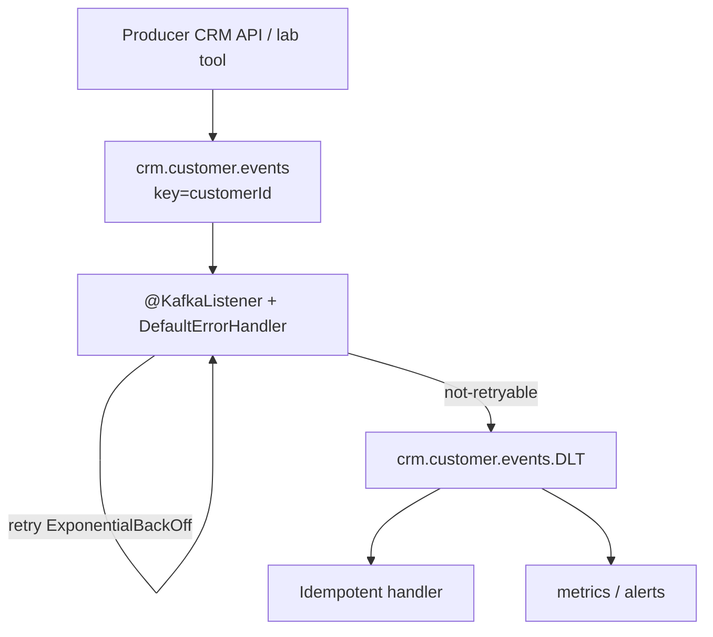
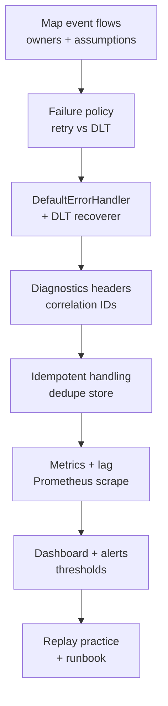

# Lab 46: Kafka Resilience and Observability — Northstar CRM Event Paths

**Module:** 46 — Kafka Resilience and Observability  
**Lab folder:** `labs/Week 5 - DevOps, CI-CD and OpenShift/module-46/lab46/`  
**Difficulty:** Advanced  
**Duration:** 4–5 Hours

**Primary IDE:** IntelliJ IDEA Community Edition · **Optional IDE:** VS Code

| OS | How-to for this lab |
| -- | ------------------- |
| Windows | [LAB-46-WINDOWS.md](LAB-46-WINDOWS.md) |
| macOS | [LAB-46-MACOS.md](LAB-46-MACOS.md) |

> **Environment reminder:** Finish [Lab 0](../../../Week%201%20-%20Java%20and%20JVM%20Foundations/module-00/lab0/LAB-0-GUIDE.md). Use **IntelliJ IDEA Community** (primary; optional VS Code) on your laptop with **JDK 21**, **Maven 3.9+**, and instructor **shared Kafka** bootstrap servers. Work under `~/java-bootcamp` (Windows: `%USERPROFILE%\java-bootcamp`).

---

## How to follow this lab

1. Open the **Windows** or **macOS** how-to (links above) in a second tab.
2. Create/work only under your `java-bootcamp/examples/…` folder from the steps (not inside this `labs/` git clone unless a step says otherwise).
3. For each **Step N**: read **Why** (if present) → do the actions → confirm **Expected** / **Expected result** → then continue.
4. When stuck, use **Failure Experiments** / troubleshooting in this guide before asking for help.
5. Capture evidence under `notes/screenshots/lab-46/` (workspace root under `java-bootcamp`; redact secrets). Use the **Pass criteria** tables — write **Pass** or **Fail** in your notes. GitHub file view does not support clickable checkboxes.

## Lab Overview

This Module 46 lab makes CRM Kafka consumers **diagnosable and failure-tolerant** using bounded retries, a dead-letter topic (DLT), idempotent handling, consumer-lag monitoring, and actionable Micrometer metrics. You will configure Spring Kafka error handling, capture DLT inspection evidence, document a dashboard, write `docs/dlt-replay-runbook.md`, and add failure/recovery tests.

**Purpose.** Leadership freezes an events rule: a malformed customer event must not block the partition forever while lag grows unnoticed. Poison messages go to a DLT with diagnostics; handlers are idempotent so replay does not double-apply side effects; operators have lag and DLT growth signals with runbooks. Silent infinite retry is a failing grade.

**What you build (exercise).** Copy to `lab46-crm`; map event flows; define failure policy; configure `DefaultErrorHandler` + `DeadLetterPublishingRecoverer`; preserve correlation/diagnostic headers; make handling idempotent; expose metrics (processed/failed/retried/DLT, latency, lag); document alerts/dashboard; practice safe replay; write tests and `docs/dlt-replay-runbook.md`.

**What success looks like.** Under `~/java-bootcamp/examples/lab46-crm/` you can force a poison event related to CRM identity, see it land on the DLT with correlation metadata, prove lag/metrics move, and demonstrate a dry-run or limited replay that does not duplicate side effects for `CUS-1001` / `CUS-1002`.

**Depends on Labs 30–31 (Kafka)** and a Spring Boot CRM consumer path. Docker Compose Kafka is typical. Finish basic produce/consume before this resilience layer.

**CRM connection.** Events may carry customer IDs `CUS-1001` (Amina Khan) and `CUS-1002` (Ravi Singh) plus correlation `lab-request-001`. Redact names/emails from logs and metric tags. Lab 47 will communicate incidents that look like this class of failure—keep evidence shareable and secret-free.

---

## Learning Objectives

After completing this lab, you will be able to:

* Classify consumer failures (validation, deserialization, timeout, DB, authz)
* Configure bounded retry and dead-letter behavior in Spring Kafka
* Preserve correlation and original-topic diagnostics without leaking PII
* Measure consumer lag and expose Micrometer/Prometheus metrics
* Design dashboard panels and alert thresholds tied to user impact
* Write a safe DLT replay procedure with dry-run and rate limits
* Prove idempotent handling under duplicate delivery and rebalance
* Connect observability evidence to release watch windows (Lab 44)

---

## Business Scenario

A malformed customer event repeatedly blocks processing while lag grows unnoticed. Agents opening profiles for Amina (`CUS-1001`) see stale data; Ravi’s (`CUS-1002`) status projection never advances. The team needs failure classification, safe recovery, and evidence that replay will not duplicate business side effects (double emails, double ledger posts—whatever your CRM consumer owns).

Use these examples consistently:

| ID | Name | Notes |
| -- | ---- | ----- |
| `CUS-1001` | Amina Khan | `ACTIVE` — projection / event fixture |
| `CUS-1002` | Ravi Singh | `PROSPECT` — status-change events |
| `lab-request-001` | — | correlation header / MDC |
| `crm.customer.events` | — | primary topic (adapt name) |
| `crm.customer.events.DLT` | — | dead-letter topic |
| `crm-customer-projection-v1` | — | consumer group example |

**Security note for evidence.** Console-consume with headers for lab topics only. Never dump production topics. Redact tokens. Prefer customer **IDs** over names in logs and metrics tags (bounded cardinality—no raw emails as tag values).

---

## Architecture Context

### NOW (this lab)



### Lab flow (mermaid)



### Architecture NOW vs LATER

| Aspect | Lab 46 (NOW) | Production messaging |
| ------ | ------------ | -------------------- |
| Replay | Manual / documented dry-run | Gated redrive tool with audit |
| Metrics | Actuator Prometheus + notes | Grafana/Alertmanager wired |
| Schema | Lab fixtures / JSON | Schema registry + compatibility |
| Multi-region | Single lab cluster | MirrorMaker / replication story |

**Lab focus:** Kafka resilience—DLT, idempotency, lag metrics, replay runbook for CRM events.

---

## Prerequisites

Complete [SETUP](../../../SETUP-INSTRUCTIONS.md), [Lab 0](../../../Week%201%20-%20Java%20and%20JVM%20Foundations/module-00/lab0/LAB-0-GUIDE.md), and Kafka labs [30](../../../Week%204%20-%20Kafka,%20React,%20PostgreSQL%20and%20Resilience/module-30/lab30/LAB-30-GUIDE.md)–[31](../../../Week%204%20-%20Kafka,%20React,%20PostgreSQL%20and%20Resilience/module-31/lab31/LAB-31-GUIDE.md) as applicable. Confirm:

* Kafka available (Docker Compose or instructor cluster)
* Spring Boot CRM consumers compiling
* Actuator/Prometheus exposure allowed in lab profile
* Docker + monitoring endpoints as per lab
* No secrets committed to Git

### Pre-flight

```bash
java -version
mvn -version
docker --version
docker compose version
git --version
pwd
ls ~/java-bootcamp/examples
```

Start Kafka if local:

```bash
docker compose ps 2>/dev/null || true
```

---

## Suggested Project Files

Primary training layout:

```text
~/java-bootcamp/examples/lab46-crm/
├── src/main/java/com/northstar/crm/
│   ├── messaging/
│   │   ├── CustomerEventListener.java
│   │   ├── CustomerEventIdempotencyService.java
│   │   └── KafkaConsumerConfig.java   # DefaultErrorHandler + DLT
│   └── ...
├── src/main/resources/
│   └── application.yml
├── src/test/java/com/northstar/crm/messaging/
│   ├── CustomerEventListenerIT.java
│   └── DltReplaySafetyTest.java
├── docs/
│   ├── kafka-dashboard.md
│   └── dlt-replay-runbook.md
├── notes/screenshots/
├── pom.xml
├── .gitignore
└── README.md
```

Platform secondary paths:

```text
~/java-bootcamp/examples/customer-management-platform/
├── backend/src/.../messaging/
├── docs/kafka-dashboard.md
├── docs/dlt-replay-runbook.md
└── reports/
```

Ignore `target/`, broker data dirs with real payloads, and credential files.

---

## Concepts to Discuss

Write 2–3 sentences each in `docs/dlt-replay-runbook.md` or `docs/kafka-dashboard.md`:

1. Main event flow (produce → consume → side effect)
2. Trust boundary: deserialization / validation before side effects
3. Success/failure contracts (ack vs retry vs DLT)
4. Stable keys (`CUS-1001`) and event IDs vs random offsets alone
5. Idempotency under at-least-once delivery
6. Why unbounded retry is worse than a DLT
7. Evidence operators need (lag, DLT rate, correlation)
8. Two consumer instances in one group (rebalance behavior)
9. False confidence: lag=0 while DLT is growing
10. What Lab 47 stakeholders need from your incident evidence

---

## Implementation Steps

Complete each step in order. Commands assume `~/java-bootcamp/examples/lab46-crm` (Windows: `%USERPROFILE%\java-bootcamp\examples\lab46-crm`) unless noted. Parts 1–8 map to Steps 1–8.

---

### Step 1 — Map event flows (Part 1)

**Why:** You cannot alert or replay what you have not named.

**Do this:**

```bash
cd ~/java-bootcamp/examples
cp -r lab31-crm lab46-crm 2>/dev/null || cp -r lab30-crm lab46-crm 2>/dev/null || mkdir -p lab46-crm
cd lab46-crm
mkdir -p docs
mkdir -p ~/java-bootcamp/notes/screenshots/lab-46
git switch -c lab/46-crm 2>/dev/null || true
```

In `docs/kafka-dashboard.md`, list producer, topic, partition key, group, side effect, and owner. Document delivery and ordering assumptions. Identify sensitive fields that must not enter logs (email, phone, tokens).

**Expected result:** Event-flow table for CRM customer events with owners and redaction rules.

**If it fails:** Unknown side effects → stop and reverse-engineer the listener before coding DLT.

---

### Step 2 — Define failure policy (Part 2)

**Why:** Retrying deserialization errors forever burns CPU and lag SLO.

**Do this:** Classify validation, deserialization, timeout, database, and authorization failures. Choose retryable exceptions. Set bounded attempts, backoff, and time budget. Record the policy in `docs/dlt-replay-runbook.md`.

Example policy snippet:

```text
IllegalArgumentException / JsonParseException → not retryable → DLT
Transient DataAccessResourceFailureException → retry with backoff
Max elapsed retry budget: 10s (lab) / document prod values separately
```

**Expected result:** Written classification with retryable vs not-retryable lists.

**If it fails:** Everything marked retryable → revise before implementing the handler.

---

### Step 3 — Configure retry and DLT (Part 3)

**Why:** Without a recoverer, exhausted retries may seek/stop/loop depending on defaults.

**Do this:** Configure `DeadLetterPublishingRecoverer` and `DefaultErrorHandler`. Route exhausted records to a named DLT. Prevent infinite retry loops.

```java
@Bean
DefaultErrorHandler kafkaErrorHandler(KafkaTemplate<Object, Object> template) {
  var recoverer = new DeadLetterPublishingRecoverer(template,
      (record, ex) -> new TopicPartition(record.topic() + ".DLT", record.partition()));
  var backoff = new ExponentialBackOff(500L, 2.0);
  backoff.setMaxElapsedTime(10_000L);
  var handler = new DefaultErrorHandler(recoverer, backoff);
  handler.addNotRetryableExceptions(IllegalArgumentException.class);
  return handler;
}
```

Wire the handler into concurrent Kafka listener container factory (as taught in class). Create the DLT if auto-create is disabled.

**Expected result:** Poison messages reach `*.DLT` after bounded retries; main consumer continues.

**If it fails:** Infinite retry → verify not-retryable list and max elapsed time; check recoverer bean wiring.

---

### Step 4 — Preserve diagnostics (Part 4)

**Why:** A DLT without headers is a black hole.

**Do this:** Carry event and correlation IDs (`lab-request-001`). Record original topic, partition, offset, exception type, and timestamp (Spring Kafka DLT headers help). Redact tokens and customer details from custom log lines—log `CUS-1001`, not email.

Produce a poison payload intentionally and inspect:

```bash
kafka-console-consumer.sh --bootstrap-server localhost:9092 \
  --topic crm.customer.events.DLT --from-beginning \
  --property print.headers=true --max-messages 10
```

Save sanitized evidence under `notes/screenshots/lab-46/`.

**Expected result:** DLT records show diagnostic headers; correlation present; no secrets/PII dumps.

**If it fails:** Empty DLT → handler not registered or wrong topic naming; fix before metrics work.

---

### Step 5 — Make handling idempotent (Part 5)

**Why:** At-least-once + replay without dedupe doubles side effects.

**Do this:** Deduplicate by event ID or business key (`customerId` + event type + version). Store processed-event evidence transactionally where practical. Test duplicates and rebalance behavior with tests that republish the same event for `CUS-1002`.

**Expected result:** Second delivery is a no-op (or safe merge); test proves it.

**If it fails:** Deduped only in memory → document restart risk; prefer durable store for credit.

---

### Step 6 — Expose metrics (Part 6)

**Why:** Lag you cannot scrape is lag you will learn about from angry agents.

**Do this:** Count processed, failed, retried, and DLT records. Time handler latency and expose consumer lag (Micrometer Kafka binders / custom gauges as taught). Use bounded-cardinality metric tags (`topic`, `outcome`)—never per-email tags.

```yaml
spring:
  kafka:
    consumer:
      group-id: crm-customer-projection-v1
      enable-auto-commit: false
      properties:
        isolation.level: read_committed
        max.poll.interval.ms: 300000
    listener:
      ack-mode: record
management:
  endpoints.web.exposure.include: health,info,prometheus
  metrics.tags.application: crm-api
```

```bash
curl -fsS http://localhost:8080/actuator/prometheus | head
kafka-consumer-groups.sh --bootstrap-server localhost:9092 \
  --group crm-customer-projection-v1 --describe
```

**Expected result:** Prometheus scrape shows CRM consumer metrics; lag describable via CLI.

**If it fails:** Endpoint 404 → expose Actuator carefully in lab profile only.

---

### Step 7 — Create alerts and dashboard notes (Part 7)

**Why:** Metrics without thresholds become museum pieces.

**Do this:** In `docs/kafka-dashboard.md`, graph (or describe panels for) throughput, error rate, p95 latency, lag, and DLT growth. Define warning and critical thresholds. Tie alerts to user impact (“stale customer profile”) and link the replay runbook.

Example thresholds (adapt):

```text
Lag > 1000 messages for 5m → warning
Lag > 10000 or DLT rate > 0 for 2m → critical + page runbook
```

**Expected result:** Dashboard doc with panels, thresholds, and runbook link.

**If it fails:** Thresholds with no user impact → rewrite the “so what” column.

---

### Step 8 — Practice replay (Part 8)

**Why:** Blind replay is how you page yourself twice.

**Do this:** Fix root cause before replay. Select and rate-limit records explicitly. Verify ordering assumptions and absence of duplicate side effects. Write `docs/dlt-replay-runbook.md` with dry-run, selection criteria, rate limit, verification (fixtures `CUS-1001`/`CUS-1002`), and abort conditions.

**Expected result:** Runbook complete; at least one rehearsal (or tabletop) recorded.

**If it fails:** Runbook says “republish all DLT” with no filter → add selective criteria.

---

### Step 9 — Failure experiments + evidence pack

**Why:** Resilience untested is hope.

**Do this:** Complete [Failure Experiments](#failure-experiments). Run `mvn -q test` twice for determinism where tests exist. Keep Git clean of broker dumps. Append a verification block to `docs/dlt-replay-runbook.md`:

```markdown
## Lab Pass criteria
_Mark each row **Pass** or **Fail** in your lab notes (GitHub markdown files are not interactive checklists)._

| # | Confirm | Your notes |
| - | ------- | ---------- |
| 1 | Poison message → DLT with headers | Pass / Fail |
| 2 | Duplicate event → no double side effect (CUS-1002) | Pass / Fail |
| 3 | Lag describe output captured | Pass / Fail |
| 4 | Prometheus snippet captured (sanitized) | Pass / Fail |
| 5 | Replay dry-run steps rehearsed / tabletoped | Pass / Fail |
```

**Expected result:** ≥3 experiments; DLT evidence; green tests; runbooks ready.

**If it fails:** See Troubleshooting.

---

## Implementation Checkpoints

### Checkpoint A — Tooling

_Mark each row **Pass** or **Fail** in your lab notes (GitHub markdown files are not interactive checklists)._

| # | Confirm | Your notes |
| - | ------- | ---------- |
| 1 | `lab46-crm` under `examples/` | Pass / Fail |
| 2 | Kafka reachable; CRM app starts | Pass / Fail |
| 3 | Actuator/Prometheus or CLI lag available | Pass / Fail |

### Checkpoint B — Core resilience

_Mark each row **Pass** or **Fail** in your lab notes (GitHub markdown files are not interactive checklists)._

| # | Confirm | Your notes |
| - | ------- | ---------- |
| 1 | Event flow map + failure policy documented | Pass / Fail |
| 2 | `DefaultErrorHandler` + DLT recoverer configured | Pass / Fail |
| 3 | Diagnostics headers / correlation preserved | Pass / Fail |

### Checkpoint C — Idempotency + observability

_Mark each row **Pass** or **Fail** in your lab notes (GitHub markdown files are not interactive checklists)._

| # | Confirm | Your notes |
| - | ------- | ---------- |
| 1 | Idempotent handling with test evidence | Pass / Fail |
| 2 | Metrics + lag inspection evidence | Pass / Fail |
| 3 | Dashboard + alert thresholds documented | Pass / Fail |

### Checkpoint D — Hygiene

_Mark each row **Pass** or **Fail** in your lab notes (GitHub markdown files are not interactive checklists)._

| # | Confirm | Your notes |
| - | ------- | ---------- |
| 1 | `docs/dlt-replay-runbook.md` complete | Pass / Fail |
| 2 | No PII/secrets in logs or Git | Pass / Fail |
| 3 | Controlled poison → DLT → recover path evidenced | Pass / Fail |

---

## Reference Commands, Configuration, and Code

### Spring Kafka error handler

```java
@Bean
DefaultErrorHandler kafkaErrorHandler(KafkaTemplate<Object, Object> template) {
  var recoverer = new DeadLetterPublishingRecoverer(template,
      (record, ex) -> new TopicPartition(record.topic() + ".DLT", record.partition()));
  var backoff = new ExponentialBackOff(500L, 2.0);
  backoff.setMaxElapsedTime(10_000L);
  var handler = new DefaultErrorHandler(recoverer, backoff);
  handler.addNotRetryableExceptions(
      IllegalArgumentException.class,
      org.springframework.messaging.converter.MessageConversionException.class
  );
  return handler;
}
```

### Consumer and metrics configuration

```yaml
spring:
  kafka:
    consumer:
      group-id: crm-customer-projection-v1
      enable-auto-commit: false
      key-deserializer: org.apache.kafka.common.serialization.StringDeserializer
      value-deserializer: org.springframework.kafka.support.serializer.ErrorHandlingDeserializer
      properties:
        isolation.level: read_committed
        max.poll.interval.ms: 300000
        spring.deserializer.value.delegate.class: org.springframework.kafka.support.serializer.JsonDeserializer
        spring.json.trusted.packages: com.northstar.crm
    listener:
      ack-mode: record
management:
  endpoints.web.exposure.include: health,info,prometheus
  metrics.tags.application: crm-api
```

### Inspect lag and DLT

```bash
kafka-consumer-groups.sh --bootstrap-server localhost:9092 \
  --group crm-customer-projection-v1 --describe
kafka-console-consumer.sh --bootstrap-server localhost:9092 \
  --topic crm.customer.events.DLT --from-beginning \
  --property print.headers=true --max-messages 10
curl -fsS http://localhost:8080/actuator/prometheus | rg -i "kafka|crm|dlt|consumer" || true
```

### `docs/dlt-replay-runbook.md` outline

```markdown
# DLT Replay Runbook — crm.customer.events
## Preconditions
_Mark each row **Pass** or **Fail** in your lab notes (GitHub markdown files are not interactive checklists)._

| # | Confirm | Your notes |
| - | ------- | ---------- |
| 1 | Root cause fixed and deployed | Pass / Fail |
| 2 | Idempotency proven for event type | Pass / Fail |
| 3 | Dry-run selection listed (offsets / eventIds) | Pass / Fail |
## Steps
1. Export selected DLT records (sanitize PII)
2. Rate-limit republish to main topic
3. Watch lag, error rate, DLT growth
4. Verify CUS-1001 / CUS-1002 projections
## Abort if
- Duplicate side effects detected
- Lag critical threshold exceeded
## Correlation
- Prefer lab-request-001 style IDs in lab evidence
```

### Dashboard outline (`docs/kafka-dashboard.md`)

```markdown
# CRM Kafka Dashboard
## Panels
1. Messages/sec processed
2. Error rate
3. p95 handler latency
4. Consumer lag by group
5. DLT publish rate
## Thresholds
- Warning / Critical (document values)
## User impact
- Stale profiles for agents (CUS-* projections)
## Runbook link
- docs/dlt-replay-runbook.md
```

### Commands

```bash
cd ~/java-bootcamp/examples/lab46-crm
mvn -q -B clean test
mvn -q -B spring-boot:run
git status --short
```

### Evidence log template

```markdown
# Lab 46 Evidence Log
- Topic / DLT / group:
- Poison test correlation:
## Results
| Check | Result | Evidence |
| ----- | ------ | -------- |
| DLT receive | PASS/FAIL | |
| Idempotent duplicate | PASS/FAIL | |
| Lag visible | PASS/FAIL | |
| Metrics scrape | PASS/FAIL | |
| Replay dry-run | PASS/FAIL | |
```

### Artifact map

| Artifact | Role |
| -------- | ---- |
| Kafka error-handler config | Retry + DLT wiring |
| DLT inspection evidence | Poison-path proof |
| `docs/kafka-dashboard.md` | Ops panels + thresholds |
| `docs/dlt-replay-runbook.md` | Safe redrive procedure |
| Failure/recovery tests | Regression safety |
| Actuator Prometheus excerpt | Metrics evidence |

---

## Manual Verification

1. Failure policy distinguishes retryable vs not-retryable errors.
2. Bounded retries then DLT—no infinite loop.
3. DLT headers include original topic/offset/exception metadata.
4. Correlation `lab-request-001` is visible in diagnostics where applicable.
5. Duplicate event for `CUS-1002` does not double-apply side effects.
6. Lag and/or Prometheus metrics are observable.
7. Dashboard doc defines warning/critical thresholds with user impact.
8. Replay runbook requires root-cause fix, selection, rate limit, verification.
9. Tests cover failure and recovery paths.
10. No real customer PII or secrets in logs/Git.

---

## Failure Experiments

| # | Experiment | Observe | Restore |
| - | ---------- | ------- | ------- |
| 1 | Publish poison JSON to main topic | Lands on DLT after budget | Keep sample for evidence |
| 2 | Republish same valid event twice | Idempotent second apply | Assert counters/fixtures |
| 3 | Stop consumer briefly | Lag rises; clears after start | Document lag signal |
| 4 | Mark retryable as not-retryable wrongly | Premature DLT | Fix classification |
| 5 | Log email in listener | PII leak smell | Redact; use customerId only |

---

## Troubleshooting

| Symptom | Likely cause | Fix |
| ------- | ------------ | --- |
| No DLT messages | Handler not on factory | Wire `CommonErrorHandler` on container factory |
| Infinite retry | Missing not-retryable / budget | Add exceptions; set max elapsed |
| Lag stuck | Poison still on main / stop | Check DLT routing; pause partitions if needed |
| Duplicate side effects | No durable idempotency | Persist processed keys |
| Metrics empty | Actuator not exposed | Lab profile exposure; security allowlist |
| Rebalance storms | Long processing / max.poll | Tune poll interval; shorten work |
| Header missing | Custom recoverer overrides | Preserve Spring DLT headers |
| DLT topic missing | Auto-create disabled | Create `*.DLT` explicitly |
| Wrong group lag | Observing wrong `group-id` | Match `crm-customer-projection-v1` (or yours) |
| Test flake on EmbeddedKafka | Shared topic state | Unique topics per test / `@DirtiesContext` |

---

## Security and Production Review

Answer in `docs/dlt-replay-runbook.md`:

1. Which inputs are untrusted (Kafka payloads from other services)?
2. Where are authn/authz for redrive enforced?
3. Which values are sensitive in DLT bodies and logs?
4. What can be retried safely (idempotent handlers)?
5. What happens after partial replay failure?
6. What would an operator monitor (lag, DLT rate, error ratio)?
7. Which local default is unacceptable (infinite retry, PII logs, replay-all)?
8. How are event contracts versioned with schema evolution?

---

## Cleanup

```bash
cd ~/java-bootcamp/examples/lab46-crm
mvn -q clean
docker compose down 2>/dev/null || true
git status --short
```

Purge lab DLT messages if shared brokers require it. Keep sanitized screenshots.

**Keep `lab46-crm`**—Lab 47 may reference this failure class in incident communications.

---

## Expected Deliverables

* Kafka error-handler configuration (retry + DLT)
* DLT inspection evidence
* `docs/kafka-dashboard.md`
* `docs/dlt-replay-runbook.md`
* Failure and recovery tests
* Metrics/lag evidence
* No secrets or real customer PII committed

---

## Evaluation Rubric (100 Marks)

| Criteria | Marks |
| -------- | ----: |
| Environment and project structure | 10 |
| Core implementation (error handler, DLT, idempotency) | 30 |
| Integration/configuration correctness (Spring Kafka + metrics) | 15 |
| Failure handling (poison path + replay safety) | 15 |
| Automated verification | 10 |
| Security and production awareness (PII, bounded tags) | 10 |
| Documentation and evidence | 10 |

**Notes:** Infinite retry or PII in logs → lose security marks. Replay-all without idempotency → lose recovery marks.

---

## Reflection Questions

Write 3–6 sentence answers:

1. Which design decision most affected correctness (keying, DLT, or idempotency)?
2. Which failure was hardest to diagnose?
3. What evidence proves the poison path is bounded?
4. What breaks first at ten times the event rate?
5. Which concern should move to shared platform Kafka tooling?
6. What must change before real customer payloads are logged (spoiler: don’t)?
7. How does this lab connect to Labs 30–31, 44, and 47?
8. What metric matters most on the on-call dashboard?
9. (Forward look) How does schema evolution change DLT replay criteria?

---

## Bonus Challenges

1. Add a DLT redrive utility with dry-run mode.
2. Alert on lag **duration** rather than only record count.
3. Test duplicate delivery across process restart.
4. Add retry and DLT integration tests with EmbeddedKafka / Testcontainers.
5. Document partition-key trade-offs for `CUS-*` keys.
6. Export a Grafana JSON excerpt (sanitized) matching `kafka-dashboard.md`.

---

## Success Criteria

You are finished when:

* Poison events reach the DLT after bounded retries
* Idempotent handling prevents duplicate side effects
* Lag and consumer metrics are observable
* Dashboard/alert notes and replay runbook exist
* Failure/recovery tests pass deterministically
* Another student can follow the replay dry-run
* No production secret or real PII is hard-coded in logs

---

## Instructor Notes

* **Live probe:** Have the student publish a poison message, show DLT headers, then explain why replaying it now would or would not be safe.
* **Assess:** Classification quality, handler wiring, idempotency proof, metrics/lag evidence, usable runbook.
* **Continuity:** Prefer `examples/lab46-crm`. Keep fixture IDs. Lab 47 should reuse this narrative without renaming customers.
* **Common pitfalls:** Unwired error handler; infinite retry; logging emails; high-cardinality metric tags; replay-all; auto-commit fighting manual ack mode.
* **Timing:** 4–5 hours. Broker connectivity and DLT topic creation often burn 45 minutes—pre-check Compose.

---

*End of Lab 46 — Kafka Resilience and Observability: Northstar CRM Event Paths. Keep `lab46-crm` for Lab 47 communication scenarios and portfolio evidence.*
