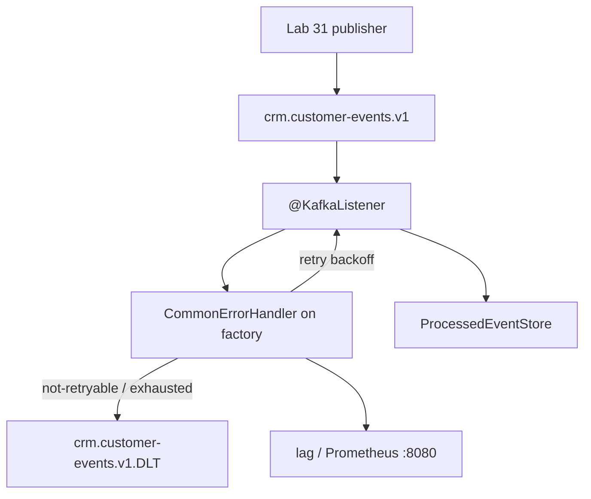

# Lab 46: Kafka Resilience and Observability — Northstar CRM Event Paths

**Module:** 46 — Kafka Resilience and Observability  
**Duration:** ~45 minutes (timed path with starter) · Full path: 4–5 Hours

**Primary IDE:** IntelliJ IDEA Community Edition · **Optional IDE:** VS Code

| OS | How-to for this lab |
| -- | ------------------- |
| Windows | [LAB-46-WINDOWS.md](LAB-46-WINDOWS.md) |
| macOS | [LAB-46-MACOS.md](LAB-46-MACOS.md) |

> **Two folders (do not mix):** [Clone the course repo · Commit in your own repo](../../../CLONE-AND-OWN-REPO-GUIDE.md). Read this GUIDE in the **course clone**. Write, run, and **push** everything in **your** `java-bootcamp` repo.

---

## Activity card

| | |
| --- | --- |
| **Time** | ~45 min timed · full path 4–5 h |
| **Checkpoint** | **E** (after Ex 1→4→2→3→5→6) |
| **Must prove** | One error handler on the factory · DLT topic · dashboard · dry-run replay |
| **Hard gate** | Pre-lab Pass · **Lab 31 CRM** in `java-bootcamp` · Lab 30 broker **or** EmbeddedKafka |

### What you will learn

Make Lab 31 CRM Kafka consumers diagnosable: bounded retry, DLT, idempotency notes, lag/metrics, safe replay.

### Enterprise context

Silent infinite retry while lag grows is a failing grade—poison must be diagnosable.

### Predict

Should malformed events stay on the main topic forever?

### Debug

Poison produced but DLT empty — factory unwired, wrong topic (`.dlq` vs `.DLT`), or `.sh` run on the Windows host?

---

## Two folders — every command below uses these paths

| Folder | Remote | You… |
| ------ | ------ | ---- |
| **Course clone** (handouts) | `bc-sw-engineer-java-participant` | **Read** this GUIDE / starter. **Never** commit homework here. |
| **Your repo** | private `java-bootcamp` | **Copy Lab 31**, merge starter docs/config, **commit**. |

| Item | Course clone (read) | Your `java-bootcamp` (write) |
| ---- | ------------------- | ---------------------------- |
| This GUIDE | `labs/…/module-46/lab46/LAB-46-GUIDE.md` | — |
| Starter docs + `KafkaErrorConfig` | `labs/…/module-46/lab46/starter/` | merge into `examples/lab46-crm/` |
| Graded Kafka CRM | — | `examples/lab46-crm/` (copy of **Lab 31**, not Lab 41–45) |
| Pre-lab notes | — | `examples/module-46-exercises/notes/` |
| Screenshots | — | `notes/screenshots/lab-46/` (gitignored) |

IntelliJ stays on `java-bootcamp`.

**This lab returns to Week 4 Kafka CRM.** Copy **`examples/lab31-crm`**. **Do not** copy Lab 30 (no Spring Boot), Lab 41–45 (HTTP CRM, **no** Kafka), or starter-only (no `pom.xml`).

**Broker:** Lab 30 Compose service **`crm-kafka`**, host **`localhost:9092`**. Start it from `examples/lab30-crm` (`docker compose up -d`). There is **no** `docker-compose.yml` in Lab 46.

**Topics (keep Lab 31 names):**

| Topic | Role |
| ----- | ---- |
| `crm.customer-events.v1` | Main stream (Lab 30/31) |
| `crm.customer-events.v1.DLT` | Spring `DeadLetterPublishingRecoverer` default (`topic + ".DLT"`) |
| `crm.customer-events.v1.dlq` | Lab 30 created this — **not** where Spring publishes unless you coded that name |

Create `.DLT` if it does not exist. Consume **`.DLT`**, not `.dlq`, unless you changed the recoverer.

**CLI:** always `docker exec crm-kafka /opt/kafka/bin/….sh`. There is no `kafka-console-consumer.sh` on the Windows PATH.

**HTTP:** Actuator on **`http://localhost:8080`**. Do **not** use Lab 42 Host `:8088`.

**One handler bean:** Lab 31 already has `KafkaErrorConfig`. Lab 46 **edits that class** (backoff, not-retryable, **wire `ConcurrentKafkaListenerContainerFactory`**). Do **not** add a second `@Bean DefaultErrorHandler` (`KafkaConsumerConfig`).

**Idempotency:** Lab 31 `ProcessedEventStore` is in-memory. Timed path: document restart risk. Do not log emails.

---

## 45-minute timed path (use starter)

> **Pacing reminder:** [PACING.md](../PACING.md) checkpoint **E**. Homework: live poison→DLT via `docker exec`, Prometheus scrape, replay tabletop.

1. Open [`starter/README.md`](starter/README.md) **in the course clone**.
2. In **`java-bootcamp`**, copy Lab 31 → `examples/lab46-crm`, merge starter **docs** + `KafkaErrorConfig`.
3. Fill TODOs — do **not** work under `labs/`.
4. `mvn -B -DskipTests compile` (or `mvn -B test` with EmbeddedKafka). Evidence under `notes/screenshots/lab-46/`.
5. Mark timed-path Pass criteria in the starter README.

| Path | Time | Scope |
| ---- | ---- | ----- |
| **Timed (default)** | ~45 min | Factory-wired handler + docs + compile/tests |
| **Full (extended)** | see Duration | Live broker poison→`.DLT` + lag describe + Prometheus |

---

## What you'll submit (read this first)

All of these live under **`java-bootcamp`**, not the course clone.

| # | Deliverable | Where |
| - | ----------- | ----- |
| 1 | `KafkaErrorConfig` — recoverer + bounded backoff + **factory wiring** | `examples/lab46-crm/` |
| 2 | DLT inspect evidence **or** EmbeddedKafka/tabletop note | `notes/screenshots/lab-46/` |
| 3 | `docs/kafka-dashboard.md` | `examples/lab46-crm/docs/` |
| 4 | `docs/dlt-replay-runbook.md` | same |
| 5 | Tests green twice, or compile + documented IT gap | `src/test/…` |
| 6 | No secrets / real PII | `git status` on **your** repo |

**Do not submit:** `target/`, broker dumps, kubeconfig, or a verbatim instructor `solution/`.

---

## Lab Overview

Harden Lab 31 Spring Kafka: bounded retries, DLT, correlation, lag, replay runbook. You are **not** adding Kafka to the Lab 41 Docker/k3d CRM.

## Learning Objectives

After completing this lab, you will be able to:

* Classify consumer failures (validation, deserialization, timeout, DB)
* Configure bounded retry and DLT in Spring Kafka **on the listener factory**
* Preserve correlation without leaking PII
* Inspect lag via `docker exec` and Actuator/Prometheus on **8080**
* Write a dry-run replay runbook

## Business Scenario

A malformed customer event blocks the group while lag grows. Agents see stale Amina (`CUS-1001`) / Ravi (`CUS-1002`) projections. You need classification, DLT, and replay that will not double side effects.

| ID | Name | Notes |
| -- | ---- | ----- |
| `CUS-1001` | Amina Khan | `ACTIVE` — event fixture |
| `CUS-1002` | Ravi Singh | `PROSPECT` |
| `lab-request-001` | — | correlation |
| `crm.customer-events.v1` | — | main topic |
| `crm.customer-events.v1.DLT` | — | Spring DLT |
| `crm-notifications` | — | Lab 31 default `group-id` (use whatever is in **your** `application.yml`) |

**Security note.** Training topics only. Log **customer IDs**, not emails.

---

## Architecture Context
### NOW (this lab)


```mermaid
flowchart TB
  Prod["Lab 31 publisher"] --> Topic["crm.customer-events.v1"]
  Topic --> L["@KafkaListener"]
  L --> EH["CommonErrorHandler on factory"]
  EH -->|retry backoff| L
  EH -->|not-retryable / exhausted| DLT["crm.customer-events.v1.DLT"]
  L --> Idem["ProcessedEventStore"]
  EH --> Obs["lag / Prometheus :8080"]
```

Replay from DLT **re-enters the listener** (then idempotency matters). The DLT is a sink, not the handler.

## Prerequisites

Prior labs: [Lab 31](../../../Week%204%20-%20Kafka,%20React,%20PostgreSQL%20and%20Resilience/module-31/lab31/LAB-31-GUIDE.md) in **`java-bootcamp`**. Broker: [Lab 30](../../../Week%204%20-%20Kafka,%20React,%20PostgreSQL%20and%20Resilience/module-30/lab30/LAB-30-GUIDE.md) Compose.

Confirm:

* `examples/lab31-crm` has `pom.xml` + Spring Kafka
* `crm-kafka` Up **or** you will use EmbeddedKafka only
* No secrets in Git

### Pre-flight

```powershell
git remote -v   # YOUR java-bootcamp
cd $env:USERPROFILE\java-bootcamp\examples\lab30-crm
docker compose ps
```

Working directory for the CRM:

```text
~/java-bootcamp/examples/lab46-crm
```

## Worked example (read before you code)

```powershell
docker exec crm-kafka /opt/kafka/bin/kafka-topics.sh `
  --bootstrap-server localhost:9092 --create --if-not-exists `
  --topic crm.customer-events.v1.DLT --partitions 1 --replication-factor 1

docker exec crm-kafka /opt/kafka/bin/kafka-consumer-groups.sh `
  --bootstrap-server localhost:9092 --group crm-notifications --describe
```

**What to notice:** Instructors check **Lab 31 copy**, **one** handler on the **factory**, and DLT inspect on **`.DLT`**.

---

## Implementation Steps

Complete each step in order. **Write** under `java-bootcamp`. **Read** starter from the course clone.

---

### Step 1 — Copy Lab 31, merge starter, map event flows

**Why:** You cannot alert or replay what you have not named. Starter is not a full Maven app.

**Do this:**

**Windows (PowerShell):**

```powershell
$jb = "$env:USERPROFILE\java-bootcamp"
$courseLab46 = "$env:USERPROFILE\bc-sw-engineer-java-participant\labs\Week 5 - DevOps, CI-CD and OpenShift\module-46\lab46"

Copy-Item -Recurse -Force "$jb\examples\lab31-crm" "$jb\examples\lab46-crm"
New-Item -ItemType Directory -Force -Path "$jb\examples\lab46-crm\docs","$jb\notes\screenshots\lab-46" | Out-Null
Copy-Item -Force "$courseLab46\starter\docs\*" "$jb\examples\lab46-crm\docs\"
Copy-Item -Force "$courseLab46\starter\src\main\java\com\northstar\crm\config\KafkaErrorConfig.java" `
  "$jb\examples\lab46-crm\src\main\java\com\northstar\crm\config\KafkaErrorConfig.java"
Copy-Item -Force "$courseLab46\starter\src\main\resources\application.yml" `
  "$jb\examples\lab46-crm\src\main\resources\application.yml"
# That yml keeps Lab 31 topics (`crm.customer-events.v1`) and adds Actuator. Do not rename to crm.customer.events.
cd "$jb\examples\lab46-crm"
```

**macOS / Linux:**

```bash
JB=~/java-bootcamp
COURSE_LAB46=~/bc-sw-engineer-java-participant/labs/Week\ 5\ -\ DevOps,\ CI-CD\ and\ OpenShift/module-46/lab46

cp -R "$JB/examples/lab31-crm" "$JB/examples/lab46-crm"
mkdir -p "$JB/examples/lab46-crm/docs" "$JB/notes/screenshots/lab-46"
cp "$COURSE_LAB46/starter/docs/"* "$JB/examples/lab46-crm/docs/"
cp "$COURSE_LAB46/starter/src/main/java/com/northstar/crm/config/KafkaErrorConfig.java" \
  "$JB/examples/lab46-crm/src/main/java/com/northstar/crm/config/KafkaErrorConfig.java"
cp "$COURSE_LAB46/starter/src/main/resources/application.yml" \
  "$JB/examples/lab46-crm/src/main/resources/application.yml"
cd "$JB/examples/lab46-crm"
```

Confirm `pom.xml` exists. Confirm you did **not** copy Lab 44/45. Confirm there is **one** `KafkaErrorConfig` (no extra `KafkaConsumerConfig` `@Bean` handler). Add `spring-boot-starter-actuator` + `micrometer-registry-prometheus` to `pom.xml` if they are missing (Lab 31 did not include them).

In `docs/kafka-dashboard.md`, list producer, topic `crm.customer-events.v1`, key=`customerId`, group, side effect, owner, redaction (no email in tags).

**Expected result:** `lab46-crm` is Lab 31 + Lab 46 docs/config; event-flow table started.

**If it fails:** Copied Lab 30 / 41 / starter-only → start over with **Lab 31**.

---

### Step 2 — Define failure policy

**Why:** Retrying deserialization forever burns CPU and lag SLO.

**Do this:** In `docs/dlt-replay-runbook.md`, classify:

```text
InvalidCustomerEventException / UnsupportedEventVersionException / parse → not retryable → DLT
Transient DataAccessResourceFailureException → retry with backoff, then DLT
Max elapsed (lab): 10s
```

**Expected result:** Retryable vs not-retryable lists.

---

### Step 3 — Bounded retry + DLT **on the factory**

**Why:** A `DefaultErrorHandler` `@Bean` that is never set on `ConcurrentKafkaListenerContainerFactory` does not run.

**Do this:** Complete TODOs in `KafkaErrorConfig`: `DeadLetterPublishingRecoverer` (`topic + ".DLT"`), `ExponentialBackOff` (lab max elapsed 10s) or bounded `FixedBackOff`, `addNotRetryableExceptions`, and:

```java
factory.setCommonErrorHandler(kafkaErrorHandler);
```

Create the DLT topic (Step worked example). Do **not** add a second handler class.

**Expected result:** Poison/contract errors can reach `crm.customer-events.v1.DLT`; main consumer continues.

**If it fails:** Infinite retry → not-retryable + max elapsed. Dual beans → delete the extra `@Bean`.

---

### Step 4 — Diagnostics (headers, not host `.sh`)

**Why:** A DLT without headers is a black hole.

**Do this:** Keep `lab-request-001`. Log `CUS-1001`, not email.

Full path — inspect DLT:

```powershell
docker exec crm-kafka /opt/kafka/bin/kafka-console-consumer.sh `
  --bootstrap-server localhost:9092 `
  --topic crm.customer-events.v1.DLT --from-beginning `
  --property print.headers=true --max-messages 10 --timeout-ms 15000
```

Timed path: tabletop this command + screenshot of config. Save under `notes/screenshots/lab-46/`.

**Expected result:** You know **`.DLT`** is the Spring destination (Lab 30 `.dlq` is a different name).

**If it fails:** Empty DLT → factory not wired, or you consumed `.dlq`. `.sh` not found → you ran the script on the host; use `docker exec`.

---

### Step 5 — Idempotency

**Why:** At-least-once + replay without dedupe doubles side effects.

**Do this:** Keep `ProcessedEventStore.markIfNew(eventId)`. Test duplicate `CUS-1002` / same `eventId`. Document: in-memory store **resets on restart**.

**Expected result:** Second delivery is a no-op; restart risk written in the runbook.

---

### Step 6 — Metrics and lag

**Why:** Lag you cannot scrape is lag you learn about from agents.

**Do this:** Expose Actuator Prometheus in **lab profile** (`health,prometheus`). Tags: `topic` / `outcome` — never email.

```powershell
curl.exe -fsS http://localhost:8080/actuator/prometheus
docker exec crm-kafka /opt/kafka/bin/kafka-consumer-groups.sh `
  --bootstrap-server localhost:9092 --group crm-notifications --describe
```

If the app is not running, timed path: document the commands + `mvn -B test`.

**Expected result:** Scrape **or** CLI lag **or** documented substitute.

**If it fails:** 404 → expose Actuator. Connection refused on 8080 → app not started (not k3d `:8088`).

---

### Step 7 — Dashboard notes

**Why:** Metrics without thresholds are museum pieces.

**Do this:** Finish `docs/kafka-dashboard.md`: lag, DLT rate, retries, latency; warning/critical; user impact (stale CUS-* projections); link the runbook.

**Expected result:** Panels + “so what.”

---

### Step 8 — Replay dry-run

**Why:** Blind replay pages you twice.

**Do this:** Finish `docs/dlt-replay-runbook.md`: fix root cause first, select records, rate-limit, verify fixtures, abort on duplicate side effects. Tabletop is valid on the timed path.

**Expected result:** Runbook a peer can follow.

---

### Step 9 — Failure experiments + evidence pack

**Do this:** Complete Failure Experiments. `mvn -B test` twice if EmbeddedKafka tests exist. `git status` on **your** repo.

```markdown
| # | Confirm | Notes |
| - | ------- | ----- |
| 1 | Work in java-bootcamp; Lab 31 copy | Pass / Fail |
| 2 | One handler on the factory | Pass / Fail |
| 3 | DLT is .DLT (not host .sh / not .dlq unless you coded it) | Pass / Fail |
| 4 | Dashboard + replay dry-run | Pass / Fail |
| 5 | No PII/secrets in Git | Pass / Fail |
```

---

## Implementation Checkpoints

### Checkpoint A — Tooling

| # | Confirm | Your notes |
| - | ------- | ---------- |
| 1 | `examples/lab46-crm` is Lab 31 (`pom.xml` + Kafka) | Pass / Fail |
| 2 | `crm-kafka` Up **or** EmbeddedKafka-only path | Pass / Fail |
| 3 | `crm.customer-events.v1.DLT` created or documented | Pass / Fail |

### Checkpoint B — Core resilience

| # | Confirm | Your notes |
| - | ------- | ---------- |
| 1 | Event flow + failure policy | Pass / Fail |
| 2 | Recoverer + backoff + **factory** | Pass / Fail |
| 3 | Correlation / no email in logs | Pass / Fail |

### Checkpoint C — Idempotency + observability

| # | Confirm | Your notes |
| - | ------- | ---------- |
| 1 | Duplicate event no-op + restart risk noted | Pass / Fail |
| 2 | Lag or Prometheus (8080) or substitute | Pass / Fail |
| 3 | Dashboard thresholds | Pass / Fail |

### Checkpoint D — Hygiene

| # | Confirm | Your notes |
| - | ------- | ---------- |
| 1 | Replay runbook complete | Pass / Fail |
| 2 | No PII/secrets | Pass / Fail |
| 3 | Pushes to **your** remote | Pass / Fail |

---

## Safety Rules

* Never dump production Kafka topics.
* Never log emails as metric tags.
* Never add a second `DefaultErrorHandler` bean.
* Never treat Lab 41–45 as the Kafka app.
* Never run `kafka-*.sh` on the Windows host PATH.

---

## Reference Commands

```powershell
cd $env:USERPROFILE\java-bootcamp\examples\lab30-crm
docker compose up -d
docker exec crm-kafka /opt/kafka/bin/kafka-topics.sh --bootstrap-server localhost:9092 --list

cd $env:USERPROFILE\java-bootcamp\examples\lab46-crm
mvn -B test
```

## Failure Experiments

| # | Experiment | Observe | Restore |
| - | ---------- | ------- | ------- |
| 1 | Contract error (bad key / version) | Fast DLT | Keep sample |
| 2 | Same eventId twice | Second is no-op | Assert store |
| 3 | Stop consumer | Lag rises | Start again |
| 4 | Consume `.dlq` while recoverer uses `.DLT` | Empty | Consume `.DLT` |
| 5 | Second handler `@Bean` | Context fail / silent skip | One `KafkaErrorConfig` |
| 6 | Log email in listener | PII smell | CustomerId only |

---

## Troubleshooting

| Symptom | Likely cause | Fix |
| ------- | ------------ | --- |
| No `pom.xml` | Starter-only or Lab 30 | Copy **Lab 31** |
| Copied Lab 41–45 | No Kafka | Copy **Lab 31** |
| Work in course clone | Wrong folder | `java-bootcamp` |
| `kafka-console-consumer.sh` not found | Host PATH | `docker exec crm-kafka …` |
| Empty DLT on `.dlq` | Lab 30 name | Spring default is **`.DLT`** |
| Empty DLT on `.DLT` | Factory not wired | `setCommonErrorHandler` |
| Dual `DefaultErrorHandler` | Extra `KafkaConsumerConfig` | Delete extra `@Bean` |
| Infinite retry | No not-retryable / budget | Classify + max elapsed |
| Actuator on 8088 | Lab 42 habit | **8080** |
| Metrics empty | Actuator not exposed | Lab profile include prometheus |
| In-memory dupes after restart | `ProcessedEventStore` | Document; durable store for credit |

## Evidence Log Template

```markdown
# Lab 46 Evidence Log
- Repo (must be java-bootcamp):
- Seed (must be Lab 31):
- Topic / DLT / group:
- Factory wired:
- Poison/DLT (live or tabletop):
```

---

## Cleanup

```bash
cd ~/java-bootcamp/examples/lab46-crm
mvn -q clean
# Broker stays with Lab 30 unless you intend to stop it:
# cd ../lab30-crm && docker compose stop
git status --short
```

**Keep `lab46-crm`**—Lab 47 may cite this failure class.

---

## Reflection Questions

Write **1–3 sentence** answers (not essays):

1. Which design decision most affected correctness (factory wiring, DLT name, or idempotency)?
2. What evidence proves the poison path is bounded?
3. Why must Lab 44 CD still not rebuild the JAR even if Kafka is healthy?
