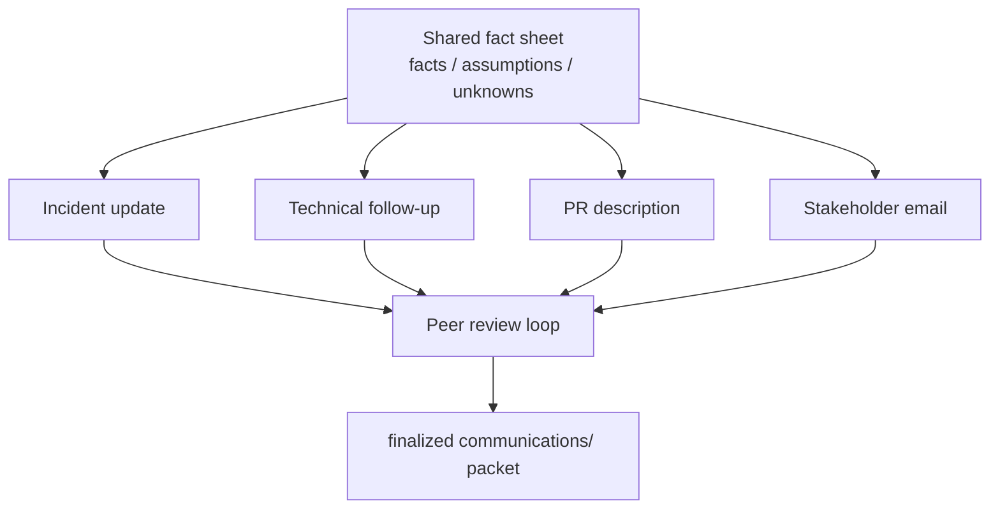
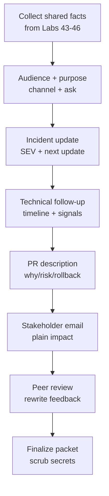

# Lab 47: Professional Communication for a CRM Release — Northstar Stakeholder Pack

**Module:** 47 — Professional Communication for a CRM Release  
**Lab folder:** `labs/Week 5 - DevOps, CI-CD and OpenShift/module-47/lab47/`  
**Difficulty:** Intermediate  
**Duration:** 3–4 Hours

**Primary IDE:** IntelliJ IDEA Community Edition · **Optional IDE:** VS Code

| OS | How-to for this lab |
| -- | ------------------- |
| Windows | [LAB-47-WINDOWS.md](LAB-47-WINDOWS.md) |
| macOS | [LAB-47-MACOS.md](LAB-47-MACOS.md) |

> **Environment reminder:** Finish [Lab 0](../../../Week%201%20-%20Java%20and%20JVM%20Foundations/module-00/lab0/LAB-0-GUIDE.md). This is primarily a **documentation / communication** lab in **IntelliJ IDEA Community** (or optional VS Code) under `~/java-bootcamp` (Windows: `%USERPROFILE%\java-bootcamp`). Keep prior CRM evidence nearby.

---

## How to follow this lab

1. Open the **Windows** or **macOS** how-to (links above) in a second tab.
2. Create/work only under your `java-bootcamp/examples/…` folder from the steps (not inside this `labs/` git clone unless a step says otherwise).
3. For each **Step N**: read **Why** (if present) → do the actions → confirm **Expected** / **Expected result** → then continue.
4. When stuck, use **Failure Experiments** / troubleshooting in this guide before asking for help.
5. Capture evidence under `notes/screenshots/lab-47/` (workspace root under `java-bootcamp`; redact secrets). Use the **Pass criteria** tables — write **Pass** or **Fail** in your notes. GitHub file view does not support clickable checkboxes.

## Lab Overview

This Module 47 lab teaches you to communicate a CRM release clearly to engineers, responders, reviewers, and business stakeholders through an **incident update**, **pull-request description**, **stakeholder email**, and **peer review**. You will produce files under `communications/` plus release briefing notes that share one consistent fact base.

**Purpose.** Leadership freezes a communication rule: during CRM 1.4 (example) release stress, different audiences need different depth—but never contradictory facts. Blame, invented root cause, and leaked credentials are unacceptable. Clarity under time pressure is a deliverable equal to code.

**What you build (exercise).** Create `lab47-crm` docs workspace; collect shared facts from prior labs; define audience and purpose; write incident update; write technical follow-up; draft PR description; draft stakeholder email; run peer review with concrete rewrites; finalize the packet (dates, links, secrecy scrub). Optionally verify CRM still builds with `mvn -q test`.

**What success looks like.** Under `~/java-bootcamp/examples/lab47-crm/` a peer can read all four communication artifacts, confirm they agree on severity/impact/next update, find no secrets, and reuse fixture language consistently (`CUS-1001` Amina, `CUS-1002` Ravi, `lab-request-001`).

**Depends on prior CRM lab notes.** Ideal inputs: Lab 43 CI runbook, Lab 44 release/rollback docs, Lab 46 lag/DLT evidence. If those are thin, use the fictional but **internally consistent** scenario in Business Scenario—label assumptions explicitly.

**CRM connection.** Communications may reference agents failing to open profiles for `CUS-1001` / `CUS-1002` with correlation `lab-request-001` after a `crm-api` 1.4.0 rollout—synthetic only. This lab closes the week’s delivery narrative before later specialized modules.

---

## Learning Objectives

After completing this lab, you will be able to:

* Adapt tone and detail to audience without changing facts
* Write factual, blameless incident updates with next-update times
* Create reviewable PR descriptions with verification and rollback
* Translate technical risk into business impact in plain language
* Separate confirmed facts, assumptions, and unknowns
* Give specific, respectful peer-review feedback with rewrite suggestions
* Scrub secrets and personal data from communication packets
* Align CI/CD/Kafka evidence from Labs 43–46 into one narrative

---

## Business Scenario

During the CRM 1.4 release, some agents receive errors opening customer profiles. Engineering, reviewers, support, and business leaders need different levels of detail but one consistent fact base.

Use this **lab scenario** (adapt only with instructor approval—do not invent contradictory severity):

| Field | Lab value |
| ----- | --------- |
| Severity | SEV-2 (example) |
| Symptom | Some agents see HTTP 503 opening profiles |
| Started | Document a UTC start (e.g. 13:52 UTC) |
| Suspected change | `crm-api` 1.4.0 rollout (Lab 44 artifact) |
| Mitigation example | Roll back toward 1.3.2 digest; watch readiness + Kafka lag (Lab 46) |
| Fixtures | `CUS-1001` Amina Khan; `CUS-1002` Ravi Singh; `lab-request-001` |

| ID | Name | Notes |
| -- | ---- | ----- |
| `CUS-1001` | Amina Khan | Example profile open failing for some agents |
| `CUS-1002` | Ravi Singh | Example status/projection stale if events lag |
| `lab-request-001` | — | Correlation cited in technical follow-up only |

**Security note for evidence.** No tokens, connection strings, or personal agent emails. Prefer role titles (“Release commander — Team A”). Use fictional support routes.

---

## Architecture Context

### NOW (this lab)



### Lab flow (mermaid)



### Architecture NOW vs LATER

| Aspect | Lab 47 (NOW) | Production comms |
| ------ | ------------ | ---------------- |
| Channels | Markdown files as stand-ins | Slack/Statuspage/ServiceNow/email |
| Facts | Lab scenario + prior evidence | Live telemetry + change tickets |
| Review | Peer student review | Comms + on-call commander approval |
| Tone | Practiced blameless updates | Same skill under real pressure |

**Lab focus:** Professional communication—incident update, PR description, stakeholder email, peer review for a CRM release.

---

## Prerequisites

Complete [SETUP](../../../SETUP-INSTRUCTIONS.md), [Lab 0](../../../Week%201%20-%20Java%20and%20JVM%20Foundations/module-00/lab0/LAB-0-GUIDE.md), and gather notes from Labs 43–46 when available. Confirm:

* Prior CRM lab notes and release context (or use the lab scenario table)
* Markdown editing in VS Code
* Optional: CRM tree that still builds (`mvn -q test`)
* No secrets (keys, tokens, passwords) committed to Git

### Pre-flight

```bash
java -version
./mvnw --version 2>/dev/null || mvn -version
git --version
pwd
ls ~/java-bootcamp/examples
mkdir -p ~/java-bootcamp/examples/lab47-crm/communications \
         ~/java-bootcamp/examples/lab47-crm/docs \
         ~/java-bootcamp/examples/lab47-crm/notes
```

---

## Suggested Project Files

Primary training layout:

```text
~/java-bootcamp/examples/lab47-crm/
├── communications/
│   ├── shared-facts.md
│   ├── incident-update.md
│   ├── technical-follow-up.md
│   ├── pull-request-description.md
│   ├── stakeholder-release-email.md
│   └── peer-review.md
├── docs/
│   └── release-briefing-notes.md
├── notes/
│   └── (optional links to Lab 43–46 evidence)
├── .gitignore
└── README.md
```

Platform secondary paths:

```text
~/java-bootcamp/examples/customer-management-platform/
└── communications/
    ├── incident-update.md
    ├── pull-request-description.md
    ├── stakeholder-release-email.md
    └── peer-review.md
```

Ignore secrets, raw pager dumps with PII, and unrelated binary noise.

---

## Concepts to Discuss

Write 2–3 sentences each in `communications/shared-facts.md`:

1. Main narrative arc (release → symptom → mitigation → next update)
2. Trust boundary: what you may claim without telemetry links
3. Success/failure contracts of a comms update (clarity, accuracy, ask)
4. Stable fixture IDs vs naming real customers
5. Idempotency of posting a corrected update (say what changed)
6. Why audience splitting matters without fact splitting
7. Evidence stakeholders vs engineers need
8. Two writers editing drafts: conflict / consistency control
9. False confidence: sounding certain about unknown root cause
10. How Labs 43–46 evidence supports or limits your wording

---

## Implementation Steps

Complete each step in order. Paths assume `~/java-bootcamp/examples/lab47-crm`. Parts 1–8 map to Steps 1–8.

---

### Step 1 — Collect shared facts (Part 1)

**Why:** Beautiful prose cannot fix contradictory severity across channels.

**Do this:** Create `communications/shared-facts.md`. Review scope, evidence, defects, deployment state, owners, and dates from Labs 43–46 (or the lab scenario). Label **confirmed facts**, **assumptions**, and **unknowns**. Do not invent status or root cause.

Minimum fields:

```markdown
## Confirmed
- ...
## Assumptions
- ...
## Unknowns
- ...
## Owners / next update time
- ...
```

**Expected result:** One fact sheet all other docs will cite.

**If it fails:** Root cause stated as fact without evidence → move to Unknowns/Assumptions.

---

### Step 2 — Define audience and purpose (Part 2)

**Why:** The wrong channel and urgency create either panic or silence.

**Do this:** In `docs/release-briefing-notes.md`, for each audience (on-call engineers, PR reviewers, business stakeholders, peer reviewer), state what they know, what they must decide, channel, urgency, and the clear ask / next update time.

**Expected result:** Audience matrix with purpose and ask.

**If it fails:** Same walls of text for all audiences → split intents before drafting.

---

### Step 3 — Write incident update (Part 3)

**Why:** Responders need scannable severity, impact, and next touch time.

**Do this:** Create `communications/incident-update.md`. State severity, impact, start time, symptoms, mitigation, owner, and next update. Avoid blame and unsupported cause claims. Use UTC. Quantify impact only where evidence exists.

```markdown
# CRM Incident Update — SEV-2
**Time:** 2026-07-13 14:30 UTC  
**Status:** Mitigating  
**Impact:** Some agents receive HTTP 503 when opening customer profiles. Writes remain available.  
**Started:** 13:52 UTC  
**Current action:** The team rolled back crm-api from 1.4.0 to 1.3.2 and is monitoring readiness and Kafka lag.  
**Known:** Error rate increased after rollout; database health remains green.  
**Unknown:** Root cause remains under investigation.  
**Owner:** Release commander — Team A  
**Next update:** 15:00 UTC or sooner if impact changes.
```

Adapt to your fact sheet. Fixtures may appear sparingly (“synthetic checks on CUS-1001”).

**Expected result:** One-page update matching shared facts; next update time present.

**If it fails:** Blames a named engineer → rewrite blamelessly.

---

### Step 4 — Write technical follow-up (Part 4)

**Why:** Engineers need timeline and signals without changing the public facts.

**Do this:** Create `communications/technical-follow-up.md`. Add timeline, signals (CI digest from Lab 43/44, lag from Lab 46), hypotheses, actions, and results. Distinguish correlation from causation. Link dashboards/runbooks without exposing secrets. Cite `lab-request-001` only in diagnostic context.

**Expected result:** Technical doc aligned with incident update; no secret URLs with tokens.

**If it fails:** Contradicts severity/status of Step 3 → reconcile via fact sheet first.

---

### Step 5 — Draft PR description (Part 5)

**Why:** Reviewers cannot review “fix” with no risk or test story.

**Do this:** Create `communications/pull-request-description.md` for a plausible mitigation/fix PR (rollback automation, DLT handling, health check, etc.—pick one consistent with your facts).

```markdown
## Why
State the customer or operational problem.

## What changed
- Backend:
- Messaging/data:
- Deployment/configuration:

## Verification
_Mark each row **Pass** or **Fail** in your lab notes (GitHub markdown files are not interactive checklists)._

| # | Confirm | Your notes |
| - | ------- | ---------- |
| 1 | Unit and integration tests | Pass / Fail |
| 2 | Security checks | Pass / Fail |
| 3 | Happy and failure paths (CUS-1001 / CUS-1002) | Pass / Fail |

## Risk and rollback
State compatibility, observability, and exact rollback action.

## Reviewer focus
Ask two or three precise questions.
```

**Expected result:** Complete PR body with verification + rollback + focused questions.

**If it fails:** No rollback → add concrete digest/command references (from Lab 44 style).

---

### Step 6 — Draft stakeholder email (Part 6)

**Why:** Business readers will not parse Kafka consumer groups; they will parse impact and action.

**Do this:** Create `communications/stakeholder-release-email.md` in plain language. Lead with outcome and user impact. Explain schedule, disruption, risk, and support route. Avoid implementation detail that does not support a decision.

```text
Subject: CRM 1.4 release planned for Tuesday, 18:00 UTC

CRM 1.4 improves customer search reliability and case-status updates. We expect no planned outage; users may see brief retries during the rolling deployment.

Engineering completed automated tests, security checks, and staging verification. The team will monitor errors, response time, and support volume for 60 minutes. If thresholds are exceeded, version 1.3.2 will be restored.

No action is required. Report unexpected behavior through the service desk under “CRM Release.”

Regards,
CRM Release Team
```

If you are mid-incident instead of pre-release, rewrite subject/body to match **shared facts** (impact, mitigation, next update)—still without jargon dumps.

**Expected result:** Email a non-engineer can forward; consistent with fact sheet.

**If it fails:** Claims “no risk” while SEV-2 is open → align honesty with facts.

---

### Step 7 — Run peer review (Part 7)

**Why:** Solo authors miss tone/fact drift; peer review is the QA gate for words.

**Do this:** Exchange packets with a peer (or self-review with a written checklist if solo). Create `communications/peer-review.md`. Check fact, audience, action, tone, and consistency. Suggest concrete rewrites (before/after sentences). Author accepts or declines with rationale.

**Expected result:** Peer-review file with ≥2 concrete rewrite suggestions and dispositions.

**If it fails:** “Looks good” only → insufficient; demand specific line-level feedback.

---

### Step 8 — Finalize packet (Part 8)

**Why:** Drafts with wrong dates and secret paste leftovers must not ship.

**Do this:** Correct dates, names, links, and status across all files. Remove secrets and personal data. Archive approved versions and owners in `docs/release-briefing-notes.md`. Optionally:

```bash
cd ~/java-bootcamp/examples/lab43-crm 2>/dev/null || true
./mvnw -q -B test 2>/dev/null || true
cd ~/java-bootcamp/examples/lab47-crm
git status --short
```

**Expected result:** Consistent finalized packet; scrub complete; owners listed.

**If it fails:** Residual token in a pasted log → delete, rotate if real, replace with redacted excerpt.

---

### Step 9 — Failure experiments + evidence pack

**Why:** Communication failure modes are as real as pipeline failure modes.

**Do this:** Complete [Failure Experiments](#failure-experiments). Keep the packet internally consistent after each experiment’s restore. Add a final consistency scan note to `docs/release-briefing-notes.md`:

```markdown
## Final consistency scan
_Mark each row **Pass** or **Fail** in your lab notes (GitHub markdown files are not interactive checklists)._

| # | Confirm | Your notes |
| - | ------- | ---------- |
| 1 | Same severity/status across incident + stakeholder drafts | Pass / Fail |
| 2 | Same mitigation named (e.g. rollback to 1.3.2) | Pass / Fail |
| 3 | Assumptions not presented as facts | Pass / Fail |
| 4 | No secrets (`rg` check clean) | Pass / Fail |
| 5 | Peer rewrites applied or declined with rationale | Pass / Fail |
```

**Expected result:** ≥3 experiments documented; final packet ready for rubric.

**If it fails:** See Troubleshooting.

---

## Implementation Checkpoints

### Checkpoint A — Tooling

_Mark each row **Pass** or **Fail** in your lab notes (GitHub markdown files are not interactive checklists)._

| # | Confirm | Your notes |
| - | ------- | ---------- |
| 1 | `lab47-crm` with `communications/` tree | Pass / Fail |
| 2 | Shared fact sheet created | Pass / Fail |
| 3 | Prior lab evidence linked or scenario labeled | Pass / Fail |

### Checkpoint B — Core artifacts

_Mark each row **Pass** or **Fail** in your lab notes (GitHub markdown files are not interactive checklists)._

| # | Confirm | Your notes |
| - | ------- | ---------- |
| 1 | Incident update with next update time | Pass / Fail |
| 2 | Technical follow-up aligned to facts | Pass / Fail |
| 3 | PR description with verification + rollback | Pass / Fail |

### Checkpoint C — Audience + review

_Mark each row **Pass** or **Fail** in your lab notes (GitHub markdown files are not interactive checklists)._

| # | Confirm | Your notes |
| - | ------- | ---------- |
| 1 | Stakeholder email in plain language | Pass / Fail |
| 2 | Peer review with concrete rewrites | Pass / Fail |
| 3 | Audience matrix documented | Pass / Fail |

### Checkpoint D — Hygiene

_Mark each row **Pass** or **Fail** in your lab notes (GitHub markdown files are not interactive checklists)._

| # | Confirm | Your notes |
| - | ------- | ---------- |
| 1 | Facts / assumptions / unknowns labeled | Pass / Fail |
| 2 | No secrets or real PII | Pass / Fail |
| 3 | Dates/status consistent across all docs | Pass / Fail |

---

## Reference Commands, Configuration, and Code

### Shared facts skeleton

```markdown
# Shared facts — CRM 1.4 lab scenario
## Confirmed
- Symptom:
- Start (UTC):
- Mitigation in progress:
## Assumptions
-
## Unknowns
- Root cause:
## Owners
- Release commander:
## Next update
- Time (UTC):
## Fixtures (synthetic only)
- CUS-1001 Amina Khan; CUS-1002 Ravi Singh; lab-request-001
## Links to prior labs (paths only)
- Lab 43 ci-runbook:
- Lab 44 rollback-runbook:
- Lab 46 dlt-replay-runbook:
```

### Incident update skeleton

```markdown
# CRM Incident Update — SEV-2
**Time:** 2026-07-13 14:30 UTC  
**Status:** Mitigating  
**Impact:** Some agents receive HTTP 503 when opening customer profiles. Writes remain available.  
**Started:** 13:52 UTC  
**Current action:** The team rolled back crm-api from 1.4.0 to 1.3.2 and is monitoring readiness and Kafka lag.  
**Known:** Error rate increased after rollout; database health remains green.  
**Unknown:** Root cause remains under investigation.  
**Owner:** Release commander — Team A  
**Next update:** 15:00 UTC or sooner if impact changes.
```

### PR template

```markdown
## Why
State the customer or operational problem.

## What changed
- Backend:
- Messaging/data:
- Deployment/configuration:

## Verification
_Mark each row **Pass** or **Fail** in your lab notes (GitHub markdown files are not interactive checklists)._

| # | Confirm | Your notes |
| - | ------- | ---------- |
| 1 | Unit and integration tests | Pass / Fail |
| 2 | Security checks | Pass / Fail |
| 3 | Happy and failure paths (CUS-1001 / CUS-1002 / lab-request-001) | Pass / Fail |

## Risk and rollback
State compatibility, observability, and exact rollback digest/action.

## Reviewer focus
1.
2.
3.
```

### Stakeholder email

```text
Subject: CRM 1.4 release planned for Tuesday, 18:00 UTC

CRM 1.4 improves customer search reliability and case-status updates. We expect no planned outage; users may see brief retries during the rolling deployment.

Engineering completed automated tests, security checks, and staging verification. The team will monitor errors, response time, and support volume for 60 minutes. If thresholds are exceeded, version 1.3.2 will be restored.

No action is required. Report unexpected behavior through the service desk under “CRM Release.”

Regards,
CRM Release Team
```

### Peer-review template

```markdown
# Peer review — Lab 47
Reviewer / date:
## Consistency with shared-facts.md
-
## Audience fit
-
## Concrete rewrites
1. Before: ...
   After: ...
2. Before: ...
   After: ...
## Author disposition
- Accept / decline + rationale
```

### Commands

```bash
cd ~/java-bootcamp/examples/lab47-crm
ls communications
wc -l communications/*.md docs/*.md
# Optional cross-check: ensure no obvious secrets
rg -n "password|token|AKIA|BEGIN RSA|kubeconfig" communications docs || true
git status --short
```

### Evidence log template

```markdown
# Lab 47 Evidence Log
- Scenario used (lab table / real prior evidence):
- Peer reviewer:
## Results
| Check | Result | Evidence |
| ----- | ------ | -------- |
| Shared facts labeled | PASS/FAIL | |
| Incident update complete | PASS/FAIL | |
| PR description complete | PASS/FAIL | |
| Stakeholder email complete | PASS/FAIL | |
| Peer rewrites ≥2 | PASS/FAIL | |
| Secret scrub | PASS/FAIL | |
```

### Artifact map

| Artifact | Audience |
| -------- | -------- |
| `shared-facts.md` | All writers (source of truth) |
| `incident-update.md` | Responders / war room |
| `technical-follow-up.md` | Engineers |
| `pull-request-description.md` | Reviewers |
| `stakeholder-release-email.md` | Business / support |
| `peer-review.md` | Author quality gate |
| `release-briefing-notes.md` | Owners + archive |

---

## Manual Verification

1. Shared fact sheet separates facts, assumptions, unknowns.
2. Incident update includes severity, impact, mitigation, owner, next update.
3. Technical follow-up does not invent root cause.
4. PR description includes tests, risk, rollback, reviewer questions.
5. Stakeholder email is plain language and decision-oriented.
6. All docs agree on status and times (or explicitly versioned corrections).
7. Peer review contains concrete rewrites, not vague praise.
8. Fixtures `CUS-1001` / `CUS-1002` / `lab-request-001` used only as synthetics.
9. No secrets, tokens, or real customer PII appear.
10. A peer can brief from the packet without asking “which is true?”

---

## Failure Experiments

| # | Experiment | Observe | Restore |
| - | ---------- | ------- | ------- |
| 1 | Draft update claiming root cause without evidence | Peer should reject | Move to Unknowns |
| 2 | Stakeholder email contradicting SEV status | Inconsistency caught | Align to fact sheet |
| 3 | Paste a fake secret into a draft | Scrub risk visible | Remove; add scrub checklist |
| 4 | Vague peer comment “unclear” | Not actionable | Rewrite as before/after |
| 5 | Miss next-update time | Ops ambiguity | Restore required field |

---

## Troubleshooting

| Symptom | Likely cause | Fix |
| ------- | ------------ | --- |
| Docs disagree on severity | No shared fact sheet | Rebuild Step 1; re-sync |
| Stakeholder panic | Too much uncertainty framed badly | Lead with impact + actions |
| Engineer says “useless” | Missing signals/links | Add technical follow-up detail |
| Reviewer cannot test | PR lacks verification steps | Add commands/fixtures |
| Accidental blame tone | Stress drafting | Blameless rewrite pass |
| Secret in markdown | Log paste | Delete; rotate if real |
| Empty peer review | Skipped critique | Require two rewrites |
| Conflicting next-update times | Copy/paste drift | Single source in shared-facts.md |
| Oversharing fixture emails | Treat fixtures as real PII | Use IDs only in external email |
| Statuspage vs Slack mismatch | Dual drafts | Always edit from shared facts first |

---

## Security and Production Review

Answer in `docs/release-briefing-notes.md`:

1. Which inputs are untrusted (chat rumors vs telemetry)?
2. Where are approval gates for external stakeholder email?
3. Which values are sensitive in incident pastes?
4. What can be safely corrected after sending (correction update)?
5. What happens after partial communication failure (wrong channel)?
6. What would an operator monitor (update cadence, conflict)?
7. Which local default is unacceptable (invented RCA, secret paste)?
8. How are communication templates versioned with release process?

---

## Cleanup

```bash
cd ~/java-bootcamp/examples/lab47-crm
git status --short
```

Remove any accidental secret pastes. Keep the finalized packet for portfolio. No cluster teardown required (docs lab).

**Keep `lab47-crm`**—Capstone presentations often reuse these templates.

---

## Expected Deliverables

* `communications/incident-update.md`
* `communications/pull-request-description.md`
* `communications/stakeholder-release-email.md`
* `communications/peer-review.md`
* Release briefing notes + shared facts
* Consistent, secret-free packet
* Optional: links to Labs 43–46 evidence

---

## Evaluation Rubric (100 Marks)

| Criteria | Marks |
| -------- | ----: |
| Environment and project structure | 10 |
| Core implementation (four communications + facts) | 30 |
| Integration/configuration correctness (cross-doc consistency) | 15 |
| Failure handling (corrections, peer-caught issues) | 15 |
| Verification (peer can brief; optional build check) | 10 |
| Security and production awareness (scrub, blameless) | 10 |
| Documentation and evidence | 10 |

**Notes:** Invented root cause stated as fact → lose failure/security marks. Secrets in packet → must remediate. Audience-inappropriate dump of Kafka internals to executives → lose core marks.

---

## Reflection Questions

Write 3–6 sentence answers:

1. Which design decision most affected clarity (fact sheet vs tone)?
2. Which failure was hardest to diagnose (contradiction type)?
3. What evidence proves the packet is internally consistent?
4. What breaks first at ten concurrent update authors?
5. Which concern should move to shared org templates?
6. What must change before real customer names appear (spoiler: don’t)?
7. How does this lab connect to Labs 43–46?
8. What metric matters most for incident communications (update cadence)?
9. (Forward look) How would Statuspage wording differ from Slack war-room notes?

---

## Bonus Challenges

1. Write a 60-second executive briefing.
2. Create a correction for an inaccurate earlier update.
3. Turn a vague review comment into actionable feedback.
4. Write a blameless incident handoff between shifts.
5. Compare technical and stakeholder versions for consistency in a table.
6. Draft a Statuspage-style customer notice from the same fact sheet.

---

## Success Criteria

You are finished when:

* Four audience-appropriate artifacts share one fact base
* Incident update is scannable and timed
* PR description is reviewable with rollback
* Stakeholder email is plain and honest
* Peer review produced concrete improvements
* Secrets and real PII are absent
* Another student can brief from the packet alone

---

## Instructor Notes

* **Live probe:** Ask the student to reconcile the stakeholder email and incident update in 60 seconds. Then ask which assumption they labeled (not stated as fact).
* **Assess:** Fact hygiene, audience fit, blameless tone, peer-review quality, secret scrubbing, fixture discipline.
* **Continuity:** Prefer `examples/lab47-crm`. Keep fixture IDs aligned with Labs 43–46 narratives.
* **Common pitfalls:** Invented RCA; blame; secret pastes; contradictory severity; stakeholder jargon; empty peer review.
* **Timing:** 3–4 hours. Peer-review scheduling often burns 30 minutes—pair students early.

---

*End of Lab 47 — Professional Communication for a CRM Release: Northstar Stakeholder Pack. Keep `lab47-crm` for capstone and portfolio communication evidence.*
