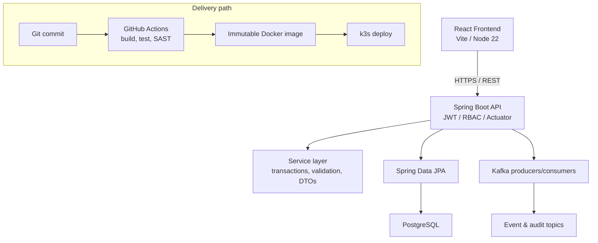

# Java Software Engineer Bootcamp  
# Enterprise Capstone — Overview, Rubric, and Company Brief

**Document type:** Single shareable brief (sponsors + training team)  
**Program:** Java Software Engineer Bootcamp (6 weeks · 52 modules)  
**Capstone week:** Week 6 · Modules / Labs 48–52  
**Prepared by:** Innovation In Software Corporation  
**Audience:** Client sponsors, engineering leads, L&D / talent partners, hiring managers, instructors  
**Version:** 2.0 · July 2026  

> One document for product description, Week 6 flow, evidence expectations, scoring rubrics, defense checklist, and company sign-off. Day-to-day lab steps remain in Labs [48](module-48/lab48/LAB-48-GUIDE.md)–[52](module-52/lab52/LAB-52-GUIDE.md). Operational schedule lives in the [Week 6 Capstone index](WEEK-LABS-INDEX.md).
>
> **Word deliverables (Platform Engineer reference style):** [Java_Software_Engineer_Capstone.docx](Java_Software_Engineer_Capstone.docx) (project brief) · [Java_Software_Engineer_Capstone_Rubric.docx](Java_Software_Engineer_Capstone_Rubric.docx) (4-point weighted evaluation rubric).

---

## 1. Why this capstone matters

The bootcamp prepares early-career developers for **enterprise Java full-stack roles**. Week 6 is not another technology survey. It is a **controlled delivery simulation** that asks teams to prove they can move a coherent product from architecture through production-style release.

| Sponsor question | Capstone answer |
| ---------------- | --------------- |
| Can they ship a vertical feature, not only a tutorial? | Teams deliver one coherent Customer Management Platform slice end to end. |
| Will they leave reproducible evidence? | Live demos require docs, tests, pipeline runs, and deployment proof another engineer can follow. |
| Do they understand enterprise constraints? | Security, roles, correlation/traceability, rollback, and residual-risk ownership are scored—not optional. |
| Can they communicate under review? | Week ends with a formal stakeholder demo, technical defense, Q&A, and blameless retrospective. |

**Bottom line:** Graduates leave Week 6 with portfolio-grade evidence of planning, implementation, quality, security, CI/CD, deployment, and professional defense—aligned to how real teams release software.

### Source confirmation (curriculum)

| Item | Status |
| ---- | ------ |
| Capstone exists in course scope | Confirmed |
| Capstone is team-based | Confirmed |
| Full enterprise toolchain (design → deploy) | Confirmed |
| Week 6 modules 48–52 define progression | Confirmed |
| Formal presentation and technical defense | Confirmed |
| Detailed scoring rubric (this document) | Confirmed for delivery use |

---

## 2. Product under delivery

### 2.1 One-paragraph description

Service agents use a **React** application to search and manage customers and record interactions. A **Spring Boot** API enforces **JWT / role-based access control**, persists data in **PostgreSQL** via **Spring Data JPA**, and publishes **versioned Kafka** events for processing and audit. Delivery is proven through **GitHub Actions** (build, test, security scanning), **immutable Docker images**, **Kubernetes (k3s)** deployment, smoke tests, observability, and a documented **rollback** path. The week closes with a formal technical defense and retrospective.

### 2.2 Business scenario

A large enterprise needs a **Customer Relationship Management (CRM) / Customer Management Platform** for service agents. Capstone teams must deliver a coherent platform—not five disconnected demos—with clear traceability from business outcomes through architecture, backlog, tests, security, deployment, and operations.

Synthetic demo customers only (no real customer data):

| Customer ID | Persona | Typical journey |
| ----------- | ------- | --------------- |
| `CUS-1001` | Amina Khan (ACTIVE) | Search → profile → interaction timeline |
| `CUS-1002` | Ravi Singh (PROSPECT → ACTIVE) | Onboarding / status change journey |
| `CUS-9999` | (synthetic not-found) | Negative paths and error handling |

### 2.3 Functional scope

| Area | Capabilities demonstrated |
| ---- | ------------------------- |
| Customer management | Create, update, search, and managed customer lifecycle |
| Interactions | Record durable customer interactions with verified persistence |
| Events | Publish and consume versioned customer / audit events (Kafka) |
| Security | JWT authentication and role-based authorization (e.g., AGENT / ADMIN) |
| Operations | Health checks, logging/metrics, smoke tests, monitored release, rollback plan |

### 2.4 Non-functional expectations

Teams define **measurable** NFRs covering security, traceability, recoverability, performance, and operability—then prove them with evidence in Labs 49–52. Vague goals such as “fast” or “secure” without thresholds and verification methods do not meet the success standard.

---

## 3. Week 6 structure (Modules 48–52)

| Phase | Module | Lab | What participants produce |
| ----- | ------ | --- | ------------------------- |
| **Plan** | 48 | [Lab 48](module-48/lab48/LAB-48-GUIDE.md) | C4 context/containers, measurable NFRs, ADRs, prioritized backlog, risk register, ownership plan |
| **Backend** | 49 | [Lab 49](module-49/lab49/LAB-49-GUIDE.md) | Spring Boot vertical slice, service/repository layers, Kafka producer/consumer, unit & integration tests |
| **Full stack** | 50 | [Lab 50](module-50/lab50/LAB-50-GUIDE.md) | React agent journey + PostgreSQL/JPA end-to-end flow, accessible UI, UI→DB verification |
| **Release** | 51 | [Lab 51](module-51/lab51/LAB-51-GUIDE.md) | JWT/RBAC hardening, GitHub pipeline gates, Docker digests, k3s deploy, smoke + rollback |
| **Defend** | 52 | [Lab 52](module-52/lab52/LAB-52-GUIDE.md) | Stakeholder demo, evidence-backed Q&A, architecture review, retrospective, individual reflection |

**Style:** Team-based delivery (recommended 3–5 people) with peer review and evidence gates. Instructors coach for enterprise standards; sponsors may attend the final defense by invitation.

---

## 4. Technology stack

| Layer | Technologies |
| ----- | ------------ |
| Language / build | Java 21, Maven |
| Backend | Spring Boot, Spring Security (JWT / RBAC), validation, transactions |
| Messaging | Apache Kafka (versioned events, resilient consumption / DLT patterns) |
| Frontend | React (Node 22), typed API client, accessible forms |
| Persistence | PostgreSQL, Spring Data JPA, versioned migrations |
| Quality | JUnit, Mockito, integration tests, Selenium / UI checks as assigned |
| Delivery | Docker, Kubernetes (k3s), GitHub Actions, SAST |
| Infrastructure (as scoped) | Terraform and Ansible patterns with reviewed AI-assisted drafts |
| Observability | Structured logging, Actuator health/metrics, correlation IDs |

Participants never commit secrets, private keys, `.env` files, kubeconfigs, or Terraform state.

---

## 5. Target architecture (reference)



```text
customer-management-platform/
├── backend/      # Spring Boot API
├── frontend/     # React application
├── k8s/          # Kubernetes (k3s) manifests
├── infra/        # Terraform / Ansible (as assigned)
├── docs/         # Architecture, NFRs, ADRs, backlog, risks
├── defense/      # Final presentation packet
├── reports/      # Sanitized scan and pipeline evidence
└── README.md
```

---

## 6. Deliverables and expected evidence

### By phase

| Phase | Deliverables |
| ----- | ------------ |
| Planning (48) | Architecture context/container docs, measurable NFRs, ADRs, prioritized backlog, risk register |
| Implementation (49–50) | Backend slice + Kafka, React journey + PostgreSQL persistence, automated tests, reproduction notes |
| Release (51) | Security negatives, CI/CD + SAST evidence, image digest, deploy evidence, smoke + rollback |
| Defense (52) | Presentation, demo script, **evidence index**, Q&A notes, retrospective, reflection, self-score |

### Evidence pack (reviewer checklist)

Teams prepare artifacts another engineer can use to understand, reproduce, and assess the work:

- Architecture diagram and design notes  
- Team roles and working agreements  
- Prioritized backlog and delivery plan  
- Risk register with mitigations  
- Source for backend, frontend, persistence, and messaging  
- Unit, integration, UI, smoke, and security test results  
- CI/CD pipeline run evidence  
- Infrastructure automation evidence (as assigned)  
- Kubernetes (k3s) deployment evidence  
- Final demo script / walkthrough notes  
- Technical defense notes  
- Team retrospective and individual reflection  

---

## 7. Success standard

| Standard | Meaning |
| -------- | ------- |
| Demo alone is not enough | A green happy path without evidence receives limited credit. |
| Reproducibility | Another engineer can follow documentation and recreate the result. |
| Evidence over assertion | Claims map to sanitized reports, logs, tests, pipeline runs, or repository links. |
| Failure paths matter | At least one controlled negative / failure path is verified and explained (per lab). |
| Honest residual risk | Incomplete work or accepted risks have owners and due dates. |
| No real PII / secrets | Synthetic data only; secrets stay out of Git and shared packs. |

Assessment focuses on **reasoning, safety, recoverability, and evidence**—not memorizing sample host names.

---

## 8. Evaluation rubrics

### 8.1 Overall Week 6 score (100 points)

Used for sponsor-facing week assessment and Lab 52 self-reconciliation.

| Category | Points | Full-credit indicators |
| -------- | -----: | ---------------------- |
| Architecture and planning | 15 | Roles, prioritized backlog, full-stack architecture, CI/CD plan, risks and mitigations |
| Backend and messaging | 20 | Working Spring Boot services, layered design, Kafka integration, review evidence, tests |
| Frontend and persistence | 15 | React journey connected to APIs, PostgreSQL via Spring Data JPA, validated end-to-end flow |
| Testing and quality | 15 | Unit, integration, UI/smoke checks; repeatable validation; documented fixes or limitations |
| Security, CI/CD, and deployment | 20 | SAST evidence, pipeline execution, containers, k3s deploy, readiness / rollback |
| Final defense and professionalism | 15 | Stakeholder demo, strong Q&A, design tradeoffs, evidence index, retrospective, reflection |
| **Total** | **100** | |

### 8.2 Per-lab coaching rubric (100 marks each)

The same rubric applies to Labs 48–52 during coaching days. Lab 52 additionally requires a rehearsed defense packet and rubric-based self-assessment.

| Criterion | Marks | Full-credit evidence |
| --------- | ----: | -------------------- |
| Scope and baseline | 8 | Clear scope and recorded starting state |
| Technical implementation | 25 | Correct, maintainable lab-specific work |
| Security and safe configuration | 12 | Least privilege, no secrets, negative test |
| Automated validation | 15 | Repeatable happy-path and failure-path checks |
| Operational readiness | 10 | Useful health, logs, metrics, pipeline, or rollout evidence |
| Recovery and risk management | 10 | Verified recovery and explicit residual risks |
| Documentation | 12 | Another engineer can reproduce the work |
| Peer review and professionalism | 8 | Focused feedback and clean submission |
| **Total** | **100** | |

### 8.3 Final team evaluation (4-point weighted scale)

Modeled on the Platform Engineer Networking Capstone rubric style. Full descriptors live in [Java_Software_Engineer_Capstone_Rubric.docx](Java_Software_Engineer_Capstone_Rubric.docx).

| Criterion | Weight |
| --------- | -----: |
| Full-Stack Architecture & Planning | 15% |
| Backend Services & Messaging | 20% |
| Frontend & Persistence | 15% |
| CI/CD, Containers & Deployment | 15% |
| Testing & Observability | 10% |
| Demonstration Scenario & Recovery | 10% |
| Security & Operational Hygiene | 5% |
| Documentation & Repository Quality | 5% |
| Presentation & Communication | 5% |
| **Total** | **100%** |

Scale: **4** Exemplary · **3** Proficient · **2** Developing · **1** Beginning.  
Final score = Σ (score × weight) / 100 → reported **/ 4.00**.  
≥ 3.50 Exemplary · 2.50–3.49 Proficient · 1.50–2.49 Developing · &lt; 1.50 Beginning. Below **2.50** does not meet the completion bar.

### 8.4 Scoring rules

1. Demonstration without supporting evidence does **not** receive full credit.  
2. Committed secrets or unsafe unauthorized actions must be **remediated** before assessment.  
3. Final defense score is **part of** the overall Week 6 score (sections 8.1 / 8.3), not a disconnected vanity grade.  
4. Peer review contributes via professionalism marks and evidence quality; it does not replace instructor assessment.  
5. A formal **evidence index** is required before the final presentation (Lab 52).  
6. Security findings and deployment gaps are **hard gates** for full credit unless residual risk is explicitly accepted with owner and date.  
7. Self-score (Lab 52) is reconciled with instructor review using evidence links.  
8. Anchor scores to rubric descriptors, not to other teams; Proficient = competent early-career bar, Exemplary = promotion-credible.  

---

## 9. Final defense

### 9.1 What sponsors may observe

1. Working product walkthrough (search / profile / interaction) on synthetic data  
2. Architecture story — components and data/event flow  
3. Quality story — automated tests and failure-path evidence  
4. Release story — pipeline gates, image identity, deploy, smoke, rollback  
5. Security story — authn/authz and scan triage honesty  
6. Risk and learning story — residual risks, retrospective, next steps  

**Suggested observer timebox:** 60–90 minutes per team (demo + Q&A + brief feedback).

### 9.2 Defense pass criteria

_Mark each row **Pass** or **Fail** in your lab notes (GitHub markdown files are not interactive checklists)._

| # | Confirm | Your notes |
| - | ------- | ---------- |
| 1 | Demonstrate the working application | Pass / Fail |
| 2 | Explain the architecture and major design decisions | Pass / Fail |
| 3 | Walk through backend, messaging, frontend, and persistence flow | Pass / Fail |
| 4 | Show automated test evidence | Pass / Fail |
| 5 | Show security scan evidence | Pass / Fail |
| 6 | Show CI/CD and deployment evidence | Pass / Fail |
| 7 | Explain known risks, limitations, and mitigations | Pass / Fail |
| 8 | Answer technical Q&A with evidence | Pass / Fail |
| 9 | Present team retrospective findings | Pass / Fail |
| 10 | Submit individual reflection and next steps | Pass / Fail |

### 9.3 Week close-out pass criteria

_Mark each row **Pass** or **Fail** in your lab notes (GitHub markdown files are not interactive checklists)._

| # | Confirm | Your notes |
| - | ------- | ---------- |
| 1 | Architecture, NFRs, backlog, ADRs, and risk register complete (Lab 48) | Pass / Fail |
| 2 | Backend vertical slice with Kafka and tests (Lab 49) | Pass / Fail |
| 3 | React + PostgreSQL end-to-end journey verified (Lab 50) | Pass / Fail |
| 4 | Security, pipeline, image digest, deploy, smoke, and rollback evidenced (Lab 51) | Pass / Fail |
| 5 | Defense packet ready: presentation, demo script, evidence index, Q&A, retrospective, self-assessment (Lab 52) | Pass / Fail |
| 6 | No secrets or real customer data in submitted artifacts | Pass / Fail |
| 7 | Known limitations listed with owners and next actions | Pass / Fail |

---

## 10. Program context

| Week | Theme | Capstone relevance |
| ---- | ----- | ------------------ |
| 1 | Java and JVM foundations | Language and design discipline |
| 2 | Backend, AI tools, and testing | Maven, APIs, testing mindset, observability basics |
| 3 | Spring enterprise patterns | IoC, Boot, security, transactions, validation |
| 4 | Kafka, React, PostgreSQL, resilience | Messaging, UI, persistence, fault tolerance |
| 5 | DevOps, CI/CD, k3s | Containers, pipelines, infrastructure, release communication |
| **6** | **Enterprise capstone** | **Integrate Weeks 1–5 into one defendable delivery** |

---

## 11. Logistics (fill at kickoff)

| Item | Detail (customize) |
| ---- | ------------------ |
| Client / business unit | ______________________________ |
| Cohort size | ______________________________ |
| Capstone week dates | ______________________________ |
| Team size (recommended) | 3–5 participants per team |
| Training environment | Authorized cloud / laptop lab (instructor-provisioned) |
| Sponsor attendees (Module 52) | Names / roles: ________________ |
| Internal mentor / buddy (optional) | ______________________________ |
| Data classification rule | Synthetic data only; no production systems |
| Intellectual property | Training artifacts under agreed program IP / sharing policy |

---

## 12. Safety and compliance

- Work **only** in authorized training environments  
- Use **synthetic** identities and data (never production customer information)  
- Keep secrets out of source control and shared evidence packs  
- Do not weaken authorization, TLS, scanning, or tests merely for a green demo  
- Stop before destructive data or infrastructure actions without instructor approval  
- Document residual risks with owners and target dates  

---

## 13. Company / stakeholder confirmation

Confirm this single brief before Week 6 delivery (or at program kickoff).

| Item | Status | Notes |
| ---- | ------ | ----- |
| Product description (CRM platform) approved | ☐ Yes · ☐ Changes needed | |
| Week 6 module flow (48–52) approved | ☐ Yes · ☐ Changes needed | |
| Technology stack approved | ☐ Yes · ☐ Changes needed | |
| Overall 100-point week rubric (section 8.1) approved | ☐ Yes · ☐ Changes needed | |
| Per-lab 100-point coaching rubric (section 8.2) approved | ☐ Yes · ☐ Changes needed | |
| Evidence / success standard approved | ☐ Yes · ☐ Changes needed | |
| Final defense expectations (sponsor attendance) approved | ☐ Yes · ☐ Changes needed | |

**Client reviewer:** ____________________ **Role:** ____________________  
**Date:** ____________________  
**Decision:** ☐ Confirmed · ☐ Confirmed with notes · ☐ Revise and resubmit  

**Notes / required changes:**

-  

---

## 14. Related documents

| Document | Purpose |
| -------- | ------- |
| [Java_Software_Engineer_Capstone.docx](Java_Software_Engineer_Capstone.docx) | Company-shareable project brief (Mainframe-style) |
| [Java_Software_Engineer_Capstone_Rubric.docx](Java_Software_Engineer_Capstone_Rubric.docx) | 4-point weighted evaluation rubric (Networking-style) |
| [Week 6 Capstone index](WEEK-LABS-INDEX.md) | Operational master document (schedule, module narratives) |
| Labs [48](module-48/lab48/LAB-48-GUIDE.md)–[52](module-52/lab52/LAB-52-GUIDE.md) | Day-to-day student lab guides |
| [SETUP-INSTRUCTIONS.md](../SETUP-INSTRUCTIONS.md) | Environment and tool verification |
| [TECHNOLOGY-STACK-GUIDE.md](../TECHNOLOGY-STACK-GUIDE.md) | Technology rationale for learners |
| Curriculum slides folder | [Week 6 - Capstone Project](../../Week%206%20-%20Capstone%20Project/) (outline + module slide text) |

---

## 15. Contact

**Training provider:** Innovation In Software Corporation  
**Program:** Java Software Engineer Bootcamp — Enterprise Capstone (Week 6)  

For Module 52 defense attendance or rubric adjustments, contact your designated Innovation In Software program lead.

---

© 2026 by Innovation In Software Corporation.  
Authorized for distribution to the client organization sponsoring this cohort. Redistribution beyond the sponsoring organization requires prior written approval.
