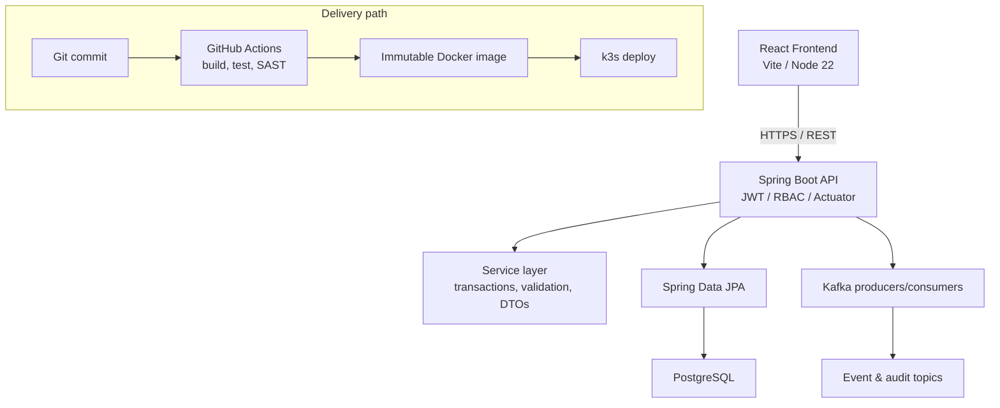

# WEEK 6 — ENTERPRISE CAPSTONE DOCUMENT

**Primary IDE:** IntelliJ IDEA Community Edition · **Optional IDE:** VS Code  
**OS guides:** each `module-NN/labN/` has `LAB-N-WINDOWS.md` and `LAB-N-MACOS.md`.

## Customer Relationship Management (CRM) Platform

> Week 6 is **delivery week**, not another technology introduction. Teams apply Weeks 1–5 into one coherent product: plan the architecture, build backend and messaging, complete frontend and persistence, secure and deploy through CI/CD, then defend the solution with evidence.

This document is the **capstone master document** for Modules 48–52 and Labs 48–52. Lab guides remain the day-to-day working instructions; use this document for scope, schedule, architecture expectations, deliverables, and assessment.

**Session block (~45 min):** each Lab 48–52 has `starter/` templates for the scheduled class block (ADRs, stubs, checklists, defense outline). Multi-day build/defense stays on the full GUIDE path — see [`_STARTER-PATH.md`](../_STARTER-PATH.md).

| Resource | Path |
| -------- | ---- |
| **Capstone project brief (DOCX, company-shareable)** | [Java_Software_Engineer_Capstone.docx](Java_Software_Engineer_Capstone.docx) |
| **Capstone evaluation rubric (DOCX)** | [Java_Software_Engineer_Capstone_Rubric.docx](Java_Software_Engineer_Capstone_Rubric.docx) |
| Capstone brief + rubric (Markdown) | [CAPSTONE-BRIEF-AND-RUBRIC.md](CAPSTONE-BRIEF-AND-RUBRIC.md) |
| Slide outline | [slides_outline.md](../../Week%206%20-%20Capstone%20Project/slides_outline.md) |
| Labs index | [labs/LABS-INDEX.md](../LABS-INDEX.md) |
| Setup (Weeks 1–6) | [labs/SETUP-INSTRUCTIONS.md](../SETUP-INSTRUCTIONS.md) |
| Technology stack | [labs/TECHNOLOGY-STACK-GUIDE.md](../TECHNOLOGY-STACK-GUIDE.md) |
| Bootcamp overview | [README.md](../../README.md) |

---

## Week at a glance

| Item | Detail |
| ---- | ------ |
| Theme | Enterprise software delivery simulation |
| Modules | 48–52 |
| Labs | [48](module-48/lab48/LAB-48-GUIDE.md) · [49](module-49/lab49/LAB-49-GUIDE.md) · [50](module-50/lab50/LAB-50-GUIDE.md) · [51](module-51/lab51/LAB-51-GUIDE.md) · [52](module-52/lab52/LAB-52-GUIDE.md) |
| Product | Enterprise CRM / Customer Management Platform |
| Style | Team delivery with evidence gates and peer review |
| Capstone | Formal demo + architecture defense + retrospective |

| Day focus | Module | Lab | Outcome |
| --------- | ------ | --- | ------- |
| Plan | 48 | [Lab 48](module-48/lab48/LAB-48-GUIDE.md) | Architecture, NFRs, backlog, ADRs, risk register |
| Backend | 49 | [Lab 49](module-49/lab49/LAB-49-GUIDE.md) | Spring Boot APIs, Kafka events, tests |
| Full stack | 50 | [Lab 50](module-50/lab50/LAB-50-GUIDE.md) | React UI + PostgreSQL/JPA end-to-end journey |
| Release | 51 | [Lab 51](module-51/lab51/LAB-51-GUIDE.md) | Security, pipeline, containers, k3s deploy |
| Defend | 52 | [Lab 52](module-52/lab52/LAB-52-GUIDE.md) | Live demo, Q&A, retrospective, rubric score |

---

## Week learning outcomes

By the end of Week 6, students should be able to:

- Design and document an enterprise architecture with measurable NFRs and ADRs
- Deliver a vertical backend slice with validated APIs, transactions, and Kafka events
- Complete a usable React journey backed by Spring Data JPA and PostgreSQL
- Apply JWT/RBAC, SAST gates, immutable images, and safe k3s deployment
- Present and defend the solution with reproducible evidence
- Run a blameless retrospective and score work against a transparent rubric

---

## Capstone scenario

A large enterprise needs a **Customer Relationship Management platform** for service agents. The team must deliver a coherent platform—not disconnected demos—with traceability from business outcomes through architecture, stories, tests, deployment, and operations.

### Functional scope

| Area | Capabilities |
| ---- | ------------ |
| Customer management | Create, update, search, and delete customers |
| Interactions | Record customer interactions with durable storage |
| Events | Publish and consume customer / audit events |
| Security | JWT authentication and role-based access control |
| Operations | Logging, health checks, metrics, smoke tests, rollback |

### Non-functional expectations

Teams must define **measurable** NFRs (Lab 48) covering security, traceability, recoverability, performance, and operability—then prove them with evidence in Labs 49–52.

### Success standard

A green demo alone is not enough. Another engineer must be able to reproduce the result from documentation and understand its limits.

---

## Target architecture



### Suggested repository layout

Adapt to the existing CRM project; do not reorganize unrelated modules:

```text
~/java-bootcamp/examples/customer-management-platform/
├── backend/               # Spring Boot API
├── frontend/              # React application
├── k8s/                   # Kubernetes (k3s) manifests
├── infra/                 # Terraform and Ansible (as assigned)
├── docs/                  # ADRs, architecture, NFRs, backlog, risks
├── defense/               # Lab 52 presentation packet
├── reports/               # Sanitized generated evidence
└── README.md

# Evidence (Lab 0 layout — workspace root, not inside the platform tree):
# ~/java-bootcamp/notes/screenshots/lab-48/ … lab-52/
```

---

## Prerequisites

Complete [Labs Setup Instructions](../SETUP-INSTRUCTIONS.md) and confirm Weeks 4–5 verification before Lab 48.

Capstone expects the full stack from Weeks 1–5:

| Layer | Expectation |
| ----- | ----------- |
| Runtime | Java 21 + Maven Wrapper |
| Backend | Spring Boot + Kafka |
| Frontend | React (Node 22) |
| Data | PostgreSQL + Spring Data JPA |
| Delivery | Docker images + k3s deploy path |
| CI | GitHub Actions with SAST gates |

Pre-flight (adapt as instructed):

```bash
java -version
./mvnw --version 2>/dev/null || mvn -version
node --version
npm --version
docker --version
docker compose version
git status --short
./mvnw -B clean verify
```

---

## Safety and engineering rules (all capstone labs)

- Work only in the authorized training environment.
- Use synthetic data (for example `alex@example.test`); never real customer information.
- Never commit tokens, private keys, passwords, `.env` files, kubeconfig, or Terraform state.
- Do not weaken authorization, TLS, scanning, validation, or tests for a green result.
- Keep changes narrowly scoped; record assumptions, residual risks, owners, and due dates.
- Stop before destructive database or infrastructure actions and obtain instructor approval.

---

# MODULE 48 — Capstone Planning and Architecture

**Duration:** ~4 hours theory + team workshop · **Lab:** 5–6 hours · [Lab 48](module-48/lab48/LAB-48-GUIDE.md)

### Why this module exists

Most delivery failures start with unclear scope and undocumented decisions. Teams learn to turn a brief into an executable plan.

### Focus

- Business scope, context and container diagrams
- Measurable NFRs and vertical backlog stories
- Architecture Decision Records (ADRs)
- Ownership plan and risk register

### Lab outcomes and artifacts

| Artifact | Purpose |
| -------- | ------- |
| `docs/architecture/context.md` | Users, external systems, trust boundaries |
| `docs/architecture/container.md` | Deployable units and data/event flow |
| `docs/nfrs.md` | Measurable quality attributes |
| `docs/adrs/` | Decided trade-offs with consequences |
| `docs/backlog.md` | Prioritized vertical stories |
| `docs/risk-register.md` | Risks, mitigations, owners, dates |

### Module narrative (slides)

Requirements → architecture → backlog → risks → documentation → lab deliverables  
See [slides_outline.md](../../Week%206%20-%20Capstone%20Project/slides_outline.md) (slides ~1–34) and [Module 48 slide text](../../Week%206%20-%20Capstone%20Project/Module%2048%20-%20Capstone%20Architecture%20and%20Planning/SLIDE-TEXT-README.md).

---

# MODULE 49 — Capstone Backend and Messaging

**Duration:** Full day · **Lab:** 6–8 hours · [Lab 49](module-49/lab49/LAB-49-GUIDE.md)

### Why this module exists

Enterprise CRM features must persist reliably, expose a clear API contract, publish traceable events, and tolerate duplicate or failed consumption.

### Focus

- Layered Spring Boot (controller → service → repository)
- DTO validation and deliberate transactions
- Versioned Kafka producers and idempotent consumers
- Unit and integration tests with evidence

### Lab outcomes and artifacts

| Artifact | Purpose |
| -------- | ------- |
| Backend source changes | Vertical slice implementation |
| Database migration | Schema change supporting the slice |
| Versioned event contract | Traceable messaging API |
| Unit and integration tests | Happy path + failure path |
| `docs/backend-demo.md` | Reproduction notes for reviewers |

### Module narrative (slides)

API design → Kafka events → JWT/RBAC review → testing → quality checklist → lab  
See [slides_outline.md](../../Week%206%20-%20Capstone%20Project/slides_outline.md) (slides ~35–62) and [Module 49 slide text](../../Week%206%20-%20Capstone%20Project/Module%2049%20-%20Capstone%20Build%20-%20Backend%20and%20Messaging/SLIDE-TEXT-README.md).

---

# MODULE 50 — Capstone Frontend and Persistence

**Duration:** Full day · **Lab:** 6–8 hours · [Lab 50](module-50/lab50/LAB-50-GUIDE.md)

### Why this module exists

Agents need an accessible UI journey—search, profile, timeline, interaction form—with durable PostgreSQL storage and clear loading/error states.

### Focus

- Typed React service calls and accessible forms
- Spring Data JPA mappings and PostgreSQL migrations
- Loading, error, and empty UI states
- UI-to-database verification (component / E2E as assigned)

### Lab outcomes and artifacts

| Artifact | Purpose |
| -------- | ------- |
| React components | Customer journey UI |
| Typed API client | Contract-safe frontend calls |
| JPA mapping changes | Domain persistence |
| PostgreSQL migration scripts | Repeatable schema |
| Component and UI tests | End-to-end evidence |

### Module narrative (slides)

React review → screens → API integration → PostgreSQL/JPA → UI testing → lab  
See [slides_outline.md](../../Week%206%20-%20Capstone%20Project/slides_outline.md) (slides ~63–88) and [Module 50 slide text](../../Week%206%20-%20Capstone%20Project/Module%2050%20-%20Capstone%20Build%20-%20Frontend%20and%20Persistence/SLIDE-TEXT-README.md).

---

# MODULE 51 — Capstone Security, CI/CD and Deployment

**Duration:** Full day · **Lab:** 6–8 hours · [Lab 51](module-51/lab51/LAB-51-GUIDE.md)

### Why this module exists

Feature-complete is not release-ready. Access control, delivery automation, image provenance, protected configuration, and recovery must be proven together.

### Focus

- JWT resource server, deny-by-default authorization, negative tests
- GitHub Actions with build, test, and SAST gates
- Immutable container images (digest identity)
- k3s deploy, smoke tests, observability, rollback

### Lab outcomes and artifacts

| Artifact | Purpose |
| -------- | ------- |
| Spring Security changes and tests | Protected endpoints |
| Pipeline definition | Gated delivery |
| Dockerfile and image digest | Immutable promotion identity |
| Deployment manifests | Cluster release |
| Security and deployment evidence | Sanitized proof packet |

### Module narrative (slides)

Threat model → secure endpoints → SAST/DAST → Docker → pipeline → k3s → smoke/rollback → lab  
See [slides_outline.md](../../Week%206%20-%20Capstone%20Project/slides_outline.md) (slides ~89–119) and [Module 51 slide text](../../Week%206%20-%20Capstone%20Project/Module%2051%20-%20Capstone%20Security,%20CI-CD%20and%20Deployment/SLIDE-TEXT-README.md).

---

# MODULE 52 — Capstone Final Defense and Retrospective

**Duration:** Full day · **Lab:** 5–6 hours · [Lab 52](module-52/lab52/LAB-52-GUIDE.md)

### Why this module exists

Enterprise engineers must communicate value, architecture, trade-offs, and limits. Reviewers assess understanding—not only whether the CRM runs.

### Focus

- Business-to-technology narrative and rehearsed demo
- Evidence-backed answers to architecture / security / ops questions
- Blameless retrospective and rubric-based self-assessment

### Lab outcomes and artifacts

| Artifact | Purpose |
| -------- | ------- |
| `defense/final-presentation.pdf` | Panel presentation |
| `defense/demo-script.md` | Deterministic walkthrough |
| `defense/evidence-index.md` | Claim → artifact map |
| `defense/technical-q-and-a.md` | Prepared answers with links |
| `defense/retrospective.md` | Blameless lessons learned |
| `defense/self-assessment.md` | Rubric score with evidence |

### Module narrative (slides)

Presentation structure → live walkthrough → review-board Q&A → evaluation → retrospective → program wrap-up  
See [slides_outline.md](../../Week%206%20-%20Capstone%20Project/slides_outline.md) (slides ~120–168) and [Module 52 slide text](../../Week%206%20-%20Capstone%20Project/Module%2052%20-%20Capstone%20Final%20Defense%20and%20Retrospective/SLIDE-TEXT-README.md).

---

## Portfolio checklist (Labs 48–52)

Use this as the team close-out inventory. Each item must be sanitized (no secrets or customer data).

### Planning (48)

_Mark each row **Pass** or **Fail** in your lab notes (GitHub markdown files are not interactive checklists)._

| # | Confirm | Your notes |
| - | ------- | ---------- |
| 1 | Context and container architecture docs | Pass / Fail |
| 2 | Measurable NFRs | Pass / Fail |
| 3 | Prioritized backlog with acceptance criteria | Pass / Fail |
| 4 | ADRs for major decisions | Pass / Fail |
| 5 | Risk register with owners and dates | Pass / Fail |

### Backend (49)

_Mark each row **Pass** or **Fail** in your lab notes (GitHub markdown files are not interactive checklists)._

| # | Confirm | Your notes |
| - | ------- | ---------- |
| 1 | Vertical API + persistence + Kafka slice | Pass / Fail |
| 2 | Versioned event contract | Pass / Fail |
| 3 | Automated tests (happy + failure path) | Pass / Fail |
| 4 | Backend demo / reproduction notes | Pass / Fail |

### Frontend and data (50)

_Mark each row **Pass** or **Fail** in your lab notes (GitHub markdown files are not interactive checklists)._

| # | Confirm | Your notes |
| - | ------- | ---------- |
| 1 | Accessible CRM UI journey | Pass / Fail |
| 2 | PostgreSQL migrations and JPA mappings | Pass / Fail |
| 3 | UI / E2E verification evidence | Pass / Fail |
| 4 | Documented end-to-end data flow | Pass / Fail |

### Delivery (51)

_Mark each row **Pass** or **Fail** in your lab notes (GitHub markdown files are not interactive checklists)._

| # | Confirm | Your notes |
| - | ------- | ---------- |
| 1 | JWT/RBAC with negative-path tests | Pass / Fail |
| 2 | Pipeline with SAST gate | Pass / Fail |
| 3 | Image digest and deploy manifests | Pass / Fail |
| 4 | Smoke test and rollback evidence | Pass / Fail |

### Defense (52)

_Mark each row **Pass** or **Fail** in your lab notes (GitHub markdown files are not interactive checklists)._

| # | Confirm | Your notes |
| - | ------- | ---------- |
| 1 | Presentation, demo script, evidence index | Pass / Fail |
| 2 | Technical Q&A and retrospective | Pass / Fail |
| 3 | Self-assessment against rubric | Pass / Fail |
| 4 | Peer-review notes and residual risks | Pass / Fail |

---

## Evaluation overview

Each lab uses a **100-mark rubric**. A live demo without supporting evidence does not earn full credit. Committed secrets or unsafe unauthorized actions must be remediated before assessment.

| Criterion | Marks | Full-credit evidence |
| --------- | ----: | -------------------- |
| Scope and baseline | 8 | Clear scope and recorded starting state |
| Technical implementation | 25 | Correct, maintainable lab-specific work |
| Security and safe configuration | 12 | Least privilege, no secrets, negative test |
| Automated validation | 15 | Repeatable happy and failure checks |
| Operational readiness | 10 | Health, logs, metrics, pipeline, or rollout evidence |
| Recovery and risk management | 10 | Verified recovery and explicit residual risks |
| Documentation | 12 | Another engineer can reproduce the work |
| Peer review and professionalism | 8 | Focused feedback and clean submission |

### Week success criteria

- CRM still builds; required regression tests pass
- Each lab objective is implemented and demonstrated
- At least one negative or failure-path behavior is verified per lab
- No secrets or real customer records in submitted artifacts
- A peer can reproduce the core result from documentation
- Residual risks and incomplete work have owners and dates
- Defense packet is internally consistent and review-ready

---

## Suggested team roles

Adapt to cohort size; every member should touch implementation and evidence.

| Role | Primary accountability |
| ---- | ---------------------- |
| Architecture / docs lead | Context/container diagrams, ADRs, NFR evidence |
| Backend / messaging | Spring Boot APIs, Kafka, tests |
| Frontend / UX | React journey, accessibility, UI verification |
| Data / persistence | PostgreSQL schema, migrations, JPA |
| Security / delivery | JWT, pipeline gates, images, k3s |
| Demo / defense coordinator | Script, evidence index, rehearsal, retrospective |

---

## How instructors and students use this document

### Instructors

1. Use this README for week orientation and assessment framing.
2. Teach from module slide assets / [slides_outline.md](../../Week%206%20-%20Capstone%20Project/slides_outline.md).
3. Run hands-on work from Labs [48](module-48/lab48/LAB-48-GUIDE.md)–[52](module-52/lab52/LAB-52-GUIDE.md) (see [labs index](../LABS-INDEX.md)); each lab is evidence-gated.
4. Score using the shared rubric; require claim → artifact linkage in Lab 52.

### Students

1. Confirm prerequisites and branch discipline (`lab/48-crm` … `lab/52-crm` as instructed).
2. Complete Labs 48→52 in order; do not skip evidence gates.
3. Keep `docs/`, `reports/`, and `defense/` portfolio-safe.
4. Rehearse the Lab 52 demo with a fallback path before the panel.

---

## Related module folders

| Module | Folder |
| ------ | ------ |
| 48 | [Module 48 - Capstone Architecture and Planning](../../Week%206%20-%20Capstone%20Project/Module%2048%20-%20Capstone%20Architecture%20and%20Planning/) |
| 49 | [Module 49 - Capstone Build - Backend and Messaging](../../Week%206%20-%20Capstone%20Project/Module%2049%20-%20Capstone%20Build%20-%20Backend%20and%20Messaging/) |
| 50 | [Module 50 - Capstone Build - Frontend and Persistence](../../Week%206%20-%20Capstone%20Project/Module%2050%20-%20Capstone%20Build%20-%20Frontend%20and%20Persistence/) |
| 51 | [Module 51 - Capstone Security, CI-CD and Deployment](../../Week%206%20-%20Capstone%20Project/Module%2051%20-%20Capstone%20Security,%20CI-CD%20and%20Deployment/) |
| 52 | [Module 52 - Capstone Final Defense and Retrospective](../../Week%206%20-%20Capstone%20Project/Module%2052%20-%20Capstone%20Final%20Defense%20and%20Retrospective/) |

---

© 2026 by Innovation In Software Corporation

Curriculum content in this repository is intended for authorized instructor-led training use.
