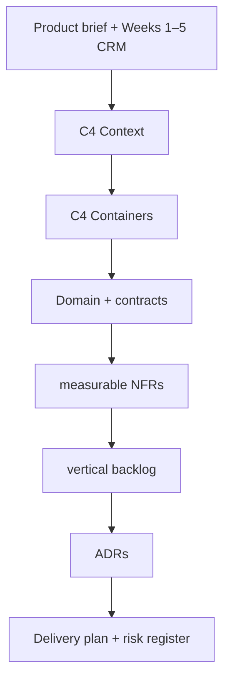
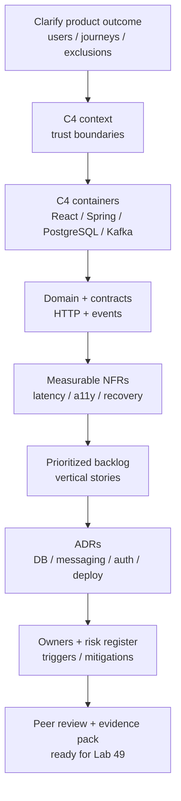
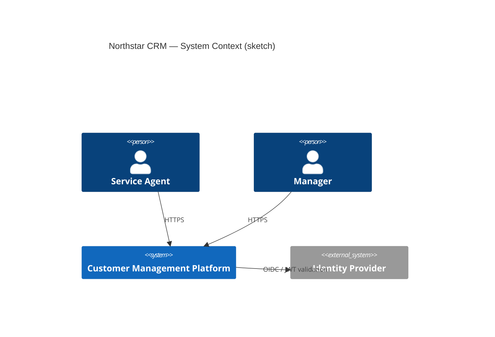
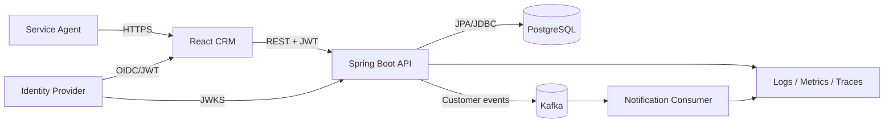

# Lab 48: Capstone Planning and Architecture — Northstar CRM Executable Plan

**Module:** 48 — Capstone Planning and Architecture  
**Lab folder:** `labs/Week 6 - Capstone Project/module-48/lab48/`  
**Difficulty:** Advanced Capstone  
**Duration:** 5–6 Hours

**Primary IDE:** IntelliJ IDEA Community Edition · **Optional IDE:** VS Code

| OS | How-to for this lab |
| -- | ------------------- |
| Windows | [LAB-48-WINDOWS.md](LAB-48-WINDOWS.md) |
| macOS | [LAB-48-MACOS.md](LAB-48-MACOS.md) |

> **Environment reminder:** Finish [Lab 0](../../../Week%201%20-%20Java%20and%20JVM%20Foundations/module-00/lab0/LAB-0-GUIDE.md). Planning lab: **desktop IntelliJ IDEA Community (primary; optional VS Code)** on your laptop under `~/java-bootcamp/examples/customer-management-platform/` (or `lab48-crm/`). No cluster or database required for Lab 48 (Windows: `%USERPROFILE%\java-bootcamp`).

---

## How to follow this lab

1. Open the **Windows** or **macOS** how-to (links above) in a second tab.
2. Create/work only under your `java-bootcamp/examples/…` folder from the steps (not inside this `labs/` git clone unless a step says otherwise).
3. For each **Step N**: read **Why** (if present) → do the actions → confirm **Expected** / **Expected result** → then continue.
4. When stuck, use **Failure Experiments** / troubleshooting in this guide before asking for help.
5. Capture evidence under `notes/screenshots/lab-48/` (workspace root under `java-bootcamp`; redact secrets). Use the **Pass criteria** tables — write **Pass** or **Fail** in your notes. GitHub file view does not support clickable checkboxes.

## Lab Overview

This Module 48 lab turns the Enterprise CRM brief into an **executable architecture and delivery plan**. You produce C4 context and container views, measurable NFRs, ADRs, a prioritized vertical backlog, ownership milestones, and a scored risk register—so Labs 49–52 implement against decisions rather than improvisation.

**Purpose.** Leadership will not fund disconnected demos. Reviewers need traceability from business outcomes → architecture choices → stories → tests → deployment → operations. Ambiguous “fast/scalable” language, missing trust boundaries, and undocumented risks are acceptance-blockers for the Week 6 defense.

**What you build (exercise).** Clarify product outcome and exclusions; draw C4 context and containers (React, Spring Boot, PostgreSQL, Kafka, IdP, observability); define domain/contracts; write measurable NFRs; create a prioritized vertical backlog (include interaction recording for Amina/Ravi fixtures); author ADRs for database, messaging, auth, deployment, and consistency; assign owners and score risks with triggers/mitigations/contingencies.

**What success looks like.** Under your capstone docs tree, a peer can open `context.md`, `container.md`, `nfrs.md`, `adrs/`, `backlog.md`, and `risk-register.md` and reproduce the intended Week 6 plan without Slack archaeology. Fixture IDs `CUS-1001` / `CUS-1002` / `lab-request-001` appear in demo stories and acceptance criteria.

**Depends on Labs 0–47 (stack familiarity).** Need working mental model of CRM service boundaries, Kafka events, React journeys, PostgreSQL persistence, JWT, and pipeline/deploy patterns from prior modules. Finish earlier evidence packs if architecture vocabulary is missing.

**CRM connection.** Planning must name the same enterprise fixtures used in implementation labs: Amina (`CUS-1001`), Ravi (`CUS-1002`), correlation `lab-request-001`. Lab 49 implements the interaction vertical slice; Lab 50 closes UI→PostgreSQL; Lab 51 hardens security/CI/CD/deploy; Lab 52 defends with your evidence index.

---

## Learning Objectives

After completing this lab, you will be able to:

* Clarify business scope, users, journeys, exclusions, and success measures
* Produce C4 context diagrams with protocols and trust boundaries
* Design container views placing React, Spring Boot, PostgreSQL, Kafka, identity, and observability
* Define domain ownership and versioned HTTP/event contracts
* Write measurable NFRs with method, environment, and thresholds
* Slice vertical backlog items with acceptance criteria
* Record architecture decisions as ADRs with alternatives and consequences
* Plan ownership, critical path, and a scored risk register with mitigations
* Keep synthetic CRM fixtures consistent across planning and later labs
* Prove another engineer can reproduce the plan from docs alone

---

## Business Scenario

The capstone team must deliver a coherent **Customer Management Platform**, not five disconnected demonstrations. Before coding Week 6 slices, reviewers freeze:

**No Lab 49–52 work counts as “in scope” unless it maps to a backlog item, an ADR (or explicit out-of-scope note), and a measurable NFR or acceptance criterion.**

You own the planning gate for agent journeys around Amina (`CUS-1001` ACTIVE), Ravi (`CUS-1002` PROSPECT→ACTIVE), interaction recording, search/profile/timeline, secure release, and final defense.

Use these fixtures consistently:

| ID | Name | Notes |
| -- | ---- | ----- |
| `CUS-1001` | Amina Khan | `ACTIVE` — primary demo customer for interaction timeline |
| `CUS-1002` | Ravi Singh | `PROSPECT` → `ACTIVE` — onboarding / status journey |
| `CUS-9999` | — | not-found / negative paths in later labs |
| `lab-request-001` | — | correlation ID on API, events, and failure evidence |
| `CAP-12`, … | — | backlog story IDs in `docs/backlog.md` |

**Security note for evidence.** Use fictional emails only (`amina.khan@example.test`, `ravi.singh@example.test`). Never paste real IdP secrets, kubeconfigs, or production URLs into ADRs.

---

## Architecture Context

### NOW (this lab)



### Lab flow (mermaid)



### Architecture NOW vs LATER

| Aspect | Lab 48 (NOW) | Labs 49–52 (LATER) |
| ------ | ------------ | ------------------- |
| Output | Docs, diagrams, ADRs, backlog, risks | Code, tests, UI, pipeline, defense |
| Fixtures | Named in stories and acceptance | Implemented and demonstrated |
| Decisions | Proposed / Accepted ADRs | Enforced by tests, scanners, deploy |
| Proof | Peer can reproduce the plan | Peer can reproduce green verify + demo |

**Lab focus:** Executable architecture, measurable quality targets, vertical backlog, ADRs, delivery and risk planning—no production coding required yet.

---

## Prerequisites

Complete [SETUP](../../../SETUP-INSTRUCTIONS.md), [Lab 0](../../../Week%201%20-%20Java%20and%20JVM%20Foundations/module-00/lab0/LAB-0-GUIDE.md), and be familiar with CRM patterns from Weeks 1–5. Confirm:

* JDK 21; Maven; Git; Docker available for later labs
* Diagram/backlog tooling as instructed (Markdown Mermaid acceptable)
* Access to capstone repo or `~/java-bootcamp/examples/`
* No secrets committed to Git

### Pre-flight

```bash
java -version
mvn -version
git --version
docker --version
pwd
ls ~/java-bootcamp/examples
```

Create a focused branch and record the baseline:

```bash
cd ~/java-bootcamp/examples
# Prefer shared capstone tree when it exists:
#   customer-management-platform/
# Otherwise create a planning slice:
mkdir -p customer-management-platform/docs/architecture \
  customer-management-platform/docs/adrs \
  ~/java-bootcamp/notes/screenshots/lab-48
cd customer-management-platform
git switch -c lab/48-crm 2>/dev/null || git checkout -b lab/48-crm
git status --short
```

If the shared platform build already exists, run a baseline verify and note failures (do not hide inherited red builds):

```bash
./mvnw -B clean verify 2>/dev/null || mvn -B clean verify
```

---

## Suggested Project Files

```text
~/java-bootcamp/examples/customer-management-platform/
├── backend/                          # Lab 49+
├── frontend/                         # Lab 50+
├── k8s/                              # Lab 51+
├── infra/                            # Lab 51+
├── docs/
│   ├── architecture/
│   │   ├── context.md
│   │   ├── container.md
│   │   └── sequence-interaction.md   # optional bonus
│   ├── nfrs.md
│   ├── backlog.md
│   ├── risk-register.md
│   ├── team-plan.md
│   ├── adrs/
│   │   ├── ADR-001-postgresql.md
│   │   ├── ADR-002-kafka.md
│   │   ├── ADR-003-consistency.md
│   │   ├── ADR-004-jwt-auth.md
│   │   └── ADR-005-deploy.md
│   └── notes/screenshots/
├── reports/                          # sanitized evidence
├── .gitignore
└── README.md
```

Ignore `target/`, `node_modules/`, IDE metadata, tokens, and passwords. Capstone may keep planning-only work under `lab48-crm/docs/` if the instructor requires a separate folder—link it from the platform README.

---

## Concepts to Discuss

Write 2–3 sentences each in `docs/team-plan.md` or `docs/architecture/context.md` notes:

1. Main flow planned for Week 6 (agent search → profile → record interaction for `CUS-1001`)
2. Trust boundary: browser vs API vs IdP vs Kafka consumers
3. Success/failure contracts that backlog acceptance criteria must encode
4. Stable fixtures (`CUS-1001`, `CUS-1002`, `lab-request-001`) vs random demo data
5. Idempotency expectations for interaction create / event consume (preview Lab 49)
6. Why NFRs need thresholds, measurement method, and environment—not adjectives
7. Evidence reviewers/leads need at Lab 52 (diagrams, ADRs, risks, demo map)
8. Two machines / two peers: same docs must yield the same plan interpretation
9. False-confidence architecture (pretty boxes with no protocols or owners)
10. What Labs 49–52 will change without rewriting fixture IDs

---

## Implementation Steps

Complete each step in order. Paths assume `~/java-bootcamp/examples/customer-management-platform` unless noted. Parts 1–8 of the legacy plan map to Steps 1–8; Step 9 closes evidence.

---

### Step 1 — Clarify product outcome (Part 1)

**Why:** Without named users, journeys, exclusions, and success measures, later “done” is contested in the defense panel.

**Do this:** In `docs/architecture/context.md` (or `docs/product-outcome.md`), define:

* Primary users (service agent, manager, operator)
* Journeys: search Amina/Ravi, view profile/timeline, record interaction, status change (where in scope)
* In-scope capabilities vs explicit exclusions (e.g. billing, real PII import)
* Success measures tied to Lab 52 demo minutes and NFR thresholds
* Open questions with owners and due dates

Include fixture table rows for `CUS-1001`, `CUS-1002`, and correlation `lab-request-001`.

**Expected result:** A one-page outcome statement a peer can paraphrase; exclusions are explicit; questions have owners.

**If it fails:** Vague “build a CRM” only → rewrite with users and measurable success. Real customer names → replace with synthetic fixtures.

---

### Step 2 — Model system context (Part 2)

**Why:** Context diagrams without trust boundaries hide IdP and data-exfiltration risks reviewers will probe.

**Do this:** Complete `docs/architecture/context.md` with a C4 context view:

* People: Service Agent, Manager, Platform Operator
* Software systems: CRM Platform, Identity Provider, (optional) email/SMS gateway
* Relationships labeled with protocols (HTTPS, OIDC/JWT) and trust boundaries
* Keep implementation detail out (no class names, no Kafka topic internals yet)



If Mermaid C4 plugins are unavailable, use an equivalent flowchart and note the tooling constraint.

**Expected result:** Context diagram committed; protocols and trust boundaries labeled; no container internals polluting the view.

**If it fails:** Mixing React/Kafka boxes into context → move those to Step 3. Missing IdP → add identity as external system.

---

### Step 3 — Design containers and data flow (Part 3)

**Why:** Container placement forces sync vs async decisions that ADRs and NFRs must later quantify.

**Do this:** Write `docs/architecture/container.md` placing:

* React CRM UI
* Spring Boot API
* PostgreSQL database
* Kafka + notification/worker consumer
* Identity Provider
* Logs / metrics / traces

Label synchronous (REST+JWT) and asynchronous (customer events) flows. Show deployment/admin boundaries (namespace, who may apply manifests).



**Expected result:** Container diagram matches intended Lab 49–51 topology; sync/async edges are labeled.

**If it fails:** Orphan Kafka with no consumer → add worker or document “publish-only this week” as temporary risk. PostgreSQL omitted → add persistence container.

---

### Step 4 — Define domain and contracts (Part 4)

**Why:** Unversioned endpoints and events create Lab 50 contract breakage and Lab 52 panel failure.

**Do this:** In `docs/architecture/container.md` or `docs/contracts.md`, identify ownership for:

* Customer, Interaction, Case (if any), Notification side effects
* Draft endpoint sketch: `POST /api/customers/{id}/interactions` with Problem Details errors
* Draft event: `CustomerInteractionRecordedV1` fields (eventId, type, version, time, actor, correlationId, customerId, interactionId, channel)
* Compatibility policy: additive fields OK; breaking changes require version bump

Reference fixtures: create interaction for `CUS-1001` with header `X-Correlation-ID: lab-request-001`.

**Expected result:** Named owners for aggregates; HTTP + event sketches; versioning policy in one paragraph.

**If it fails:** Exposing JPA entities as API contracts → rewrite as DTO/record contracts. Missing correlation field → add it before Lab 49.

---

### Step 5 — Write measurable NFRs (Part 5)

**Why:** “Fast,” “secure,” and “scalable” without thresholds cannot be tested or defended.

**Do this:** Author `docs/nfrs.md` covering at least:

| Concern | Example threshold (adapt with instructor) | Measurement |
| ------- | ---------------------------------------- | ----------- |
| Latency | p95 create-interaction API ≤ 500 ms in lab | timed curl / Micrometer |
| Availability | API readiness after deploy within 3 min | probe + smoke |
| Recovery | Rollback previous digest ≤ 10 min | rehearse Lab 51 |
| Security | Unauthenticated `/api/**` → 401; wrong role → 403 | security tests |
| Accessibility | Keyboard-complete interaction form; labels associated | Lab 50 a11y check |
| Retention | Logs retain correlation IDs; no note bodies | log review |

State **method** and **environment** (local Docker vs training cluster) for each target. Ban unsupported adjectives.

**Expected result:** Every NFR has number/boolean, how measured, where measured; a11y and recovery included.

**If it fails:** Only performance numbers → add security/a11y/recovery. Thresholds without method → fill measurement column.

---

### Step 6 — Create prioritized backlog (Part 6)

**Why:** Horizontal “layers first” backlogs strand Week 6 without a demoable vertical slice.

**Do this:** Write `docs/backlog.md` with vertical stories ordered by value, risk, dependency, and learning. Include at least:

```markdown
### CAP-12 — Record a customer interaction
As a service agent, I want to record an interaction for CUS-1001 (Amina Khan)
so the next agent understands customer history.

Acceptance criteria:
1. Valid input returns 201 and a resource identifier; correlation `lab-request-001` preserved.
2. The timeline shows the interaction within two seconds after refresh.
3. A versioned event is published after (documented) consistency strategy.
4. Invalid notes return field-level errors and are not persisted.
5. Audit data records actor and correlation ID without note contents.
```

Also add stories mapping to Labs 49–52 (API/Kafka, React+PostgreSQL, JWT/pipeline/deploy, defense prep). Enabling tech stories must cite which outcome they unlock.

**Expected result:** Prioritized vertical backlog; CAP-12 (or equivalent) present; Lab 49–52 traceability noted.

**If it fails:** Purely technical tickets (“set up Kafka”) with no user outcome → rewrite as enabling work tied to CAP-*. Missing Amina/Ravi → add fixture-based acceptance.

---

### Step 7 — Record architecture decisions (Part 7)

**Why:** Undocumented choices are re-argued in every demo and fail Lab 52 trade-off questions.

**Do this:** Create ADRs under `docs/adrs/` for at least:

1. PostgreSQL as system of record
2. Kafka for customer interaction events
3. Consistency strategy (after-commit publish, outbox candidate, etc.)
4. JWT / OIDC resource-server authentication
5. Container deploy target (k3s training namespace)

Each ADR must include Status, Date, Owners, Context, Decision, Alternatives (≥2), Consequences.

Skeleton:

```markdown
# ADR-003: Publish events after database commit
- Status: Proposed
- Date: 2026-07-14
- Owners: Capstone Team
## Context
Describe the consistency problem and constraints.
## Decision
State the selected approach precisely.
## Alternatives
List at least two viable alternatives.
## Consequences
Record benefits, costs, failure modes, and follow-up work.
```

**Expected result:** ≥5 ADRs; alternatives and consequences present; statuses and owners set.

**If it fails:** Decision-only sticky notes → expand alternatives/consequences. Conflicting ADRs → resolve or mark Superseded.

---

### Step 8 — Plan delivery and risk (Part 8)

**Why:** Unowned critical-path and unscoreable risks surface as Week 6 thrash and incomplete defense.

**Do this:** Complete `docs/team-plan.md` and `docs/risk-register.md`:

* Accountable owners for Labs 49–52 milestones
* Integration points (UI↔API, API↔PostgreSQL, API↔Kafka, pipeline↔registry↔cluster)
* Critical path diagram or ordered list
* Risks scored (likelihood × impact) with trigger, mitigation, contingency, owner, due date

Minimum risks to include: Kafka lag, PostgreSQL migration failure, JWT misconfig, pipeline secret leak, demo environment outage, contract drift UI/API.

**Expected result:** Named owners; critical path visible; ≥6 scored risks with mitigations.

**If it fails:** Risks listed without scores/owners → complete columns. “Hope” as mitigation → replace with testable control.

---

### Step 9 — Failure experiments + evidence pack

**Why:** Planning without a hostile review leaves false-confidence boxes for Lab 52.

**Do this:** Complete [Failure Experiments](#failure-experiments). Capture peer-review notes under `docs/notes/` or `reports/`. Ensure README points to the six core artifacts. Run a peer walkthrough: peer opens docs alone and restates CAP-12 + one ADR consequence.

Also complete an evidence log:

```markdown
# Lab 48 Evidence Log
- Branch and commit:
- Environment:
- Tool versions:
- Peer reviewer:

## Artifact checklist
| Artifact | Path | Peer OK? |
|---|---|---|
| Context | docs/architecture/context.md | |
| Containers | docs/architecture/container.md | |
| NFRs | docs/nfrs.md | |
| Backlog | docs/backlog.md | |
| ADRs | docs/adrs/ | |
| Risks | docs/risk-register.md | |
```

**Expected result:** ≥3 experiments recorded; peer reproduction noted; evidence log filled; no secrets in docs; `git status` clean of junk.

**If it fails:** See Troubleshooting.

---

### Working notes for Week 6 continuity

Keep this short checklist in `docs/team-plan.md` so Labs 49–52 do not renegotiate scope mid-week:

1. **Lab 49 owns:** CAP-12 API + Kafka for `CUS-1001` with `lab-request-001`.
2. **Lab 50 owns:** React search/profile/timeline + PostgreSQL durability proof for the same fixtures.
3. **Lab 51 owns:** JWT deny-by-default, pipeline gates, immutable image, smoke + rollback.
4. **Lab 52 owns:** Demo script, evidence index, Q&A cards, retro, self-assessment—no new scope.

If a story is deferred, mark it Explicitly Deferred with owner and date in the risk register—do not silently drop it.

---

## Implementation Checkpoints

### Checkpoint A — Scope and structure

_Mark each row **Pass** or **Fail** in your lab notes (GitHub markdown files are not interactive checklists)._

| # | Confirm | Your notes |
| - | ------- | ---------- |
| 1 | Capstone docs tree under `customer-management-platform/` (or instructor-approved `lab48-crm/`) | Pass / Fail |
| 2 | Product outcome with users, journeys, exclusions, success measures | Pass / Fail |
| 3 | Fixture IDs `CUS-1001`, `CUS-1002`, `lab-request-001` named in planning docs | Pass / Fail |

### Checkpoint B — Architecture

_Mark each row **Pass** or **Fail** in your lab notes (GitHub markdown files are not interactive checklists)._

| # | Confirm | Your notes |
| - | ------- | ---------- |
| 1 | C4 context with protocols and trust boundaries | Pass / Fail |
| 2 | C4 containers: React, Spring Boot, PostgreSQL, Kafka, IdP, observability | Pass / Fail |
| 3 | Domain/contract sketches with versioning policy | Pass / Fail |

### Checkpoint C — Quality and decisions

_Mark each row **Pass** or **Fail** in your lab notes (GitHub markdown files are not interactive checklists)._

| # | Confirm | Your notes |
| - | ------- | ---------- |
| 1 | Measurable NFRs (latency, security, a11y, recovery, retention) | Pass / Fail |
| 2 | Prioritized vertical backlog including interaction story | Pass / Fail |
| 3 | ≥5 ADRs with alternatives and consequences | Pass / Fail |

### Checkpoint D — Delivery hygiene

_Mark each row **Pass** or **Fail** in your lab notes (GitHub markdown files are not interactive checklists)._

| # | Confirm | Your notes |
| - | ------- | ---------- |
| 1 | Team plan with owners and critical path | Pass / Fail |
| 2 | Risk register scored with mitigations | Pass / Fail |
| 3 | Peer review completed; no secrets in committed docs | Pass / Fail |

---

## Reference Commands, Configuration, and Code

### Vertical story excerpt

```markdown
### CAP-12 — Record a customer interaction
As a service agent, I want to record an interaction so the next agent understands customer history.
Fixtures: CUS-1001 (Amina), correlation lab-request-001.
```

### ADR skeleton

```markdown
# ADR-00N: Title
- Status: Proposed | Accepted | Superseded
- Date: YYYY-MM-DD
- Owners: ...
## Context
## Decision
## Alternatives
## Consequences
```

### Commands

```bash
cd ~/java-bootcamp/examples/customer-management-platform
mkdir -p docs/architecture docs/adrs reports
mkdir -p ~/java-bootcamp/notes/screenshots/lab-48
ls docs/architecture docs/adrs
git status --short
# optional baseline if code exists:
./mvnw -B -q clean verify 2>/dev/null || true
```

### Artifact map

| Artifact | Role |
| -------- | ---- |
| `docs/architecture/context.md` | C4 context + product outcome |
| `docs/architecture/container.md` | Containers + data flow |
| `docs/nfrs.md` | Measurable quality targets |
| `docs/backlog.md` | Prioritized vertical stories |
| `docs/adrs/*` | Decision records |
| `docs/risk-register.md` | Scored risks |
| `docs/team-plan.md` | Owners and milestones |

---

## Manual Verification

1. Product outcome names users, journeys, exclusions, and success measures.
2. Context diagram shows IdP and trust boundaries without container spam.
3. Container diagram includes React, Spring Boot, PostgreSQL, Kafka, observability.
4. Contracts name versioned HTTP and event shapes; correlation field present.
5. Every NFR has threshold + measurement method + environment.
6. Backlog is vertical; CAP-12 (or equivalent) uses `CUS-1001` / `lab-request-001`.
7. ≥5 ADRs include alternatives and consequences.
8. Risk register has scores, triggers, mitigations, owners.
9. Peer can reproduce plan from docs without verbal coaching.
10. No secrets, real PII, kubeconfigs, or `.env` files committed.

---

## Failure Experiments

| # | Experiment | Observe | Restore |
| - | ---------- | ------- | ------- |
| 1 | Remove trust boundaries from context | Peer cannot locate IdP risk | Restore boundaries |
| 2 | Write NFR as “must be fast” | Cannot invent a test | Add numeric threshold |
| 3 | Split backlog into UI-only then API-only | Demo path breaks across weeks | Re-slice vertical |
| 4 | ADR with no alternatives | Reviewer rejects decision quality | Add ≥2 alternatives |
| 5 | Risk “Kafka might fail” with no score/owner | Cannot prioritize mitigation | Score + assign owner |

---

## Troubleshooting

| Symptom | Likely cause | Fix |
| ------- | ------------ | --- |
| Peer disagrees on scope | Missing exclusions | Add explicit out-of-scope list |
| Diagrams ignored in review | Embedded images only, no source | Prefer Mermaid/text in repo |
| Lab 49 unsure what to build | Backlog not vertical / no CAP-12 | Rewrite stories with acceptance |
| Conflicting tech choices | No ADR status | Accept one ADR; supersede other |
| “We’ll document later” | Evidence deferred | Finish docs before coding |
| Secrets in screenshots | Pasted real tokens | Redact, rotate, replace evidence |
| Fixture drift | Random demo names | Standardize on CUS-1001/1002 |
| Inherited build red | Pre-existing platform fail | Record baseline; do not hide |

---

## Security and Production Review

Answer in `docs/team-plan.md` or README appendix:

1. Which inputs are untrusted (browser agents, JWT claims, Kafka payloads)?
2. Where will authn/authz/validation be enforced (UI hints vs API enforcement)?
3. Which values are sensitive—never in ADRs or screenshots?
4. What planning artifacts can be updated safely (docs) vs locked (Accepted ADRs)?
5. What happens after partial Week 6 failure (risk contingencies)?
6. What would an operator/lead monitor once Lab 51 deploys (from NFRs)?
7. Which local default is unacceptable (commits of secrets, real customer CSV)?
8. How are contract versions tied to backlog acceptance and ADRs?

---

## Cleanup

```bash
cd ~/java-bootcamp/examples/customer-management-platform
git status --short
# Remove accidental secret files if any:
# shred/delete local .env copies; do not commit
```

Stop any exploratory containers started while sketching. Keep sanitized planning docs; delete generated noise.

**Keep the Lab 48 docs tree**—Labs 49–52 implement and defend against it. Do not delete Accepted ADRs without superseding.

---

## Expected Deliverables

* `docs/architecture/context.md` (C4 context + product outcome)
* `docs/architecture/container.md` (containers + data flow)
* `docs/nfrs.md` (measurable NFRs)
* `docs/adrs/` (≥5 ADRs: DB, messaging, consistency, auth, deploy)
* `docs/backlog.md` (prioritized vertical stories including interaction recording)
* `docs/risk-register.md` (scored risks with mitigations)
* `docs/team-plan.md` (owners, milestones, critical path)
* Baseline note if platform code already exists
* One controlled “bad plan” failure-experiment result restored
* Concise setup/reproduction pointers in platform README
* Peer-review notes and resolved comments
* Known limitations, residual risks, owners, and next actions

Exclude real `.env` files, access tokens, database exports, private keys, kubeconfig, Terraform state, and sensitive screenshots.

---

## Evaluation Rubric (100 Marks)

| Criteria | Marks |
| -------- | ----: |
| Environment and project structure | 10 |
| Core implementation (context, containers, backlog, ADRs) | 30 |
| Integration/configuration correctness (NFR measurability, contract sketches) | 15 |
| Failure handling (risk register, contingencies, experiment) | 15 |
| Automated verification (peer reproduction checklist) | 10 |
| Security and production awareness | 10 |
| Documentation and evidence | 10 |

**Notes:** Pretty diagrams without trust boundaries or owners → lose architecture marks. ADRs without alternatives → honor violation on decision quality. Backlog that cannot demo `CUS-1001` interaction → incomplete core implementation.

---

## Reflection Questions

Write 3–6 sentence answers:

1. Which design decision most affected correctness of the Week 6 plan?
2. Which ambiguity was hardest to force into an explicit assumption or question?
3. What evidence proves the plan is executable (not decorative)?
4. What breaks first if the team triples in size for one week?
5. Which concern should move to shared CI infrastructure by Lab 51?
6. What must change before real customer data is used (spoiler: don’t in training)?
7. How does this lab connect to Labs 49–52 and earlier CRM modules?
8. What metric matters most on the planning dashboard (risk burn-down? NFR coverage?)?
9. (Forward look) Which ADR consequence will Lab 49 feel first when publishing Kafka events?

---

## Bonus Challenges

1. Add a sequence diagram for interaction recording (`docs/architecture/sequence-interaction.md`).
2. Create an NFR-to-test traceability matrix linking CAP stories to future test classes.
3. Write a dedicated outbox-pattern ADR and compare to after-commit publish.
4. Run a risk pre-mortem: “It is Lab 52 and we failed—why?” and feed the register.
5. Estimate critical path with dependency arrows and slack time.
6. Map each Lab 17–style fixture ID to demo minutes in a draft Lab 52 run sheet.

---

## Success Criteria

You are finished when:

* Context and container architecture are reviewable and labeled
* NFRs are measurable; backlog is vertical and fixture-aware
* ADRs record decisions with alternatives and consequences
* Risk register and team plan have owners and triggers
* Another student can follow your docs without verbal help
* Peer review recorded; failure experiment restored
* No production secret or real PII is in the repository

---

## Instructor Notes

* **Live probe:** Ask the student to point to the trust boundary for JWT validation and the backlog item that Lab 49 must implement for `CUS-1001`. Cross-check NFR thresholds against empty adjectives.
* **Assess:** Vertical backlog quality, ADR alternatives, scored risks with owners, fixture consistency (`CUS-1001`/`CUS-1002`/`lab-request-001`).
* **Continuity:** Prefer `examples/customer-management-platform/docs`. Keep fixture IDs stable into Labs 49–52. Do not require code for Lab 48 pass.
* **Common pitfalls:** UI-only backlog; missing IdP; Kafka without consumer story; ADRs as slogans; risks without scores; copying production diagrams with secrets.
* **Timing:** 5–6 hours. Diagramming + ADR writing often burns 90 minutes—time-box and require one vertical story early.

---

*End of Lab 48 — Capstone Planning and Architecture: Northstar CRM Executable Plan. Keep planning docs for Labs 49–52 and portfolio evidence.*
