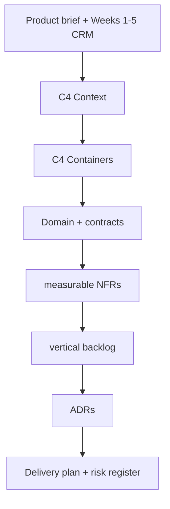

# Lab 48: Capstone Planning and Architecture — Northstar CRM Executable Plan

**Module:** 48 — Capstone Planning and Architecture  
**Duration:** ~45 minutes (session block with starter) · Full path: 5–6 Hours (multi-day)

**Primary IDE:** IntelliJ IDEA Community Edition · **Optional IDE:** VS Code

| OS | How-to for this lab |
| -- | ------------------- |
| Windows | [LAB-48-WINDOWS.md](LAB-48-WINDOWS.md) |
| macOS | [LAB-48-MACOS.md](LAB-48-MACOS.md) |

> **Two folders (do not mix):** [Clone the course repo · Commit in your own repo](../../../CLONE-AND-OWN-REPO-GUIDE.md). Read this GUIDE in the **course clone**. Write and **push** planning docs in **your** `java-bootcamp` repo.

---

## Activity card

| | |
| --- | --- |
| **Time** | ~45 min session · full path 5–6 h multi-day |
| **Checkpoint** | **E** (after Ex **2 → 1 → 4 → 3 → 5 → 6**) |
| **Must prove** | Context + fixtures · ≥1 ADR · backlog seeds · risk seeds · no secrets |
| **Hard gate** | Pre-lab Pass · docs before Lab 49 code |

### What you will learn

Produce an executable CRM plan peers can follow into Labs 49–52.

### Enterprise context

Ambiguous NFRs, missing ADRs, and undocumented risks are Week 6 defense blockers.

### Predict

Should Lab 49 start before ADRs and a vertical backlog exist?

### Debug

Copied Lab 41 CRM into this folder, or ran `mvn compile` with no `pom.xml` — what went wrong?

---

## Two folders — every command below uses these paths

| Folder | Remote | You… |
| ------ | ------ | ---- |
| **Course clone** (handouts) | `bc-sw-engineer-java-participant` | **Read** this GUIDE / starter. **Never** commit homework here. |
| **Your repo** | private `java-bootcamp` | **Copy starter docs** here, fill TODOs, **commit**. |

| Item | Course clone (read) | Your `java-bootcamp` (write) |
| ---- | ------------------- | ---------------------------- |
| This GUIDE | `labs/…/module-48/lab48/LAB-48-GUIDE.md` | — |
| Starter planning docs | `labs/…/module-48/lab48/starter/` | `examples/customer-management-platform/` |
| Graded plan | — | **`examples/customer-management-platform/`** (not `lab48-crm`) |
| Pre-lab notes | — | `examples/module-48-exercises/notes/` |
| Screenshots | — | `notes/screenshots/lab-48/` (gitignored) |

IntelliJ stays on `java-bootcamp`.

**This lab is Markdown planning, not a Spring app.** Copy the **starter** into `examples/customer-management-platform/`. **Do not** copy Lab 31 / 41–47 CRM over this folder. Those stay at `examples/labXX-crm`. Labs 49–52 grow **this same tree**.

**Do not** `mvn` / `./mvnw` as the Lab 48 smoke. Starter has **no** `pom.xml`.

**Week 5 vs Week 6 contracts (plan the delta; do not pretend it already exists):**

| Already true (Labs 40–45 / 31) | Capstone adds (Labs 49–51) |
| ------------------------------ | -------------------------- |
| `GET /api/customers` list only | **`POST /api/v1/interactions`** (Lab 49) |
| No Spring Security | JWT 401/403 (Lab 51) |
| Kafka `crm.customer-events.v1` / group `crm-notifications` | Interaction event `CustomerInteractionRecordedV1` (name the topic in ADR-002) |
| Lab 42 **k3d** `crm-training` `:8088` | Lab 51 deploy target is **k3s** (digest-pinned). Do not treat k3d as the capstone cluster unless the instructor says so. |
| Lab 44 identity **`jarSha256`** | Image digest is Lab 51; do not invent `ghcr.io/…@sha256:…` in ADRs |

**Security NFR:** Unauthenticated `POST /api/v1/interactions` → 401 is a **Lab 51** target. Lab 49 may ship without JWT; do not fail the plan for that.

---

## 45-minute session block (use starter)

> **Pacing reminder:** [PACING.md](../PACING.md) checkpoint **E**. Homework: all 5 ADRs, measurable NFRs, team plan, full risk register.

1. Open [`starter/README.md`](starter/README.md) **in the course clone**.
2. Copy starter into **`java-bootcamp/examples/customer-management-platform/`**.
3. Fill context, **one** ADR, backlog rows, risk seeds — do **not** work under `labs/`.
4. Smoke with `Test-Path` / `Get-ChildItem` (not Maven). Evidence under `notes/screenshots/lab-48/`.
5. Mark session Pass criteria in the starter README.

| Path | Time | Scope |
| ---- | ---- | ----- |
| **Session (default)** | ~45 min | Context + ≥1 ADR + backlog/risk seeds |
| **Full (multi-day)** | see Duration | Every Step in this GUIDE |

---

## What you'll submit (read this first)

All of these live under **`java-bootcamp/examples/customer-management-platform/`**.

| # | Deliverable | Session | Full path |
| - | ----------- | ------- | --------- |
| 1 | `docs/architecture/context.md` | Outcome + fixtures + stub | Complete C4 context |
| 2 | `docs/architecture/container.md` | Sketch OK | Complete |
| 3 | `docs/nfrs.md` | Seeds OK | Measurable table |
| 4 | `docs/adrs/` | **≥1** filled ADR | **≥5** (DB, Kafka, consistency, auth, deploy) |
| 5 | `docs/backlog.md` | CAP-12 + 2 more rows | Prioritized vertical set |
| 6 | `docs/risk-register.md` | ≥2 scored risks | ≥6 with owners |
| 7 | `docs/team-plan.md` | Owners sketched | Critical path complete |
| 8 | `docs/plan-checklist.md` | Session boxes | Full-path boxes |

**Do not submit:** `target/`, secrets, kubeconfig, or a verbatim instructor `solution/`.

---

## Lab Overview

Freeze the Enterprise CRM brief as an **executable plan** so Labs 49–52 implement decisions instead of improvising.

## Learning Objectives

After completing this lab, you will be able to:

* Name users, journeys, exclusions, and success measures
* Draw C4 context with protocols and trust boundaries
* Place React, Spring Boot, PostgreSQL, Kafka, IdP, and observability on a container view
* Write measurable NFRs (method + environment + threshold)
* Record ADRs, a vertical backlog, and scored risks

## Business Scenario

**No Lab 49–52 work counts as in-scope unless it maps to a backlog item, an ADR (or explicit out-of-scope note), and a measurable NFR or acceptance criterion.**

| ID | Name | Notes |
| -- | ---- | ----- |
| `CUS-1001` | Amina Khan | `ACTIVE` — CAP-12 interaction demo |
| `CUS-1002` | Ravi Singh | `PROSPECT` → `ACTIVE` |
| `CUS-9999` | — | not-found later |
| `lab-request-001` | — | correlation on API and events |
| `CAP-12` | — | Record interaction for Amina |

**Security note.** Fictional emails only (`amina.khan@example.test`). Never paste IdP secrets, kubeconfigs, or production URLs into ADRs.

---

## Architecture Context
### NOW (this lab)


```mermaid
flowchart TB
  Brief["Product brief + Weeks 1-5 CRM"] --> C4C["C4 Context"]
  C4C --> C4Cont["C4 Containers"]
  C4Cont --> Domain["Domain + contracts"]
  Domain --> NFR["measurable NFRs"]
  NFR --> Backlog["vertical backlog"]
  Backlog --> ADR["ADRs"]
  ADR --> Plan["Delivery plan + risk register"]
```

## Prerequisites

* Git + Markdown in IntelliJ (JDK/Maven **not** required today)
* Lab 48 starter from the **course clone**
* No secrets in Git

### Pre-flight

```powershell
git remote -v   # YOUR java-bootcamp
Test-Path "$env:USERPROFILE\java-bootcamp"
```

Working directory:

```text
~/java-bootcamp/examples/customer-management-platform
```

## Worked example (read before you write)

```markdown
### CAP-12 — Record a customer interaction
As a service agent, I want to record an interaction for CUS-1001 (Amina Khan)
so the next agent understands customer history.

Acceptance criteria:
1. Valid `POST /api/v1/interactions` returns 201; correlation `lab-request-001` preserved.
2. Timeline shows the interaction after refresh (Lab 50).
3. A versioned event is published after the documented consistency strategy (ADR-003).
4. Invalid notes return field-level errors and are not persisted.
5. Audit records actor and correlation ID without note contents.
```

**What to notice:** This endpoint **does not exist** on the Week 5 list API. Lab 49 builds it.

---

## Implementation Steps

Complete each step in order. **Write** under `java-bootcamp`. **Read** starter from the course clone.

---

### Step 1 — Copy starter, clarify product outcome

**Why:** Without named users and exclusions, “done” is contested in Lab 52.

**Do this:**

**Windows (PowerShell):**

```powershell
$jb = "$env:USERPROFILE\java-bootcamp"
$courseLab48 = "$env:USERPROFILE\bc-sw-engineer-java-participant\labs\Week 6 - Capstone Project\module-48\lab48"

New-Item -ItemType Directory -Force -Path "$jb\examples\customer-management-platform","$jb\notes\screenshots\lab-48" | Out-Null
Copy-Item -Recurse -Force "$courseLab48\starter\*" "$jb\examples\customer-management-platform\"
cd "$jb\examples\customer-management-platform"
```

If the platform tree already has filled ADRs, **merge** — do not blindly overwrite.

**macOS / Linux:**

```bash
JB=~/java-bootcamp
COURSE_LAB48=~/bc-sw-engineer-java-participant/labs/Week\ 6\ -\ Capstone\ Project/module-48/lab48

mkdir -p "$JB/examples/customer-management-platform" "$JB/notes/screenshots/lab-48"
cp -R "$COURSE_LAB48/starter/." "$JB/examples/customer-management-platform/"
cd "$JB/examples/customer-management-platform"
```

Fill `docs/architecture/context.md`: users, journeys (search Amina/Ravi, record interaction, status change), exclusions (billing, real PII), success measures, fixture table.

**Expected result:** `customer-management-platform/docs/` exists; outcome names CUS-1001 / CUS-1002 / `lab-request-001`.

**If it fails:** Work ended in `labs/` → move to `java-bootcamp`. Copied Lab 41 → start over with **starter**.

---

### Step 2 — Model system context

**Why:** Missing trust boundaries hide IdP and data-exfiltration risks.

**Do this:** Complete the C4 context in `docs/architecture/context.md`. People: Service Agent, Manager, Operator. Systems: CRM Platform, Identity Provider. Label HTTPS / OIDC. Keep Kafka topic internals off this view.

**Expected result:** Protocols and trust boundaries labeled.

**If it fails:** React/Kafka boxes on the context view → move them to Step 3.

---

### Step 3 — Design containers and data flow

**Why:** Container placement forces the sync vs async decisions ADRs must quantify.

**Do this:** Fill `docs/architecture/container.md`: React UI, Spring Boot API, PostgreSQL, Kafka + consumer, IdP, logs/metrics. Label REST+JWT vs customer/interaction events. Deploy boundary: **k3s in Lab 51** (not Lab 42 k3d unless assigned).

**Expected result:** Topology Labs 49–51 can implement.

**If it fails:** Kafka with no consumer and no “publish-only this week” risk → add one.

---

### Step 4 — Define domain and contracts

**Why:** Unversioned endpoints break Lab 50 and Lab 52.

**Do this:** Sketch `POST /api/v1/interactions` (body: `customerId`, `interactionType`, `summary`, `correlationId`) and event `CustomerInteractionRecordedV1`. Compatibility: additive OK; breaking changes version-bump. Header `X-Correlation-ID: lab-request-001`.

**Expected result:** Named owners; HTTP + event sketches; versioning paragraph.

**If it fails:** Planning `GET /api/customers/{id}` as the interaction API → Week 5 has **no** per-id GET. CAP-12 is **POST interactions**.

---

### Step 5 — Write measurable NFRs

**Why:** “Fast” cannot be tested.

**Do this:** Fill `docs/nfrs.md` (latency, availability, recovery, security, a11y, retention). Each row: number/boolean, method, environment. Security 401/403 is **Lab 51**. Recovery: rollback to prior **digest or `jarSha256`** (Lab 44/51) — do not invent GHCR digests.

**Expected result:** No unsupported adjectives.

---

### Step 6 — Create prioritized backlog

**Why:** Horizontal “Kafka first” stories strand the demo.

**Do this:** Complete `docs/backlog.md` with CAP-12 and stories mapped to Labs 49–52. Enabling tech stories must cite the outcome they unlock.

**Expected result:** Vertical backlog; Amina/Ravi in acceptance.

---

### Step 7 — Record architecture decisions

**Why:** Undocumented choices are re-argued in every demo.

**Do this:** Session: fill **one** ADR. Full path: five files — PostgreSQL, Kafka, consistency (after-commit vs outbox), JWT (Lab 51), k3s digest-pin (Lab 51). Each: Status, Date, Owners, Context, Decision, Alternatives (≥2), Consequences.

**Expected result:** Session ≥1; full path ≥5 with alternatives.

**If it fails:** Two Accepted ADRs that pick different databases → supersede one.

---

### Step 8 — Plan delivery and risk

**Why:** Unowned critical path becomes Week 6 thrash.

**Do this:** Complete `docs/team-plan.md` and `docs/risk-register.md`. Minimum risks: Kafka lag, migration failure, JWT misconfig, secret leak, demo outage, UI/API contract drift.

Keep this continuity list in the team plan:

1. **Lab 49:** CAP-12 API + event for `CUS-1001` / `lab-request-001`
2. **Lab 50:** React search/profile/timeline + PostgreSQL proof
3. **Lab 51:** JWT deny-by-default, pipeline, k3s smoke + rollback
4. **Lab 52:** Demo/evidence — **no new scope**

**Expected result:** Named owners; scored risks.

---

### Step 9 — Failure experiments + evidence pack

**Do this:** Complete Failure Experiments. Peer (or self) restates CAP-12 + one ADR consequence from docs alone. `git status` on **your** repo.

```markdown
| # | Confirm | Notes |
| - | ------- | ----- |
| 1 | Work in java-bootcamp / customer-management-platform | Pass / Fail |
| 2 | Docs-only (no Maven as Lab 48 smoke) | Pass / Fail |
| 3 | Fixtures + CAP-12 present | Pass / Fail |
| 4 | Session: ≥1 ADR; full path: ≥5 | Pass / Fail |
| 5 | No secrets | Pass / Fail |
```

---

## Implementation Checkpoints

### Checkpoint A — Tooling

| # | Confirm | Your notes |
| - | ------- | ---------- |
| 1 | Tree is `examples/customer-management-platform/` (not `lab48-crm`) | Pass / Fail |
| 2 | Copied **starter**, not Lab 41–47 | Pass / Fail |
| 3 | Fixtures named | Pass / Fail |

### Checkpoint B — Architecture

| # | Confirm | Your notes |
| - | ------- | ---------- |
| 1 | Context with protocols / trust boundaries | Pass / Fail |
| 2 | Containers include React, API, PostgreSQL, Kafka, IdP | Pass / Fail |
| 3 | CAP-12 is POST interactions (not list-API `/{id}`) | Pass / Fail |

### Checkpoint C — Quality and decisions

| # | Confirm | Your notes |
| - | ------- | ---------- |
| 1 | NFRs measurable (401 is Lab 51) | Pass / Fail |
| 2 | Vertical backlog including CAP-12 | Pass / Fail |
| 3 | Session ≥1 ADR / full path ≥5 | Pass / Fail |

### Checkpoint D — Hygiene

| # | Confirm | Your notes |
| - | ------- | ---------- |
| 1 | Team plan + scored risks | Pass / Fail |
| 2 | No secrets | Pass / Fail |
| 3 | Pushes to **your** remote | Pass / Fail |

---

## Safety Rules

* Never import real PII into planning docs.
* Never commit tokens, kubeconfig, or `.env`.
* Never treat Lab 42 k3d as “the” capstone cluster unless assigned.
* Never start Lab 49 code before session-block docs exist.

---

## Reference Commands

```powershell
cd $env:USERPROFILE\java-bootcamp\examples\customer-management-platform
Get-ChildItem docs\architecture, docs\adrs
Select-String -Path docs\**\*.md -Pattern 'CUS-1001|lab-request-001|CAP-12' | Select-Object -First 20
git status --short
```

## Failure Experiments

| # | Experiment | Observe | Restore |
| - | ---------- | ------- | ------- |
| 1 | Remove trust boundaries | Peer cannot locate IdP risk | Restore |
| 2 | NFR = “must be fast” | Cannot invent a test | Add a number |
| 3 | UI-only then API-only backlog | Demo path breaks | Re-slice vertical |
| 4 | ADR with no alternatives | Reviewer rejects | Add ≥2 |
| 5 | Risk with no score/owner | Cannot prioritize | Score + owner |
| 6 | `mvn compile` in this folder | No `pom.xml` | Docs-only smoke |

---

## Troubleshooting

| Symptom | Likely cause | Fix |
| ------- | ------------ | --- |
| No `docs/` | Copied wrong folder | Copy **starter** |
| Work in course clone | Wrong folder | `java-bootcamp` |
| `mvn` / `./mvnw` fails | Docs lab | `Test-Path` / `Get-ChildItem` |
| Copied Lab 41–47 | Wrong seed | Starter into `customer-management-platform` |
| Planned `GET /api/customers/{id}` | Week 5 habit | CAP-12 is **POST /api/v1/interactions** |
| GHCR digest in ADR | Lab 44 habit | `jarSha256` / Lab 51 digest after you have one |
| k3d in ADR-005 as default | Lab 42 habit | Lab 51 is **k3s** unless assigned otherwise |
| Two Accepted DB ADRs | Status drift | Supersede one |
| Lab 49 unsure what to build | No CAP-12 | Rewrite vertical story |

## Evidence Log Template

```markdown
# Lab 48 Evidence Log
- Repo (must be java-bootcamp):
- Path (must be customer-management-platform):
- Session vs full path:
- Peer restated CAP-12:
```

---

## Cleanup

```powershell
cd $env:USERPROFILE\java-bootcamp\examples\customer-management-platform
git status --short
```

**Keep this tree**—Labs 49–52 implement and defend against it.

---

## Reflection Questions

Write **1–3 sentence** answers (not essays):

1. Which decision most affected the Week 6 plan (CAP-12, Kafka, or deploy target)?
2. What evidence proves the plan is executable, not decorative?
3. Which ambiguity did you force into an explicit assumption?
