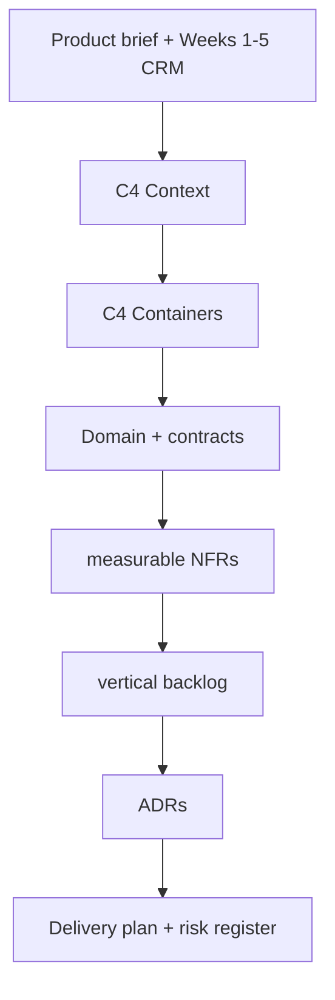
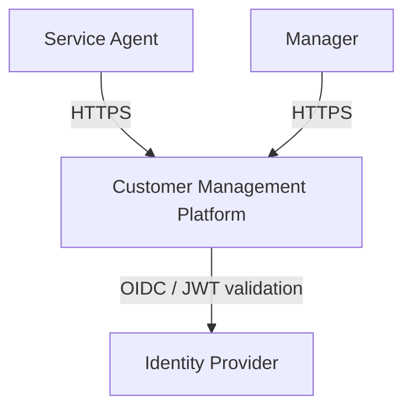
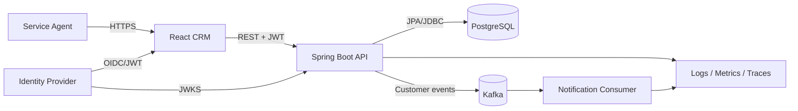

# Lab 48: Capstone Planning and Architecture — Northstar CRM Executable Plan

**Module:** 48 — Capstone Planning and Architecture  
**Duration:** ~45 minutes (timed path / session block with starter) · Full path: 5–6 Hours

**Primary IDE:** IntelliJ IDEA Community Edition · **Optional IDE:** VS Code

| OS | How-to for this lab |
| -- | ------------------- |
| Windows | [LAB-48-WINDOWS.md](LAB-48-WINDOWS.md) |
| macOS | [LAB-48-MACOS.md](LAB-48-MACOS.md) |

---

## Activity card

| | |
| --- | --- |
| **Time** | ~45 min session block · full path 5–6 h multi-day |
| **Checkpoint** | **E** (after Ex 2→1→4→3→5→6) |
| **Must prove** | context + fixtures · ≥1 ADR · backlog seeds · risk seeds · no secrets |
| **Hard gate** | Pre-lab Pass · measurable NFR mindset · docs before coding Labs 49+ |

### What you will learn

Produce an executable CRM architecture and delivery plan peers can follow into Labs 49–52.

### Enterprise context

Ambiguous NFRs, missing ADRs, and undocumented risks are Week 6 defense blockers.

### Predict

Should Lab 49 start before ADRs and vertical backlog exist?

### Debug

Two Accepted ADRs that pick different databases — what do you do?

---

## 45-minute timed path (session block — use starter)

> **Pacing reminder:** [PACING.md](../PACING.md) checkpoint **E**. Homework/multi-day: full NFRs, ≥5 ADRs, team plan, complete risk register.

In class, use the starter templates so the **session block** fits **~45 minutes**. Capstone planning remains **multi-day** on the full path below — the starter does not replace ADRs, NFRs, or the complete risk register.

1. Open [`starter/README.md`](starter/README.md).
2. Copy `starter/` into `java-bootcamp/examples/customer-management-platform/` (see starter README).
3. Fill context diagram stub, ≥1 ADR, backlog rows, and risk seeds — do **not** wait on a perfect prior lab.
4. Run the starter smoke check; evidence under `notes/screenshots/lab-48/`.
5. Mark timed-path Pass criteria in the starter README. Continue remaining GUIDE steps as homework / multi-day work.

| Path | Time | Scope |
| ---- | ---- | ----- |
| **Timed / session block** | ~45 min | Starter TODOs + smoke check |
| **Full (multi-day)** | 5–6 Hours | Every Step in this GUIDE |

Policy: [`labs/_STARTER-PATH.md`](../../../_STARTER-PATH.md)

---

## What you'll submit (read this first)

Keep this checklist visible while you work.

| # | Deliverable |
| - | ----------- |
| 1 | `docs/architecture/context.md` (C4 context + product outcome) |
| 2 | `docs/architecture/container.md` (containers + data flow) |
| 3 | `docs/nfrs.md` (measurable NFRs) — create if missing from starter |
| 4 | `docs/adrs/` (≥5 ADRs: DB, messaging, consistency, auth, deploy) |
| 5 | `docs/backlog.md` (prioritized vertical stories including interaction recording) |
| 6 | `docs/risk-register.md` (scored risks with mitigations) |
| 7 | `docs/team-plan.md` (owners, milestones, critical path) — create if missing from starter |
| 8 | Baseline note if platform code already exists |

**Must submit:** the items in the table above (sources + evidence + short notes).

**Do not submit:** `target/`, `node_modules/`, secrets, heap dumps, or a verbatim instructor `solution/`.

## Lab Overview

This Module 48 lab turns the Enterprise CRM brief into an **executable architecture and delivery plan**. You produce C4 context and container views, measurable NFRs, ADRs, a prioritized vertical backlog, ownership milestones, and a scored risk register—so Labs 49–52 implement against decisions rather than improvisation.

## Learning Objectives

After completing this lab, you will be able to:

* Clarify business scope, users, journeys, exclusions, and success measures
* Produce C4 context diagrams with protocols and trust boundaries
* Design container views placing React, Spring Boot, PostgreSQL, Kafka, identity, and observability
* Define domain ownership and versioned HTTP/event contracts
* Write measurable NFRs with method, environment, and thresholds

## Business Scenario

The capstone team must deliver a coherent **Customer Management Platform**, not five disconnected demonstrations. Before coding Week 6 slices, reviewers freeze:

**No Lab 49–52 work counts as “in scope” unless it maps to a backlog item, an ADR (or explicit out-of-scope note), and a measurable NFR or acceptance criterion.**

You own the planning gate for agent journeys around Amina (`CUS-1001` ACTIVE), Ravi (`CUS-1002` PROSPECT→ACTIVE), interaction recording, search/profile/timeline, secure release, and final defense.

Use these fixtures consistently:

| ID | Name | Notes |
| -- | ---- | ----- |
| `CUS-1001` | Amina Khan | `ACTIVE` — primary demo customer for interaction timeline |
| `CUS-1002` | Ravi Singh | `PROSPECT` → `ACTIVE` — onboarding / status journey |
| `CUS-9999` | — | not-found / negative paths in later labs |
| `lab-request-001` | — | correlation ID on API, events, and failure evidence |
| `CAP-12`, … | — | backlog story IDs in `docs/backlog.md` |

**Security note for evidence.** Use fictional emails only (`amina.khan@example.test`, `ravi.singh@example.test`). Never paste real IdP secrets, kubeconfigs, or production URLs into ADRs.

---

## Architecture Context
### NOW (this lab)


```mermaid
flowchart TB
  Brief["Product brief + Weeks 1-5 CRM"] --> C4C["C4 Context"]
  C4C --> C4Cont["C4 Containers"]
  C4Cont --> Domain["Domain + contracts"]
  Domain --> NFR["measurable NFRs"]
  NFR --> Backlog["vertical backlog"]
  Backlog --> ADR["ADRs"]
  ADR --> Plan["Delivery plan + risk register"]
```

## Prerequisites

Confirm (Lab 0 tools assumed):

* JDK 21; Maven; Git; Docker available for later labs
* Diagram/backlog tooling as instructed (Markdown Mermaid acceptable)
* Access to capstone repo or `~/java-bootcamp/examples/`
* No secrets committed to Git

### Pre-flight

```bash
java -version
mvn -version
```

## Worked example (read before you code)

Study this pattern once before Step 1. Your job is to apply the same idea in the Steps — do not skip ahead to a full solution.

```markdown
### CAP-12 — Record a customer interaction
As a service agent, I want to record an interaction for CUS-1001 (Amina Khan)
so the next agent understands customer history.

Acceptance criteria:
1. Valid input returns 201 and a resource identifier; correlation `lab-request-001` preserved.
2. The timeline shows the interaction within two seconds after refresh.
3. A versioned event is published after (documented) consistency strategy.
4. Invalid notes return field-level errors and are not persisted.
5. Audit data records actor and correlation ID without note contents.
```

**What to notice:** Match names, IDs, and failure behavior from the scenario — instructors check these.

---

## Implementation Steps

Complete each step in order. Paths assume `~/java-bootcamp/examples/customer-management-platform` unless noted. Parts 1–8 of the legacy plan map to Steps 1–8; Step 9 closes evidence.

---

### Step 1 — Clarify product outcome (Part 1)

**Why:** Without named users, journeys, exclusions, and success measures, later “done” is contested in the defense panel.

**Do this:** In `docs/architecture/context.md` (or `docs/product-outcome.md`), define:

* Primary users (service agent, manager, operator)
* Journeys: search Amina/Ravi, view profile/timeline, record interaction, status change (where in scope)
* In-scope capabilities vs explicit exclusions (e.g. billing, real PII import)
* Success measures tied to Lab 52 demo minutes and NFR thresholds
* Open questions with owners and due dates

Include fixture table rows for `CUS-1001`, `CUS-1002`, and correlation `lab-request-001`.

**Expected result:** A one-page outcome statement a peer can paraphrase; exclusions are explicit; questions have owners.

**If it fails:** Vague “build a CRM” only → rewrite with users and measurable success. Real customer names → replace with synthetic fixtures.

---

### Step 2 — Model system context (Part 2)

**Why:** Context diagrams without trust boundaries hide IdP and data-exfiltration risks reviewers will probe.

**Do this:** Complete `docs/architecture/context.md` with a C4 context view:

* People: Service Agent, Manager, Platform Operator
* Software systems: CRM Platform, Identity Provider, (optional) email/SMS gateway
* Relationships labeled with protocols (HTTPS, OIDC/JWT) and trust boundaries
* Keep implementation detail out (no class names, no Kafka topic internals yet)


```mermaid
flowchart TB
  Agent["Service Agent"] -->|HTTPS| CRM["Customer Management Platform"]
  Mgr["Manager"] -->|HTTPS| CRM
  CRM -->|"OIDC / JWT validation"| IdP["Identity Provider"]
```

GitHub Markdown renders this as a flowchart (C4 Mermaid syntax is experimental and not reliable on GitHub).

**Expected result:** Context diagram committed; protocols and trust boundaries labeled; no container internals polluting the view.

**If it fails:** Mixing React/Kafka boxes into context → move those to Step 3. Missing IdP → add identity as external system.

---

### Step 3 — Design containers and data flow (Part 3)

**Why:** Container placement forces sync vs async decisions that ADRs and NFRs must later quantify.

**Do this:** Write `docs/architecture/container.md` placing:

* React CRM UI
* Spring Boot API
* PostgreSQL database
* Kafka + notification/worker consumer
* Identity Provider
* Logs / metrics / traces

Label synchronous (REST+JWT) and asynchronous (customer events) flows. Show deployment/admin boundaries (namespace, who may apply manifests).


```mermaid
flowchart LR
  Agent["Service Agent"] -->|HTTPS| UI["React CRM"]
  UI -->|"REST + JWT"| API["Spring Boot API"]
  API -->|JPA/JDBC| DB[("PostgreSQL")]
  API -->|"Customer events"| K[("Kafka")]
  K --> Worker["Notification Consumer"]
  API --> Obs["Logs / Metrics / Traces"]
  Worker --> Obs
  IdP["Identity Provider"] -->|OIDC/JWT| UI
  IdP -->|JWKS| API
```

**Expected result:** Container diagram matches intended Lab 49–51 topology; sync/async edges are labeled.

**If it fails:** Orphan Kafka with no consumer → add worker or document “publish-only this week” as temporary risk. PostgreSQL omitted → add persistence container.

---

### Step 4 — Define domain and contracts (Part 4)

**Why:** Unversioned endpoints and events create Lab 50 contract breakage and Lab 52 panel failure.

**Do this:** In `docs/architecture/container.md` or `docs/contracts.md`, identify ownership for:

* Customer, Interaction, Case (if any), Notification side effects
* Draft endpoint sketch: `POST /api/v1/interactions` with Problem Details errors (body includes `customerId`, `interactionType`, `summary`, `correlationId`)
* Draft event: `CustomerInteractionRecordedV1` fields (eventId, type, version, time, actor, correlationId, customerId, interactionId, interactionType)
* Compatibility policy: additive fields OK; breaking changes require version bump

Reference fixtures: create interaction for `CUS-1001` with header `X-Correlation-ID: lab-request-001`.

**Expected result:** Named owners for aggregates; HTTP + event sketches; versioning policy in one paragraph.

**If it fails:** Exposing JPA entities as API contracts → rewrite as DTO/record contracts. Missing correlation field → add it before Lab 49.

---

### Step 5 — Write measurable NFRs (Part 5)

**Why:** “Fast,” “secure,” and “scalable” without thresholds cannot be tested or defended.

**Do this:** Author `docs/nfrs.md` covering at least:

| Concern | Example threshold (adapt with instructor) | Measurement |
| ------- | ---------------------------------------- | ----------- |
| Latency | p95 create-interaction API ≤ 500 ms in lab | timed curl / Micrometer |
| Availability | API readiness after deploy within 3 min | probe + smoke |
| Recovery | Rollback previous digest ≤ 10 min | rehearse Lab 51 |
| Security | Unauthenticated `/api/**` → 401; wrong role → 403 | security tests |
| Accessibility | Keyboard-complete interaction form; labels associated | Lab 50 a11y check |
| Retention | Logs retain correlation IDs; no note bodies | log review |

State **method** and **environment** (local Docker vs training cluster) for each target. Ban unsupported adjectives.

**Expected result:** Every NFR has number/boolean, how measured, where measured; a11y and recovery included.

**If it fails:** Only performance numbers → add security/a11y/recovery. Thresholds without method → fill measurement column.

---

### Step 6 — Create prioritized backlog (Part 6)

**Why:** Horizontal “layers first” backlogs strand Week 6 without a demoable vertical slice.

**Do this:** Write `docs/backlog.md` with vertical stories ordered by value, risk, dependency, and learning. Include at least:

```markdown
### CAP-12 — Record a customer interaction
As a service agent, I want to record an interaction for CUS-1001 (Amina Khan)
so the next agent understands customer history.

Acceptance criteria:
1. Valid input returns 201 and a resource identifier; correlation `lab-request-001` preserved.
2. The timeline shows the interaction within two seconds after refresh.
3. A versioned event is published after (documented) consistency strategy.
4. Invalid notes return field-level errors and are not persisted.
5. Audit data records actor and correlation ID without note contents.
```

Also add stories mapping to Labs 49–52 (API/Kafka, React+PostgreSQL, JWT/pipeline/deploy, defense prep). Enabling tech stories must cite which outcome they unlock.

**Expected result:** Prioritized vertical backlog; CAP-12 (or equivalent) present; Lab 49–52 traceability noted.

**If it fails:** Purely technical tickets (“set up Kafka”) with no user outcome → rewrite as enabling work tied to CAP-*. Missing Amina/Ravi → add fixture-based acceptance.

---

### Step 7 — Record architecture decisions (Part 7)

**Why:** Undocumented choices are re-argued in every demo and fail Lab 52 trade-off questions.

**Do this:** Create ADRs under `docs/adrs/` for at least:

1. PostgreSQL as system of record
2. Kafka for customer interaction events
3. Consistency strategy (after-commit publish, outbox candidate, etc.)
4. JWT / OIDC resource-server authentication
5. Container deploy target (k3s training namespace)

Each ADR must include Status, Date, Owners, Context, Decision, Alternatives (≥2), Consequences.

Skeleton:

```markdown
# ADR-003: Publish events after database commit
- Status: Proposed
- Date: 2026-07-14
- Owners: Capstone Team
## Context

Describe the consistency problem and constraints.
## Decision

State the selected approach precisely.
## Alternatives

List at least two viable alternatives.
## Consequences

Record benefits, costs, failure modes, and follow-up work.
```

**Expected result:** ≥5 ADRs; alternatives and consequences present; statuses and owners set.

**If it fails:** Decision-only sticky notes → expand alternatives/consequences. Conflicting ADRs → resolve or mark Superseded.

---

### Step 8 — Plan delivery and risk (Part 8)

**Why:** Unowned critical-path and unscoreable risks surface as Week 6 thrash and incomplete defense.

**Do this:** Complete `docs/team-plan.md` and `docs/risk-register.md`:

* Accountable owners for Labs 49–52 milestones
* Integration points (UI↔API, API↔PostgreSQL, API↔Kafka, pipeline↔registry↔cluster)
* Critical path diagram or ordered list
* Risks scored (likelihood × impact) with trigger, mitigation, contingency, owner, due date

Minimum risks to include: Kafka lag, PostgreSQL migration failure, JWT misconfig, pipeline secret leak, demo environment outage, contract drift UI/API.

**Expected result:** Named owners; critical path visible; ≥6 scored risks with mitigations.

**If it fails:** Risks listed without scores/owners → complete columns. “Hope” as mitigation → replace with testable control.

---

### Step 9 — Failure experiments + evidence pack

**Why:** Planning without a hostile review leaves false-confidence boxes for Lab 52.

**Do this:** Complete Failure Experiments. Capture peer-review notes under `docs/notes/` or `reports/`. Ensure README points to the six core artifacts. Run a peer walkthrough: peer opens docs alone and restates CAP-12 + one ADR consequence.

Also complete an evidence log:

```markdown
# Lab 48 Evidence Log
- Branch and commit:
- Environment:
- Tool versions:
- Peer reviewer:

## Artifact checklist

| Artifact | Path | Peer OK? |
|---|---|---|
| Context | docs/architecture/context.md | |
| Containers | docs/architecture/container.md | |
| NFRs | docs/nfrs.md | |
| Backlog | docs/backlog.md | |
| ADRs | docs/adrs/ | |
| Risks | docs/risk-register.md | |
```

**Expected result:** ≥3 experiments recorded; peer reproduction noted; evidence log filled; no secrets in docs; `git status` clean of junk.

**If it fails:** See Troubleshooting.

---

### Working notes for Week 6 continuity

Keep this short checklist in `docs/team-plan.md` so Labs 49–52 do not renegotiate scope mid-week:

1. **Lab 49 owns:** CAP-12 API + Kafka for `CUS-1001` with `lab-request-001`.
2. **Lab 50 owns:** React search/profile/timeline + PostgreSQL durability proof for the same fixtures.
3. **Lab 51 owns:** JWT deny-by-default, pipeline gates, immutable image, smoke + rollback.
4. **Lab 52 owns:** Demo script, evidence index, Q&A cards, retro, self-assessment—no new scope.

If a story is deferred, mark it Explicitly Deferred with owner and date in the risk register—do not silently drop it.

---

## Implementation Checkpoints

### Checkpoint A — Scope and structure

_Mark **Pass** or **Fail** in your lab notes._

| # | Confirm | Your notes |
| - | ------- | ---------- |
| 1 | Capstone docs tree under `customer-management-platform/` (or instructor-approved `lab48-crm/`) | Pass / Fail |
| 2 | Product outcome with users, journeys, exclusions, success measures | Pass / Fail |
| 3 | Fixture IDs `CUS-1001`, `CUS-1002`, `lab-request-001` named in planning docs | Pass / Fail |

### Checkpoint B — Architecture

_Mark **Pass** or **Fail** in your lab notes._

| # | Confirm | Your notes |
| - | ------- | ---------- |
| 1 | C4 context with protocols and trust boundaries | Pass / Fail |
| 2 | C4 containers: React, Spring Boot, PostgreSQL, Kafka, IdP, observability | Pass / Fail |
| 3 | Domain/contract sketches with versioning policy | Pass / Fail |

### Checkpoint C — Quality and decisions

_Mark **Pass** or **Fail** in your lab notes._

| # | Confirm | Your notes |
| - | ------- | ---------- |
| 1 | Measurable NFRs (latency, security, a11y, recovery, retention) | Pass / Fail |
| 2 | Prioritized vertical backlog including interaction story | Pass / Fail |
| 3 | ≥5 ADRs with alternatives and consequences | Pass / Fail |

### Checkpoint D — Delivery hygiene

_Mark **Pass** or **Fail** in your lab notes._

| # | Confirm | Your notes |
| - | ------- | ---------- |
| 1 | Team plan with owners and critical path | Pass / Fail |
| 2 | Risk register scored with mitigations | Pass / Fail |
| 3 | Peer review completed; no secrets in committed docs | Pass / Fail |

---

## Reference Commands, Configuration, and Code

### Vertical story excerpt

```markdown
### CAP-12 — Record a customer interaction
As a service agent, I want to record an interaction so the next agent understands customer history.
Fixtures: CUS-1001 (Amina), correlation lab-request-001.
```

### ADR skeleton

```markdown
# ADR-00N: Title
- Status: Proposed | Accepted | Superseded
- Date: YYYY-MM-DD
- Owners: ...


## Context
## Decision
## Alternatives
## Consequences

```

### Commands

```bash
cd ~/java-bootcamp/examples/customer-management-platform
mkdir -p docs/architecture docs/adrs reports
mkdir -p ~/java-bootcamp/notes/screenshots/lab-48
ls docs/architecture docs/adrs
git status --short
# optional baseline if code exists:
./mvnw -B -q clean verify 2>/dev/null || true
```

### Artifact map

| Artifact | Role |
| -------- | ---- |
| `docs/architecture/context.md` | C4 context + product outcome |
| `docs/architecture/container.md` | Containers + data flow |
| `docs/nfrs.md` | Measurable quality targets |
| `docs/backlog.md` | Prioritized vertical stories |
| `docs/adrs/*` | Decision records |
| `docs/risk-register.md` | Scored risks |
| `docs/team-plan.md` | Owners and milestones |

---

## Failure Experiments

| # | Experiment | Observe | Restore |
| - | ---------- | ------- | ------- |
| 1 | Remove trust boundaries from context | Peer cannot locate IdP risk | Restore boundaries |
| 2 | Write NFR as “must be fast” | Cannot invent a test | Add numeric threshold |
| 3 | Split backlog into UI-only then API-only | Demo path breaks across weeks | Re-slice vertical |
| 4 | ADR with no alternatives | Reviewer rejects decision quality | Add ≥2 alternatives |
| 5 | Risk “Kafka might fail” with no score/owner | Cannot prioritize mitigation | Score + assign owner |

---

## Troubleshooting

| Symptom | Likely cause | Fix |
| ------- | ------------ | --- |
| Peer disagrees on scope | Missing exclusions | Add explicit out-of-scope list |
| Diagrams ignored in review | Embedded images only, no source | Prefer Mermaid/text in repo |
| Lab 49 unsure what to build | Backlog not vertical / no CAP-12 | Rewrite stories with acceptance |
| Conflicting tech choices | No ADR status | Accept one ADR; supersede other |
| “We’ll document later” | Evidence deferred | Finish docs before coding |
| Secrets in screenshots | Pasted real tokens | Redact, rotate, replace evidence |
| Fixture drift | Random demo names | Standardize on CUS-1001/1002 |
| Inherited build red | Pre-existing platform fail | Record baseline; do not hide |

## Security and Production Review

Optional — jot brief notes in your README if useful for your progress check (not a separate essay):

1. Which inputs are untrusted (browser agents, JWT claims, Kafka payloads)?
2. Where will authn/authz/validation be enforced (UI hints vs API enforcement)?
3. Which values are sensitive—never in ADRs or screenshots?

---


## Cleanup

```bash
cd ~/java-bootcamp/examples/customer-management-platform
git status --short
# Remove accidental secret files if any:
# shred/delete local .env copies; do not commit
```

Stop any exploratory containers started while sketching. Keep sanitized planning docs; delete generated noise.

**Keep the Lab 48 docs tree**—Labs 49–52 implement and defend against it. Do not delete Accepted ADRs without superseding.


## Reflection Questions

Write **1–3 sentence** answers (not essays):

1. Which design decision most affected correctness of the Week 6 plan?
2. What evidence proves the plan is executable (not decorative)?
3. Which ambiguity was hardest to force into an explicit assumption or question?

---


