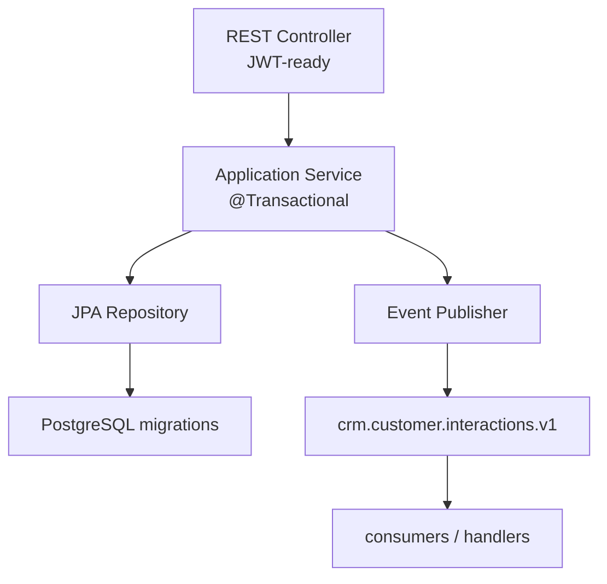
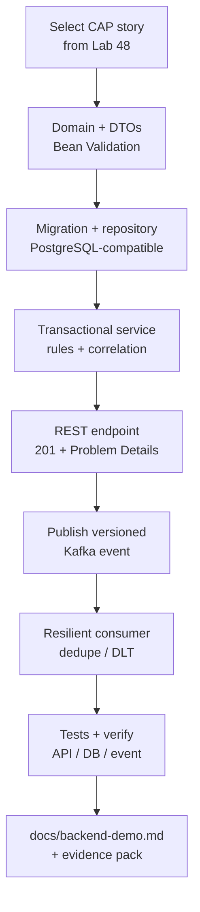

# Lab 49: Capstone Backend and Messaging — Northstar CRM Interaction Slice

**Module:** 49 — Capstone Backend and Messaging  
**Lab folder:** `labs/Week 6 - Capstone Project/module-49/lab49/`  
**Difficulty:** Advanced Capstone  
**Duration:** 6–8 Hours

**Primary IDE:** IntelliJ IDEA Community Edition · **Optional IDE:** VS Code

| OS | How-to for this lab |
| -- | ------------------- |
| Windows | [LAB-49-WINDOWS.md](LAB-49-WINDOWS.md) |
| macOS | [LAB-49-MACOS.md](LAB-49-MACOS.md) |

> **Environment reminder:** Finish [Lab 0](../../../Week%201%20-%20Java%20and%20JVM%20Foundations/module-00/lab0/LAB-0-GUIDE.md) and Lab 48 planning. Use **IntelliJ IDEA Community** (primary; optional VS Code) with **JDK 21**, **Maven 3.9+**, and instructor **shared Kafka**. Work under `~/java-bootcamp/examples/customer-management-platform` (Windows: `%USERPROFILE%\java-bootcamp\examples\customer-management-platform`).

---

## How to follow this lab

1. Open the **Windows** or **macOS** how-to (links above) in a second tab.
2. Create/work only under your `java-bootcamp/examples/…` folder from the steps (not inside this `labs/` git clone unless a step says otherwise).
3. For each **Step N**: read **Why** (if present) → do the actions → confirm **Expected** / **Expected result** → then continue.
4. When stuck, use **Failure Experiments** / troubleshooting in this guide before asking for help.
5. Capture evidence under `notes/screenshots/lab-49/` (workspace root under `java-bootcamp`; redact secrets). Use the **Pass criteria** tables — write **Pass** or **Fail** in your notes. GitHub file view does not support clickable checkboxes.

## Lab Overview

This Module 49 lab implements or extends the CRM **Spring Boot + Kafka vertical slice** for recording customer interactions: validated REST APIs, transaction-safe persistence, versioned events, resilient consumption, and automated tests—producing `docs/backend-demo.md` evidence for the defense.

**Purpose.** Service agents must record interactions that persist reliably, return a clear API contract, publish a traceable event, and tolerate duplicate or failed consumption. A green demo without tests, correlation IDs, or failure-path evidence does not pass capstone quality.

**What you build (exercise).** Select a Lab 48 backlog story (e.g. CAP-12); create domain/DTOs with Bean Validation; JPA persistence + migration; transactional application service; REST endpoint with Problem Details; Kafka publisher with versioned event; resilient consumer (dedupe, retries, DLT); unit/MVC/JPA/Kafka tests; document the demo runbook.

**What success looks like.** Under the capstone backend, `./mvnw -B clean verify` (or `mvn`) is green twice; `POST` interaction for `CUS-1001` with `lab-request-001` returns 201; row exists; event appears on the topic; negatives return Problem Details; `docs/backend-demo.md` lets a peer reproduce the slice.

**Depends on Lab 48.** Need backlog acceptance criteria, contract sketches, and ADRs (PostgreSQL, Kafka, consistency, JWT if already decided). Finish Lab 48 if CAP-12 (or equivalent) is missing.

**CRM connection.** Fixtures `CUS-1001` Amina / `CUS-1002` Ravi / `CUS-9999` not-found / correlation `lab-request-001`. Lab 50 attaches React UI and proves UI→PostgreSQL; Lab 51 hardens JWT and deploy; keep publishers/consumers injectable for tests.

---

## Learning Objectives

After completing this lab, you will be able to:

* Implement layered Spring Boot features for a CRM vertical slice
* Keep JPA entities out of external contracts; validate DTOs
* Use transactions deliberately around persist + publish strategy
* Publish versioned Kafka events with correlation and actor metadata
* Consume idempotently with bounded retries and DLT
* Test HTTP, persistence, and messaging with failure paths
* Document a reproducible backend demo with synthetic fixtures
* Trace a single request from API → DB → event with `lab-request-001`
* Reject false-confidence tests that never assert domain outcomes
* Preserve Lab 48 ADR decisions in working code

---

## Business Scenario

Service agents need to record customer interactions for Amina (`CUS-1001`) and continue Ravi’s (`CUS-1002`) journey. Leadership freezes:

**No merge of the interaction slice without API evidence, persistence proof, versioned event proof, automated tests, and a documented failure path.**

You own that backend gate using Lab 48 CAP-12 acceptance criteria.

Use these fixtures consistently:

| ID | Name | Notes |
| -- | ---- | ----- |
| `CUS-1001` | Amina Khan | `ACTIVE` — primary interaction create target |
| `CUS-1002` | Ravi Singh | secondary customer / list filters |
| `CUS-9999` | — | not-found paths |
| `lab-request-001` | — | `X-Correlation-ID` on HTTP and events |
| `capstone-49-001` | — | optional alternate correlation for smoke curls |

**Security note for evidence.** Use fictional emails and summaries. Never log full interaction notes with secrets; never commit broker credentials.

---

## Architecture Context

### NOW (this lab)



### Lab flow (mermaid)



### Architecture NOW vs LATER

| Aspect | Lab 49 (NOW) | Lab 50 / 51 (LATER) |
| ------ | ------------ | ------------------- |
| UI | API-only evidence via curl/MockMvc | React journey + a11y |
| Auth | Role annotations / tests stubs OK | Full JWT harden + scanners |
| Consistency | Per Lab 48 ADR | Same strategy under load/deploy |
| Proof | verify + demo.md | UI→DB + pipeline smoke |

**Lab focus:** Spring Boot vertical slice, Kafka publish/consume, transactional boundaries, automated tests, backend demo documentation.

---

## Prerequisites

Complete [SETUP](../../../SETUP-INSTRUCTIONS.md), [Lab 0](../../../Week%201%20-%20Java%20and%20JVM%20Foundations/module-00/lab0/LAB-0-GUIDE.md), and [Lab 48](../../module-48/lab48/LAB-48-GUIDE.md). Confirm:

* Java 21 + Maven + Spring Boot backend present or scaffolded
* shared Kafka (instructor bootstrap; local Compose optional if allowed) (or instructor broker)
* JUnit 5 + Spring test stack
* Lab 48 backlog + ADRs available under `docs/`
* No secrets committed to Git

### Pre-flight

```bash
java -version
mvn -version
docker --version
docker compose version
git --version
pwd
ls ~/java-bootcamp/examples
```

Confirm Lab 48 artifacts exist before coding:

```bash
ls ~/java-bootcamp/examples/customer-management-platform/docs/backlog.md
ls ~/java-bootcamp/examples/customer-management-platform/docs/adrs
```

Create branch and baseline:

```bash
cd ~/java-bootcamp/examples/customer-management-platform
git switch -c lab/49-crm 2>/dev/null || git checkout -b lab/49-crm
./mvnw -B clean verify 2>/dev/null || mvn -B clean verify
docker compose ps 2>/dev/null || true
git status --short
```

If baseline fails, save the exact command and error; agree whether pre-existing. Do not hide inherited failure by skipping tests.

---

## Suggested Project Files

```text
~/java-bootcamp/examples/customer-management-platform/
├── backend/
│   ├── src/main/java/com/northstar/crm/
│   │   ├── api/InteractionController.java
│   │   ├── api/dto/CreateInteractionRequest.java
│   │   ├── api/dto/InteractionResponse.java
│   │   ├── domain/Interaction.java
│   │   ├── domain/Customer.java
│   │   ├── service/InteractionService.java
│   │   ├── repo/InteractionRepository.java
│   │   ├── messaging/InteractionEventPublisher.java
│   │   ├── messaging/CustomerInteractionRecordedV1.java
│   │   ├── messaging/InteractionEventConsumer.java
│   │   └── web/ProblemDetailsAdvice.java
│   ├── src/main/resources/
│   │   ├── application.yml
│   │   └── db/migration/V...__customer_interaction.sql
│   └── src/test/java/com/northstar/crm/
│       ├── api/InteractionControllerTest.java
│       ├── service/InteractionServiceTest.java
│       ├── repo/InteractionRepositoryTest.java
│       └── messaging/InteractionMessagingIT.java
├── docs/
│   ├── backend-demo.md
│   ├── backlog.md                    # from Lab 48
│   └── notes/screenshots/
├── docker-compose.yml                # Kafka (+ maybe DB)
├── .gitignore
└── README.md
```

Ignore `target/`, IDE metadata, tokens, and passwords. If using `lab49-crm/` alone, mirror the same package layout under `~/java-bootcamp/examples/customer-management-platform/`.

---

## Concepts to Discuss

Write 2–3 sentences each in `docs/backend-demo.md`:

1. Main flow under test (create interaction for `CUS-1001`, not UI)
2. Trust boundary: what API validation proves vs what JWT Lab 51 will enforce
3. Success/failure contracts (201 + body vs Problem Details; event vs DLT)
4. Stable fixtures vs random UUIDs without seed customers
5. Idempotency of consumer on duplicate `eventId`
6. Why publish strategy must match Lab 48 ADR-003 (or equivalent)
7. Evidence operators/leads need (Surefire, curl, kafka console, SQL)
8. Two machines: same fixtures, same topic name, same verify
9. False-confidence asserts (`assertNotNull(response)` only) vs domain asserts
10. What Lab 50 will consume (DTO fields) without renaming fixture IDs

---

## Implementation Steps

Complete each step in order. Commands assume capstone `backend/` unless noted. Parts 1–8 map to Steps 1–8; Step 9 closes evidence.

---

### Step 1 — Select vertical slice (Part 1)

**Why:** Coding without a frozen acceptance list produces feature sprawl and an undefendable demo.

**Do this:** Open Lab 48 `docs/backlog.md`. Choose CAP-12 (or instructor equivalent). In `docs/backend-demo.md` write:

* Acceptance criteria copied and numbered
* API, persistence, event, security stub, observability change list
* Definition of done + demo evidence checklist before coding
* Fixture plan: seed/find `CUS-1001`, correlation `lab-request-001`

```bash
cd ~/java-bootcamp/examples/customer-management-platform
mkdir -p ~/java-bootcamp/notes/screenshots/lab-49 backend/src/test/java/com/northstar/crm
```

**Expected result:** Written DoD; peer can state what “done” means without watching you code.

**If it fails:** Story missing → return to Lab 48 or agree a CAP-12 substitute with instructor. Scope includes UI → defer UI to Lab 50.

---

### Step 2 — Create domain and DTOs (Part 2)

**Why:** Shipping JPA entities as JSON couples clients to persistence and breaks Lab 50 typing.

**Do this:** Create immutable request/response/event records. Keep entities internal. Use Bean Validation and enums for channel (`PHONE`, `EMAIL`, `CHAT`).

Example shapes (adapt to your IDs):

```java
public record CreateInteractionRequest(
    @NotBlank @Size(max = 20) String channel,
    @NotBlank @Size(max = 1000) String summary) {}

public record InteractionResponse(
    UUID id, UUID customerId, String channel, String summary, Instant createdAt) {}

public record CustomerInteractionRecordedV1(
    UUID eventId, String eventType, int eventVersion,
    Instant occurredAt, String correlationId, String actor,
    UUID customerId, UUID interactionId, String channel) {}
```

**Expected result:** DTOs compile; entities not referenced from controller method signatures.

**If it fails:** Validation missing → add `@Valid` plan for Step 5. Entity in public API → introduce mapper.

---

### Step 3 — Implement persistence (Part 3)

**Why:** Constraints and indexes belong in migrations, not “Hibernate will figure it out.”

**Do this:** Add Flyway/Liquibase migration for `customer_interaction` (PostgreSQL-compatible types if targeting PostgreSQL; H2/Testcontainers profile for CI if instructor allows). Repository methods by business need (`findByCustomerIdOrderByCreatedAtDesc`). Avoid N+1 when loading timelines.

Inspect generated SQL in a test or log once. Seed Amina (`CUS-1001`) and Ravi (`CUS-1002`) via migration or `@Sql` so repository tests are deterministic.

Document in `docs/backend-demo.md`:

* Migration version id
* Primary key strategy (UUID/RAW)
* Index purpose (timeline by customer + time)
* Which profile runs against PostgreSQL vs H2

**Expected result:** Migration applies; repository round-trip saves interaction for seeded Amina; SQL plan/log inspected once.

**If it fails:** Type mismatch PostgreSQL vs H2 → document profile strategy. Missing FK to customer → add constraint aligning with Lab 48 ADR. Flaky seed → use fixed fixture IDs, never random emails.

---

### Step 4 — Build application service (Part 4)

**Why:** Controllers that open transactions and publish ad hoc skip business rules and correlation.

**Do this:** Implement `InteractionService` with `@Transactional` boundary per Lab 48 consistency ADR:

* Load customer or throw not-found for `CUS-9999`
* Map conflict/validation outcomes
* Persist interaction
* Publish event via collaborator (not static Kafka client inside domain)
* Propagate actor + `correlationId` without logging note secrets

```java
@Transactional
public InteractionResponse create(UUID customerId, CreateInteractionRequest request, String correlationId) {
  var customer = customers.findById(customerId)
      .orElseThrow(() -> new CustomerNotFoundException(customerId));
  var saved = interactions.save(mapper.toEntity(customer, request));
  events.publish(eventFactory.interactionRecorded(saved, correlationId));
  return mapper.toResponse(saved);
}
```

Unit-test the service with a fake publisher that records the event payload for `lab-request-001`. Assert customer not-found never calls publish.

**Expected result:** Service tests cover happy path + not-found without starting full server; publisher invoked only after successful save path.

**If it fails:** Publish before persist without ADR → stop and align with Lab 48. Missing correlation → thread from controller header. Service opens Kafka admin clients → inject port so tests stay fast.

---

### Step 5 — Expose REST endpoint (Part 5)

**Why:** Wrong status codes and opaque 500s block frontend integration and panel trust.

**Do this:** `POST /api/customers/{customerId}/interactions` returning 201 + `Location`. Use Problem Details for validation and not-found. Read `X-Correlation-ID` (default generate if absent—but demos must send `lab-request-001`). Prepare `@PreAuthorize` stubs if security present; Lab 51 hardens fully.

```java
@PostMapping("/api/customers/{customerId}/interactions")
@PreAuthorize("hasAnyRole('AGENT','MANAGER')")
ResponseEntity<InteractionResponse> create(
    @PathVariable UUID customerId,
    @Valid @RequestBody CreateInteractionRequest request,
    @RequestHeader(value = "X-Correlation-ID", required = false) String correlationId) {
  var cid = correlationId == null || correlationId.isBlank() ? "lab-request-001" : correlationId;
  var result = service.create(customerId, request, cid);
  var location = URI.create("/api/customers/" + customerId + "/interactions/" + result.id());
  return ResponseEntity.created(location).body(result);
}
```

Also add GET timeline endpoint if CAP story requires it for Lab 50. Capture MockMvc JSON snippets (sanitized) under `~/java-bootcamp/notes/screenshots/lab-49/`.

**Expected result:** MockMvc: 201 for Amina; 400 invalid channel; 404 `CUS-9999`; Location header present.

**If it fails:** 200 on create → fix to 201. Stack traces in body → Problem Details advice. Path variable type mismatch vs Lab 50 client → freeze ID type in contract doc.

---

### Step 6 — Publish Kafka event (Part 6)

**Why:** Unversioned fire-and-forget events become silent data loss under consumer lag.

**Do this:** Use stable topic (e.g. `crm.customer.interactions.v1`) and partition key = customer id. Include event ID, type, version, time, actor, correlation ID. Publish only with documented consistency strategy (after commit / outbox).

Verify with console consumer in demo.md.

**Expected result:** One event for one successful create; payload includes `lab-request-001` and Amina’s customer id.

**If it fails:** Event on validation failure → do not publish. Wrong key → fix partition key to customer.

---

### Step 7 — Implement resilient consumer (Part 7)

**Why:** At-least-once delivery without dedupe double-sends notifications and fails the defense.

**Do this:** Consumer validates `eventVersion`, deduplicates on `eventId`, uses bounded retries, routes poison messages to DLT, and logs correlation without note body. Make lag/failure observable (counter or structured log).

**Expected result:** Duplicate delivery is no-op; poison message lands in DLT (or documented training substitute).

**If it fails:** Infinite retry storm → add backoff + DLT. Ignoring version → reject incompatible events.

---

### Step 8 — Test complete slice (Part 8)

**Why:** Untested messaging is a live-demo mystery failure in Lab 52.

**Do this:** Write unit, MockMvc, JPA, Kafka IT, and failure tests. Prefer Testcontainers or approved Compose. Capture API, DB, and event evidence for `CUS-1001`.

```bash
cd ~/java-bootcamp/examples/customer-management-platform/backend
./mvnw -B clean verify
# or from root if multi-module:
# ./mvnw -B clean verify
```

Manual curl (adapt token/id):

```bash
curl -i -X POST "http://localhost:8080/api/customers/$CUSTOMER_ID/interactions" \
  -H 'Content-Type: application/json' \
  -H "Authorization: Bearer $TOKEN" \
  -H 'X-Correlation-ID: lab-request-001' \
  -d '{"channel":"PHONE","summary":"Requested address update"}'
```

**Expected result:** `BUILD SUCCESS`; tests cover happy + negative; evidence noted in `docs/backend-demo.md`.

**If it fails:** Flaky Kafka IT → awaitility + unique event IDs; fix shared topic pollution.

---

### Step 9 — Failure experiments + evidence pack

**Why:** Capstone credibility is failure-path literacy, not curl-once luck.

**Do this:** Complete [Failure Experiments](#failure-experiments). Fill `docs/backend-demo.md` with exact commands, topic name, migration id, and screenshots/excerpts under `~/java-bootcamp/notes/screenshots/lab-49/`. Run verify twice for determinism.

**Expected result:** ≥3 experiments; identical consecutive verifies; peer can follow demo.md; no secrets committed.

**If it fails:** See Troubleshooting.

---

## Implementation Checkpoints

### Checkpoint A — Structure and scope

_Mark each row **Pass** or **Fail** in your lab notes (GitHub markdown files are not interactive checklists)._

| # | Confirm | Your notes |
| - | ------- | ---------- |
| 1 | Capstone backend (or `lab49-crm`) under `examples/` | Pass / Fail |
| 2 | CAP story selected; DoD in `docs/backend-demo.md` | Pass / Fail |
| 3 | Fixtures `CUS-1001` / `CUS-1002` / `lab-request-001` planned | Pass / Fail |

### Checkpoint B — Core slice

_Mark each row **Pass** or **Fail** in your lab notes (GitHub markdown files are not interactive checklists)._

| # | Confirm | Your notes |
| - | ------- | ---------- |
| 1 | DTOs + validation; entities not in API | Pass / Fail |
| 2 | Migration + repository | Pass / Fail |
| 3 | Transactional service + REST 201/Problem Details | Pass / Fail |

### Checkpoint C — Messaging + tests

_Mark each row **Pass** or **Fail** in your lab notes (GitHub markdown files are not interactive checklists)._

| # | Confirm | Your notes |
| - | ------- | ---------- |
| 1 | Versioned event published with correlation | Pass / Fail |
| 2 | Consumer dedupe/retry/DLT (or documented substitute) | Pass / Fail |
| 3 | `mvn clean verify` green with HTTP/DB/messaging coverage | Pass / Fail |

### Checkpoint D — Hygiene

_Mark each row **Pass** or **Fail** in your lab notes (GitHub markdown files are not interactive checklists)._

| # | Confirm | Your notes |
| - | ------- | ---------- |
| 1 | Two consecutive verifies identical success | Pass / Fail |
| 2 | `docs/backend-demo.md` complete | Pass / Fail |
| 3 | No secrets / `target/` committed | Pass / Fail |

---

## Reference Commands, Configuration, and Code

### Event record

```java
public record CustomerInteractionRecordedV1(
    UUID eventId, String eventType, int eventVersion,
    Instant occurredAt, String correlationId,
    UUID customerId, UUID interactionId, String channel) {}
```

### Verify API and event

```bash
./mvnw -B clean verify
curl -i -X POST http://localhost:8080/api/customers/$CUSTOMER_ID/interactions \
  -H 'Content-Type: application/json' -H "Authorization: Bearer $TOKEN" \
  -H 'X-Correlation-ID: lab-request-001' \
  -d '{"channel":"PHONE","summary":"Requested address update"}'
kafka-console-consumer.sh --bootstrap-server localhost:9092 \
  --topic crm.customer.interactions.v1 --from-beginning --max-messages 1
```

### Commands

```bash
cd ~/java-bootcamp/examples/customer-management-platform
docker compose up -d
cd backend
./mvnw -B -q test
./mvnw -B clean verify
./mvnw -B -q test -Dtest=InteractionControllerTest
git status --short
```

### Class map

| Class | Role |
| ----- | ---- |
| `InteractionController` | HTTP contract |
| `InteractionService` | Transaction + rules |
| `CustomerInteractionRecordedV1` | Versioned event |
| `InteractionEventConsumer` | Idempotent side effects |
| `docs/backend-demo.md` | Reproduction runbook |

### `backend-demo.md` outline (minimum)

```markdown
# Backend demo — Lab 49
## Prerequisites (JDK, Compose, profiles)
## Seed customers (CUS-1001 Amina, CUS-1002 Ravi)
## Happy path curl (lab-request-001)
## Negative path curl (invalid channel, CUS-9999)
## SQL verification
## Kafka verification (topic, sample payload fields)
## Test commands (mvn clean verify)
## Known limitations / ADR references
```

### Problem Details expectation (validation)

```json
{
  "type": "about:blank",
  "title": "Bad Request",
  "status": 400,
  "detail": "Validation failed",
  "instance": "/api/customers/.../interactions"
}
```

Adapt field names to your Problem Details implementation; keep status semantics stable for Lab 50.

---

## Manual Verification

1. Create interaction for seeded Amina (`CUS-1001`) returns 201 + Location.
2. Invalid channel/summary returns Problem Details and does not persist.
3. Not-found customer (`CUS-9999`) returns 404 Problem Details.
4. Correlation `lab-request-001` appears in logs/event metadata (not note body).
5. Kafka event version and type match contract; partition key is customer.
6. Duplicate event consumption does not double-apply side effects.
7. Unit + MVC + persistence + messaging tests pass.
8. Two consecutive `mvn clean verify` runs match.
9. `docs/backend-demo.md` lists commands a peer can run.
10. No sensitive values in tests, logs samples, or Git.
11. Entity types are not returned directly from controllers.
12. Publish behavior matches Lab 48 consistency ADR (no silent divergence).

---

## Failure Experiments

| # | Experiment | Observe | Restore |
| - | ---------- | ------- | ------- |
| 1 | POST invalid channel | 400 Problem Details; no row; no event | Keep validation |
| 2 | POST for `CUS-9999` | 404; bounded error | Keep mapping |
| 3 | Break consumer idempotency briefly | Duplicate side effect | Restore dedupe |
| 4 | Stop Kafka mid-publish (safe lab) | Failure matches ADR expectation | Restart broker |
| 5 | Run `mvn -q test` twice | Identical results | Keep isolation |
| 6 | POST with empty summary | 400; no event | Keep `@NotBlank` |
| 7 | Reuse same `eventId` in consumer test | Second apply skipped | Keep dedupe store |

---

## Troubleshooting

| Symptom | Likely cause | Fix |
| ------- | ------------ | --- |
| Tests not discovered | Naming/path | `*Test`/`*IT` under `src/test/java` |
| Kafka connection refused | Compose not up | `docker compose up -d`; check port |
| Event missing | Publish before commit / wrong topic | Align ADR; verify topic name |
| Flaky IT | Shared consumer group / timing | Unique keys; awaitility |
| PostgreSQL migration fail | Non-PostgreSQL SQL | Use compatible types/profiles |
| 401/403 surprises | Security auto-config | Add test security config; Lab 51 hardens |
| Correlation null | Header not read | Bind `X-Correlation-ID` |
| Entity in JSON | Mapper skipped | Return DTO records only |
| DLT never fills | Retry infinite / wrong error type | Bound retries; classify poison |
| Topic exists locally only | CI broker missing | Testcontainers or skip-IT profile documented |
| Customer id mismatch UI | UUID vs string drift | Freeze contract in demo.md |

---

## Security and Production Review

Answer in `docs/backend-demo.md`:

1. Which inputs are untrusted (body, path ids, headers, Kafka payloads)?
2. Where are authn/authz/validation enforced (validation now; JWT Lab 51)?
3. Which values are sensitive—never in logs beyond samples?
4. What can be retried safely (`mvn verify`, consumer with dedupe)?
5. What happens after partial failure (txn rollback; DLT)?
6. What would an operator monitor (consumer lag, error rate, correlation search)?
7. Which local default is unacceptable (plaintext passwords in `application.yml` committed)?
8. How are event contracts versioned with API/DTO changes?

---

## Cleanup

```bash
cd ~/java-bootcamp/examples/customer-management-platform
./mvnw -q clean 2>/dev/null || (cd backend && ./mvnw -q clean)
docker compose stop
git status --short
```

Do not commit `target/` or broker data directories. Keep `docs/backend-demo.md` and sanitized screenshots.

**Keep the Lab 49 backend slice**—Lab 50 builds UI and PostgreSQL proof on these contracts; Lab 51 secures and deploys them.

---

## Expected Deliverables

* Backend source changes for the interaction vertical slice
* Database migration for interaction persistence
* Versioned event contract (`CustomerInteractionRecordedV1` or equivalent)
* Unit and integration tests (HTTP, persistence, messaging)
* `docs/backend-demo.md` reproduction runbook
* Baseline and final validation results (`mvn clean verify`)
* One controlled failure-path result (invalid input or not-found)
* Concise setup and reproduction guide cross-links
* Peer-review notes and resolved comments
* Known limitations, residual risks, owners, and next actions

Exclude real `.env` files, access tokens, database exports, private keys, kubeconfig, Terraform state, and sensitive screenshots.

---

## Evaluation Rubric (100 Marks)

| Criteria | Marks |
| -------- | ----: |
| Environment and project structure | 10 |
| Core implementation (API, service, persistence, Kafka) | 30 |
| Integration/configuration correctness (migration, topic, profiles) | 15 |
| Failure handling (validation, not-found, consumer DLT/dedupe) | 15 |
| Automated verification | 10 |
| Security and production awareness | 10 |
| Documentation and evidence (`backend-demo.md`) | 10 |

**Notes:** Happy-path-only without negatives → lose failure marks. Publishing on validation failure → honor violation. Demo without `lab-request-001` correlation → incomplete evidence.

---

## Reflection Questions

Write 3–6 sentence answers:

1. Which design decision most affected correctness (transaction vs publish timing)?
2. Which failure was hardest to diagnose (Kafka, JPA, validation)?
3. What evidence proves the slice works end-to-end?
4. What breaks first at ten times event volume?
5. Which concern should move to shared CI infrastructure?
6. What must change before real customer notes are stored?
7. How does this lab connect to Labs 48, 50, and 51?
8. What metric matters most on the ops dashboard for this slice?
9. (Forward look) Which DTO fields must stay stable for Lab 50 React types?

---

## Bonus Challenges

1. Implement a transactional outbox and compare to after-commit publish.
2. Add consumer contract tests (schema/example payload).
3. Automate duplicate event delivery assertion in IT.
4. Add optimistic concurrency on interaction updates.
5. Generate OpenAPI + event examples checked into `docs/`.
6. Assert Problem Details `correlationId` equals `lab-request-001` on failures.

---

## Success Criteria

You are finished when:

* Interaction API persists and returns correct contracts
* Versioned Kafka event includes correlation for `CUS-1001`
* Consumer handles duplicates/failures safely
* Automated verify is green and repeatable
* Failure paths are demonstrated and documented
* Another student can follow `docs/backend-demo.md`
* No production secret is hard-coded

---

## Instructor Notes

* **Live probe:** Have the student create an interaction for Amina with `lab-request-001`, then show matching DB row and Kafka payload. Ask where publish sits relative to commit. Ask what happens on duplicate `eventId`.
* **Assess:** DTO boundary, migration quality, verify green, consumer idempotency, honest limitations, correlation evidence.
* **Continuity:** Prefer `customer-management-platform/backend`. Keep fixture IDs. Lab 50 must not invent a new API shape. Lab 51 should not need to redesign the event envelope.
* **Common pitfalls:** Entity JSON; missing Problem Details; no correlation; flaky Kafka tests; publishing on 400; committed secrets; after-commit vs outbox undocumented drift from Lab 48 ADR.
* **Timing:** 6–8 hours. Messaging ITs often burn 60–90 minutes—encourage early Testcontainers/Compose health checks. Cap “perfect consumer” once happy path + dedupe + one DLT/retry story is evidenced.
* **Parity check:** If students use `lab49-crm/` instead of the shared platform tree, require a README pointer so Lab 50 finds contracts.
* **Quality bar:** Two consecutive green verifies beat a single local happy curl.

---

### Quick peer reproduction card (attach to PR)

```markdown
Peer name:
Directory used:
mvn clean verify result:
Curl 201 for CUS-1001? Y/N
Event seen with lab-request-001? Y/N
Negative 400 evidenced? Y/N
Secrets absent from diff? Y/N
Blocked questions:
```

Use this card during Checkpoint D; paste sanitized results into `docs/backend-demo.md`.

---

*End of Lab 49 — Capstone Backend and Messaging: Northstar CRM Interaction Slice. Keep the backend for Labs 50–52 and portfolio evidence.*
