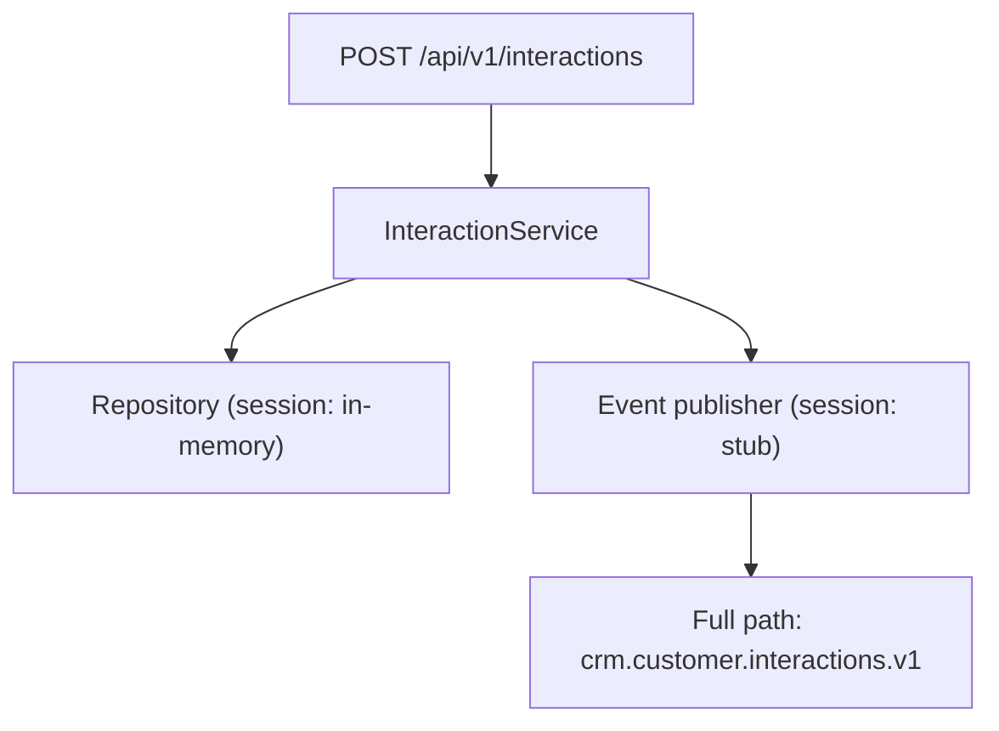

# Lab 49: Capstone Backend and Messaging — Northstar CRM Interaction Slice

**Module:** 49 — Capstone Backend and Messaging  
**Duration:** ~45 minutes (session block with starter) · Full path: 6–8 Hours (multi-day)

**Primary IDE:** IntelliJ IDEA Community Edition · **Optional IDE:** VS Code

| OS | How-to for this lab |
| -- | ------------------- |
| Windows | [LAB-49-WINDOWS.md](LAB-49-WINDOWS.md) |
| macOS | [LAB-49-MACOS.md](LAB-49-MACOS.md) |

> **Two folders (do not mix):** [Clone the course repo · Commit in your own repo](../../../CLONE-AND-OWN-REPO-GUIDE.md). Read this GUIDE in the **course clone**. Write, run, and **push** in **your** `java-bootcamp` repo.

---

## Activity card

| | |
| --- | --- |
| **Time** | ~45 min session · full path 6–8 h multi-day |
| **Checkpoint** | **E** (after Ex **1 → 2 → 3 → 4 → 5 → 6**) |
| **Must prove** | Service TODOs · `mvn -B test` · CUS-1001 · event V1 sketch |
| **Hard gate** | Pre-lab Pass · Lab 48 CAP-12 · docs before claiming done |

### What you will learn

Implement CAP-12: validated `POST /api/v1/interactions`, persist, versioned event, tests, demo runbook.

### Enterprise context

A green demo without tests, correlation, or a failure path does not pass capstone.

### Predict

Should the publisher run before the DB transaction commits?

### Debug

`./mvnw` not found, or `401` on a session curl with `Bearer $TOKEN` — what is wrong?

---

## Two folders — every command below uses these paths

| Folder | Remote | You… |
| ------ | ------ | ---- |
| **Course clone** | `bc-sw-engineer-java-participant` | **Read** GUIDE / starter. **Never** commit homework here. |
| **Your repo** | private `java-bootcamp` | Merge starter **`backend/`** into the Lab 48 tree, fill TODOs, **commit**. |

| Item | Course clone (read) | Your `java-bootcamp` (write) |
| ---- | ------------------- | ---------------------------- |
| This GUIDE | `labs/…/module-49/lab49/LAB-49-GUIDE.md` | — |
| Starter backend | `labs/…/module-49/lab49/starter/backend/` | `examples/customer-management-platform/backend/` |
| Lab 48 plan (keep) | — | `examples/customer-management-platform/docs/` (ADRs, backlog) |
| Pre-lab notes | — | `examples/module-49-exercises/notes/` |
| Screenshots | — | `notes/screenshots/lab-49/` |

IntelliJ stays on `java-bootcamp`. Open the **`backend`** Maven module (JDK 21).

**Merge into the Lab 48 tree.** Copy **`backend/`** + `docs/build-checklist.md`. **Do not** copy starter `README.md` over Lab 48 docs. **Do not** copy Lab 41–47 CRM. **Do not** use `lab49-crm` as the default folder.

**Session starter is in-memory** (no JPA, no Kafka, no Flyway, **no Spring Security**). `mvn -B test` from `backend/` is the session smoke. Full path adds Flyway, Kafka, DLT, `docs/backend-demo.md`.

**HTTP:** `POST http://localhost:8080/api/v1/interactions`. This route is **new**. Week 5 only had `GET /api/customers`. There is **no** `GET /api/customers/{id}`.

**Auth:** Session curls **omit** `Authorization`. `$TOKEN` / JWT is **Lab 51**. A 401 on the session stub means you added security too early.

**Customer id type:** **String** fixtures (`CUS-1001`). Do not switch the service to `UUID customerId`.

**Kafka (full path):** topic from ADR-002 (example `crm.customer.interactions.v1`). CLI: `docker exec crm-kafka /opt/kafka/bin/….sh` (Lab 30 broker). There is no `kafka-console-consumer.sh` on the Windows PATH. Do not invent `crm.customer.events`.

**Maven:** `mvn` from `backend/`. No wrapper unless you added one.

---

## 45-minute session block (use starter)

> **Pacing reminder:** [PACING.md](../PACING.md) checkpoint **E**. Homework: Flyway, Kafka IT, consumer/DLT, verify twice, `docs/backend-demo.md`.

1. Open [`starter/README.md`](starter/README.md) **in the course clone**.
2. Merge `backend/` into **`java-bootcamp/examples/customer-management-platform/`**.
3. Fill `InteractionService` TODOs — do **not** work under `labs/`.
4. `mvn -B -f backend/pom.xml test`. Evidence under `notes/screenshots/lab-49/`.
5. Mark session Pass criteria in the starter README.

| Path | Time | Scope |
| ---- | ---- | ----- |
| **Session (default)** | ~45 min | Service TODOs + unit tests |
| **Full (multi-day)** | see Duration | Every Step in this GUIDE |

---

## What you'll submit

| # | Deliverable | Session | Full path |
| - | ----------- | ------- | --------- |
| 1 | `backend/` interaction slice | Service + tests | + Flyway/JPA |
| 2 | Event V1 type | Sketch / stub publish | Kafka + DLT |
| 3 | `docs/backend-demo.md` | Outline OK | Exact commands |
| 4 | `mvn -B test` (session) / `mvn -B clean verify` twice (full) | Required | Required |
| 5 | Failure path (CUS-9999 or invalid type) | Unit test | + HTTP Problem Details |

**Do not submit:** `target/`, secrets, verbatim `solution/`.

---

## Lab Overview

Implement Lab 48 **CAP-12** on Spring Boot: DTO API, persist, versioned event, tests.

## Business Scenario

**No merge without API evidence, persistence proof, versioned event proof, automated tests, and a documented failure path.**

| ID | Notes |
| -- | ----- |
| `CUS-1001` | Amina — happy-path create |
| `CUS-1002` | Ravi — known customer |
| `CUS-9999` | not-found |
| `lab-request-001` | `X-Correlation-ID` |

---

## Architecture Context
### NOW (this lab)


```mermaid
flowchart TB
  Ctrl["POST /api/v1/interactions"] --> Svc["InteractionService"]
  Svc --> Repo["Repository (session: in-memory)"]
  Svc --> Pub["Event publisher (session: stub)"]
  Pub --> Kafka["Full path: crm.customer.interactions.v1"]
```

## Prerequisites

Lab 48 docs in **`customer-management-platform/docs/`**. JDK 21 + Maven. Kafka/Postgres optional on the session path.

### Pre-flight

```powershell
java -version
mvn -version
Test-Path "$env:USERPROFILE\java-bootcamp\examples\customer-management-platform\docs\backlog.md"
```

## Worked example (session — no Bearer)

```powershell
curl.exe -i -X POST "http://localhost:8080/api/v1/interactions" `
  -H "Content-Type: application/json" `
  -H "X-Correlation-ID: lab-request-001" `
  -d "{\"customerId\":\"CUS-1001\",\"interactionType\":\"NOTE\",\"summary\":\"Requested address update\",\"correlationId\":\"lab-request-001\"}"
```

App must be running. Session evidence can be **unit tests only** if you do not start the server.

---

## Implementation Steps

---

### Step 1 — Merge starter, freeze CAP-12

**Why:** Coding without a frozen DoD produces sprawl.

**Do this:**

```powershell
$jb = "$env:USERPROFILE\java-bootcamp"
$courseLab49 = "$env:USERPROFILE\bc-sw-engineer-java-participant\labs\Week 6 - Capstone Project\module-49\lab49"
$dest = "$jb\examples\customer-management-platform"

New-Item -ItemType Directory -Force -Path "$dest\backend","$dest\docs","$jb\notes\screenshots\lab-49" | Out-Null
Copy-Item -Recurse -Force "$courseLab49\starter\backend\*" "$dest\backend\"
Copy-Item -Force "$courseLab49\starter\docs\build-checklist.md" "$dest\docs\build-checklist.md"
# Do NOT copy starter README over Lab 48 docs
cd "$dest\backend"
```

In `docs/backend-demo.md` (create it), paste CAP-12 acceptance from Lab 48. Fixture plan: `CUS-1001` / `lab-request-001`.

**Expected result:** `backend/pom.xml` exists; Lab 48 ADRs still present.

**If it fails:** Overwrote `docs/adrs` → restore from git; copy only `backend/`.

---

### Step 2 — DTOs (not entities)

**Why:** JPA entities as JSON couple Lab 50 to persistence.

**Do this:** Keep records in `api/dto`. Customer id is **String**. Annotate `CreateInteractionRequest` (`@NotBlank`, `interactionType` CALL/EMAIL/NOTE/MEETING).

**Expected result:** Controller signatures use DTOs only.

---

### Step 3 — Persistence

**Session:** in-memory `InteractionRepository` (`customerExists` for CUS-1001/1002).

**Full path:** Flyway `customer_interaction`, JPA, seed Amina/Ravi. Document PostgreSQL vs H2 profile.

**Expected result:** Session: save in map. Full: migration applies.

---

### Step 4 — Application service

**Why:** Controllers must not open Kafka clients.

**Do this:** Fill `InteractionService.create`:

1. Correlation: header > body > `lab-request-001`
2. Reject `CUS-9999` (`UnknownCustomerException`)
3. Map → `Interaction`, `createdAt = Instant.now()`
4. `save`
5. `eventPublisher.publish`
6. Return `InteractionResponse`

Use **String** `customerId`, not UUID. Align publish-vs-commit with Lab 48 ADR-003 on the full path (`@Transactional`).

**Expected result:** `InteractionServiceTest` green (Amina 201-shape; unknown customer throws).

**If it fails:** Tests still `UnsupportedOperationException` → TODOs not filled.

---

### Step 5 — REST endpoint

**Do this:** `POST /api/v1/interactions` → **201**. Problem Details on the full path. Read `X-Correlation-ID`. **No** `@PreAuthorize` on the session stub.

**Expected result:** MockMvc or curl 201 for CUS-1001; 400 invalid type; 404 CUS-9999 (full path mapping).

**If it fails:** 401 → remove session security. 200 on create → use 201.

---

### Step 6 — Publish event (session stub / full Kafka)

**Session:** `InteractionEventPublisher` may log. Sketch `CustomerInteractionRecordedV1` fields.

**Full path:** topic `crm.customer.interactions.v1` (or ADR name), key = customerId, after-commit/outbox per ADR. Inspect with:

```powershell
docker exec crm-kafka /opt/kafka/bin/kafka-console-consumer.sh `
  --bootstrap-server localhost:9092 `
  --topic crm.customer.interactions.v1 --from-beginning --max-messages 1 --timeout-ms 15000
```

Broker is Lab 30 `crm-kafka` if you use Compose.

**Expected result:** One event per successful create; includes `lab-request-001`.

---

### Step 7 — Resilient consumer (full path)

**Why:** At-least-once without dedupe doubles side effects.

**Do this:** Validate `eventVersion`, dedupe `eventId`, bounded retry, DLT (Lab 46: factory-wired handler, topic + `.DLT`). Session: document “stub publisher, consumer later.”

---

### Step 8 — Test the slice

```powershell
cd $env:USERPROFILE\java-bootcamp\examples\customer-management-platform\backend
mvn -B test
# Full path:
# mvn -B clean verify
```

**Expected result:** Session tests green. Full path: verify twice.

---

### Step 9 — Failure experiments + evidence

Fill `docs/backend-demo.md`. `git status` on **java-bootcamp**. No secrets.

---

## Implementation Checkpoints

### Checkpoint A — Structure

| # | Confirm | Notes |
| - | ------- | ----- |
| 1 | `customer-management-platform/backend/` (not `lab49-crm`) | Pass / Fail |
| 2 | Lab 48 docs still intact | Pass / Fail |
| 3 | CAP-12 / fixtures planned | Pass / Fail |

### Checkpoint B — Core slice

| # | Confirm | Notes |
| - | ------- | ----- |
| 1 | DTOs; String customerId | Pass / Fail |
| 2 | Service TODOs filled | Pass / Fail |
| 3 | POST → 201 (or unit-test equivalent) | Pass / Fail |

### Checkpoint C — Messaging + tests

| # | Confirm | Notes |
| - | ------- | ----- |
| 1 | Event V1 sketched / stubbed | Pass / Fail |
| 2 | Session: `mvn -B test` · Full: Kafka/DLT or documented substitute | Pass / Fail |
| 3 | Unknown-customer test | Pass / Fail |

### Checkpoint D — Hygiene

| # | Confirm | Notes |
| - | ------- | ----- |
| 1 | No `./mvnw` required | Pass / Fail |
| 2 | No Bearer on session curls | Pass / Fail |
| 3 | No secrets / `target/` | Pass / Fail |

---

## Reference Commands

```powershell
cd $env:USERPROFILE\java-bootcamp\examples\customer-management-platform\backend
mvn -B test
```

## Failure Experiments

| # | Experiment | Observe | Restore |
| - | ---------- | ------- | ------- |
| 1 | Invalid `interactionType` | 400 / validation; no event | Keep validation |
| 2 | `CUS-9999` | Throws / 404; no publish | Keep mapping |
| 3 | Bearer token on session stub | 401 if you added security | Remove JWT until Lab 51 |
| 4 | `./mvnw` | File not found | Use `mvn` |
| 5 | Host `kafka-*.sh` | Not on PATH | `docker exec crm-kafka …` |
| 6 | UUID in `create(UUID customerId, …)` | Breaks CUS-1001 | String id |

---

## Troubleshooting

| Symptom | Likely cause | Fix |
| ------- | ------------ | --- |
| No `pom.xml` | Copied README only | Copy **`backend/`** |
| Overwrote Lab 48 ADRs | `Copy-Item starter\*` | Copy `backend/` only |
| `./mvnw` not found | No wrapper | `mvn -B test` |
| 401 on curl | JWT too early | Omit `Authorization` |
| `GET /api/customers/CUS-1001` 404 | Week 5 habit | **POST /api/v1/interactions** |
| Kafka `.sh` not found | Host PATH | `docker exec crm-kafka` |
| Tests `UnsupportedOperationException` | TODOs left | Fill `InteractionService` |
| Work in `labs/` | Wrong folder | `java-bootcamp` |

---

## Cleanup

```powershell
cd $env:USERPROFILE\java-bootcamp\examples\customer-management-platform\backend
mvn -q clean
git status --short
```

**Keep this backend**—Lab 50 consumes the contract; Lab 51 secures and deploys it.

---

## Reflection Questions

Write **1–3 sentence** answers:

1. Which decision most affected correctness (transaction vs publish)?
2. What evidence proves the slice (tests vs live curl)?
3. Why must session curls omit Bearer?
