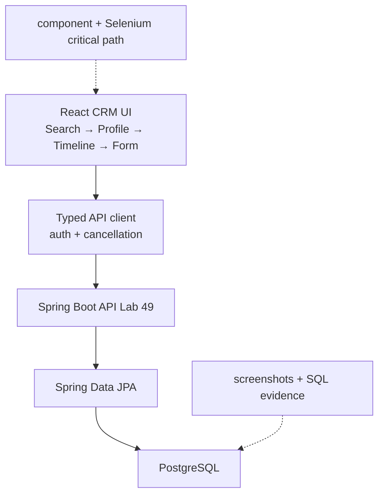
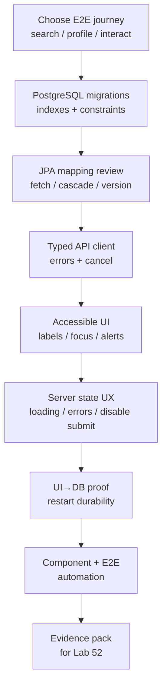

# Lab 50: Capstone Frontend and Persistence — Northstar CRM UI→PostgreSQL Journey

**Module:** 50 — Capstone Frontend and Persistence  
**Lab folder:** `labs/Week 6 - Capstone Project/module-50/lab50/`  
**Difficulty:** Advanced Capstone  
**Duration:** 6–8 Hours

**Primary IDE:** IntelliJ IDEA Community Edition · **Optional IDE:** VS Code

| OS | How-to for this lab |
| -- | ------------------- |
| Windows | [LAB-50-WINDOWS.md](LAB-50-WINDOWS.md) |
| macOS | [LAB-50-MACOS.md](LAB-50-MACOS.md) |

> **Environment reminder:** Finish Labs 0 and 49. Use **IntelliJ IDEA Community** (primary; optional VS Code) with **JDK 21**, **Maven 3.9+**, **Node.js 22+**, and instructor **shared PostgreSQL**. Work under the capstone tree.

---

## How to follow this lab

1. Open the **Windows** or **macOS** how-to (links above) in a second tab.
2. Create/work only under your `java-bootcamp/examples/…` folder from the steps (not inside this `labs/` git clone unless a step says otherwise).
3. For each **Step N**: read **Why** (if present) → do the actions → confirm **Expected** / **Expected result** → then continue.
4. When stuck, use **Failure Experiments** / troubleshooting in this guide before asking for help.
5. Capture evidence under `notes/screenshots/` (redact secrets). Use the **Pass criteria** tables — write **Pass** or **Fail** in your notes. GitHub file view does not support clickable checkboxes.

## Lab Overview

This Module 50 lab completes a usable **React CRM journey** backed by **Spring Data JPA and PostgreSQL**, proving validation, persistence, loading/error states, accessibility, and end-to-end UI→database flow for the same fixtures Labs 48–49 planned and implemented.

**Purpose.** The backend vertical slice exists, but agents still need an accessible search, profile, timeline, and interaction form with durable PostgreSQL storage. A UI that “looks done” without DB proof or a11y basics fails the capstone.

**What you build (exercise).** Choose the end-to-end journey; complete PostgreSQL schema migrations; review JPA mappings; create a typed API client; build accessible forms; handle loading/empty/error/unauthorized states; verify UI→API→DB durability; automate component tests and one Selenium (or agreed E2E) critical path.

**What success looks like.** Under the capstone frontend+backend, an agent can search Amina (`CUS-1001`), open profile/timeline, record an interaction with `lab-request-001`, see it on the timeline, and prove the row in PostgreSQL after restart. Lint/test/build and backend verify are green; a11y basics pass keyboard review.

**Depends on Labs 48–49.** Need CAP story acceptance, DTO/API shapes, and working create-interaction endpoint. Finish Lab 49 if contracts or persistence are missing.

**CRM connection.** Fixtures `CUS-1001` Amina / `CUS-1002` Ravi / `CUS-9999` not-found / correlation `lab-request-001`. Lab 51 secures and deploys; keep client typed against Lab 49 DTOs—do not invent parallel payload shapes.

---

## Learning Objectives

After completing this lab, you will be able to:

* Build typed React service calls against Lab 49 contracts
* Implement accessible forms (labels, focus, alerts)
* Complete JPA and PostgreSQL mappings with owned relationships
* Create repeatable versioned migrations
* Handle loading, empty, success, invalid, unauthorized, and outage states
* Verify UI-to-database flow with restart durability
* Automate component tests and one critical-path E2E journey
* Keep synthetic fixtures stable across UI and SQL evidence
* Prevent duplicate submits and stale response races
* Document reproduction for Lab 52 demo operators

---

## Business Scenario

Agents must complete the customer-facing workflow for Amina and Ravi. Leadership freezes:

**No Lab 50 pass without UI proof, PostgreSQL row proof, accessibility basics, and at least one automated UI/component check on the critical path.**

You own the frontend+persistence gate for search → profile → timeline → create interaction.

Use these fixtures consistently:

| ID | Name | Notes |
| -- | ---- | ----- |
| `CUS-1001` | Amina Khan | `ACTIVE` — primary UI demo customer |
| `CUS-1002` | Ravi Singh | search alternate / status journey |
| `CUS-9999` | — | not-found empty state |
| `lab-request-001` | — | correlation header from UI client |
| `amina.khan@example.test` | — | fictional email only |

**Security note for evidence.** Never screenshot real tokens. Mask Authorization headers in notes. Do not enter payment data in summary fields.

---

## Architecture Context

### NOW (this lab)



### Lab flow (mermaid)



### Architecture NOW vs LATER

| Aspect | Lab 50 (NOW) | Lab 51 / 52 (LATER) |
| ------ | ------------ | ------------------- |
| Security UX | Show 401/403 states | Harden JWT server + scanners |
| Data plane | Prove PostgreSQL durability | Deploy with secrets/config |
| Proof | UI + SQL (+ tests) | Pipeline smoke + defense narrative |
| A11y | Labels, keyboard, alerts | Optional automated axe scan (bonus) |

**Lab focus:** React journey, JPA/PostgreSQL correctness, accessibility, UI→DB evidence, critical-path automation.

---

## Prerequisites

Complete [SETUP](../../../SETUP-INSTRUCTIONS.md), [Lab 0](../../../Week%201%20-%20Java%20and%20JVM%20Foundations/module-00/lab0/LAB-0-GUIDE.md), [Lab 48](../../module-48/lab48/LAB-48-GUIDE.md), and [Lab 49](../../module-49/lab49/LAB-49-GUIDE.md). Confirm:

* Node 22 + npm (React frontend)
* PostgreSQL reachable **or** instructor-approved local stand-in with honesty note
* Spring Data JPA backend from Lab 49
* Selenium or agreed E2E approach
* No secrets committed to Git

### Pre-flight

```bash
java -version
mvn -version
node --version
npm --version
git --version
pwd
ls ~/java-bootcamp/examples/customer-management-platform
```

Branch and baseline:

```bash
cd ~/java-bootcamp/examples/customer-management-platform
git switch -c lab/50-crm 2>/dev/null || git checkout -b lab/50-crm
./mvnw -B clean verify 2>/dev/null || mvn -B clean verify
cd frontend && npm ci && npm test -- --run && cd ..
git status --short
```

If baseline fails, record command/error; do not hide inherited failure.

---

## Suggested Project Files

```text
~/java-bootcamp/examples/customer-management-platform/
├── backend/
│   ├── src/main/resources/db/migration/
│   │   └── V...__customer_interaction.sql
│   └── src/main/java/com/northstar/crm/domain/
├── frontend/
│   ├── src/
│   │   ├── api/client.ts
│   │   ├── api/interactions.ts
│   │   ├── api/customers.ts
│   │   ├── components/CustomerSearch.tsx
│   │   ├── components/CustomerProfile.tsx
│   │   ├── components/InteractionTimeline.tsx
│   │   ├── components/InteractionForm.tsx
│   │   └── App.tsx
│   ├── tests/ or src/**/*.test.tsx
│   └── e2e/interaction-journey.spec.ts   # Selenium/Playwright as agreed
├── docs/
│   ├── frontend-persistence-demo.md
│   ├── notes/screenshots/
│   └── backlog.md
├── .gitignore
└── README.md
```

Ignore `node_modules/`, `dist/`, `target/`, IDE metadata, tokens, and passwords. Instructor may allow `lab50-crm/` parallel tree—keep contracts identical.

---

## Concepts to Discuss

Write 2–3 sentences each in `docs/frontend-persistence-demo.md`:

1. Main flow under UI test (search Amina → record interaction)
2. Trust boundary: browser validation vs API enforcement
3. Success/failure contracts shown to the agent (toast vs `role="alert"`)
4. Stable fixtures vs ephemeral typed IDs without seed data
5. Idempotency of submit button disable / single in-flight request
6. Why optimistic locking matters when two agents edit timeline-related data
7. Evidence leads need (screenshot + SQL + test log)
8. Two machines: same Node/Java versions, same seed customers
9. False-confidence UI (always shows success) vs honest outage state
10. What Lab 51 changes (auth headers/token lifecycle) without renaming fixtures

---

## Implementation Steps

Parts 1–8 map to Steps 1–8; Step 9 closes evidence. Work from repo root unless noted.

---

### Step 1 — Choose end-to-end journey (Part 1)

**Why:** Without a frozen journey, UI work scatters into disconnected widgets.

**Do this:** In `docs/frontend-persistence-demo.md`, select:

* Customer search (Amina / Ravi)
* Profile header + interaction timeline
* Create interaction form posting to Lab 49 API
* UI states and API calls table
* Tables/constraints/demo data required in PostgreSQL

Include correlation: client sends `X-Correlation-ID: lab-request-001` on writes.

**Expected result:** Journey storyboard + API call list committed before major UI coding.

**If it fails:** Journey depends on unimplemented Lab 49 endpoint → finish Lab 49 first.

---

### Step 2 — Complete PostgreSQL schema (Part 2)

**Why:** Hand-edited production tables are not reproducible for Lab 52.

**Do this:** Versioned migrations with PostgreSQL-compatible types and named constraints/indexes for demonstrated queries (`customer_id`, `created_at`).

```sql
CREATE TABLE customer_interaction (
  interaction_id RAW(16) NOT NULL,
  customer_id RAW(16) NOT NULL,
  channel VARCHAR(20) NOT NULL,
  summary VARCHAR(1000) NOT NULL,
  created_at TIMESTAMP(6) WITH TIME ZONE NOT NULL,
  version INTEGER DEFAULT 0 NOT NULL,
  CONSTRAINT pk_customer_interaction PRIMARY KEY (interaction_id),
  CONSTRAINT fk_interaction_customer FOREIGN KEY (customer_id) REFERENCES customer(customer_id),
  CONSTRAINT ck_interaction_channel CHECK (channel IN ('PHONE','EMAIL','CHAT'))
);
CREATE INDEX ix_interaction_customer_time ON customer_interaction(customer_id, created_at);
```

Adapt types if your schema already uses UUID/VARCHAR strategies—document the adaptation.

**Expected result:** Migration applies cleanly on training PostgreSQL (or documented profile).

**If it fails:** RAW vs UUID mismatch → align JPA `@Type` / converter with Lab 49. Missing customer table → seed migration for fixtures.

---

### Step 3 — Review JPA mapping (Part 3)

**Why:** Wrong cascade/fetch creates N+1 and accidental deletes under agent load.

**Do this:** Define relationship ownership, fetch strategy (prefer lazy + explicit timeline query), cascade/orphan rules, and `@Version` where concurrent edits matter. Confirm entity fields map to migration columns.

Run a repository test loading Amina’s interactions.

**Expected result:** Mapping notes in demo.md; no unexpected cascade delete of customer.

**If it fails:** `LazyInitializationException` in API → fix transactional boundaries / DTO mapping in service (not Open Session in View as a silent default without ADR).

---

### Step 4 — Create typed API client (Part 4)

**Why:** Ad-hoc `fetch` copy-paste drifts from Lab 49 and breaks at integration time.

**Do this:** Centralize base URL and auth headers. Type requests/responses/errors. Support cancellation or stale-response protection.

```typescript
export interface CreateInteraction { channel: string; summary: string }
export interface Interaction {
  id: string; channel: string; summary: string; createdAt: string
}
export async function createInteraction(
  customerId: string,
  body: CreateInteraction,
  signal?: AbortSignal
): Promise<Interaction> {
  const response = await fetch(`${apiBase}/api/customers/${customerId}/interactions`, {
    method: "POST",
    headers: {
      "Content-Type": "application/json",
      "X-Correlation-ID": "lab-request-001",
      ...authHeaders()
    },
    body: JSON.stringify(body),
    signal
  });
  if (!response.ok) throw await toApiError(response);
  return response.json();
}
```

**Expected result:** One client module; components do not hardcode URLs.

**If it fails:** Token in source → move to env injected at runtime; never commit. CORS errors → coordinate allowed origins with backend config.

---

### Step 5 — Build accessible UI (Part 5)

**Why:** Capstone NFRs include accessibility; color-only errors fail keyboard users and Lab 52 probes.

**Do this:** Associate labels and controls; keyboard tab order; focus management after submit; expose validation/status via `role="alert"` / `aria-describedby`.

```tsx
<label htmlFor="summary">Interaction summary</label>
<textarea
  id="summary"
  name="summary"
  required
  maxLength={1000}
  aria-describedby="summary-help summary-error"
/>
<p id="summary-help">Do not enter payment details or passwords.</p>
{error && <p id="summary-error" role="alert">{error}</p>}
<button type="submit" disabled={submitting}>
  {submitting ? "Saving…" : "Save interaction"}
</button>
```

Build search, profile, timeline, and form wired to the typed client for `CUS-1001`. Also verify Ravi (`CUS-1002`) appears in search results. Prefer semantic landmarks (`main`, `nav`) over div soup.

Keyboard checklist (record in demo doc):

1. Tab from search box through results into profile actions
2. Enter submits search; Enter/Space activates buttons
3. After save, focus moves to a sensible success region or first timeline item
4. Errors are reachable by assistive tech (not icon-only)

**Expected result:** Full journey usable by keyboard; labels present; errors announced.

**If it fails:** Click-only widgets → add button semantics. Placeholder-as-label → real `<label>`. Modal traps focus forever → provide Escape + return focus.

---

### Step 6 — Handle server state (Part 6)

**Why:** Happy-path-only UIs lie during outages and invalidate demo trust.

**Do this:** Implement loading, empty, success, invalid (400), unauthorized (401/403), and outage (5xx/network) states. Prevent duplicate submits. Refresh timeline after successful write.

Test with backend stopped once (safe local) to capture outage UI evidence. Map Problem Details `detail`/`fieldErrors` into form alerts when present.

State matrix (copy into demo.md):

| State | Trigger | UI behavior |
| ----- | ------- | ----------- |
| Loading | In-flight GET/POST | Spinner/skeleton; disable submit |
| Empty | No interactions | Explicit empty message |
| Success | 201 | Timeline refresh; brief confirmation |
| Invalid | 400 | `role="alert"` field errors |
| Unauthorized | 401/403 | Sign-in/access message |
| Outage | network/5xx | Retry guidance; no fake success |

**Expected result:** Each state visible/recordable; submit disabled while in flight.

**If it fails:** Double posts create two rows → disable button + ignore stale responses. Success toast on 400 → check `response.ok` before optimistic UI.

---

### Step 7 — Verify persistence (Part 7)

**Why:** UI toast without PostgreSQL row is not persistence.

**Do this:**

1. Create interaction through UI for Amina
2. Retrieve via API GET timeline
3. Inspect approved DB evidence (`SELECT` by customer id)
4. Restart API (and UI if needed); confirm durability
5. Submit invalid request; confirm rollback (no row)

Record SQL excerpt (sanitized) and screenshot in `docs/notes/screenshots/`.

**Expected result:** UI↔API↔DB consistent for `CUS-1001`; invalid path leaves DB unchanged.

**If it fails:** Row missing after restart → transaction not committed / wrong datasource. UI shows success on 400 → fix error handling.

---

### Step 8 — Automate critical path (Part 8)

**Why:** Manual-only UIs regress before Lab 52 rehearsal.

**Do this:** Component tests for form validation and timeline rendering. One Selenium/Playwright (as agreed) journey: search Amina → save interaction → assert timeline text. Use stable accessible selectors (`getByLabel`, roles). Isolate test data; screenshots on failure only.

```bash
cd ~/java-bootcamp/examples/customer-management-platform/frontend
npm ci
npm run lint
npm test -- --run
npm run build
# e2e as configured, e.g.:
# npm run test:e2e
cd ..
./mvnw -B clean verify 2>/dev/null || mvn -B clean verify
```

**Expected result:** Lint/unit/build green; E2E critical path green or documented instructor substitute with component coverage.

**If it fails:** Brittle CSS selectors → switch to roles/labels. E2E env flaky → seed fixtures in setup.

---

### Step 9 — Failure experiments + evidence pack

**Why:** Panel will ask what happens when PostgreSQL or API fails.

**Do this:** Complete [Failure Experiments](#failure-experiments). Finish `docs/frontend-persistence-demo.md` with commands, seed data, and proof links. Run UI test suite twice for determinism where feasible.

**Expected result:** ≥3 experiments; peer can reproduce UI→DB proof; no secrets committed.

**If it fails:** See Troubleshooting.

---

## Implementation Checkpoints

### Checkpoint A — Journey and schema

_Mark each row **Pass** or **Fail** in your lab notes (GitHub markdown files are not interactive checklists)._

| # | Confirm | Your notes |
| - | ------- | ---------- |
| 1 | Journey documented (search/profile/timeline/form) | Pass / Fail |
| 2 | PostgreSQL migration with constraints/indexes | Pass / Fail |
| 3 | Fixtures `CUS-1001` / `CUS-1002` / `lab-request-001` named | Pass / Fail |

### Checkpoint B — Client and UI

_Mark each row **Pass** or **Fail** in your lab notes (GitHub markdown files are not interactive checklists)._

| # | Confirm | Your notes |
| - | ------- | ---------- |
| 1 | Typed API client with correlation header | Pass / Fail |
| 2 | Accessible form/search/profile/timeline | Pass / Fail |
| 3 | Loading/error/unauthorized/outage states | Pass / Fail |

### Checkpoint C — Persistence proof + tests

_Mark each row **Pass** or **Fail** in your lab notes (GitHub markdown files are not interactive checklists)._

| # | Confirm | Your notes |
| - | ------- | ---------- |
| 1 | UI create → API read → SQL evidence | Pass / Fail |
| 2 | Restart durability confirmed | Pass / Fail |
| 3 | Component tests + critical-path E2E (or approved substitute) | Pass / Fail |

### Checkpoint D — Hygiene

_Mark each row **Pass** or **Fail** in your lab notes (GitHub markdown files are not interactive checklists)._

| # | Confirm | Your notes |
| - | ------- | ---------- |
| 1 | Frontend build + backend verify green | Pass / Fail |
| 2 | Demo doc complete | Pass / Fail |
| 3 | No secrets / `node_modules` / `target` committed | Pass / Fail |

---

## Reference Commands, Configuration, and Code

### Typed client excerpt

```typescript
headers: {
  "Content-Type": "application/json",
  "X-Correlation-ID": "lab-request-001",
  ...authHeaders()
}
```

### Frontend and backend checks

```bash
npm ci
npm run lint
npm test -- --run
npm run build
./mvnw -B clean verify
```

### Commands

```bash
cd ~/java-bootcamp/examples/customer-management-platform
cd frontend && npm ci && npm run build && cd ..
# seed/verify PostgreSQL per instructor runbook
git status --short
```

### Surface map

| Surface | Role |
| ------- | ---- |
| `InteractionForm` | Accessible write path |
| `InteractionTimeline` | Read model after write |
| `api/interactions.ts` | Typed contract adapter |
| Flyway/Liquibase SQL | Schema truth |
| `frontend-persistence-demo.md` | UI→DB reproduction |

### `frontend-persistence-demo.md` outline (minimum)

```markdown
# Frontend + persistence demo — Lab 50
## Tool versions (Node, npm, JDK)
## Seed data (CUS-1001 / CUS-1002)
## UI happy path steps
## SQL proof query
## Restart durability steps
## Invalid + outage evidence
## a11y keyboard checklist
## Test commands (npm / mvn)
## Contract notes vs Lab 49 DTOs
```

### Example SQL proof (adapt schema)

```sql
SELECT interaction_id, channel, created_at
FROM customer_interaction
WHERE customer_id = :aminaId
ORDER BY created_at DESC;
```

Never paste connection passwords beside the query in evidence files.

---

## Manual Verification

1. Search finds Amina (`CUS-1001`) and Ravi (`CUS-1002`).
2. Profile shows status and timeline region.
3. Valid interaction appears on timeline within NFR window.
4. Invalid summary/channel shows accessible error; no DB row.
5. Unauthorized state visible when token removed (local test).
6. Outage state visible when API stopped.
7. SQL confirms row; survives restart.
8. Correlation header sent as `lab-request-001`.
9. Component/E2E automation covers critical path.
10. No sensitive values in screenshots or Git.
11. Keyboard-only path completes create interaction.
12. Lab 49 DTO field names match TypeScript interfaces.

---

## Failure Experiments

| # | Experiment | Observe | Restore |
| - | ---------- | ------- | ------- |
| 1 | Submit empty summary | Alert + no row | Keep validation |
| 2 | Stop API during save | Outage state; no false success | Restart API |
| 3 | Double-click submit | Only one row | Keep disable/guard |
| 4 | Search `CUS-9999` | Empty/not-found UX | Keep fixtures |
| 5 | Restart after success | Timeline still populated | Keep durability |
| 6 | Remove auth header | Unauthorized UX | Restore token wiring |
| 7 | Break label association | a11y checklist fails | Restore `htmlFor` |

---

## Troubleshooting

| Symptom | Likely cause | Fix |
| ------- | ------------ | --- |
| CORS errors | Origin not allowed | Align Spring CORS with UI origin |
| 401 in UI | Token missing/expired | Wire auth headers; Lab 51 hardens |
| UI success / no SQL | Wrong env DB | Check datasource URL/profile |
| Migration fail on PostgreSQL | Non-PostgreSQL types | Rewrite migration |
| Flaky E2E | Timing/selectors | Await network idle; role selectors |
| A11y fail on label | Missing `htmlFor` | Associate labels |
| Stale timeline | No refetch | Invalidate/refetch after POST |
| Type mismatch | DTO drift vs Lab 49 | Reconcile OpenAPI/DTO |
| Hydration mismatch | SSR/data race | Prefer client fetch patterns used in course |
| PostgreSQL timezone skew | TZ mapping | Align TIMESTAMPTZ + Instant |
| Empty search always | Seed missing | Re-run fixture seed for Amina/Ravi |

---

## Security and Production Review

Answer in `docs/frontend-persistence-demo.md`:

1. Which inputs are untrusted (form fields, query strings)?
2. Where are authn/authz/validation enforced (UI hints vs API)?
3. Which values are sensitive—never in browser logs or screenshots?
4. What can be retried safely (idempotent GET; POST needs guard)?
5. What happens after partial failure (error state; no fake toast)?
6. What would an operator monitor (UI error rates, DB slow queries)?
7. Which local default is unacceptable (API keys in frontend bundle)?
8. How are UI types versioned with backend DTO changes?

---

## Cleanup

```bash
cd ~/java-bootcamp/examples/customer-management-platform/frontend
# stop dev servers
npm run build >/dev/null 2>&1 || true
cd ..
./mvnw -q clean 2>/dev/null || true
git status --short
```

Remove temporary plaintext env files. Keep sanitized screenshots and demo.md.

**Keep Lab 50 UI + migrations**—Lab 51 deploys them; Lab 52 demos them.

---

## Expected Deliverables

* React components for search, profile, timeline, interaction form
* Typed API client
* JPA mapping changes as required
* PostgreSQL migration scripts
* Component and UI/E2E tests
* Baseline and final validation results
* One controlled failure-path result (invalid input or outage)
* Concise setup and reproduction guide (`docs/frontend-persistence-demo.md`)
* Peer-review notes and resolved comments
* Known limitations, residual risks, owners, and next actions

Exclude real `.env` files, access tokens, database exports, private keys, kubeconfig, Terraform state, and sensitive screenshots.

---

## Evaluation Rubric (100 Marks)

| Criteria | Marks |
| -------- | ----: |
| Environment and project structure | 10 |
| Core implementation (React journey + JPA/PostgreSQL) | 30 |
| Integration/configuration correctness (client ↔ API ↔ DB) | 15 |
| Failure handling (UI states + invalid rollback) | 15 |
| Automated verification | 10 |
| Security and production awareness / a11y | 10 |
| Documentation and evidence | 10 |

**Notes:** Pretty UI without SQL proof → incomplete core marks. Missing labels/keyboard support → lose a11y/security marks. DTO drift from Lab 49 → integration deduction.

---

## Reflection Questions

Write 3–6 sentence answers:

1. Which design decision most affected correctness (fetch strategy, client types, form state)?
2. Which failure was hardest to diagnose (CORS, JPA, E2E flake)?
3. What evidence proves UI→DB works?
4. What breaks first at ten times agent concurrency?
5. Which concern should move to shared CI (E2E, a11y scan)?
6. What must change before real customer data appears in UI screenshots?
7. How does this lab connect to Labs 48–49 and 51–52?
8. What metric matters most on the UI quality dashboard?
9. (Forward look) Which auth UX will Lab 51 force you to revisit?

---

## Bonus Challenges

1. Add optimistic-lock conflict UI when `@Version` conflicts.
2. Run an automated accessibility scan (axe) and remediate top issues.
3. Add pagination to the interaction timeline.
4. Surface PostgreSQL constraint errors as field-level Problem Details in UI.
5. Add a Selenium outage-state assertion.
6. Record a 60-second silent UI→SQL proof video for Lab 52 fallback.

---

## Success Criteria

You are finished when:

* Accessible React journey covers search/profile/interact for Amina
* PostgreSQL persistence is proven with restart durability
* Invalid and outage paths are honest in the UI
* Automated checks cover components/critical path
* Another student can follow your demo doc
* Lab 49 contracts remained stable
* No production secret is hard-coded

---

## Instructor Notes

* **Live probe:** Watch search for `CUS-1001`, create interaction, then show SQL. Keyboard-only pass on the form. Ask where correlation is set. Ask what the UI does when the API returns 400 vs when the API is down.
* **Assess:** A11y basics, UI→DB evidence, state handling, DTO alignment with Lab 49, automation, restart durability.
* **Continuity:** Prefer `customer-management-platform/{frontend,backend}`. Keep fixtures. Do not accept a mock-only UI without persistence proof unless instructor grants a documented exception.
* **Common pitfalls:** Placeholder labels; double submit; CORS hacks with `*`; screenshots with JWTs; E2E coupled to CSS classes; silent Open Session in View; TypeScript types drifting from Lab 49 records.
* **Timing:** 6–8 hours. PostgreSQL access issues often burn 45 minutes—verify connectivity in pre-flight. If E2E environment is unavailable, require stronger component tests + recorded manual critical path with SQL proof.
* **Parity check:** Confirm Lab 49 `Location`/`InteractionResponse` fields match the typed client before students invent parallel DTOs.
* **Quality bar:** SQL proof + keyboard checklist + at least one automated UI/component test.

---

### Quick peer reproduction card (attach to PR)

```markdown
Peer name:
npm build/test result:
Keyboard form complete? Y/N
UI create → SQL row for CUS-1001? Y/N
Invalid path leaves DB unchanged? Y/N
lab-request-001 sent from client? Y/N
Secrets absent from screenshots? Y/N
```

Paste sanitized results into `docs/frontend-persistence-demo.md`.

---

*End of Lab 50 — Capstone Frontend and Persistence: Northstar CRM UI→PostgreSQL Journey. Keep frontend and migrations for Labs 51–52 and portfolio evidence.*
