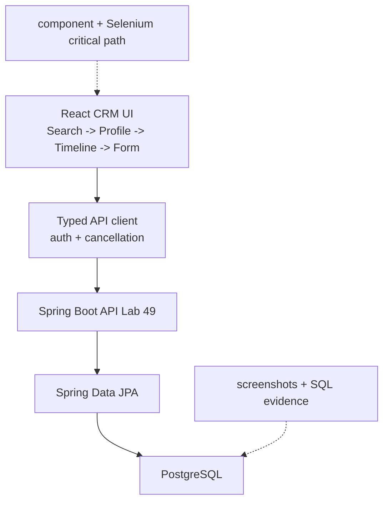

# Lab 50: Capstone Frontend and Persistence — Northstar CRM UI→PostgreSQL Journey

**Module:** 50 — Capstone Frontend and Persistence  
**Duration:** ~45 minutes (timed path / session block with starter) · Full path: 6–8 Hours

**Primary IDE:** IntelliJ IDEA Community Edition · **Optional IDE:** VS Code

| OS | How-to for this lab |
| -- | ------------------- |
| Windows | [LAB-50-WINDOWS.md](LAB-50-WINDOWS.md) |
| macOS | [LAB-50-MACOS.md](LAB-50-MACOS.md) |

---

## Activity card

| | |
| --- | --- |
| **Time** | ~45 min session block · full path 6–8 h multi-day |
| **Checkpoint** | **E** (after Ex 1→4→2→3→5→6) |
| **Must prove** | Data/API checklist · SQL/Flyway TODOs · journey fixtures · durability SELECT draft |
| **Hard gate** | Pre-lab Pass · Lab 49 contract known |

### What you will learn

Connect an accessible React agent journey to PostgreSQL with typed API calls and durable proof.

### Enterprise context

Pretty UI without DB restart proof or a11y basics fails the capstone.

### Predict

UI shows success but SQL has no row — first three checks?

### Debug

TypeScript types disagree with Lab 49 DTOs — what do you reconcile?

---

## 45-minute timed path (session block — use starter)

> **Starter note:** Timed path = SQL migration + `docs/data-api-checklist.md` only. There is **no** `frontend/` in the starter. Gate `npm` / React under the **full path** (homework / multi-day). Solution adds `frontend/` for the full deliverable.

## 45-minute timed path details

> **Pacing reminder:** [PACING.md](../PACING.md) checkpoint **E**. Homework/multi-day: React, a11y, E2E, restart durability, `docs/frontend-persistence-demo.md`.

In class, use the starter data/API + Flyway stubs so the **session block** fits **~45 minutes**. React UI, a11y, E2E, and restart durability remain **multi-day** on the full path.

1. Open [`starter/README.md`](starter/README.md).
2. Copy `starter/` into `java-bootcamp/examples/customer-management-platform/` (see starter README).
3. Fill the data/API checklist and SQL/Flyway TODOs — align with Lab 49 contracts.
4. Run the starter smoke check; evidence under `notes/screenshots/lab-50/`.
5. Mark timed-path Pass criteria in the starter README. Continue remaining GUIDE steps as homework / multi-day work.

| Path | Time | Scope |
| ---- | ---- | ----- |
| **Timed / session block** | ~45 min | Starter TODOs + smoke check |
| **Full (multi-day)** | 6–8 Hours | Every Step in this GUIDE |

Policy: [`labs/_STARTER-PATH.md`](../../../_STARTER-PATH.md)

---

## What you'll submit (read this first)

Keep this checklist visible while you work.

| # | Deliverable |
| - | ----------- |
| 1 | React components for search, profile, timeline, interaction form |
| 2 | Typed API client |
| 3 | JPA mapping changes as required |
| 4 | PostgreSQL migration scripts |
| 5 | Component and UI/E2E tests |
| 6 | Baseline and final validation results |
| 7 | One controlled failure-path result (invalid input or outage) |
| 8 | Concise setup and reproduction guide (`docs/frontend-persistence-demo.md`) |

**Must submit:** the items in the table above (sources + evidence + short notes).

**Do not submit:** `target/`, `node_modules/`, secrets, heap dumps, or a verbatim instructor `solution/`.

## Lab Overview

This Module 50 lab completes a usable **React CRM journey** backed by **Spring Data JPA and PostgreSQL**, proving validation, persistence, loading/error states, accessibility, and end-to-end UI→database flow for the same fixtures Labs 48–49 planned and implemented.

## Learning Objectives

After completing this lab, you will be able to:

* Build typed React service calls against Lab 49 contracts
* Implement accessible forms (labels, focus, alerts)
* Complete JPA and PostgreSQL mappings with owned relationships
* Create repeatable versioned migrations
* Handle loading, empty, success, invalid, unauthorized, and outage states

## Business Scenario

Agents must complete the customer-facing workflow for Amina and Ravi. Leadership freezes:

**No Lab 50 pass without UI proof, PostgreSQL row proof, accessibility basics, and at least one automated UI/component check on the critical path.**

You own the frontend+persistence gate for search → profile → timeline → create interaction.

Use these fixtures consistently:

| ID | Name | Notes |
| -- | ---- | ----- |
| `CUS-1001` | Amina Khan | `ACTIVE` — primary UI demo customer |
| `CUS-1002` | Ravi Singh | search alternate / status journey |
| `CUS-9999` | — | not-found empty state |
| `lab-request-001` | — | correlation header from UI client |
| `amina.khan@example.test` | — | fictional email only |

**Security note for evidence.** Never screenshot real tokens. Mask Authorization headers in notes. Do not enter payment data in summary fields.

---

## Architecture Context
### NOW (this lab)


```mermaid
flowchart TB
  UI["React CRM UI<br/>Search -> Profile -> Timeline -> Form"] --> Client["Typed API client<br/>auth + cancellation"]
  Client --> API["Spring Boot API Lab 49"]
  API --> JPA["Spring Data JPA"]
  JPA --> PG["PostgreSQL"]
  E2E["component + Selenium critical path"] -.-> UI
  Ev["screenshots + SQL evidence"] -.-> PG
```

## Prerequisites

Prior labs: [Lab 48](../../module-48/lab48/LAB-48-GUIDE.md) · [Lab 49](../../module-49/lab49/LAB-49-GUIDE.md).

Confirm (Lab 0 tools assumed):

* Node 22 + npm (React frontend)
* PostgreSQL reachable **or** instructor-approved local stand-in with honesty note
* Spring Data JPA backend from Lab 49
* Selenium or agreed E2E approach
* No secrets committed to Git

### Pre-flight

```bash
java -version
mvn -version
```

## Worked example (read before you code)

Study this pattern once before Step 1. Your job is to apply the same idea in the Steps — do not skip ahead to a full solution.

```bash
# FULL PATH only (starter has no frontend/ — skip on timed path):
cd ~/java-bootcamp/examples/customer-management-platform/frontend
npm ci
npm run lint
npm test -- --run
npm run build
# e2e as configured, e.g.:
# npm run test:e2e
cd ..
./mvnw -B clean verify 2>/dev/null || mvn -B clean verify
```

**What to notice:** Match names, IDs, and failure behavior from the scenario — instructors check these.

---

## Implementation Steps

Parts 1–8 map to Steps 1–8; Step 9 closes evidence. Work from repo root unless noted.

---

### Step 1 — Choose end-to-end journey (Part 1)

**Why:** Without a frozen journey, UI work scatters into disconnected widgets.

**Do this:** In `docs/frontend-persistence-demo.md`, select:

* Customer search (Amina / Ravi)
* Profile header + interaction timeline
* Create interaction form posting to Lab 49 API
* UI states and API calls table
* Tables/constraints/demo data required in PostgreSQL

Include correlation: client sends `X-Correlation-ID: lab-request-001` on writes.

**Expected result:** Journey storyboard + API call list committed before major UI coding.

**If it fails:** Journey depends on unimplemented Lab 49 endpoint → finish Lab 49 first.

---

### Step 2 — Complete PostgreSQL schema (Part 2)

**Why:** Hand-edited production tables are not reproducible for Lab 52.

**Do this:** Versioned migrations with PostgreSQL-compatible types and named constraints/indexes for demonstrated queries (`customer_id`, `created_at`).

```sql
CREATE TABLE customer_interaction (
  interaction_id RAW(16) NOT NULL,
  customer_id RAW(16) NOT NULL,
  channel VARCHAR(20) NOT NULL,
  summary VARCHAR(1000) NOT NULL,
  created_at TIMESTAMP(6) WITH TIME ZONE NOT NULL,
  version INTEGER DEFAULT 0 NOT NULL,
  CONSTRAINT pk_customer_interaction PRIMARY KEY (interaction_id),
  CONSTRAINT fk_interaction_customer FOREIGN KEY (customer_id) REFERENCES customer(customer_id),
  CONSTRAINT ck_interaction_channel CHECK (channel IN ('PHONE','EMAIL','CHAT'))
);
CREATE INDEX ix_interaction_customer_time ON customer_interaction(customer_id, created_at);
```

Adapt types if your schema already uses UUID/VARCHAR strategies—document the adaptation.

**Expected result:** Migration applies cleanly on training PostgreSQL (or documented profile).

**If it fails:** RAW vs UUID mismatch → align JPA `@Type` / converter with Lab 49. Missing customer table → seed migration for fixtures.

---

### Step 3 — Review JPA mapping (Part 3)

**Why:** Wrong cascade/fetch creates N+1 and accidental deletes under agent load.

**Do this:** Define relationship ownership, fetch strategy (prefer lazy + explicit timeline query), cascade/orphan rules, and `@Version` where concurrent edits matter. Confirm entity fields map to migration columns.

Run a repository test loading Amina’s interactions.

**Expected result:** Mapping notes in demo.md; no unexpected cascade delete of customer.

**If it fails:** `LazyInitializationException` in API → fix transactional boundaries / DTO mapping in service (not Open Session in View as a silent default without ADR).

---

### Step 4 — Create typed API client (Part 4)

**Why:** Ad-hoc `fetch` copy-paste drifts from Lab 49 and breaks at integration time.

**Do this:** Centralize base URL and auth headers. Type requests/responses/errors. Support cancellation or stale-response protection.

```typescript
export interface CreateInteraction { channel: string; summary: string }
export interface Interaction {
  id: string; channel: string; summary: string; createdAt: string
}
export async function createInteraction(
  customerId: string,
  body: CreateInteraction,
  signal?: AbortSignal
): Promise<Interaction> {
  const response = await fetch(`${apiBase}/api/v1/interactions`, {
    method: "POST",
    headers: {
      "Content-Type": "application/json",
      "X-Correlation-ID": "lab-request-001",
      ...authHeaders()
    },
    body: JSON.stringify(body),
    signal
  });
  if (!response.ok) throw await toApiError(response);
  return response.json();
}
```

**Expected result:** One client module; components do not hardcode URLs.

**If it fails:** Token in source → move to env injected at runtime; never commit. CORS errors → coordinate allowed origins with backend config.

---

### Step 5 — Build accessible UI (Part 5)

**Why:** Capstone NFRs include accessibility; color-only errors fail keyboard users and Lab 52 probes.

**Do this:** Associate labels and controls; keyboard tab order; focus management after submit; expose validation/status via `role="alert"` / `aria-describedby`.

```tsx
<label htmlFor="summary">Interaction summary</label>
<textarea
  id="summary"
  name="summary"
  required
  maxLength={1000}
  aria-describedby="summary-help summary-error"
/>
<p id="summary-help">Do not enter payment details or passwords.</p>
{error && <p id="summary-error" role="alert">{error}</p>}
<button type="submit" disabled={submitting}>
  {submitting ? "Saving…" : "Save interaction"}
</button>
```

Build search, profile, timeline, and form wired to the typed client for `CUS-1001`. Also verify Ravi (`CUS-1002`) appears in search results. Prefer semantic landmarks (`main`, `nav`) over div soup.

Keyboard checklist (record in demo doc):

1. Tab from search box through results into profile actions
2. Enter submits search; Enter/Space activates buttons
3. After save, focus moves to a sensible success region or first timeline item
4. Errors are reachable by assistive tech (not icon-only)

**Expected result:** Full journey usable by keyboard; labels present; errors announced.

**If it fails:** Click-only widgets → add button semantics. Placeholder-as-label → real `<label>`. Modal traps focus forever → provide Escape + return focus.

---

### Step 6 — Handle server state (Part 6)

**Why:** Happy-path-only UIs lie during outages and invalidate demo trust.

**Do this:** Implement loading, empty, success, invalid (400), unauthorized (401/403), and outage (5xx/network) states. Prevent duplicate submits. Refresh timeline after successful write.

Test with backend stopped once (safe local) to capture outage UI evidence. Map Problem Details `detail`/`fieldErrors` into form alerts when present.

State matrix (copy into demo.md):

| State | Trigger | UI behavior |
| ----- | ------- | ----------- |
| Loading | In-flight GET/POST | Spinner/skeleton; disable submit |
| Empty | No interactions | Explicit empty message |
| Success | 201 | Timeline refresh; brief confirmation |
| Invalid | 400 | `role="alert"` field errors |
| Unauthorized | 401/403 | Sign-in/access message |
| Outage | network/5xx | Retry guidance; no fake success |

**Expected result:** Each state visible/recordable; submit disabled while in flight.

**If it fails:** Double posts create two rows → disable button + ignore stale responses. Success toast on 400 → check `response.ok` before optimistic UI.

---

### Step 7 — Verify persistence (Part 7)

**Why:** UI toast without PostgreSQL row is not persistence.

**Do this:**

1. Create interaction through UI for Amina
2. Retrieve via API GET timeline
3. Inspect approved DB evidence (`SELECT` by customer id)
4. Restart API (and UI if needed); confirm durability
5. Submit invalid request; confirm rollback (no row)

Record SQL excerpt (sanitized) and screenshot in `~/java-bootcamp/notes/screenshots/lab-50/`.

**Expected result:** UI↔API↔DB consistent for `CUS-1001`; invalid path leaves DB unchanged.

**If it fails:** Row missing after restart → transaction not committed / wrong datasource. UI shows success on 400 → fix error handling.

---

### Step 8 — Automate critical path (Part 8)

**Why:** Manual-only UIs regress before Lab 52 rehearsal.

**Do this:** Component tests for form validation and timeline rendering. One Selenium/Playwright (as agreed) journey: search Amina → save interaction → assert timeline text. Use stable accessible selectors (`getByLabel`, roles). Isolate test data; screenshots on failure only.

```bash
# FULL PATH only (starter has no frontend/ — skip on timed path):
cd ~/java-bootcamp/examples/customer-management-platform/frontend
npm ci
npm run lint
npm test -- --run
npm run build
# e2e as configured, e.g.:
# npm run test:e2e
cd ..
./mvnw -B clean verify 2>/dev/null || mvn -B clean verify
```

**Expected result:** Lint/unit/build green; E2E critical path green or documented instructor substitute with component coverage.

**If it fails:** Brittle CSS selectors → switch to roles/labels. E2E env flaky → seed fixtures in setup.

---

### Step 9 — Failure experiments + evidence pack

**Why:** Panel will ask what happens when PostgreSQL or API fails.

**Do this:** Complete Failure Experiments. Finish `docs/frontend-persistence-demo.md` with commands, seed data, and proof links. Run UI test suite twice for determinism where feasible.

**Expected result:** ≥3 experiments; peer can reproduce UI→DB proof; no secrets committed.

**If it fails:** See Troubleshooting.

---

## Implementation Checkpoints

### Checkpoint A — Journey and schema

_Mark **Pass** or **Fail** in your lab notes._

| # | Confirm | Your notes |
| - | ------- | ---------- |
| 1 | Journey documented (search/profile/timeline/form) | Pass / Fail |
| 2 | PostgreSQL migration with constraints/indexes | Pass / Fail |
| 3 | Fixtures `CUS-1001` / `CUS-1002` / `lab-request-001` named | Pass / Fail |

### Checkpoint B — Client and UI

_Mark **Pass** or **Fail** in your lab notes._

| # | Confirm | Your notes |
| - | ------- | ---------- |
| 1 | Typed API client with correlation header | Pass / Fail |
| 2 | Accessible form/search/profile/timeline | Pass / Fail |
| 3 | Loading/error/unauthorized/outage states | Pass / Fail |

### Checkpoint C — Persistence proof + tests

_Mark **Pass** or **Fail** in your lab notes._

| # | Confirm | Your notes |
| - | ------- | ---------- |
| 1 | UI create → API read → SQL evidence | Pass / Fail |
| 2 | Restart durability confirmed | Pass / Fail |
| 3 | Component tests + critical-path E2E (or approved substitute) | Pass / Fail |

### Checkpoint D — Hygiene

_Mark **Pass** or **Fail** in your lab notes._

| # | Confirm | Your notes |
| - | ------- | ---------- |
| 1 | Frontend build + backend verify green | Pass / Fail |
| 2 | Demo doc complete | Pass / Fail |
| 3 | No secrets / `node_modules` / `target` committed | Pass / Fail |

---

## Reference Commands, Configuration, and Code

### Frontend and backend checks

```bash
npm ci
npm run lint
npm test -- --run
npm run build
./mvnw -B clean verify
```

### Commands

```bash
cd ~/java-bootcamp/examples/customer-management-platform
cd frontend && npm ci && npm run build && cd ..
# seed/verify PostgreSQL per instructor runbook
git status --short
```

## Tool versions (Node, npm, JDK)
## Seed data (CUS-1001 / CUS-1002)
## UI happy path steps
## SQL proof query
## Restart durability steps
## Invalid + outage evidence
## a11y keyboard checklist
## Test commands (npm / mvn)
## Contract notes vs Lab 49 DTOs

```

### Example SQL proof (adapt schema)

```sql
SELECT interaction_id, channel, created_at
FROM customer_interaction
WHERE customer_id = :aminaId
ORDER BY created_at DESC;
```

Never paste connection passwords beside the query in evidence files.

---

## Failure Experiments

| # | Experiment | Observe | Restore |
| - | ---------- | ------- | ------- |
| 1 | Submit empty summary | Alert + no row | Keep validation |
| 2 | Stop API during save | Outage state; no false success | Restart API |
| 3 | Double-click submit | Only one row | Keep disable/guard |
| 4 | Search `CUS-9999` | Empty/not-found UX | Keep fixtures |
| 5 | Restart after success | Timeline still populated | Keep durability |
| 6 | Remove auth header | Unauthorized UX | Restore token wiring |
| 7 | Break label association | a11y checklist fails | Restore `htmlFor` |

---

## Troubleshooting

| Symptom | Likely cause | Fix |
| ------- | ------------ | --- |
| CORS errors | Origin not allowed | Align Spring CORS with UI origin |
| 401 in UI | Token missing/expired | Wire auth headers; Lab 51 hardens |
| UI success / no SQL | Wrong env DB | Check datasource URL/profile |
| Migration fail on PostgreSQL | Non-PostgreSQL types | Rewrite migration |
| Flaky E2E | Timing/selectors | Await network idle; role selectors |
| A11y fail on label | Missing `htmlFor` | Associate labels |
| Stale timeline | No refetch | Invalidate/refetch after POST |
| Type mismatch | DTO drift vs Lab 49 | Reconcile OpenAPI/DTO |

## Security and Production Review

Optional — jot brief notes in your README if useful for your progress check (not a separate essay):

1. Which inputs are untrusted (form fields, query strings)?
2. Where are authn/authz/validation enforced (UI hints vs API)?
3. Which values are sensitive—never in browser logs or screenshots?

---


## Cleanup

```bash
cd ~/java-bootcamp/examples/customer-management-platform/frontend
# stop dev servers
npm run build >/dev/null 2>&1 || true
cd ..
./mvnw -q clean 2>/dev/null || true
git status --short
```

Remove temporary plaintext env files. Keep sanitized screenshots and demo.md.

**Keep Lab 50 UI + migrations**—Lab 51 deploys them; Lab 52 demos them.


## Reflection Questions

Write **1–3 sentence** answers (not essays):

1. Which design decision most affected correctness (fetch strategy, client types, form state)?
2. What evidence proves UI→DB works?
3. Which failure was hardest to diagnose (CORS, JPA, E2E flake)?

---


