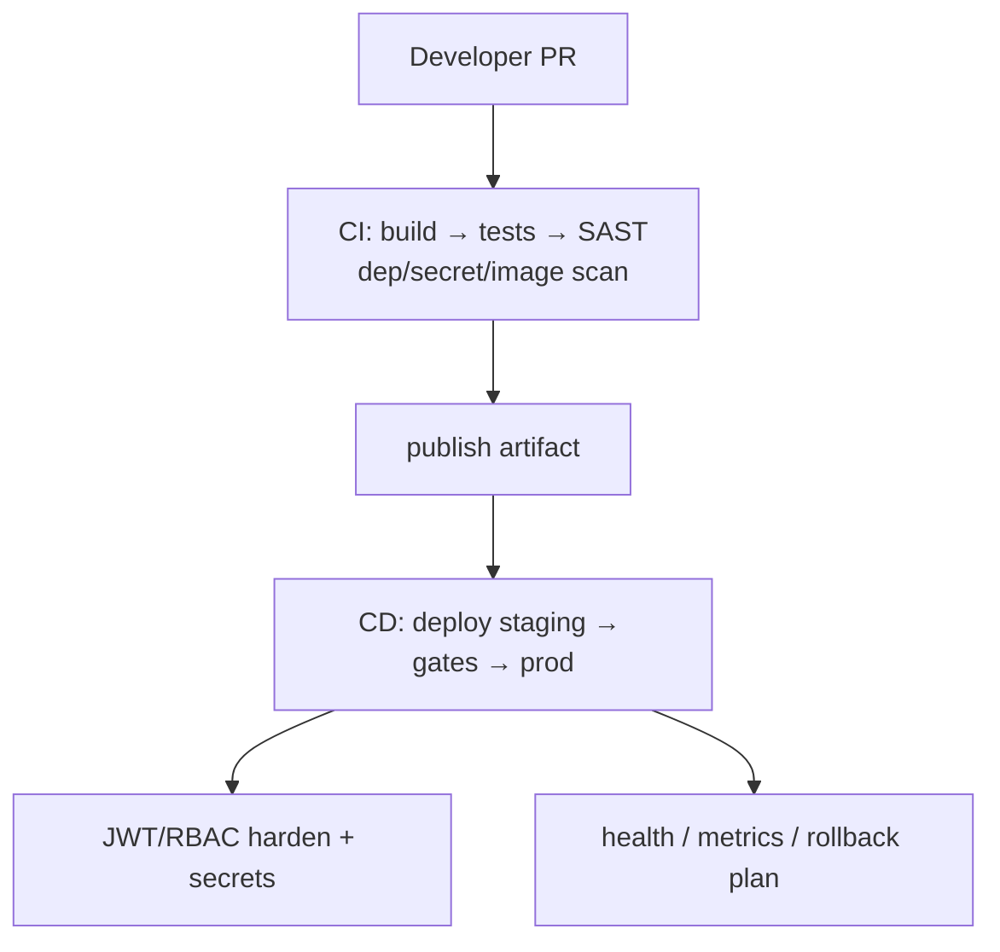
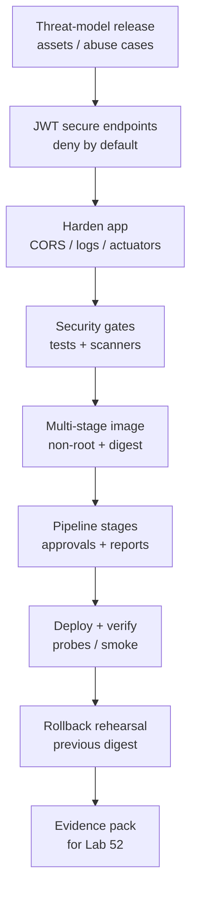

# Lab 51: Capstone Security, CI/CD, and Deployment — Northstar CRM Release Gate

**Module:** 51 — Capstone Security, CI/CD, and Deployment  
**Lab folder:** `labs/Week 6 - Capstone Project/module-51/lab51/`  
**Difficulty:** Advanced Capstone  
**Duration:** 6–8 Hours

**Primary IDE:** IntelliJ IDEA Community Edition · **Optional IDE:** VS Code

| OS | How-to for this lab |
| -- | ------------------- |
| Windows | [LAB-51-WINDOWS.md](LAB-51-WINDOWS.md) |
| macOS | [LAB-51-MACOS.md](LAB-51-MACOS.md) |

> **Environment reminder:** Finish Labs 0 and 48–50. Use **IntelliJ IDEA Community** (primary; optional VS Code) with **JDK 21**, **Maven 3.9+**, **GitHub Actions**, **Docker**, and instructor **k3s** (`kubectl`). Work under `~/java-bootcamp/examples/customer-management-platform` (Windows: `%USERPROFILE%\java-bootcamp\examples\customer-management-platform`).

---

## How to follow this lab

1. Open the **Windows** or **macOS** how-to (links above) in a second tab.
2. Create/work only under your `java-bootcamp/examples/…` folder from the steps (not inside this `labs/` git clone unless a step says otherwise).
3. For each **Step N**: read **Why** (if present) → do the actions → confirm **Expected** / **Expected result** → then continue.
4. When stuck, use **Failure Experiments** / troubleshooting in this guide before asking for help.
5. Capture evidence under `notes/screenshots/lab-51/` (workspace root under `java-bootcamp`; redact secrets). Use the **Pass criteria** tables — write **Pass** or **Fail** in your notes. GitHub file view does not support clickable checkboxes.

## Lab Overview

This Module 51 lab makes the CRM **releasable**: harden JWT authorization, protect secrets and headers, enforce gated CI/CD, publish immutable containers, deploy with health probes, run smoke tests (including unauthorized paths), and prove rollback. Treat this as the Week 6 release gate, not an optional polish pass.

**Purpose.** Feature-complete is not release-complete. Leadership freezes merge/promote until access control, delivery automation, image provenance, protected configuration, operational signals, and recovery are evidenced together.

**What you build (exercise).** Threat-model the release; secure HTTP endpoints (JWT resource server, deny-by-default); harden CORS/CSRF/logging/actuators; run security gates (tests, dependency/secret/image scans); multi-stage non-root image with digest; delivery pipeline stages; deploy + verify probes/logs/metrics/Kafka lag; rehearse previous-digest rollback.

**What success looks like.** Pipeline builds a digest-tagged image; cluster rollout healthy; authenticated smoke works for search/`CUS-1001`; anonymous API calls get 401; wrong role gets 403; rollback to previous digest verified; `docs/security-deploy-demo.md` (or reports pack) reproduces the release story.

**Depends on Labs 48–50.** Need running CRM slice, ADRs for auth/deploy, and UI/API fixtures. Finish those labs if smoke targets are missing.

**CRM connection.** Fixtures `CUS-1001` / `CUS-1002` / `lab-request-001` in smoke tests. Lab 52 defends with your digest, pipeline reports, and rollback evidence—keep artifact IDs immutable.

---

## Learning Objectives

After completing this lab, you will be able to:

* Apply JWT authorization with deny-by-default request matching
* Protect secrets, headers, and actuator exposure
* Build gated CI/CD stages with verified artifacts
* Publish immutable multi-stage non-root images
* Deploy safely to Kubernetes (k3s) with probes
* Execute authenticated and unauthorized smoke tests
* Prove rollback to a previous image digest
* Triage scanner findings with time-bounded exceptions
* Trace smoke correlation IDs into logs without leaking tokens
* Document release evidence for Lab 52 defense

---

## Business Scenario

The integrated CRM cannot ship until security and delivery gates pass. Reviewers freeze:

**No “deployed” claim without digest identity, smoke (auth + deny), health evidence, and a rehearsed rollback.**

You own the release gate for the Week 6 platform using Amina/Ravi fixtures in smoke only.

Use these fixtures consistently:

| ID | Name | Notes |
| -- | ---- | ----- |
| `CUS-1001` | Amina Khan | smoke search/read target |
| `CUS-1002` | Ravi Singh | optional second smoke record |
| `lab-request-001` | — | correlation on interactive demos |
| `release-smoke-${BUILD}` | — | correlation per pipeline smoke |
| `crm-api:<version>-<gitsha>` | — | immutable image tag pattern |

**Security note for evidence.** Redact tokens in pipeline logs pasted to docs. Never commit kubeconfig or registry passwords. Rotate any training secret that appears in screenshots.

---

## Architecture Context

### NOW (this lab)



### Lab flow (mermaid)



### Architecture NOW vs LATER

| Aspect | Lab 51 (NOW) | Lab 52 (LATER) |
| ------ | ------------ | -------------- |
| Focus | Make release gates real | Narrate and defend them |
| Auth | JWT enforced + tested | Q&A on claims/roles |
| Ops | Smoke + rollback proof | Demo run sheet + fallbacks |
| Scanners | Run and triage | Cite exceptions honestly |

**Lab focus:** JWT harden, CI/CD, Docker provenance, k3s deploy, smoke, rollback.

Keep release identity (tag, digest, pipeline id) stable for Lab 52 citations—do not rebuild silently after smoke passes.

---

## Prerequisites

Complete [SETUP](../../../SETUP-INSTRUCTIONS.md), [Lab 0](../../../Week%201%20-%20Java%20and%20JVM%20Foundations/module-00/lab0/LAB-0-GUIDE.md), and Labs [48](../../module-48/lab48/LAB-48-GUIDE.md)–[50](../../module-50/lab50/LAB-50-GUIDE.md). Confirm:

* Capstone repo builds (backend + frontend as required)
* Docker available; registry credentials via approved secret store
* `kubectl` context for your training namespace
* GitHub Actions (or instructor CI) + SAST tooling as instructed
* No secrets committed to Git

### Pre-flight

```bash
java -version
mvn -version
docker --version
kubectl version --client
git --version
pwd
kubectl config current-context 2>/dev/null || true
```

Confirm Labs 49–50 evidence pointers exist:

```bash
ls ~/java-bootcamp/examples/customer-management-platform/docs/backend-demo.md
ls ~/java-bootcamp/examples/customer-management-platform/docs/frontend-persistence-demo.md 2>/dev/null || true
```

Record cluster namespace you’ll deploy into (never commit kubeconfig):

```bash
kubectl config view --minify -o jsonpath='{.contexts[0].context.namespace}{"\n"}' 2>/dev/null || echo "set namespace per instructor"
```

Branch and baseline:

```bash
cd ~/java-bootcamp/examples/customer-management-platform
git switch -c lab/51-crm 2>/dev/null || git checkout -b lab/51-crm
./mvnw -B clean verify 2>/dev/null || mvn -B clean verify
git status --short
```

If baseline fails, record it; do not skip tests to fake green.

---

## Suggested Project Files

```text
~/java-bootcamp/examples/customer-management-platform/
├── backend/
│   ├── src/main/java/.../security/SecurityConfig.java
│   ├── src/test/java/.../security/AuthorizationTests.java
│   └── Dockerfile
├── frontend/
│   └── Dockerfile                    # if UI containerized
├── k8s/ or deploy/
│   ├── deployment-crm-api.yaml
│   ├── service.yaml
│   ├── route-or-ingress.yaml
│   └── kustomization.yaml            # optional
├── .github/workflows/ci.yml           # or .github/workflows / Jenkinsfile
├── docs/
│   ├── security-deploy-demo.md
│   ├── threat-model.md
│   └── notes/screenshots/
├── reports/                          # sanitized scan + smoke logs
├── .gitignore
└── README.md
```

Ignore plaintext secret files, kubeconfig copies, and `*.pem` keys. Prefer platform Secrets/SealedSecrets as instructed.

---

## Concepts to Discuss

Write 2–3 sentences each in `docs/security-deploy-demo.md`:

1. Main release flow (commit → digest → deploy → smoke)
2. Trust boundary: ingress TLS, JWT validation, DB credentials
3. Success/failure contracts for smoke (401/403/200)
4. Stable fixtures in smoke vs production customer data (never)
5. Idempotency of redeploy same digest
6. Why image digest beats floating `:latest`
7. Evidence operators need (rollout status, probes, scan reports)
8. Two environments: same pipeline, different secret scopes
9. False-confidence “security” (csrf disabled without rationale)
10. What Lab 52 will cite from this lab’s evidence index

---

## Implementation Steps

Parts 1–8 map to Steps 1–8; Step 9 closes evidence.

---

### Step 1 — Threat-model release (Part 1)

**Why:** Controls without a threat model become random checkboxes.

**Do this:** Write `docs/threat-model.md` covering assets (tokens, customer records, events, admin), actors (agent, manager, attacker, operator), trust boundaries, abuse cases (token theft, privilege escalation, secret in image, unsigned latest tag). Map each high risk to a control + test.

**Expected result:** Prioritized abuse list linked to Lab 51 steps.

**If it fails:** Generic OWASP paste with no CRM specifics → rewrite with JWT/Kafka/PostgreSQL paths.

---

### Step 2 — Secure HTTP endpoints (Part 2)

**Why:** Open `/api/**` in a shared cluster fails the course on security.

**Do this:** Configure OAuth2 resource server JWT; map roles from trusted claims; deny by default; method security where needed. Test anonymous, wrong-role, correct-role.

```java
@Bean
SecurityFilterChain apiSecurity(HttpSecurity http) throws Exception {
  return http
      .csrf(csrf -> csrf.disable()) // document why for bearer API
      .cors(Customizer.withDefaults())
      .sessionManagement(s -> s.sessionCreationPolicy(SessionCreationPolicy.STATELESS))
      .authorizeHttpRequests(auth -> auth
          .requestMatchers("/actuator/health/**").permitAll()
          .requestMatchers(HttpMethod.DELETE, "/api/customers/**").hasRole("MANAGER")
          .requestMatchers("/api/**").authenticated()
          .anyRequest().denyAll())
      .oauth2ResourceServer(oauth -> oauth.jwt(Customizer.withDefaults()))
      .build();
}
```

```java
@Test
void deleteCustomerRequiresManagerRole() throws Exception {
  mvc.perform(delete("/api/customers/{id}", customerId)
      .with(jwt().authorities(new SimpleGrantedAuthority("ROLE_AGENT"))))
     .andExpect(status().isForbidden());
}

@Test
void anonymousCustomersUnauthorized() throws Exception {
  mvc.perform(get("/api/customers"))
     .andExpect(status().isUnauthorized());
}

@Test
void agentCanReadCustomers() throws Exception {
  mvc.perform(get("/api/customers").with(jwt().authorities(new SimpleGrantedAuthority("ROLE_AGENT"))))
     .andExpect(status().isOk());
}
```

Document claim → role mapping (e.g. `realm_access.roles`) in `docs/security-deploy-demo.md`.

**Expected result:** Authorization tests green; anonymous `/api/customers` → 401; AGENT read OK; AGENT delete 403.

**If it fails:** `permitAll` on `/api/**` leftover → remove. Wrong claim mapping → fix converter. CSRF unexpected 403 on browser form posts → re-check token transport ADR.

---

### Step 3 — Harden application (Part 3)

**Why:** JWT alone does not stop log leakage or wide-open actuators.

**Do this:** Validate input (already from Lab 49); constrain CORS to known UI origins; document CSRF decision for bearer tokens; redact Authorization and note bodies from logs; expose only required actuator endpoints; set security headers as instructed.

Checklist to tick in demo.md:

_Mark each row **Pass** or **Fail** in your lab notes (GitHub markdown files are not interactive checklists)._

| # | Confirm | Your notes |
| - | ------- | ---------- |
| 1 | CORS allowlist matches React origin(s) | Pass / Fail |
| 2 | Actuator exposure limited to health/info (as approved) | Pass / Fail |
| 3 | Logging MDC includes correlation id, not bearer token | Pass / Fail |
| 4 | Error bodies do not dump stack traces to clients | Pass / Fail |
| 5 | Security headers configured per instructor baseline | Pass / Fail |

**Expected result:** Hardening notes + config diffs; actuator `env`/`beans` not public.

**If it fails:** `management.endpoints.web.exposure.include=*` → restrict. CORS `*` with credentials → tighten. Tokens in access logs → redaction filter.

---

### Step 4 — Run security gates (Part 4)

**Why:** Unscanned images and secrets in Git are release-blockers.

**Do this:** Execute tests, dependency scan, secret scan, and image scan (tools per instructor: OWASP Dependency-Check, Trivy, gitleaks, Snyk, etc.). Triage critical findings. Time-bound approved exceptions with owner, evidence, and expiry in `reports/` or `docs/`.

**Expected result:** Scan reports sanitized and linked; criticals fixed or exceptioned.

**If it fails:** Ignoring critical CVE without exception → create honest risk entry or upgrade.

---

### Step 5 — Build and publish once (Part 5)

**Why:** Rebuilding different bits per environment destroys provenance.

**Do this:** Multi-stage Dockerfile; non-root user; tag by version + commit SHA; push to training registry; capture digest and SBOM if available. Never bake secrets into layers.

```bash
docker build -t "$REGISTRY/crm-api:${VERSION}-${GIT_SHA}" -f backend/Dockerfile backend
docker push "$REGISTRY/crm-api:${VERSION}-${GIT_SHA}"
docker image inspect "$REGISTRY/crm-api:${VERSION}-${GIT_SHA}" --format='{{index .RepoDigests 0}}'
```

**Expected result:** Digest recorded in `docs/security-deploy-demo.md`.

**If it fails:** Running as root → set USER. `:latest` only → add immutable tag.

---

### Step 6 — Create delivery pipeline (Part 6)

**Why:** Manual “it works on my laptop” deploy is not a gate.

**Do this:** Pipeline definition: build → verify → scan → publish → (gated) deploy. Pass verified artifact identity between stages. Scope env vars/secrets; require approvals for deploy if instructed. Preserve reports as artifacts.

Minimum stage acceptance notes in demo.md:

| Stage | Pass condition | Artifact out |
| ----- | -------------- | ------------ |
| verify | `mvn clean verify` green | test reports |
| scans | no unexceptioned criticals | sanitized reports |
| publish | push succeeds | tag + digest |
| deploy | rollout ready | revision id |
| smoke | 401 + authenticated read | smoke log |

**Expected result:** Green pipeline run URL/ID recorded (sanitized).

**If it fails:** Secrets in YAML → move to repository variables. Deploy without digest pin → fix imagePull to digest/tag. Deploy stage before scans → reorder gates.

---

### Step 7 — Deploy and verify (Part 7)

**Why:** Rollout without smoke ships unbroken unit tests and broken runtime.

**Do this:** Apply manifests; wait for rollout; check readiness/liveness, routes, logs, metrics, Kafka lag if consumer deployed. Run smoke:

```bash
set -eu
curl -fsS "$CRM_URL/actuator/health/readiness"
test "$(curl -s -o /dev/null -w '%{http_code}' "$CRM_URL/api/customers")" = "401"
curl -fsS "$CRM_URL/api/customers?page=0&size=1" \
  -H "Authorization: Bearer $SMOKE_TOKEN" \
  -H "X-Correlation-ID: release-smoke-${GITHUB_RUN_NUMBER}"
# optional: assert CUS-1001 visible when seeded
kubectl rollout status deployment/crm-api --timeout=180s
```

**Expected result:** Rollout healthy; 401/200 smoke evidence saved; correlation searchable in logs.

**If it fails:** CrashLoop → read logs/events; fix probes/config. Smoke uses `:latest` mismatch → pin digest.

---

### Step 8 — Prove recovery (Part 8)

**Why:** Deploy without rollback is a hostage situation at demo time.

**Do this:** Define rollback triggers and decision owner. Redeploy previous digest. Verify health and DB/event compatibility (no breaking migration assumed for rollback path—document if migrations are forward-only).

**Expected result:** Rollback rehearsal recorded with timestamps and verification commands.

**If it fails:** Only “delete pod” knowledge → practice image pin rollback. Forward-only migration → document contingency (restore backup) with instructor.

---

### Step 9 — Failure experiments + evidence pack

**Why:** Lab 52 will ask unauthorized and rollback questions under time pressure.

**Do this:** Complete [Failure Experiments](#failure-experiments). Assemble `docs/security-deploy-demo.md` + `reports/` with digest, pipeline ID, smoke outputs, rollback notes. Ensure `git status` has no secret files.

Also freeze release identity for Lab 52:

```markdown
## Release identity
- Image tag:
- Digest:
- Pipeline run:
- Git SHA:
- Smoke correlation:
- Rollback digest:
```

**Expected result:** ≥3 experiments; peer can follow release runbook; sanitized evidence only; release identity frozen.

**If it fails:** See Troubleshooting.

---

## Implementation Checkpoints

### Checkpoint A — Threat model and authz

_Mark each row **Pass** or **Fail** in your lab notes (GitHub markdown files are not interactive checklists)._

| # | Confirm | Your notes |
| - | ------- | ---------- |
| 1 | Threat model documents CRM-specific abuse cases | Pass / Fail |
| 2 | JWT resource server deny-by-default | Pass / Fail |
| 3 | Anonymous/wrong-role/correct-role tests green | Pass / Fail |

### Checkpoint B — Harden and scan

_Mark each row **Pass** or **Fail** in your lab notes (GitHub markdown files are not interactive checklists)._

| # | Confirm | Your notes |
| - | ------- | ---------- |
| 1 | CORS/actuators/logging hardened | Pass / Fail |
| 2 | Dependency/secret/image scans executed | Pass / Fail |
| 3 | Exceptions time-bounded with owners | Pass / Fail |

### Checkpoint C — Ship and verify

_Mark each row **Pass** or **Fail** in your lab notes (GitHub markdown files are not interactive checklists)._

| # | Confirm | Your notes |
| - | ------- | ---------- |
| 1 | Non-root image published with digest | Pass / Fail |
| 2 | Pipeline stages pass with artifact identity | Pass / Fail |
| 3 | Deploy + auth/deny smoke evidence | Pass / Fail |

### Checkpoint D — Recovery hygiene

_Mark each row **Pass** or **Fail** in your lab notes (GitHub markdown files are not interactive checklists)._

| # | Confirm | Your notes |
| - | ------- | ---------- |
| 1 | Rollback to previous digest proven | Pass / Fail |
| 2 | Demo/security docs complete | Pass / Fail |
| 3 | No secrets in Git or screenshots | Pass / Fail |

---

## Reference Commands, Configuration, and Code

### Smoke excerpt

```bash
curl -fsS "$CRM_URL/actuator/health/readiness"
test "$(curl -s -o /dev/null -w '%{http_code}' "$CRM_URL/api/customers")" = "401"
kubectl rollout status deployment/crm-api --timeout=180s
```

### Commands

```bash
cd ~/java-bootcamp/examples/customer-management-platform
./mvnw -B clean verify
docker build -t crm-api:local -f backend/Dockerfile backend
kubectl apply -f k8s/
kubectl rollout status deployment/crm-api --timeout=180s
git status --short
```

### Artifact map

| Artifact | Role |
| -------- | ---- |
| `SecurityConfig` | HTTP authorize rules |
| `AuthorizationTests` | 401/403/200 proof |
| `Dockerfile` | Immutable runtime |
| Pipeline YAML | Gated delivery |
| `k8s/*.yaml` | Deploy + probes |
| `security-deploy-demo.md` | Release runbook |

### Deployment probe sketch

```yaml
readinessProbe:
  httpGet:
    path: /actuator/health/readiness
    port: 8080
  initialDelaySeconds: 10
  periodSeconds: 5
livenessProbe:
  httpGet:
    path: /actuator/health/liveness
    port: 8080
  initialDelaySeconds: 30
  periodSeconds: 10
```

Adapt paths to your Spring Boot actuator config; never probe a authenticated-only endpoint without a plan.

### `security-deploy-demo.md` outline

```markdown
# Security + deploy demo — Lab 51
## Threat model summary
## Authz test evidence
## Scan reports (paths)
## Image tag + digest
## Pipeline run id
## Smoke commands + outcomes (401/403/200)
## Rollback commands + outcomes
## Residual risks / exceptions
```

---

## Manual Verification

1. Anonymous API call returns 401.
2. AGENT cannot perform MANAGER-only action (403).
3. AGENT smoke read works; optional `CUS-1001` visible when seeded.
4. Actuator sensitive endpoints are not public.
5. Image is non-root and tagged immutably; digest recorded.
6. Pipeline stores scan reports.
7. Rollout becomes ready within NFR window.
8. Logs show smoke correlation without bearer token values.
9. Rollback previous digest restores health.
10. No secrets in repo or submitted screenshots.
11. Threat model maps at least three abuse cases to tests/controls.
12. Release identity block is complete for Lab 52 handoff.

---

## Failure Experiments

| # | Experiment | Observe | Restore |
| - | ---------- | ------- | ------- |
| 1 | Call `/api/**` without token | 401 | Keep rule |
| 2 | AGENT calls MANAGER delete | 403 | Keep method security |
| 3 | Deploy broken image tag | Rollout fails/probes fail | Roll back digest |
| 4 | Temporarily expose actuator `env` | Sensitive leakage risk | Restrict exposure |
| 5 | Fail secret scan with dummy token file | Gate fails | Remove file; rotate if needed |
| 6 | Pull `:latest` vs digest mismatch | Wrong bits or confusion | Pin digest |
| 7 | Disable readiness probe briefly | Traffic to unready pod risk | Restore probe |

---

## Troubleshooting

| Symptom | Likely cause | Fix |
| ------- | ------------ | --- |
| 401 with valid token | JWKS/issuer mismatch | Align Spring issuer-uri |
| Image pull backoff | Wrong secret/digest | Fix pull secret; pin digest |
| Readiness never ready | Bad probe path | Align actuator path |
| Pipeline secret error | Scope/permission | Use secured variables |
| Scan false positive | Triage | Document exception expiry |
| Rollback breaks DB | Forward-only migration | Document restore strategy |
| CORS only in browser | Origin mismatch | Update allowed origins |
| Smoke flaky | DNS/route propagation | Wait/retry with timeout |
| OOMKilled | Tiny limits | Raise memory request/limit carefully |
| CrashLoop on secrets | Missing env | Mount Secret keys with correct names |
| Kafka lag ignored | No consumer metrics | Add lag check to smoke/ops notes |

---

## Security and Production Review

Answer in `docs/security-deploy-demo.md`:

1. Which inputs are untrusted (tokens, headers, images, manifests)?
2. Where are authn/authz/validation enforced (filter chain, method security)?
3. Which values are sensitive—never in Git or CI logs?
4. What can be retried safely (redeploy same digest; smoke GETs)?
5. What happens after partial failure (auto rollback? manual owner?)?
6. What would an operator monitor (5xx, lag, probe failures, CVE stream)?
7. Which local default is unacceptable (`:latest`, root container, `permitAll`)?
8. How are release contracts versioned with image digests and migrations?

---

## Cleanup

```bash
kubectl config current-context
# scale down or leave per instructor policy
docker image prune -f 2>/dev/null || true
git status --short
# delete any local kubeconfig copies or .env you created
```

Keep sanitized reports; remove plaintext secrets.

**Keep Lab 51 pipeline, manifests, and digest evidence**—Lab 52 defense depends on them.

---

## Expected Deliverables

* Spring Security changes and authorization tests
* Pipeline definition
* Dockerfile and image digest record
* Deployment manifests (k3s)
* Security and deployment evidence (scans, smoke, rollback)
* Baseline and final validation results
* One controlled failure-path result (401/403 or failed rollout→rollback)
* Concise setup and reproduction guide
* Peer-review notes and resolved comments
* Known limitations, residual risks, owners, and next actions

Exclude real `.env` files, access tokens, database exports, private keys, kubeconfig, Terraform state, and sensitive screenshots.

---

## Evaluation Rubric (100 Marks)

| Criteria | Marks |
| -------- | ----: |
| Environment and project structure | 10 |
| Core implementation (JWT, pipeline, Docker, deploy) | 30 |
| Integration/configuration correctness (probes, secrets wiring) | 15 |
| Failure handling (deny paths + rollback) | 15 |
| Automated verification (tests + smoke in CI/CD) | 10 |
| Security and production awareness | 10 |
| Documentation and evidence | 10 |

**Notes:** Floating `:latest` without digest → lose integration marks. Skipping unauthorized smoke → failure-handling deduction. Committed secrets → remediation required before scoring.

---

## Reflection Questions

Write 3–6 sentence answers:

1. Which design decision most affected correctness of the release gate?
2. Which failure was hardest to diagnose (JWT, pull secret, probes)?
3. What evidence proves the deployment is the intended digest?
4. What breaks first at ten times release frequency?
5. Which concern should move to shared platform CI?
6. What must change before production customer data rides this pipeline?
7. How does this lab connect to Labs 48–50 and Lab 52?
8. What metric matters most on the release dashboard?
9. (Forward look) Which rollback assumption will Lab 52 panelists attack first?

---

## Bonus Challenges

1. Add a canary stage with abort thresholds.
2. Generate and attest an SBOM with the image digest.
3. Add NetworkPolicy and verify denied paths.
4. Test token expiry during a request flow.
5. Automate previous-digest rollback in the pipeline.
6. Wire smoke that asserts `CUS-1001` appears when seed job ran.

---

## Success Criteria

You are finished when:

* JWT deny-by-default is tested (401/403/200)
* Immutable image digest is published and deployed
* Pipeline gates include tests and security scans
* Smoke and rollback are evidenced
* Another student can follow the release runbook
* Threat model maps controls to abuse cases
* No production secret is hard-coded or committed

---

## Instructor Notes

* **Live probe:** Ask for anonymous 401 proof, AGENT vs MANAGER 403, and the exact digest in the cluster. Have student show rollback target. Ask why `:latest` is rejected.
* **Assess:** Security config quality, scan triage honesty, digest provenance, smoke coverage, rollback rehearsal, actuator lockdown.
* **Continuity:** Prefer `customer-management-platform` deploy path. Keep fixtures. Lab 52 must cite these artifacts unchanged.
* **Common pitfalls:** `:latest`; root containers; `permitAll`; secrets in YAML; skipping unauthorized smoke; undocumented CSRF disable; exposing `env` actuator.
* **Timing:** 6–8 hours. Registry/auth issues often burn 45–60 minutes—verify pull secrets early. Time-box scanner rabbit holes once criticals are triaged.
* **Parity check:** Smoke should use the same customer fixtures as Labs 49–50 when the environment is seeded; otherwise document why list/read smoke is used instead.
* **Quality bar:** Digest identity + deny smoke + rollback notes beat a “deployed somehow” screenshot.

---

### Quick peer reproduction card (attach to PR)

```markdown
Peer name:
Auth tests 401/403/200? Y/N
Image digest recorded? Y/N
Pipeline run id:
Smoke 401 anonymous? Y/N
Rollback digest verified? Y/N
Secrets absent from Git/reports? Y/N
```

Paste sanitized results into `docs/security-deploy-demo.md`.

---

### Suggested pipeline stage names

```text
build → verify → secret-scan → dep-scan → image-build → image-scan → publish → deploy (gated) → smoke
```

Rename to match GitHub/GitHub/Jenkins conventions, but preserve the gate order: **do not deploy unscanned or unverified artifacts**.

---

*End of Lab 51 — Capstone Security, CI/CD, and Deployment: Northstar CRM Release Gate. Keep release evidence for Lab 52 and portfolio.*
