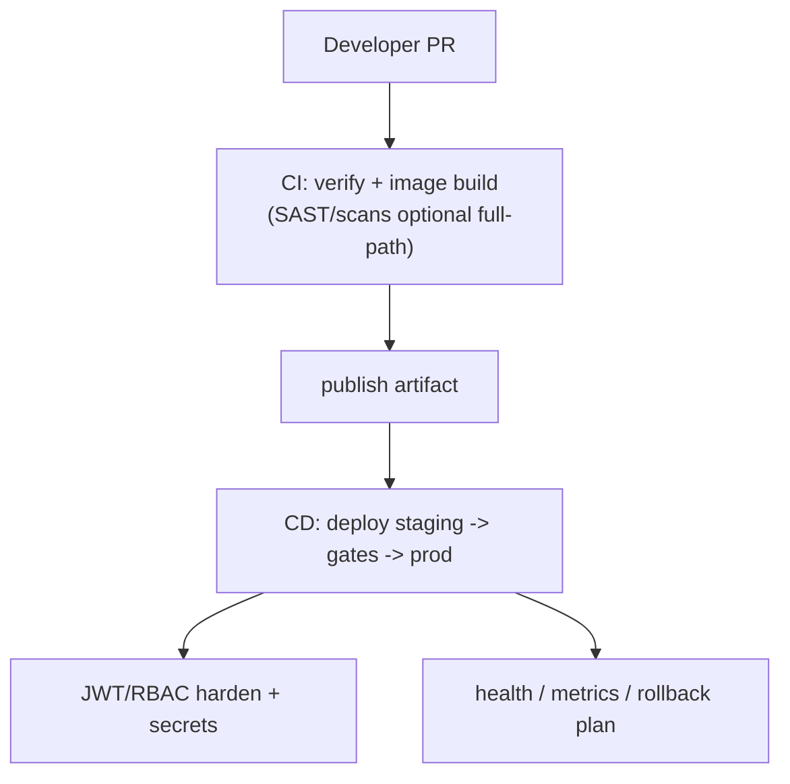

# Lab 51: Capstone Security, CI/CD, and Deployment — Northstar CRM Release Gate

**Module:** 51 — Capstone Security, CI/CD, and Deployment  
**Duration:** ~45 minutes (timed path / session block with starter) · Full path: 6–8 Hours

**Primary IDE:** IntelliJ IDEA Community Edition · **Optional IDE:** VS Code

| OS | How-to for this lab |
| -- | ------------------- |
| Windows | [LAB-51-WINDOWS.md](LAB-51-WINDOWS.md) |
| macOS | [LAB-51-MACOS.md](LAB-51-MACOS.md) |

---

## Activity card

| | |
| --- | --- |
| **Time** | ~45 min session block · full path 6–8 h multi-day |
| **Checkpoint** | **E** (after Ex 1→2→3→4→5→6) |
| **Must prove** | Security checklist · Dockerfile non-root · k8s probes · 401/403 smoke matrix · rollback digest note |
| **Hard gate** | Pre-lab Pass · no secrets in Git · Labs 48–50 smoke targets exist |

### What you will learn

Make CRM releasable: JWT/RBAC, gated CI/CD, digest-pinned image, k3s deploy, smoke, rollback.

### Enterprise context

Feature-complete without access control, provenance, and recovery is not release-complete.

### Predict

Should `:latest` be the only image identity in evidence?

### Debug

Pipeline green after skipping security tests — pass or fail the gate?

---

## 45-minute timed path (session block — use starter)

> **Pacing reminder:** [PACING.md](../PACING.md) checkpoint **E**. Homework/multi-day: JWT, GH Actions, scans, live k3s rollout + rollback, `docs/security-deploy-demo.md`.

In class, use the starter security/deploy checklist plus Dockerfile/k8s stubs so the **session block** fits **~45 minutes**. JWT hardening, pipeline, live k3s rollout, and rollback rehearsal remain **multi-day** on the full path.

1. Open [`starter/README.md`](starter/README.md).
2. Copy `starter/` into `java-bootcamp/examples/customer-management-platform/` (see starter README).
3. Fill checklist + Dockerfile/k8s TODOs — do **not** wait on a perfect cluster; dry-run is enough for the block.
4. Run the starter smoke check; evidence under `notes/screenshots/lab-51/`.
5. Mark timed-path Pass criteria in the starter README. Continue remaining GUIDE steps as homework / multi-day work.

| Path | Time | Scope |
| ---- | ---- | ----- |
| **Timed / session block** | ~45 min | Starter TODOs + smoke check |
| **Full (multi-day)** | 6–8 Hours | Every Step in this GUIDE |

Policy: [`labs/_STARTER-PATH.md`](../../../_STARTER-PATH.md)

---

## What you'll submit (read this first)

Keep this checklist visible while you work.

| # | Deliverable |
| - | ----------- |
| 1 | Spring Security changes and authorization tests |
| 2 | Pipeline definition |
| 3 | Dockerfile and image digest record |
| 4 | Deployment manifests (k3s) |
| 5 | Security and deployment evidence (scans, smoke, rollback) |
| 6 | Baseline and final validation results |
| 7 | One controlled failure-path result (401/403 or failed rollout→rollback) |
| 8 | Concise setup and reproduction guide |

**Must submit:** the items in the table above (sources + evidence + short notes).

**Do not submit:** `target/`, `node_modules/`, secrets, heap dumps, or a verbatim instructor `solution/`.

## Lab Overview

This Module 51 lab makes the CRM **releasable**: harden JWT authorization, protect secrets and headers, enforce gated CI/CD, publish immutable containers, deploy with health probes, run smoke tests (including unauthorized paths), and prove rollback. Treat this as the Week 6 release gate, not an optional polish pass.

## Learning Objectives

After completing this lab, you will be able to:

* Apply JWT authorization with deny-by-default request matching
* Protect secrets, headers, and actuator exposure
* Build gated CI/CD stages with verified artifacts
* Publish immutable multi-stage non-root images
* Deploy safely to Kubernetes (k3s) with probes

## Business Scenario

The integrated CRM cannot ship until security and delivery gates pass. Reviewers freeze:

**No “deployed” claim without digest identity, smoke (auth + deny), health evidence, and a rehearsed rollback.**

You own the release gate for the Week 6 platform using Amina/Ravi fixtures in smoke only.

Use these fixtures consistently:

| ID | Name | Notes |
| -- | ---- | ----- |
| `CUS-1001` | Amina Khan | smoke search/read target |
| `CUS-1002` | Ravi Singh | optional second smoke record |
| `lab-request-001` | — | correlation on interactive demos |
| `release-smoke-${BUILD}` | — | correlation per pipeline smoke |
| `crm-api:<version>-<gitsha>` | — | immutable image tag pattern |

**Security note for evidence.** Redact tokens in pipeline logs pasted to docs. Never commit kubeconfig or registry passwords. Rotate any training secret that appears in screenshots.

---

## Architecture Context
### NOW (this lab)


```mermaid
flowchart TB
  PR["Developer PR"] --> CI["CI: verify + image build<br/>(SAST/scans optional full-path)"]
  CI --> Pub["publish artifact"]
  Pub --> CD["CD: deploy staging -> gates -> prod"]
  CD --> Sec["JWT/RBAC harden + secrets"]
  CD --> Obs["health / metrics / rollback plan"]
```

## Prerequisites

Prior labs: [48](../../module-48/lab48/LAB-48-GUIDE.md) · [50](../../module-50/lab50/LAB-50-GUIDE.md).

Confirm (Lab 0 tools assumed):

* Capstone repo builds (backend + frontend as required)
* Docker available; registry credentials via approved secret store
* `kubectl` context for your training namespace
* GitHub Actions (or instructor CI) + SAST tooling as instructed
* No secrets committed to Git

### Pre-flight

```bash
java -version
mvn -version
```

## Worked example (read before you code)

Study this pattern once before Step 1. Your job is to apply the same idea in the Steps — do not skip ahead to a full solution.

```java
import static org.springframework.security.test.web.servlet.request.SecurityMockMvcRequestPostProcessors.jwt;
import static org.springframework.test.web.servlet.request.MockMvcRequestBuilders.delete;
import static org.springframework.test.web.servlet.request.MockMvcRequestBuilders.get;
import static org.springframework.test.web.servlet.result.MockMvcResultMatchers.status;
import org.junit.jupiter.api.Test;
import org.springframework.security.core.authority.SimpleGrantedAuthority;

@Test
void deleteCustomerRequiresManagerRole() throws Exception {
  mvc.perform(delete("/api/v1/customers/{id}", customerId)
      .with(jwt().authorities(new SimpleGrantedAuthority("ROLE_AGENT"))))
     .andExpect(status().isForbidden());
}

@Test
void anonymousCustomersUnauthorized() throws Exception {
  mvc.perform(get("/api/v1/customers"))
     .andExpect(status().isUnauthorized());
}

@Test
void agentCanReadCustomers() throws Exception {
  mvc.perform(get("/api/v1/customers").with(jwt().authorities(new SimpleGrantedAuthority("ROLE_AGENT"))))
     .andExpect(status().isOk());
}
```

**What to notice:** Match names, IDs, and failure behavior from the scenario — instructors check these.

---

## Implementation Steps

Parts 1–8 map to Steps 1–8; Step 9 closes evidence.

---

### Step 1 — Threat-model release (Part 1)

**Why:** Controls without a threat model become random checkboxes.

**Do this:** Write `docs/threat-model.md` covering assets (tokens, customer records, events, admin), actors (agent, manager, attacker, operator), trust boundaries, abuse cases (token theft, privilege escalation, secret in image, unsigned latest tag). Map each high risk to a control + test.

**Expected result:** Prioritized abuse list linked to Lab 51 steps.

**If it fails:** Generic OWASP paste with no CRM specifics → rewrite with JWT/Kafka/PostgreSQL paths.

---

### Step 2 — Secure HTTP endpoints (Part 2)

**Why:** Open `/api/**` in a shared cluster fails the course on security.

**Do this:** Configure OAuth2 resource server JWT; map roles from trusted claims; deny by default; method security where needed. Test anonymous, wrong-role, correct-role.

```java
import org.springframework.context.annotation.Bean;
import org.springframework.http.HttpMethod;
import org.springframework.security.config.Customizer;
import org.springframework.security.config.annotation.web.builders.HttpSecurity;
import org.springframework.security.config.http.SessionCreationPolicy;
import org.springframework.security.web.SecurityFilterChain;

@Bean
SecurityFilterChain apiSecurity(HttpSecurity http) throws Exception {
  return http
      .csrf(csrf -> csrf.disable()) // document why for bearer API
      .cors(Customizer.withDefaults())
      .sessionManagement(s -> s.sessionCreationPolicy(SessionCreationPolicy.STATELESS))
      .authorizeHttpRequests(auth -> auth
          .requestMatchers("/actuator/health/**").permitAll()
          .requestMatchers(HttpMethod.DELETE, "/api/v1/customers/**").hasRole("MANAGER")
          .requestMatchers("/api/v1/**").authenticated()
          .anyRequest().denyAll())
      .oauth2ResourceServer(oauth -> oauth.jwt(Customizer.withDefaults()))
      .build();
}
```

```java
import static org.springframework.security.test.web.servlet.request.SecurityMockMvcRequestPostProcessors.jwt;
import static org.springframework.test.web.servlet.request.MockMvcRequestBuilders.delete;
import static org.springframework.test.web.servlet.request.MockMvcRequestBuilders.get;
import static org.springframework.test.web.servlet.result.MockMvcResultMatchers.status;
import org.junit.jupiter.api.Test;
import org.springframework.security.core.authority.SimpleGrantedAuthority;

@Test
void deleteCustomerRequiresManagerRole() throws Exception {
  mvc.perform(delete("/api/v1/customers/{id}", customerId)
      .with(jwt().authorities(new SimpleGrantedAuthority("ROLE_AGENT"))))
     .andExpect(status().isForbidden());
}

@Test
void anonymousCustomersUnauthorized() throws Exception {
  mvc.perform(get("/api/v1/customers"))
     .andExpect(status().isUnauthorized());
}

@Test
void agentCanReadCustomers() throws Exception {
  mvc.perform(get("/api/v1/customers").with(jwt().authorities(new SimpleGrantedAuthority("ROLE_AGENT"))))
     .andExpect(status().isOk());
}
```

Document claim → role mapping (e.g. `realm_access.roles`) in `docs/security-deploy-demo.md`.

**Expected result:** Authorization tests green; anonymous `/api/customers` → 401; AGENT read OK; AGENT delete 403.

**If it fails:** `permitAll` on `/api/**` leftover → remove. Wrong claim mapping → fix converter. CSRF unexpected 403 on browser form posts → re-check token transport ADR.

---

### Step 3 — Harden application (Part 3)

**Why:** JWT alone does not stop log leakage or wide-open actuators.

**Do this:** Validate input (already from Lab 49); constrain CORS to known UI origins; document CSRF decision for bearer tokens; redact Authorization and note bodies from logs; expose only required actuator endpoints; set security headers as instructed.

Checklist to tick in demo.md:

_Mark **Pass** or **Fail** in your lab notes._

| # | Confirm | Your notes |
| - | ------- | ---------- |
| 1 | CORS allowlist matches React origin(s) | Pass / Fail |
| 2 | Actuator exposure limited to health/info (as approved) | Pass / Fail |
| 3 | Logging MDC includes correlation id, not bearer token | Pass / Fail |
| 4 | Error bodies do not dump stack traces to clients | Pass / Fail |
| 5 | Security headers configured per instructor baseline | Pass / Fail |

**Expected result:** Hardening notes + config diffs; actuator `env`/`beans` not public.

**If it fails:** `management.endpoints.web.exposure.include=*` → restrict. CORS `*` with credentials → tighten. Tokens in access logs → redaction filter.

---

### Step 4 — Run security gates (Part 4)

**Why:** Unscanned images and secrets in Git are release-blockers.

**Do this:** Execute tests, dependency scan, secret scan, and image scan (tools per instructor: OWASP Dependency-Check, Trivy, gitleaks, Snyk, etc.). Triage critical findings. Time-bound approved exceptions with owner, evidence, and expiry in `reports/` or `docs/`.

**Expected result:** Scan reports sanitized and linked; criticals fixed or exceptioned.

**If it fails:** Ignoring critical CVE without exception → create honest risk entry or upgrade.

---

### Step 5 — Build and publish once (Part 5)

**Why:** Rebuilding different bits per environment destroys provenance.

**Do this:** Multi-stage Dockerfile; non-root user; tag by version + commit SHA; push to training registry; capture digest and SBOM if available. Never bake secrets into layers.

```bash
docker build -t "$REGISTRY/crm-api:${VERSION}-${GIT_SHA}" .   # Dockerfile at CMP root; context includes backend/
docker push "$REGISTRY/crm-api:${VERSION}-${GIT_SHA}"
docker image inspect "$REGISTRY/crm-api:${VERSION}-${GIT_SHA}" --format='{{index .RepoDigests 0}}'
```

**Expected result:** Digest recorded in `docs/security-deploy-demo.md`.

**If it fails:** Running as root → set USER. `:latest` only → add immutable tag.

---

### Step 6 — Create delivery pipeline (Part 6)

**Why:** Manual “it works on my laptop” deploy is not a gate.

**Do this:** Align with solution Capstone CI (`.github/workflows/ci.yml`): jobs **`verify`** (`mvn -B clean verify` in `backend/`) and **`image`** (`docker build -t crm-api:${GITHUB_SHA} .` from repo root on `main`). Dependency/secret/image **scans and SAST are optional full-path** gates — document them in the checklist if you add them; they are not required for the solution sketch.

Minimum stage acceptance notes in demo.md:

| Stage | Pass condition | Artifact out |
| ----- | -------------- | ------------ |
| verify | `mvn clean verify` green | test reports |
| scans | no unexceptioned criticals | sanitized reports |
| publish | push succeeds | tag + digest |
| deploy | rollout ready | revision id |
| smoke | 401 + authenticated read | smoke log |

**Expected result:** Green pipeline run URL/ID recorded (sanitized).

**If it fails:** Secrets in YAML → move to repository variables. Deploy without digest pin → fix imagePull to digest/tag. Deploy stage before scans → reorder gates.

---

### Step 7 — Deploy and verify (Part 7)

**Why:** Rollout without smoke ships unbroken unit tests and broken runtime.

**Do this:** Apply manifests; wait for rollout; check readiness/liveness, routes, logs, metrics, Kafka lag if consumer deployed. Run smoke:

```bash
set -eu
curl -fsS "$CRM_URL/actuator/health/readiness"
test "$(curl -s -o /dev/null -w '%{http_code}' "$CRM_URL/api/v1/customers")" = "401"
curl -fsS "$CRM_URL/api/v1/customers?page=0&size=1" \
  -H "Authorization: Bearer $SMOKE_TOKEN" \
  -H "X-Correlation-ID: release-smoke-${GITHUB_RUN_NUMBER}"
# optional: assert CUS-1001 visible when seeded
kubectl rollout status deployment/crm-api --timeout=180s
```

**Expected result:** Rollout healthy; 401/200 smoke evidence saved; correlation searchable in logs.

**If it fails:** CrashLoop → read logs/events; fix probes/config. Smoke uses `:latest` mismatch → pin digest.

---

### Step 8 — Prove recovery (Part 8)

**Why:** Deploy without rollback is a hostage situation at demo time.

**Do this:** Define rollback triggers and decision owner. Redeploy previous digest. Verify health and DB/event compatibility (no breaking migration assumed for rollback path—document if migrations are forward-only).

**Expected result:** Rollback rehearsal recorded with timestamps and verification commands.

**If it fails:** Only “delete pod” knowledge → practice image pin rollback. Forward-only migration → document contingency (restore backup) with instructor.

---

### Step 9 — Failure experiments + evidence pack

**Why:** Lab 52 will ask unauthorized and rollback questions under time pressure.

**Do this:** Complete Failure Experiments. Assemble `docs/security-deploy-demo.md` + `reports/` with digest, pipeline ID, smoke outputs, rollback notes. Ensure `git status` has no secret files.

Also freeze release identity for Lab 52:

```markdown
## Release identity

- Image tag:
- Digest:
- Pipeline run:
- Git SHA:
- Smoke correlation:
- Rollback digest:
```

**Expected result:** ≥3 experiments; peer can follow release runbook; sanitized evidence only; release identity frozen.

**If it fails:** See Troubleshooting.

---

## Implementation Checkpoints

### Checkpoint A — Threat model and authz

_Mark **Pass** or **Fail** in your lab notes._

| # | Confirm | Your notes |
| - | ------- | ---------- |
| 1 | Threat model documents CRM-specific abuse cases | Pass / Fail |
| 2 | JWT resource server deny-by-default | Pass / Fail |
| 3 | Anonymous/wrong-role/correct-role tests green | Pass / Fail |

### Checkpoint B — Harden and scan

_Mark **Pass** or **Fail** in your lab notes._

| # | Confirm | Your notes |
| - | ------- | ---------- |
| 1 | CORS/actuators/logging hardened | Pass / Fail |
| 2 | Dependency/secret/image scans executed | Pass / Fail |
| 3 | Exceptions time-bounded with owners | Pass / Fail |

### Checkpoint C — Ship and verify

_Mark **Pass** or **Fail** in your lab notes._

| # | Confirm | Your notes |
| - | ------- | ---------- |
| 1 | Non-root image published with digest | Pass / Fail |
| 2 | Pipeline stages pass with artifact identity | Pass / Fail |
| 3 | Deploy + auth/deny smoke evidence | Pass / Fail |

### Checkpoint D — Recovery hygiene

_Mark **Pass** or **Fail** in your lab notes._

| # | Confirm | Your notes |
| - | ------- | ---------- |
| 1 | Rollback to previous digest proven | Pass / Fail |
| 2 | Demo/security docs complete | Pass / Fail |
| 3 | No secrets in Git or screenshots | Pass / Fail |

---

## Reference Commands, Configuration, and Code

### Smoke excerpt

```bash
curl -fsS "$CRM_URL/actuator/health/readiness"
test "$(curl -s -o /dev/null -w '%{http_code}' "$CRM_URL/api/v1/customers")" = "401"
kubectl rollout status deployment/crm-api --timeout=180s
```

### Commands

```bash
cd ~/java-bootcamp/examples/customer-management-platform
./mvnw -B clean verify
docker build -t crm-api:local .   # root context (see starter Dockerfile COPY backend/...)
kubectl apply -f k8s/
kubectl rollout status deployment/crm-api --timeout=180s
git status --short
```

### Deployment probe sketch

```yaml
readinessProbe:
  httpGet:
    path: /actuator/health/readiness
    port: 8080
  initialDelaySeconds: 10
  periodSeconds: 5
livenessProbe:
  httpGet:
    path: /actuator/health/liveness
    port: 8080
  initialDelaySeconds: 30
  periodSeconds: 10
```

Adapt paths to your Spring Boot actuator config; never probe a authenticated-only endpoint without a plan.

## Threat model summary
## Authz test evidence
## Scan reports (paths)
## Image tag + digest
## Pipeline run id
## Smoke commands + outcomes (401/403/200)
## Rollback commands + outcomes
## Residual risks / exceptions

```

---

## Failure Experiments

| # | Experiment | Observe | Restore |
| - | ---------- | ------- | ------- |
| 1 | Call `/api/v1/**` without token | 401 | Keep rule |
| 2 | AGENT calls MANAGER delete | 403 | Keep method security |
| 3 | Deploy broken image tag | Rollout fails/probes fail | Roll back digest |
| 4 | Temporarily expose actuator `env` | Sensitive leakage risk | Restrict exposure |
| 5 | Fail secret scan with dummy token file | Gate fails | Remove file; rotate if needed |
| 6 | Pull `:latest` vs digest mismatch | Wrong bits or confusion | Pin digest |
| 7 | Disable readiness probe briefly | Traffic to unready pod risk | Restore probe |

---

## Troubleshooting

| Symptom | Likely cause | Fix |
| ------- | ------------ | --- |
| 401 with valid token | JWKS/issuer mismatch | Align Spring issuer-uri |
| Image pull backoff | Wrong secret/digest | Fix pull secret; pin digest |
| Readiness never ready | Bad probe path | Align actuator path |
| Pipeline secret error | Scope/permission | Use secured variables |
| Scan false positive | Triage | Document exception expiry |
| Rollback breaks DB | Forward-only migration | Document restore strategy |
| CORS only in browser | Origin mismatch | Update allowed origins |
| Smoke flaky | DNS/route propagation | Wait/retry with timeout |

## Security and Production Review

Optional — jot brief notes in your README if useful for your progress check (not a separate essay):

1. Which inputs are untrusted (tokens, headers, images, manifests)?
2. Where are authn/authz/validation enforced (filter chain, method security)?
3. Which values are sensitive—never in Git or CI logs?

---


## Cleanup

```bash
kubectl config current-context
# scale down or leave per instructor policy
docker image prune -f 2>/dev/null || true
git status --short
# delete any local kubeconfig copies or .env you created
```

Keep sanitized reports; remove plaintext secrets.

**Keep Lab 51 pipeline, manifests, and digest evidence**—Lab 52 defense depends on them.


## Reflection Questions

Write **1–3 sentence** answers (not essays):

1. Which design decision most affected correctness of the release gate?
2. What evidence proves the deployment is the intended digest?
3. Which failure was hardest to diagnose (JWT, pull secret, probes)?

---


