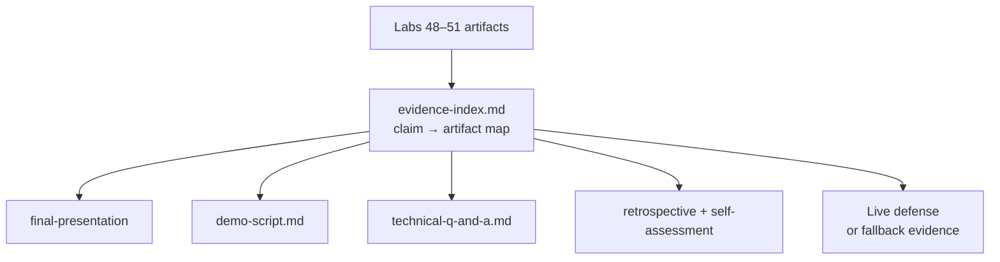
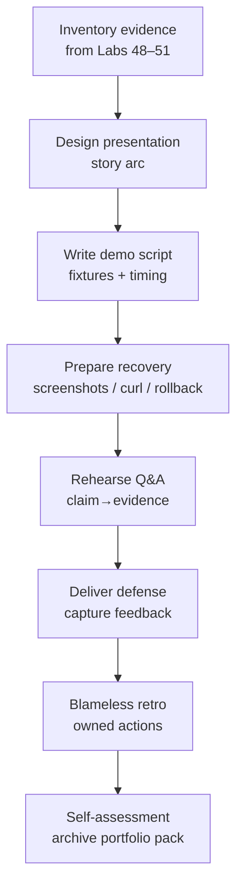

# Lab 52: Capstone Final Defense — Northstar CRM Presentation and Technical Defense

**Module:** 52 — Capstone Final Defense  
**Lab folder:** `labs/Week 6 - Capstone Project/module-52/lab52/`  
**Difficulty:** Advanced Capstone  
**Duration:** 5–6 Hours

**Primary IDE:** IntelliJ IDEA Community Edition · **Optional IDE:** VS Code

| OS | How-to for this lab |
| -- | ------------------- |
| Windows | [LAB-52-WINDOWS.md](LAB-52-WINDOWS.md) |
| macOS | [LAB-52-MACOS.md](LAB-52-MACOS.md) |

> **Environment reminder:** Finish Labs 48–51 evidence first. Demo lab: **desktop IntelliJ IDEA Community (primary; optional VS Code)** on your laptop plus your team's running CRM demo path (API/UI/DB/events as built). Work under `~/java-bootcamp/examples/customer-management-platform` (Windows: `%USERPROFILE%\java-bootcamp\examples\customer-management-platform`).

---

## How to follow this lab

1. Open the **Windows** or **macOS** how-to (links above) in a second tab.
2. Create/work only under your `java-bootcamp/examples/…` folder from the steps (not inside this `labs/` git clone unless a step says otherwise).
3. For each **Step N**: read **Why** (if present) → do the actions → confirm **Expected** / **Expected result** → then continue.
4. When stuck, use **Failure Experiments** / troubleshooting in this guide before asking for help.
5. Capture evidence under `notes/screenshots/lab-52/` (workspace root under `java-bootcamp`; redact secrets). Use the **Pass criteria** tables — write **Pass** or **Fail** in your notes. GitHub file view does not support clickable checkboxes.

## Lab Overview

This Module 52 lab is the Week 6 **final defense**: rehearse and deliver a business-to-technology narrative, a deterministic live demo, evidence-backed technical Q&A, a blameless retrospective, and a rubric-based self-assessment—packaged for the review panel and portfolio.

**Purpose.** Panels assess whether the CRM runs **and** whether the team understands business value, architecture, security, data, messaging, delivery, operations, limitations, and recovery. A lucky happy-path click-through without evidence index fails professional defense standards.

**What you build (exercise).** Inventory evidence; design presentation story; write timed demo script using Amina/Ravi fixtures; prepare demo recovery (screenshots/API fallback); rehearse Q&A cards; deliver and capture feedback; run retrospective with owned actions; score self-assessment against rubric and archive secret-free artifacts.

**What success looks like.** Under `defense/`, you have `final-presentation.pdf` (or instructor-approved slides), `demo-script.md`, `evidence-index.md`, `technical-q-and-a.md`, `retrospective.md`, and `self-assessment.md`. Live (or transparent fallback) demo proves UI→API→DB→event for `CUS-1001` with `lab-request-001`, plus security deny path and release digest citation.

**Depends on Labs 48–51.** Need architecture docs, backend-demo, UI→DB proof, pipeline/digest/rollback evidence. Finish gaps before the panel—do not invent claims.

**CRM connection.** Demo fixtures remain `CUS-1001` Amina / `CUS-1002` Ravi / correlation `lab-request-001`. Every claim in slides maps to a row in `evidence-index.md`.

---

## Learning Objectives

After completing this lab, you will be able to:

* Build a business-to-technology narrative for the CRM
* Run a deterministic timed live demo with roles
* Explain decisions and trade-offs with ADR citations
* Answer technical questions with evidence links
* Conduct a blameless retrospective with measurable actions
* Assess the team against a transparent rubric
* Prepare demo recovery when infrastructure fails
* Keep portfolio artifacts free of secrets
* Separate facts, assumptions, and unknowns under Q&A pressure
* Close Week 6 with owned residual risks

---

## Business Scenario

A review panel will assess the Enterprise CRM delivery. Leadership freezes:

**No claim on the slide deck is allowed unless `evidence-index.md` points to a reproducible artifact (test log, digest, SQL excerpt, ADR, scan report, or demo command).**

You own the defense quality bar using the same fixtures as Labs 48–51.

Use these fixtures consistently:

| ID | Name | Notes |
| -- | ---- | ----- |
| `CUS-1001` | Amina Khan | primary live demo customer |
| `CUS-1002` | Ravi Singh | secondary search/status beat |
| `CUS-9999` | — | optional not-found beat |
| `lab-request-001` | — | correlation shown in logs/events |
| `final-defense-001` | — | alternate correlation if lab-request already used |

**Security note for evidence.** Portfolio packs must be scrubbed: no JWTs, connection strings, kubeconfigs, or real emails. Prefer `example.test` domains.

---

## Architecture Context

### NOW (this lab)



### Lab flow (mermaid)



### Architecture NOW vs LATER

| Aspect | Lab 52 (NOW) | After bootcamp (LATER) |
| ------ | ------------ | ---------------------- |
| Goal | Defend Week 6 CRM | Production hardening backlog |
| Evidence | Training artifacts | Org-specific compliance packs |
| Fixtures | Synthetic Amina/Ravi | Real data under policy (not here) |
| Outcome | Graded defense + retro | Continuous improvement |

**Lab focus:** Narrative, rehearsal, evidence-linked defense, retrospective, self-assessment—not large new features.

Do not open new product scope in Lab 52. If a gap is found, file it as a residual risk with an owner instead of coding through the rehearsal window.

---

## Prerequisites

Complete [SETUP](../../../SETUP-INSTRUCTIONS.md), [Lab 0](../../../Week%201%20-%20Java%20and%20JVM%20Foundations/module-00/lab0/LAB-0-GUIDE.md), and Labs [48](../../module-48/lab48/LAB-48-GUIDE.md)–[51](../../module-51/lab51/LAB-51-GUIDE.md). Confirm:

* Evidence packs from Labs 48–51 accessible
* Demo environment reachable (UI/API/DB/Kafka or documented fallback)
* Presentation tooling available
* No secrets committed to Git

### Pre-flight

```bash
java -version
mvn -version
docker --version
git --version
pwd
ls ~/java-bootcamp/examples/customer-management-platform/docs
curl -fsS "$CRM_URL/actuator/health/readiness" 2>/dev/null || echo "NOTE: demo URL not ready — prepare fallback"
```

Confirm prior lab evidence hubs are present:

```bash
ls docs/architecture/context.md docs/backend-demo.md docs/security-deploy-demo.md 2>/dev/null || true
ls defense 2>/dev/null || mkdir -p defense
mkdir -p ~/java-bootcamp/notes/screenshots/lab-52
```

Inventory digest identity from Lab 51 before writing slides:

```bash
grep -n -i digest docs/security-deploy-demo.md 2>/dev/null | head
```

Branch and baseline:

```bash
cd ~/java-bootcamp/examples/customer-management-platform
git switch -c lab/52-crm 2>/dev/null || git checkout -b lab/52-crm
mkdir -p defense
mkdir -p ~/java-bootcamp/notes/screenshots/lab-52
./mvnw -B clean verify 2>/dev/null || mvn -B clean verify
git status --short
```

---

## Suggested Project Files

```text
~/java-bootcamp/examples/customer-management-platform/
├── defense/
│   ├── final-presentation.pdf          # or .pptx / Marp export per instructor
│   ├── demo-script.md
│   ├── evidence-index.md
│   ├── technical-q-and-a.md
│   ├── retrospective.md
│   ├── self-assessment.md
│   ├── feedback-log.md
│   └── notes/screenshots/
├── docs/                               # Labs 48–51 sources
├── reports/
├── .gitignore
└── README.md
```

If instructor requires `lab52-crm/defense/`, mirror the same files and link from the platform README.

---

## Concepts to Discuss

Write 2–3 sentences each in `defense/evidence-index.md` intro:

1. Main demo flow the panel will see (Amina interaction)
2. Trust boundary you will explain (JWT validation location)
3. Success/failure contracts you will show (201 vs 401 vs Problem Details)
4. Why stable fixtures beat improvising new customers live
5. Idempotency story (consumer dedupe or submit guard)
6. Why digest identity matters more than “we deployed”
7. Evidence types (tests, SQL, Kafka, pipeline, ADR)
8. Two environments: rehearsal vs panel room differences
9. False-confidence answers (“it should work”) vs evidence
10. What you will explicitly say is out of scope / residual risk

---

## Implementation Steps

Parts 1–8 map to Steps 1–8; Step 9 closes archival evidence.

---

### Step 1 — Inventory evidence (Part 1)

**Why:** Unindexed claims collapse under the first hard question.

**Do this:** Create `defense/evidence-index.md` mapping requirements → features → tests → scans → pipeline → digest → deployment → monitoring. Every slide claim gets a link/path. State known limitations honestly.

Minimum rows:

| Claim | Artifact |
| ----- | -------- |
| C4 architecture | `docs/architecture/*.md` |
| CAP-12 acceptance | `docs/backlog.md` |
| Interaction API | Lab 49 tests + `backend-demo.md` |
| UI→PostgreSQL | Lab 50 SQL + screenshots |
| JWT deny | Lab 51 auth tests + smoke |
| Rollback | Lab 51 rollback notes |
| NFRs measurable | `docs/nfrs.md` |
| Risk register owners | `docs/risk-register.md` |
| Correlation discipline | demos using `lab-request-001` |

Also list explicit non-claims (what you will not pretend to have proven in the panel).

**Expected result:** No orphan claims; limitations listed with owners; non-claims explicit.

**If it fails:** Missing Lab 51 digest → gather from registry/pipeline before slides. Orphan marketing slide → delete or add evidence.

---

### Step 2 — Design presentation story (Part 2)

**Why:** Tool tours without user outcomes lose business stakeholders.

**Do this:** Draft slide outline:

1. Users, problem, success measure
2. Architecture driven by quality needs (NFR/ADR)
3. Vertical slice demo preview
4. Security and delivery gates
5. Outcomes, limitations, next steps

Export `defense/final-presentation.pdf` (or approved format). Keep fixtures `CUS-1001`/`CUS-1002` on demo slides.

**Expected result:** 8–15 slides; story fits instructor timebox; every technical slide points to evidence-index IDs.

**If it fails:** Slide spam of screenshots only → add narrative connective tissue.

---

### Step 3 — Write demo script (Part 3)

**Why:** Unscripted demos overrun and skip failure paths.

**Do this:** Author `defense/demo-script.md` with prepared synthetic data, speaker vs operator roles, timed transitions, commands, expected output, and one failure path.

```markdown
| Time | Speaker action | Operator action | Evidence |
|---|---|---|---|
| 0:00 | State user problem | Show title | Product brief |
| 1:00 | Explain architecture | Show diagram | ADR links |
| 3:00 | Narrate agent journey | Sign in and search CUS-1001 | Auth and API logs |
| 5:00 | Explain persistence | Record interaction | PostgreSQL row |
| 7:00 | Explain events | Show Kafka event | Correlation lab-request-001 |
| 9:00 | Show resilience | Submit invalid input | Problem Details |
| 10:00 | Show delivery | Open pipeline and digest | Reports |
| 11:00 | Summarize outcomes | Show metrics / rollback note | NFR evidence |
```

Pre-seed checklist before the panel enters:

_Mark each row **Pass** or **Fail** in your lab notes (GitHub markdown files are not interactive checklists)._

| # | Confirm | Your notes |
| - | ------- | ---------- |
| 1 | Amina (`CUS-1001`) searchable | Pass / Fail |
| 2 | Ravi (`CUS-1002`) searchable | Pass / Fail |
| 3 | Demo token valid for agent role | Pass / Fail |
| 4 | Kafka console or UI lag view bookmarked | Pass / Fail |
| 5 | SQL client ready with sanitized query | Pass / Fail |
| 6 | Fallback screenshots folder open | Pass / Fail |

**Expected result:** Timed script ≤ allowed demo window; failure beat included; pre-seed checklist complete.

**If it fails:** No operator role → assign one; dead air during waits is a rehearsal bug. Script assumes unseeded DB → run seed job before panel.

---

### Step 4 — Prepare demo recovery (Part 4)

**Why:** Live infra fails; professionals fail over transparently.

**Do this:** Keep backup screenshots/video and API commands. Know restart/rollback. Practice switching to evidence without apologizing endlessly.

```bash
curl -fsS "$CRM_URL/actuator/health/readiness"
curl -fsS "$CRM_URL/api/customers?email=amina.khan@example.test" \
  -H "Authorization: Bearer $DEMO_TOKEN" | jq .
curl -i -X POST "$CRM_URL/api/customers/$CUSTOMER_ID/interactions" \
  -H "Authorization: Bearer $DEMO_TOKEN" -H 'Content-Type: application/json' \
  -H 'X-Correlation-ID: lab-request-001' \
  -d '{"channel":"CHAT","summary":"Resolved login question"}'
kubectl get pods -l app=crm-api
kubectl rollout history deployment/crm-api
```

Failover script language (practice aloud):

> “The live cluster is unhealthy. We are switching to recorded evidence from Lab 51 smoke run `<id>` and Lab 50 SQL proof for `CUS-1001`. Here is what that evidence does and does not prove.”

**Expected result:** Fallback pack in `defense/notes/`; criteria for when to switch documented; spoken failover line rehearsed.

**If it fails:** Fallback contains secrets → scrub before archiving. Team argues instead of switching → designate a single failover caller.

---

### Step 5 — Rehearse technical defense (Part 5)

**Why:** Architecture memorization without evidence structure fails Q&A.

**Do this:** Populate `defense/technical-q-and-a.md` with practice answers using **claim → evidence → trade-off → next-step**. Cover security, consistency, Kafka, PostgreSQL, testing, CI/CD, probes, monitoring. Practice saying “unknown—here is how we would verify.”

Sample topics:

* Where is JWT validated?
* What happens if Kafka is down at publish time (per ADR)?
* How do you prove UI wrote PostgreSQL?
* What is your rollback unit (digest)?
* Which NFR is not yet met?
* How do you prevent duplicate interaction side effects?
* What does `lab-request-001` prove in logs versus what it does not prove?
* Why is the React client not the security boundary?

Card template:

```markdown
### Q: ...
- Claim:
- Evidence (path/id):
- Trade-off:
- Next step / residual risk:
- Practice time (seconds):
```

**Expected result:** ≥10 Q&A cards; dry-run with peer timed to 60–90s each.

**If it fails:** Answers without artifact paths → update evidence-index first. Answers longer than two minutes → cut to the four-part structure.

---

### Step 6 — Deliver and capture feedback (Part 6)

**Why:** Uncaptured panel questions become lost commitments.

**Do this:** Respect presentation and demo timeboxes. Narrate outcomes while operating. Record questions and follow-ups in `defense/feedback-log.md` with owners/dates.

**Expected result:** Completed delivery (or instructor-scheduled slot) with feedback log.

**If it fails:** Overrun killing Q&A → cut optional slides; keep failure-path beat.

---

### Step 7 — Run retrospective (Part 7)

**Why:** Blame narratives block learning and violate professional practice.

**Do this:** Build delivery timeline for Week 6. Discuss helpful/harmful system conditions without blaming individuals. Choose a small number of owned measurable improvements.

```markdown
## Observation
Frontend and backend contracts diverged.
## Impact
Two stories missed staging rehearsal.
## Contributing conditions
Examples were copied manually and no consumer test ran in CI.
## Action
Add OpenAPI contract validation to pull requests.
## Owner and due date
Backend lead — within two weeks.
## Success measure
Three releases with no staging contract mismatch.
```

**Expected result:** `defense/retrospective.md` with ≤5 actions, each owned.

**If it fails:** More than five vague actions → cut to measurable few.

---

### Step 8 — Score and close (Part 8)

**Why:** Ungrounded self-scores and unclean archives create portfolio risk.

**Do this:** Complete `defense/self-assessment.md` against the Lab 52 rubric with evidence links. Reconcile team vs reviewer scores when available. Archive secret-free portfolio summary.

Scrub checklist before archive:

_Mark each row **Pass** or **Fail** in your lab notes (GitHub markdown files are not interactive checklists)._

| # | Confirm | Your notes |
| - | ------- | ---------- |
| 1 | No JWTs or refresh tokens in screenshots | Pass / Fail |
| 2 | No connection strings or kubeconfigs | Pass / Fail |
| 3 | No real customer emails/names (use Amina/Ravi fixtures only) | Pass / Fail |
| 4 | No `.env` copies in `defense/` | Pass / Fail |
| 5 | Evidence paths resolve from repo root | Pass / Fail |

**Expected result:** Self-score table filled; archive scrubbed (`git status` clean of secrets).

**If it fails:** Score without links → add evidence-index references. Secret found in pack → redact, rotate if needed, regenerate screenshots.

---

### Step 9 — Failure experiments + evidence pack

**Why:** Defense quality includes graceful degradation of the demo itself.

**Do this:** Complete [Failure Experiments](#failure-experiments). Rehearse one intentional failure beat. Confirm all six defense deliverables present. Peer reviews `evidence-index.md` for claim orphans.

**Expected result:** ≥3 experiments; six artifacts complete; peer sign-off noted.

**If it fails:** See Troubleshooting.

---

## Implementation Checkpoints

### Checkpoint A — Evidence and story

_Mark each row **Pass** or **Fail** in your lab notes (GitHub markdown files are not interactive checklists)._

| # | Confirm | Your notes |
| - | ------- | ---------- |
| 1 | `evidence-index.md` maps claims → artifacts | Pass / Fail |
| 2 | Presentation tells user→architecture→gates→outcomes | Pass / Fail |
| 3 | Limitations listed honestly | Pass / Fail |

### Checkpoint B — Demo readiness

_Mark each row **Pass** or **Fail** in your lab notes (GitHub markdown files are not interactive checklists)._

| # | Confirm | Your notes |
| - | ------- | ---------- |
| 1 | Timed `demo-script.md` with speaker/operator | Pass / Fail |
| 2 | Fixtures `CUS-1001` / `CUS-1002` / `lab-request-001` | Pass / Fail |
| 3 | Fallback screenshots/API/rollback ready | Pass / Fail |

### Checkpoint C — Defense quality

_Mark each row **Pass** or **Fail** in your lab notes (GitHub markdown files are not interactive checklists)._

| # | Confirm | Your notes |
| - | ------- | ---------- |
| 1 | Q&A cards with claim/evidence/trade-off/next | Pass / Fail |
| 2 | Delivery + `feedback-log.md` | Pass / Fail |
| 3 | Blameless retro with owned actions | Pass / Fail |

### Checkpoint D — Close-out hygiene

_Mark each row **Pass** or **Fail** in your lab notes (GitHub markdown files are not interactive checklists)._

| # | Confirm | Your notes |
| - | ------- | ---------- |
| 1 | Self-assessment with evidence links | Pass / Fail |
| 2 | Portfolio archive scrubbed of secrets | Pass / Fail |
| 3 | Peer review of defense pack complete | Pass / Fail |

---

## Reference Commands, Configuration, and Code

### Demo API fallback

```bash
curl -fsS "$CRM_URL/actuator/health/readiness"
curl -fsS "$CRM_URL/api/customers?email=amina.khan@example.test" \
  -H "Authorization: Bearer $DEMO_TOKEN" | jq .
```

### Commands

```bash
cd ~/java-bootcamp/examples/customer-management-platform
ls defense
./mvnw -B -q test 2>/dev/null || true
git status --short
```

### Artifact map

| Artifact | Role |
| -------- | ---- |
| `final-presentation.pdf` | Stakeholder narrative |
| `demo-script.md` | Timed live demo |
| `evidence-index.md` | Claim proof map |
| `technical-q-and-a.md` | Defense cards |
| `retrospective.md` | Learning + actions |
| `self-assessment.md` | Rubric honesty |

### Evidence-index row template

```markdown
| ID | Claim | Lab source | Artifact path | What it proves | What it does not prove |
|----|-------|------------|---------------|----------------|------------------------|
| E-12 | Interaction persists in PostgreSQL | 50 | ~/java-bootcamp/notes/screenshots/lab-52/amina-sql.png | UI write durable for CUS-1001 | Multi-region durability |
```

### Self-assessment scorecard stub

```markdown
| Rubric criteria | Self score / max | Evidence IDs | Gap / next action |
|---|---:|---|---|
| Environment and structure | /10 | | |
| Core defense artifacts | /30 | | |
| Live/fallback coherence | /15 | | |
| Failure handling | /15 | | |
| Verification citations | /10 | | |
| Security awareness in Q&A | /10 | | |
| Documentation (retro/self) | /10 | | |
```

---

## Manual Verification

1. Evidence index has no orphan slide claims.
2. Demo script fits timebox and includes failure path.
3. Live or fallback proves UI→DB for Amina.
4. Correlation `lab-request-001` shown in event/log evidence.
5. Unauthorized path cited from Lab 51 (401/403).
6. Digest + rollback cited from Lab 51.
7. Q&A answers reference artifacts, not vibes.
8. Retro actions are owned and measurable.
9. Self-assessment links to evidence.
10. Portfolio pack contains no secrets.
11. Pre-seed checklist completed within 15 minutes of panel.
12. Peer operator can run the demo script without the original author narrating setup.

---

## Failure Experiments

| # | Experiment | Observe | Restore |
| - | ---------- | ------- | ------- |
| 1 | Remove evidence link for one slide claim | Peer flags orphan | Restore link |
| 2 | Kill API mid-rehearsal | Team switches to fallback | Restart or continue with evidence |
| 3 | Ask “where is auth enforced?” cold | Weak answer | Rehearse card + SecurityConfig path |
| 4 | Overrun demo by 3 minutes | Q&A compressed | Cut slides; keep failure beat |
| 5 | Include a JWT in screenshot | Secret risk | Redact; regenerate evidence |
| 6 | Improvised new customer mid-demo | Fixture drift / fail | Stay on CUS-1001/1002 |
| 7 | Blame-laced retro draft | Learning blocked | Rewrite as system conditions |

---

## Troubleshooting

| Symptom | Likely cause | Fix |
| ------- | ------------ | --- |
| Demo data missing | Seeds not applied | Re-run Lab 50 seed; use curl fallback |
| Panel disputes claim | No evidence row | Add artifact or retract claim |
| Nervous silence | No script roles | Assign speaker/operator |
| Blame in retro | Facilitation slip | Reframe to system conditions |
| Huge slide deck | Scope creep | Timebox; move detail to appendix |
| Token on projector | Bad screenshot | Scrub and rotate training token |
| “Works on my machine” | Env drift | Use same URL/digest as Lab 51 |
| Incomplete Labs 48–51 | Skipped gates | Finish evidence before defense |
| Kafka UI blank | Wrong topic/cluster | Bookmark working consumer command |
| SQL client timeout | VPN/network | Pre-cache sanitized result screenshot |
| Two speakers talk over | Role ambiguity | One speaker; one operator rule |

---

## Security and Production Review

Answer in `defense/self-assessment.md`:

1. Which inputs remain untrusted in the demonstrated system?
2. Where did you prove authn/authz/validation?
3. Which sensitive values were excluded from the portfolio pack?
4. What demo steps are safely retryable?
5. What is the plan after a live demo partial failure?
6. What should operators monitor post-release?
7. Which demo habit is unacceptable (live coding secrets, real PII)?
8. How will contract/ADR versions be maintained after the course?

---

## Cleanup

```bash
cd ~/java-bootcamp/examples/customer-management-platform
# stop demo servers if local
git status --short
# scrub defense/notes of any accidental tokens before archive
```

Keep sanitized defense pack; delete temporary credential files.

**Keep `defense/`**—it is the primary portfolio and assessment packet for Week 6.

Capstone grading should weigh evidence linked from `defense/evidence-index.md` over unrehearsed claims.

---

## Expected Deliverables

* `defense/final-presentation.pdf` (or instructor-approved slide export)
* `defense/demo-script.md`
* `defense/evidence-index.md`
* `defense/technical-q-and-a.md`
* `defense/retrospective.md`
* `defense/self-assessment.md`
* Baseline/demo validation notes (health, smoke, or fallback)
* One controlled failure-path demo beat result
* Concise reproduction pointers for peer operators
* Peer-review notes and resolved comments
* Known limitations, residual risks, owners, and next actions

Exclude real `.env` files, access tokens, database exports, private keys, kubeconfig, Terraform state, and sensitive screenshots.

---

## Evaluation Rubric (100 Marks)

| Criteria | Marks |
| -------- | ----: |
| Environment and project structure (`defense/` pack) | 10 |
| Core implementation (story, demo script, evidence index) | 30 |
| Integration/configuration correctness (live/fallback coherence) | 15 |
| Failure handling (demo recovery + honest limitations) | 15 |
| Automated verification citations (tests/pipeline/smoke) | 10 |
| Security and production awareness in Q&A | 10 |
| Documentation and evidence (retro + self-assessment) | 10 |

**Notes:** Smooth demo with orphan claims → lose evidence marks. Blame-centric retro → documentation deduction. Secrets in portfolio → remediation required before scoring.

---

## Reflection Questions

Write 3–6 sentence answers (may overlap self-assessment):

1. Which design decision most affected the defense narrative?
2. Which panel (or rehearsal) question was hardest?
3. What evidence most strongly proves the CRM works?
4. What breaks first if demo traffic multiplies?
5. Which concern should become shared platform CI next?
6. What must change before real customer data appears in demos?
7. How do Labs 48–51 connect in the story you told?
8. What metric should leadership watch after “go-live”?
9. (Forward look) Which residual risk would you fund first post-bootcamp?

---

## Bonus Challenges

1. Answer ten panel questions in one minute each (timed peer drill).
2. Rehearse complete demo fallback end-to-end without UI.
3. Create a portfolio-safe one-page architecture summary.
4. Compare self-score with peer score using evidence diffs.
5. Convert retrospective learning into tracked backlog items in `docs/backlog.md`.
6. Record a 3-minute captioned demo video as archive fallback.

---

## Success Criteria

You are finished when:

* Presentation and demo script are rehearsal-proven
* Evidence index links every major claim
* Q&A uses artifacts; limitations are explicit
* Retro actions are few, owned, and measurable
* Self-assessment is evidence-based
* Another teammate can operate the demo script
* No production secret remains in the defense pack

---

## Instructor Notes

* **Live probe:** Interrupt with “Show the digest you rolled back from” and “Where is JWT enforced?” Require evidence-index hops, not memory. Ask for `lab-request-001` on the live or fallback event path.
* **Assess:** Narrative clarity, deterministic demo, failure beat, Q&A evidence discipline, blameless retro, scrubbed artifacts, fixture consistency with Labs 48–51.
* **Continuity:** Prefer `customer-management-platform/defense`. Fixtures must match Labs 48–51. Do not allow new feature coding to replace missing evidence.
* **Common pitfalls:** Slide claims without artifacts; improvisational demo data; hiding outages instead of failover; blame retros; JWT screenshots; exceeding timebox; self-score without evidence IDs.
* **Timing:** 5–6 hours prep + scheduled panel slot. Force a full rehearsal at hour 3. Cap slide count early so Q&A survives.
* **Parity check:** Spot-check that CAP-12 acceptance criteria from Lab 48 still match what the demo actually shows.
* **Quality bar:** Evidence-index completeness and transparent failover beat theatrical UI polish.

---

### Quick peer rehearsal card

```markdown
Peer name:
Story understandable without CRM jargon overload? Y/N
Demo finished inside timebox? Y/N
Failure beat included? Y/N
Orphan claims found (list):
Failover practiced? Y/N
Secrets in slides/screenshots? Y/N
Top two tough Qs still weak:
```

Store results in `defense/feedback-log.md` before the graded panel.

---

### Suggested panel timebox (adapt)

| Segment | Minutes |
| ------- | ------: |
| Business + architecture story | 8 |
| Live / fallback demo | 12 |
| Technical Q&A | 15 |
| Residual risks / next steps | 5 |

If the instructor shortens the window, cut architecture detail first—never cut the failure beat or unauthorized proof citation.

---

*End of Lab 52 — Capstone Final Defense: Northstar CRM Presentation and Technical Defense. Retain sanitized `defense/` for portfolio and assessment.*
