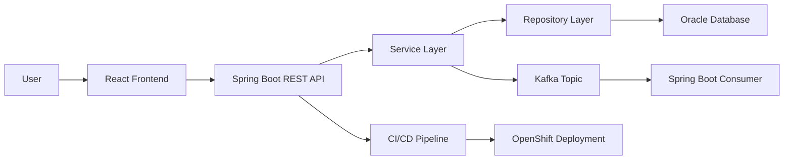
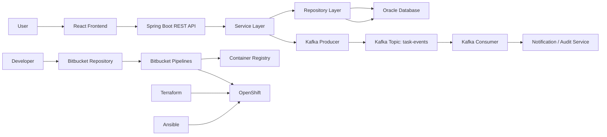

# Teach Module 48: Capstone Architecture and Planning

This note is based on Module 48's topic title from the bootcamp outline, but the teaching content is original and does not use the course material as the lesson source.

## Module 48 Overview

Module 48 is about turning a vague project idea into an executable engineering plan. Before a team writes serious code, they need to answer five big questions:

1. What are we building?
2. Who is responsible for what?
3. What are the most important features?
4. What architecture will support those features?
5. What could go wrong, and how will we reduce that risk?

Think of this module as the engineering blueprint stage.

The main topics are:

- Team roles and responsibilities
- Backlog creation and prioritization
- Architecture design using the full tech stack
- CI/CD planning with Bitbucket Pipelines, Ansible, and Terraform
- Risk identification and mitigation
- Capstone planning and architecture lab

## Team Roles

In a capstone project, everyone may write code, but roles help prevent confusion.

Common roles:

### Product Owner

Owns the business goal. Decides what matters most, clarifies requirements, and prioritizes features.

### Scrum Master / Team Lead

Keeps the team organized. Runs standups, removes blockers, tracks progress, and keeps people aligned.

### Backend Developer

Builds APIs, services, business logic, database integration, and messaging.

### Frontend Developer

Builds the user interface, connects screens to APIs, handles form validation, and supports user workflows.

### DevOps / Platform Engineer

Owns CI/CD, deployment, infrastructure automation, environment variables, secrets, and platform setup.

### QA / Test Engineer

Plans test cases, validates features, writes automated tests, and checks whether the app behaves correctly.

In real teams, one person may hold more than one role. The key is not the title. The key is that every important responsibility has an owner.

## Backlog Creation

A backlog is a prioritized list of work the team needs to complete.

A weak backlog says:

```text
Build login
Build dashboard
Build backend
```

That is too vague.

A stronger backlog uses user stories:

```text
As a customer,
I want to create an account,
so that I can access my personal dashboard.
```

A useful backlog item should usually include:

- User story
- Acceptance criteria
- Priority
- Estimate
- Owner
- Status

Example:

```text
Story: User Registration

As a new user,
I want to register with my email and password,
so that I can create an account.

Acceptance Criteria:
- User can submit name, email, and password.
- Email must be unique.
- Password must meet validation rules.
- Successful registration returns a confirmation response.
- Invalid input returns clear error messages.

Priority: High
Estimate: 5 points
```

## Prioritization

Not all features are equal.

For a capstone, the team should prioritize features that prove the full system works end to end.

Example project: order management system.

High priority:

```text
Create customer
Create order
Save order to database
View order history
Deploy working application
```

Lower priority:

```text
Dark mode
Advanced analytics
Export to PDF
Custom themes
```

A capstone should first prove technical completeness:

```text
Frontend -> Backend API -> Database -> Messaging -> CI/CD -> Deployment
```

Fancy features come after the core system works.

## Architecture Design

Architecture is the high-level structure of the system.

For a full-stack Java capstone, a typical architecture might look like this:



Each part has a job.

### React Frontend

Displays screens and sends HTTP requests.

### Spring Boot REST API

Receives requests, validates input, and exposes endpoints.

### Service Layer

Contains business logic.

### Repository Layer

Talks to the database using JPA.

### Oracle Database

Stores persistent data.

### Kafka

Handles event-driven communication.

### CI/CD Pipeline

Builds, tests, scans, and deploys the application.

### OpenShift

Runs the deployed application in containers.

A good architecture separates responsibilities. The frontend should not talk directly to the database. The controller should not contain all business logic. The deployment pipeline should not be a manual checklist.

## CI/CD Planning

CI/CD means the team plans how code moves from a developer's machine to a running environment.

A simple pipeline might include:

```text
1. Developer pushes code
2. Pipeline checks out the repository
3. Code is compiled
4. Unit tests run
5. Static analysis or security scan runs
6. Docker image is built
7. Image is pushed to registry
8. App is deployed to OpenShift
9. Smoke tests verify deployment
```

Tool responsibilities:

```text
Terraform creates infrastructure.
Ansible configures systems.
Bitbucket Pipelines automates the workflow.
```

## Risk Identification

A risk is anything that could threaten delivery.

Examples:

```text
Risk: Kafka integration takes longer than expected.
Mitigation: Build a small proof-of-concept early.

Risk: Team members merge conflicting code.
Mitigation: Use branches, pull requests, and regular code reviews.

Risk: Deployment fails near the deadline.
Mitigation: Deploy a minimal version early, then improve it.

Risk: Database schema keeps changing.
Mitigation: Agree on core entities early and track migrations.

Risk: One person owns too much critical knowledge.
Mitigation: Pair programming and shared documentation.
```

Good teams do not pretend risks do not exist. They make risks visible early.

## Practice Exercises

### Exercise 1: Choose A Capstone Idea

Pick one project idea and write a short problem statement.

Examples:

```text
Employee Task Management System
Online Bookstore
Banking Transaction Tracker
Healthcare Appointment System
Inventory Management System
Learning Management Portal
```

Your output:

```text
Project Name:
Problem It Solves:
Target Users:
Main Business Goal:
```

### Exercise 2: Define Team Roles

Create a team responsibility chart.

Example:

```text
Product Owner: Defines requirements and priorities
Backend Lead: Owns Spring Boot APIs and business logic
Frontend Lead: Owns React screens and API integration
Database Lead: Owns Oracle schema and JPA entities
DevOps Lead: Owns Bitbucket Pipelines, Terraform, Ansible, and OpenShift
QA Lead: Owns test plan, Selenium tests, and validation
```

Practice goal: every major responsibility should have a clear owner.

### Exercise 3: Create User Stories

Write at least 8 user stories for your capstone.

Format:

```text
As a [type of user],
I want to [perform an action],
so that [business value].
```

Example:

```text
As a manager,
I want to assign tasks to employees,
so that I can track team workload.
```

Then mark each story as:

```text
Must Have
Should Have
Could Have
Won't Have For Now
```

### Exercise 4: Write Acceptance Criteria

Choose 3 user stories and write acceptance criteria.

Example:

```text
Story: Create Task

Acceptance Criteria:
- User can enter title, description, due date, and assignee.
- Title is required.
- Due date cannot be in the past.
- Task is saved in the database.
- API returns a success response after creation.
```

Practice goal: make "done" measurable.

### Exercise 5: Build A Product Backlog

Create a backlog table like this:

```text
ID | Story | Priority | Estimate | Owner | Status
1  | User login | High | 5 | Backend/Frontend | Not Started
2  | Create task | High | 8 | Backend | Not Started
3  | View dashboard | Medium | 5 | Frontend | Not Started
```

Use at least 10 backlog items.

### Exercise 6: Draw The Architecture

Create a simple architecture diagram for your capstone.

Include:

```text
React frontend
Spring Boot REST API
Service layer
Repository layer
Oracle database
Kafka topic
Kafka producer
Kafka consumer
Bitbucket Pipeline
OpenShift deployment
```

Practice goal: explain how data moves through the system.

### Exercise 7: Define API Endpoints

For your project, list 8-10 REST endpoints.

Example:

```text
POST /api/tasks
GET /api/tasks
GET /api/tasks/{id}
PUT /api/tasks/{id}
DELETE /api/tasks/{id}
GET /api/users/{id}/tasks
POST /api/tasks/{id}/comments
PATCH /api/tasks/{id}/status
```

For each endpoint, write:

```text
Purpose:
Request Body:
Response:
Possible Errors:
```

### Exercise 8: Design The Database Entities

Identify your main database entities.

Example for task management:

```text
User
Task
Comment
Project
Notification
```

Then define fields:

```text
Task:
- id
- title
- description
- status
- priority
- dueDate
- assignedTo
- createdAt
```

Also define relationships:

```text
One User can have many Tasks.
One Project can have many Tasks.
One Task can have many Comments.
```

### Exercise 9: Plan Kafka Events

Decide which business events should produce Kafka messages.

Examples:

```text
TaskCreated
TaskAssigned
TaskCompleted
UserRegistered
OrderPlaced
PaymentProcessed
InventoryLow
```

For each event, define:

```text
Event Name:
Producer:
Consumer:
Payload:
Business Purpose:
```

### Exercise 10: CI/CD Pipeline Plan

Design your delivery pipeline.

Example:

```text
Step 1: Checkout code
Step 2: Build Java backend
Step 3: Run unit tests
Step 4: Run frontend build
Step 5: Run static code scan
Step 6: Build Docker image
Step 7: Push image to registry
Step 8: Deploy to OpenShift
Step 9: Run smoke tests
```

Practice goal: show how the project gets from source code to production-like deployment.

### Exercise 11: Infrastructure Planning

Create a simple infrastructure checklist.

```text
Application namespace/project
Backend deployment
Frontend deployment
Oracle database connection
Kafka broker/topic
Secrets and config maps
Container registry
Pipeline credentials
Environment variables
```

For each item, write whether it is handled by:

```text
Terraform
Ansible
OpenShift configuration
Manual setup
```

### Exercise 12: Risk Register

Create a risk table with at least 8 risks.

```text
Risk | Impact | Probability | Mitigation
Kafka integration delay | High | Medium | Build proof-of-concept early
Deployment failure | High | Medium | Deploy minimal app in week one
Unclear requirements | High | High | Review user stories with team
Merge conflicts | Medium | High | Use feature branches and PR reviews
```

### Exercise 13: Definition Of Done

Write a done checklist for backlog items.

Example:

```text
Code implemented
Unit tests written
API tested with Postman
Frontend connected
Database changes verified
Code reviewed
Pipeline passes
Deployed to test environment
Acceptance criteria satisfied
```

### Exercise 14: Sprint Planning Simulation

Pretend Module 48 is sprint planning.

Choose:

```text
5 high-priority backlog items
Team members assigned to each item
Estimated effort
Expected blockers
Demo goal for the sprint
```

A good sprint goal might be:

```text
By the end of this sprint, users can create, view, and update tasks through the frontend, with data stored in Oracle.
```

### Exercise 15: Capstone Planning Presentation

Create a short 5-slide planning presentation.

Slides:

```text
1. Project Overview
2. Team Roles
3. Backlog And Priorities
4. Architecture Diagram
5. Risks And Delivery Plan
```

This is excellent practice because final capstones usually require you to explain technical decisions clearly.

## Lab: Capstone Planning And Architecture

### Goal

Create a complete planning blueprint for your capstone project before writing code.

### Scenario

Your team will build an Employee Task Management System using:

```text
React frontend
Spring Boot backend
Oracle database
Kafka messaging
Bitbucket Pipelines
Ansible
Terraform
OpenShift
```

### Part 1: Project Overview

Create this section:

```text
Project Name:
Employee Task Management System

Problem Statement:
Managers need a simple way to assign, track, and review employee tasks.

Target Users:
- Manager
- Employee
- Admin

Core Business Goal:
Allow managers to create tasks, assign them to employees, track progress, and receive updates.
```

### Part 2: Team Roles

Fill in names or placeholders:

```text
Product Owner:
Scrum Master:
Backend Developer:
Frontend Developer:
Database Developer:
DevOps Engineer:
QA Engineer:
```

For each role, write 2-3 responsibilities.

Example:

```text
Backend Developer:
- Build Spring Boot REST APIs
- Implement service and repository layers
- Integrate Kafka producer events
```

### Part 3: User Stories

Write at least 8 user stories.

Use this format:

```text
As a manager,
I want to create a task,
so that I can assign work to an employee.
```

Required stories:

```text
User login
Create task
Assign task
View assigned tasks
Update task status
Add task comment
Send task event to Kafka
View task dashboard
```

### Part 4: Acceptance Criteria

Choose 4 user stories and write acceptance criteria.

Example:

```text
Story: Create Task

Acceptance Criteria:
- Manager can enter task title, description, priority, due date, and assignee.
- Title and assignee are required.
- Due date cannot be earlier than today.
- Task is saved in Oracle.
- System publishes a TaskCreated event to Kafka.
- API returns HTTP 201 when successful.
```

### Part 5: Product Backlog

Create a backlog table:

```text
ID | Backlog Item | Priority | Estimate | Owner
1  | User login | High | 5 | Backend + Frontend
2  | Create task API | High | 5 | Backend
3  | Task database table | High | 3 | Database
4  | Task list screen | High | 5 | Frontend
5  | Kafka TaskCreated event | Medium | 5 | Backend
6  | OpenShift deployment | High | 8 | DevOps
```

Add at least 10 items.

### Part 6: Architecture Diagram

Draw this architecture:



### Part 7: API Design

Define these endpoints:

```text
POST /api/tasks
GET /api/tasks
GET /api/tasks/{id}
PUT /api/tasks/{id}
PATCH /api/tasks/{id}/status
DELETE /api/tasks/{id}
POST /api/tasks/{id}/comments
GET /api/users/{userId}/tasks
```

For each one, include:

```text
Purpose:
Request Body:
Success Response:
Error Cases:
```

### Part 8: Database Design

Create entities:

```text
User
Task
Comment
TaskEvent
```

Example:

```text
Task:
- id
- title
- description
- status
- priority
- dueDate
- assignedToUserId
- createdByUserId
- createdAt
- updatedAt
```

Relationships:

```text
One User can create many Tasks.
One User can be assigned many Tasks.
One Task can have many Comments.
One Task can produce many TaskEvents.
```

### Part 9: Kafka Event Plan

Define at least 3 events:

```text
TaskCreated
TaskAssigned
TaskCompleted
```

Example:

```text
Event Name:
TaskCreated

Producer:
Task Service

Topic:
task-events

Consumer:
Notification Service or Audit Service

Payload:
{
  "eventId": "uuid",
  "eventType": "TaskCreated",
  "taskId": 101,
  "title": "Prepare report",
  "assignedTo": 7,
  "createdAt": "2026-08-02T10:30:00"
}
```

### Part 10: CI/CD Plan

Create this pipeline plan:

```text
1. Checkout source code
2. Build Spring Boot backend
3. Run backend unit tests
4. Build React frontend
5. Run frontend tests
6. Run static code scan
7. Build Docker images
8. Push images to registry
9. Provision or verify infrastructure with Terraform
10. Configure environment with Ansible
11. Deploy to OpenShift
12. Run smoke tests
```

### Part 11: Risk Register

Create at least 6 risks.

```text
Risk | Impact | Probability | Mitigation
Kafka setup delay | High | Medium | Build small Kafka proof-of-concept first
OpenShift deployment failure | High | Medium | Deploy hello-world app early
Unclear task requirements | Medium | High | Review user stories before development
Database schema changes | Medium | Medium | Use migration scripts
Team merge conflicts | Medium | High | Use feature branches and PR reviews
Pipeline failures | High | Medium | Create pipeline early and improve gradually
```

### Part 12: Final Deliverable

Submit one planning document with these sections:

```text
1. Project Overview
2. Team Roles
3. User Stories
4. Acceptance Criteria
5. Product Backlog
6. Architecture Diagram
7. API Design
8. Database Design
9. Kafka Event Plan
10. CI/CD Plan
11. Risk Register
12. Definition Of Done
```

## Challenge Task

Create a second version of the architecture where the backend is split into two services:

```text
Task Service
Notification Service
```

Then explain:

```text
Why split them?
What does each service own?
How do they communicate?
What risks does this add?
```

## Mini Exercise

Imagine your capstone is an Employee Task Management System.

Create these four things:

1. Three user stories.
2. A list of team roles.
3. A simple architecture with frontend, backend, database, Kafka, and deployment.
4. Three project risks with mitigations.

Starter answer:

```text
User Story 1:
As a manager, I want to create tasks so that I can assign work to employees.

User Story 2:
As an employee, I want to update task status so that my manager can track progress.

User Story 3:
As a manager, I want to view overdue tasks so that I can follow up quickly.
```

## Key Takeaway

Before building the capstone, your team must create a shared plan. The plan should define responsibilities, backlog priorities, architecture, delivery pipeline, and risks. Good planning reduces confusion later and makes the build phase much smoother.

For Module 48, the best practice deliverable is a Capstone Planning Packet containing:

```text
Project idea
Team roles
User stories
Prioritized backlog
Architecture diagram
API list
Database model
Kafka event plan
CI/CD plan
Risk register
Definition of done
```

That packet becomes your blueprint for Modules 49-52.
